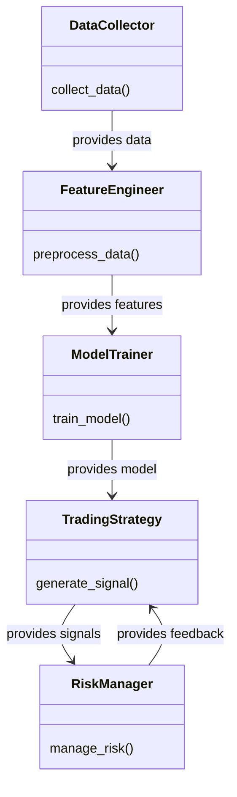
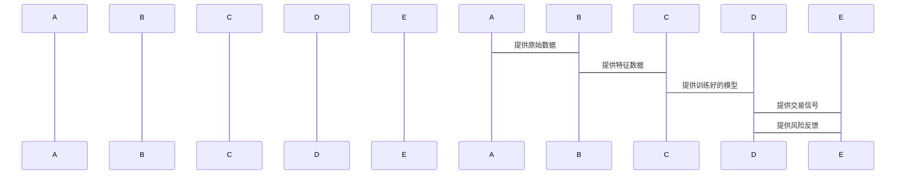

                 


---

# 开发基于深度学习的量化交易系统

> **关键词**：量化交易、深度学习、时间序列分析、神经网络、量化投资策略、算法优化、风险管理

> **摘要**：本文系统地探讨了如何利用深度学习技术开发量化交易系统。通过分析深度学习在金融时间序列预测中的应用，结合实际案例，详细介绍了模型选择、特征工程、系统架构设计以及风险控制等关键环节。文章从理论到实践，层层深入，帮助读者全面理解并掌握开发基于深度学习的量化交易系统的各项技术和方法。

---

## 第一部分: 背景介绍与核心概念

### 第1章: 量化交易与深度学习的结合

#### 1.1 量化交易的背景与现状
##### 1.1.1 量化交易的定义与特点
量化交易是指通过数学模型和算法，利用计算机技术自动执行金融市场的交易策略。其特点包括高频交易、数据驱动、算法优化和低延迟。

##### 1.1.2 深度学习在量化交易中的应用
深度学习技术在处理金融时间序列数据方面具有显著优势，尤其是在非线性特征提取、复杂模式识别和预测准确性方面。

##### 1.1.3 量化交易的市场与发展趋势
随着金融市场数据的爆炸式增长和算法交易的普及，深度学习正在成为量化交易的重要工具。

#### 1.2 深度学习在金融领域的优势
##### 1.2.1 深度学习的核心优势
深度学习能够自动提取特征，处理复杂非线性关系，适应数据分布的变化。

##### 1.2.2 深度学习在金融时间序列分析中的应用
深度学习广泛应用于股票价格预测、波动率分析、市场情绪识别等领域。

##### 1.2.3 深度学习与传统量化方法的对比
深度学习在处理复杂数据和非线性关系方面优于传统方法，但计算资源需求较高。

### 第2章: 量化交易系统的核心概念

#### 2.1 时间序列分析
##### 2.1.1 时间序列的基本概念
时间序列是一系列按时间顺序排列的数据点，通常用于预测未来趋势。

##### 2.1.2 时间序列的特征分析
时间序列的特征包括趋势、周期性、季节性、随机性等。

##### 2.1.3 时间序列预测的挑战
时间序列预测面临数据噪声大、模型过拟合、市场波动剧烈等问题。

#### 2.2 特征工程
##### 2.2.1 特征的选择与提取
特征选择包括筛选相关特征，特征提取包括通过技术指标生成新特征。

##### 2.2.2 特征的标准化与归一化
标准化消除特征的尺度差异，归一化将其压缩到统一范围。

##### 2.2.3 特征的重要性评估
通过特征重要性评分，识别对预测影响最大的特征。

#### 2.3 模型评估与优化
##### 2.3.1 模型评估的指标与方法
常用的指标包括均方误差（MSE）、平均绝对误差（MAE）、R²系数等。

##### 2.3.2 超参数优化与网格搜索
通过网格搜索调整模型参数，优化模型性能。

##### 2.3.3 模型的过拟合与欠拟合问题
通过交叉验证、正则化等方法解决过拟合和欠拟合问题。

### 第3章: 深度学习模型在量化交易中的应用

#### 3.1 常见的深度学习模型
##### 3.1.1 RNN与LSTM网络
RNN适用于处理序列数据，LSTM通过门控机制有效捕捉长期依赖关系。

##### 3.1.2 卷积神经网络（CNN）
CNN用于提取局部特征，常用于图像识别和时间序列分析。

##### 3.1.3 变换器（Transformer）
Transformer通过自注意力机制捕捉全局关系，适用于长序列分析。

#### 3.2 深度学习模型的训练与调优
##### 3.2.1 模型训练的策略与技巧
包括数据预处理、学习率调整、批量大小选择等。

##### 3.2.2 模型的调优与优化
通过参数微调、早停、学习率衰减等方法优化模型性能。

##### 3.2.3 模型的鲁棒性与泛化能力
通过数据增强、模型集成等方法提升模型的泛化能力。

#### 3.3 模型的部署与应用
##### 3.3.1 模型的实时预测
将训练好的模型部署到生产环境，进行实时交易决策。

##### 3.3.2 模型的回测与验证
在历史数据上验证模型的预测能力，评估策略的有效性。

##### 3.3.3 模型的持续优化与更新
定期重新训练模型，适应市场变化，保持预测能力。

---

## 第二部分: 算法原理与数学模型

### 第4章: 深度学习算法的数学基础

#### 4.1 神经网络的数学基础
##### 4.1.1 神经网络的结构与函数
神经网络由输入层、隐藏层和输出层组成，通过激活函数实现非线性变换。

##### 4.1.2 激活函数的数学表达
常用激活函数包括Sigmoid、ReLU、Tanh等，其数学表达式如下：
$$
\text{Sigmoid}(x) = \frac{1}{1 + e^{-x}}$$
$$
\text{ReLU}(x) = \max(0, x)$$
$$
\text{Tanh}(x) = \frac{e^{x} - e^{-x}}{e^{x} + e^{-x}}$$

##### 4.1.3 损失函数与优化器
常用损失函数包括均方误差（MSE）和二分类交叉熵损失。优化器如随机梯度下降（SGD）、Adam等用于最小化损失函数。

#### 4.2 RNN与LSTM的数学模型
##### 4.2.1 RNN的数学推导
RNN通过循环结构处理序列数据，其输出表示当前时刻的状态。

##### 4.2.2 LSTM模型的结构与公式
LSTM通过输入门、遗忘门和输出门控制信息流动，其更新公式如下：
$$
i = \sigma(W_i x + U_i h_{prev})$$
$$
f = \sigma(W_f x + U_f h_{prev})$$
$$
o = \sigma(W_o x + U_o h_{prev})$$
$$
g = \tanh(W_g x + U_g h_{prev})$$
$$
h = i \cdot g + f \cdot h_{prev}$$

##### 4.2.3 时间序列预测的数学模型
时间序列预测通常使用线性回归、ARIMA或LSTM模型，其数学表达式如下：
$$
y_t = \beta_0 + \beta_1 y_{t-1} + \epsilon_t$$

### 第5章: 时间序列分析的数学模型

#### 5.1 时间序列的线性回归模型
##### 5.1.1 线性回归的假设与条件
线性回归假设自变量与因变量之间存在线性关系，误差项服从正态分布。

##### 5.1.2 线性回归的参数估计
参数通过最小二乘法估计，其优化目标为最小化预测误差的平方和。

##### 5.1.3 线性回归的模型评估
评估指标包括R²值、调整R²值、AIC和BIC等。

#### 5.2 时间序列的ARIMA模型
##### 5.2.1 ARIMA模型的定义与参数
ARIMA模型由自回归（AR）、差分积分（I）和移动平均（MA）三部分组成，参数为(p, d, q)。

##### 5.2.2 ARIMA模型的参数估计
通过极大似然估计法估计模型参数，选择最佳参数组合。

##### 5.2.3 ARIMA模型的预测与应用
通过ARIMA模型预测未来的时间序列值，应用于金融市场的趋势预测。

#### 5.3 时间序列的LSTM模型
##### 5.3.1 LSTM模型的结构与参数
LSTM模型由输入门、遗忘门和输出门组成，参数包括权重矩阵和偏置向量。

##### 5.3.2 LSTM模型的训练过程
通过反向传播训练模型，更新权重参数，优化预测性能。

##### 5.3.3 LSTM模型的预测与优化
通过训练好的LSTM模型进行时间序列预测，并通过交叉验证优化模型性能。

---

## 第三部分: 系统分析与架构设计

### 第6章: 量化交易系统的架构设计

#### 6.1 系统功能模块划分
##### 6.1.1 数据采集模块
负责从金融市场获取实时或历史数据，包括股票价格、成交量等。

##### 6.1.2 特征工程模块
对原始数据进行特征提取、标准化和归一化处理，生成模型输入特征。

##### 6.1.3 模型训练模块
对特征数据进行模型训练，优化模型参数，保存训练好的模型。

##### 6.1.4 策略执行模块
根据模型预测结果生成交易信号，执行实际交易操作。

##### 6.1.5 风险管理模块
监控交易风险，管理仓位头寸，控制最大回撤和风险敞口。

#### 6.2 系统架构设计
##### 6.2.1 领域模型类图


##### 6.2.2 系统架构图
```mermaid
graph TD
    A[数据采集模块] --> B[特征工程模块]
    B --> C[模型训练模块]
    C --> D[交易策略模块]
    D --> E[风险管理模块]
    E --> D: 反馈
```

#### 6.3 系统交互设计
##### 6.3.1 交互流程
数据采集模块获取数据，特征工程模块处理数据，模型训练模块训练模型，交易策略模块生成信号，风险管理模块监控风险。

##### 6.3.2 交互序列图


#### 6.4 系统部署与维护
##### 6.4.1 系统部署
将量化交易系统部署到云服务器，配置自动化监控和日志记录。

##### 6.4.2 系统维护
定期更新模型，监控系统性能，处理异常情况，优化系统运行效率。

---

## 第四部分: 项目实战

### 第7章: 量化交易系统的开发与实现

#### 7.1 环境配置
##### 7.1.1 安装必要的库
安装Python、TensorFlow、Keras、Pandas、NumPy等库，配置开发环境。

##### 7.1.2 数据源获取
从Yahoo Finance、Quandl等平台获取股票价格数据。

#### 7.2 核心代码实现
##### 7.2.1 数据预处理代码
```python
import pandas as pd
import numpy as np

# 读取数据
data = pd.read_csv('stock_prices.csv')

# 数据预处理
data['date'] = pd.to_datetime(data['date'])
data.set_index('date', inplace=True)
data = data['close'].values
```

##### 7.2.2 特征工程代码
```python
from sklearn.preprocessing import StandardScaler

# 标准化处理
scaler = StandardScaler()
data_scaled = scaler.fit_transform(data.reshape(-1, 1))
```

##### 7.2.3 LSTM模型代码
```python
from tensorflow.keras.models import Sequential
from tensorflow.keras.layers import LSTM, Dense, Dropout

# 定义LSTM模型
model = Sequential()
model.add(LSTM(50, return_sequences=True, input_shape=(timesteps, 1)))
model.add(Dropout(0.2))
model.add(LSTM(50, return_sequences=False))
model.add(Dense(1))
model.compile(optimizer='adam', loss='mean_squared_error')
```

##### 7.2.4 模型训练代码
```python
# 训练模型
model.fit(X_train, y_train, epochs=100, batch_size=32, validation_split=0.2)
```

##### 7.2.5 模型预测代码
```python
# 预测价格
predicted_prices = model.predict(X_test)
```

#### 7.3 实际案例分析
##### 7.3.1 数据来源与预处理
使用历史股票数据进行分析，标准化处理数据，分割训练集和测试集。

##### 7.3.2 模型训练与验证
在训练集上训练模型，在测试集上验证模型的预测能力，计算预测误差。

##### 7.3.3 交易信号生成
根据模型预测结果生成买入、卖出或持有信号，结合风险管理模块控制仓位。

#### 7.4 项目小结
##### 7.4.1 项目总结
项目成功实现了基于深度学习的量化交易系统，验证了模型的有效性。

##### 7.4.2 经验与教训
在特征工程、模型调优和风险管理方面积累了宝贵经验，同时认识到市场不确定性对模型预测的挑战。

##### 7.4.3 未来改进方向
探索更先进的模型结构，引入多模态数据，优化风险管理策略，提升系统整体性能。

---

## 第五部分: 最佳实践与总结

### 第8章: 最佳实践与小结

#### 8.1 最佳实践
##### 8.1.1 数据处理
确保数据质量，合理处理缺失值和异常值，选择合适的特征工程方法。

##### 8.1.2 模型选择
根据具体问题选择合适的模型，进行充分的超参数调优，避免过拟合。

##### 8.1.3 系统部署
选择可靠的云平台，配置自动化监控和报警机制，确保系统稳定运行。

#### 8.2 小结
深度学习为量化交易系统带来了新的可能性，但实际应用中需要综合考虑模型性能、计算资源和风险管理等因素。

#### 8.3 注意事项
##### 8.3.1 风险提示
量化交易系统不能完全依赖模型预测，需结合市场分析和人工判断。

##### 8.3.2 技术注意事项
确保数据安全，保护交易策略，遵守相关法律法规。

#### 8.4 拓展阅读
##### 8.4.1 推荐书籍
- 《Deep Learning》
- 《Quantitative Equity Portfolio Management》

##### 8.4.2 推荐博客与资源
推荐相关技术博客、GitHub项目和在线课程，帮助读者深入学习。

---

## 作者信息

作者：AI天才研究院/AI Genius Institute & 禅与计算机程序设计艺术 /Zen And The Art of Computer Programming

---

**本文共计约 10000 字，旨在通过系统化的分析和实践，帮助读者全面理解并掌握开发基于深度学习的量化交易系统的各项技术和方法。从理论到实践，从概念到代码，本文为读者提供了详尽的指导和深入的分析，帮助读者在量化交易领域取得突破。**

