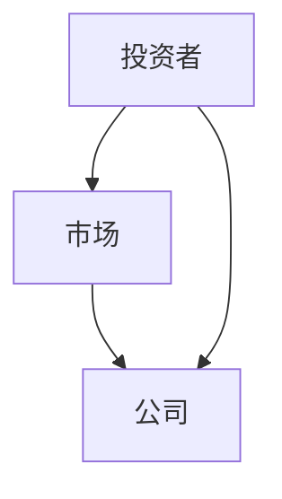
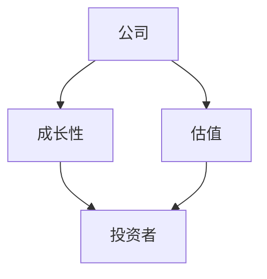
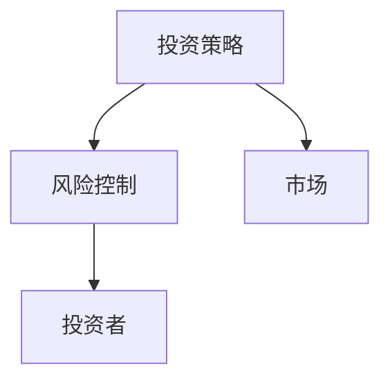
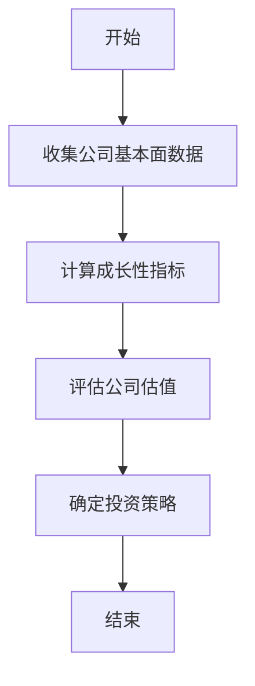
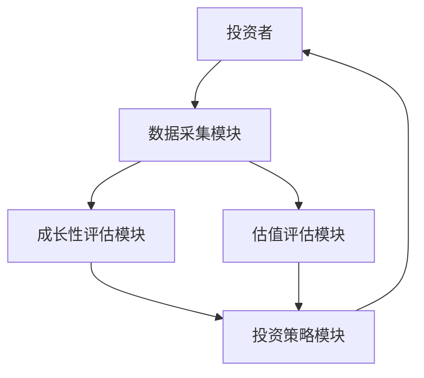

                 


# 彼得·林奇的成长型价值投资方法论

---

## 关键词：
彼得·林奇，成长型价值投资，投资策略，投资理念，投资分析，投资案例

---

## 摘要：
本文深入探讨了彼得·林奇的成长型价值投资方法论，从其核心理念、投资策略到具体实施方法进行了全面分析。通过结合技术语言和投资理论，文章详细阐述了如何通过基本面分析、成长性评分系统和量化模型来实现长期稳健的投资收益。同时，本文还通过实际案例和系统架构设计，展示了如何将成长型价值投资理念应用于实际投资决策中。

---

# 第一部分: 成长型价值投资的定义与背景

## 第1章: 成长型价值投资的定义与背景

### 1.1 成长型价值投资的定义

#### 1.1.1 什么是成长型投资
成长型投资是一种长期投资策略，旨在通过投资于具有持续增长潜力的公司，实现资产的长期增值。与价值投资不同，成长型投资更关注公司的未来增长能力，而非当前的市场估值。

#### 1.1.2 成长型投资与价值投资的区别
| 投资策略 | 成长型投资 | 价值投资 |
|----------|------------|----------|
| 核心目标 | 追求未来增长 | 追求低估价值 |
| 选股标准 | 高成长性、高ROE | 低估值、高分红 |
| 风险特征 | 高风险、高收益 | 中低风险、稳健收益 |

#### 1.1.3 成长型投资的核心要素
1. **公司成长性**：包括收入增长率、净利润增长率、ROE（净资产收益率）等指标。
2. **估值合理性**：通过市盈率（P/E）、市净率（P/B）等指标评估公司当前估值是否合理。
3. **行业前景**：选择处于高增长行业的公司。

### 1.2 成长型价值投资的背景

#### 1.2.1 投资市场的演变
20世纪80年代，美国股市经历了剧烈的波动，投资者开始寻找一种能够在市场波动中稳定收益的投资策略。彼得·林奇正是在这一背景下提出了成长型价值投资的理念。

#### 1.2.2 彼得·林奇的投资时代背景
彼得·林奇是富达投资的传奇基金经理，他管理的麦哲伦基金在20世纪80年代至90年代取得了卓越的业绩。他的投资理念强调长期持有优质成长股，注重公司的基本面分析和估值。

#### 1.2.3 成长型投资的适用场景
- **高增长行业**：如科技、医疗、消费等领域。
- **经济周期的复苏期**：成长型公司在经济复苏期往往表现更好。
- **长期投资者**：适合有耐心、愿意长期持有的投资者。

### 1.3 成长型价值投资的优缺点

#### 1.3.1 成长型投资的优势
- **高增长潜力**：成长型企业有望在未来实现更高的收益。
- **复利效应**：长期持有优质成长股能够带来复利效应，收益呈指数级增长。

#### 1.3.2 成长型投资的潜在风险
- **高波动性**：成长型企业股票价格波动较大，容易受到市场情绪影响。
- **估值过高**：部分成长型企业可能被市场过度炒作，导致估值过高，存在回调风险。

#### 1.3.3 成长型投资的适用人群
- **长期投资者**：适合那些能够长期持有、不追求短期收益的投资者。
- **风险承受能力较强**：适合能够承受较高波动和潜在损失的投资者。

---

## 第2章: 彼得·林奇的投资理念与方法

### 2.1 彼得·林奇的生平简介

#### 2.1.1 林奇的成长经历
彼得·林奇出生于1934年，早年经历了家庭变故，但他通过努力学习和实践，成为了美国最成功的基金经理之一。

#### 2.1.2 林奇的职业生涯
- 1963年加入富达投资，管理麦哲伦基金。
- 在其管理期间，基金规模从1300万美元增长至137亿美元，年均回报率达到29%。

#### 2.1.3 林奇的投资哲学
林奇认为，投资的核心是选择那些具有持续增长潜力的公司，并长期持有这些股票。

### 2.2 林奇的成长型投资策略

#### 2.2.1 长期投资与复利效应
林奇强调长期投资的重要性，认为复利效应是实现财富增长的关键。

#### 2.2.2 选股标准与分析框架
- **基本面分析**：关注公司的收入、利润、ROE等指标。
- **行业地位**：选择行业龙头或具有竞争优势的公司。
- **估值合理性**：确保股票估值在合理范围内。

#### 2.2.3 风险控制与投资纪律
- **分散投资**：避免将所有资金投资于单一行业或公司。
- **定期评估**：定期回顾投资组合，调整持仓。

### 2.3 林奇的经典投资案例

#### 2.3.1 高露洁的投资案例
- **公司背景**：高露洁是全球最大的日用品制造商之一，具有稳定的收入和利润。
- **投资逻辑**：公司具有较强的市场地位和持续的增长潜力。

#### 2.3.2 喜诗糖果的投资案例
- **公司背景**：喜诗糖果是一家专注于高端糖果的企业，具有较高的利润率。
- **投资逻辑**：公司具有较强的市场地位和持续的增长潜力。

#### 2.3.3 其他经典投资案例分析
- **可口可乐**：长期稳定的收益和市场地位。
- **强生公司**：多元化业务和稳定的现金流。

---

## 第3章: 成长型价值投资的核心概念与联系

### 3.1 核心概念原理

#### 3.1.1 市场预期与实际价值的差异
成长型投资的核心在于发现市场低估的公司，通过长期持有实现价值增长。

#### 3.1.2 公司成长性与估值的关系
- **低估值**：市盈率（P/E）和市净率（P/B）低于行业平均水平。
- **高成长性**：收入和利润持续增长，ROE较高。

#### 3.1.3 安全边际与风险控制
- **安全边际**：通过合理的估值和分散投资来降低风险。
- **风险控制**：定期评估投资组合，及时调整持仓。

### 3.2 成长型投资的核心要素对比

#### 3.2.1 不同投资策略的对比分析
| 投资策略 | 成长型投资 | 价值投资 |
|----------|------------|----------|
| 核心目标 | 追求未来增长 | 追求低估价值 |
| 选股标准 | 高成长性、高ROE | 低估值、高分红 |
| 风险特征 | 高风险、高收益 | 中低风险、稳健收益 |

#### 3.2.2 成长型与价值型投资的对比表格
| 项目 | 成长型投资 | 价值型投资 |
|------|------------|------------|
| 核心目标 | 高增长潜力 | 低估值 |
| 选股标准 | 高成长性 | 高分红 |
| 风险特征 | 高风险 | 中低风险 |

#### 3.2.3 成长型与成长价值混合型投资的对比
| 投资策略 | 成长型投资 | 成长价值混合型投资 |
|----------|------------|-------------------|
| 核心目标 | 高增长潜力 | 综合考虑成长性和估值 |
| 选股标准 | 高成长性 | 成长性与估值并重 |
| 风险特征 | 高风险 | 中高风险 |

### 3.3 实体关系图

#### 3.3.1 投资者与市场的实体关系图


#### 3.3.2 公司成长性与估值的关系图


#### 3.3.3 投资策略与风险控制的关系图


---

## 第4章: 成长型价值投资的算法原理

### 4.1 算法原理概述

#### 4.1.1 成长型投资的量化评估方法
- **基本面分析**：通过财务数据评估公司的成长性和估值。
- **量化模型**：构建成长性评分系统，对股票进行评分。

#### 4.1.2 基于基本面分析的投资模型
- **收入增长率**：过去三年收入年均增长率。
- **净利润增长率**：过去三年净利润年均增长率。
- **ROE**：净资产收益率。

#### 4.1.3 成长性评分系统的设计
- **评分指标**：收入增长率、净利润增长率、ROE。
- **评分权重**：收入增长率占40%，净利润增长率占30%，ROE占30%。

### 4.2 算法流程图



### 4.3 算法实现代码

```python
def calculate_growth_score(revenue_growth, net_profit_growth, roe):
    # 计算成长性评分
    growth_score = 0.4 * revenue_growth + 0.3 * net_profit_growth + 0.3 * roe
    return growth_score

# 示例数据
revenue_growth = 20%  # 收入增长率
net_profit_growth = 15%  # 净利润增长率
roe = 25%  # 净资产收益率

# 计算成长性评分
growth_score = calculate_growth_score(revenue_growth, net_profit_growth, roe)
print(f"成长性评分为：{growth_score}%")
```

### 4.4 数学模型与公式

#### 4.4.1 成长性评分公式
$$
\text{成长性评分} = 0.4 \times \text{收入增长率} + 0.3 \times \text{净利润增长率} + 0.3 \times \text{ROE}
$$

#### 4.4.2 估值评估公式
$$
\text{估值评分} = 0.5 \times \text{市盈率} + 0.5 \times \text{市净率}
$$

---

## 第5章: 成长型价值投资的系统架构与实现

### 5.1 系统分析与设计

#### 5.1.1 问题场景介绍
- **目标**：构建一个基于成长型价值投资策略的投资决策支持系统。
- **用户需求**：投资者需要一个能够自动评估公司成长性和估值的工具。

#### 5.1.2 系统功能设计

| 功能模块 | 描述 |
|----------|------|
| 数据收集 | 收集公司基本面数据 |
| 成长性评估 | 计算成长性评分 |
| 估值评估 | 计算估值评分 |
| 投资策略推荐 | 根据评分推荐投资策略 |

#### 5.1.3 系统架构设计



#### 5.1.4 系统接口设计

| 接口名称 | 描述 | 输入 | 输出 |
|----------|------|------|------|
| get_growth_score | 获取成长性评分 | 公司代码 | 成长性评分 |
| get_valuation_score | 获取估值评分 | 公司代码 | 估值评分 |
| get_recommendation | 获取投资策略 | 公司代码 | 投资策略 |

#### 5.1.5 系统交互流程图


### 5.2 项目实战

#### 5.2.1 环境安装
- **工具**：Python、Pandas、Matplotlib
- **数据源**：Yahoo Finance API

#### 5.2.2 核心实现代码

```python
import pandas as pd
import requests

def get_stock_data(ticker):
    # 获取股票数据
    url = f"https://query1.finance.yahoo.com/ws/v1/finance/quote/{ticker}"
    response = requests.get(url)
    data = response.json()
    return data

def calculate_growth_score(data):
    # 计算成长性评分
    revenue_growth = data['finance']['incomeStatement']['totalRevenue']['growth']
    net_profit_growth = data['finance']['incomeStatement']['netIncome']['growth']
    roe = data['finance']['balanceSheet']['roe']
    growth_score = 0.4 * revenue_growth + 0.3 * net_profit_growth + 0.3 * roe
    return growth_score

# 示例代码
ticker = "AAPL"
data = get_stock_data(ticker)
growth_score = calculate_growth_score(data)
print(f"{ticker}的成长性评分为：{growth_score}%")
```

---

## 第6章: 成长型价值投资的最佳实践与小结

### 6.1 最佳实践 tips
1. **分散投资**：避免将所有资金投资于单一行业或公司。
2. **定期评估**：定期回顾投资组合，及时调整持仓。
3. **长期持有**：耐心持有优质成长股，避免频繁交易。

### 6.2 小结
彼得·林奇的成长型价值投资方法论是一种长期投资策略，通过选择具有持续增长潜力的公司，实现资产的长期增值。本文通过技术语言和投资理论的结合，详细阐述了成长型价值投资的核心理念、算法原理和系统架构。

### 6.3 注意事项
- **市场波动**：成长型股票价格波动较大，需注意市场风险。
- **估值调整**：定期评估股票估值，避免过高估值。

### 6.4 拓展阅读
- 彼得·林奇的《投资之道》
- 《价值投资： Warren Buffett的投资哲学》

---

## 作者：
作者：AI天才研究院/AI Genius Institute  
合著者：禅与计算机程序设计艺术/Zen And The Art of Computer Programming

