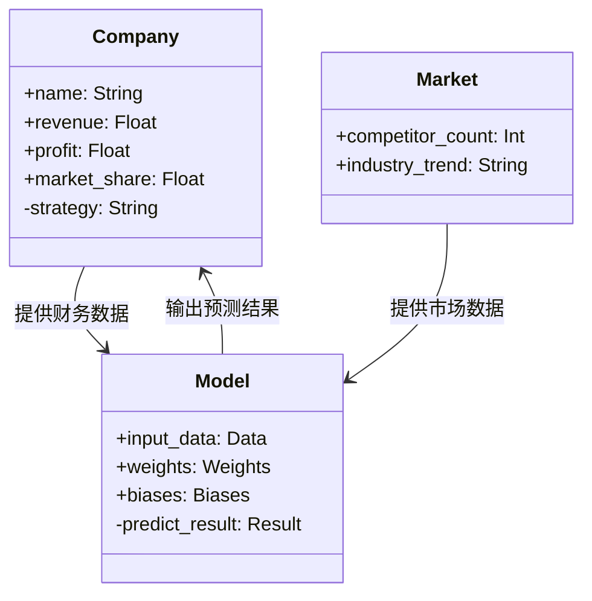

                 


# 深度学习预测公司长期竞争优势

> 关键词：深度学习，公司竞争优势，长期预测，商业分析，机器学习，企业战略

> 摘要：本文深入探讨了深度学习技术在预测公司长期竞争优势中的应用。通过分析深度学习的核心算法、模型构建、系统架构以及实际案例，本文为读者提供了从理论到实践的全面指导。我们首先介绍了深度学习的基本概念和公司竞争优势的定义，然后详细讲解了深度学习模型的构建过程，包括数据预处理、特征提取、模型训练与优化。接着，我们分析了深度学习算法在时间序列预测中的应用，并结合实际案例展示了如何利用深度学习技术预测公司的长期竞争优势。最后，我们总结了深度学习在商业分析中的优势与挑战，并提出了未来研究的方向。

---

# 第一部分: 深度学习与公司竞争优势的背景与基础

# 第1章: 深度学习与公司竞争优势概述

## 1.1 深度学习的基本概念

### 1.1.1 深度学习的定义与特点

深度学习是一种人工智能技术，属于机器学习的子领域，通过多层非线性变换模拟人脑的神经网络，以实现对数据的特征提取与模式识别。其核心特点包括：

- **非线性表达能力**：深度学习模型能够捕捉复杂的非线性关系，适用于处理高维数据。
- **自动特征提取**：深度学习通过多层网络结构自动提取特征，减少了人工特征工程的工作量。
- **大数据处理能力**：深度学习在处理大规模数据时表现出色，适用于现代商业分析中的海量数据场景。

$$
\text{深度学习的核心目标是通过数据驱动的方式，自动学习数据中的潜在规律。}
$$

### 1.1.2 深度学习的核心算法与技术

深度学习的核心算法包括：

1. **神经网络**：包括卷积神经网络（CNN）、循环神经网络（RNN）和Transformer架构。
2. **激活函数**：如ReLU、sigmoid和tanh。
3. **损失函数**：如交叉熵损失和均方误差。
4. **优化算法**：如随机梯度下降（SGD）和Adam优化器。

### 1.1.3 深度学习与公司竞争优势的关系

公司竞争优势是指企业在市场中相对于竞争对手的长期优势，通常包括成本优势、技术优势、品牌优势等。深度学习可以通过分析企业的财务数据、市场表现和战略决策，预测其竞争优势的强弱及未来发展趋势。

---

## 1.2 公司长期竞争优势的定义

### 1.2.1 什么是公司长期竞争优势

公司长期竞争优势是指企业在长期经营中能够在市场中获得超额收益的能力。这种优势通常来源于企业的核心竞争力，包括技术、管理、品牌、资源等方面。

### 1.2.2 竞争优势的类型与分类

竞争优势可以分为以下几类：

1. **成本优势**：企业通过规模经济或技术创新降低生产成本。
2. **技术优势**：企业掌握独特的技术或专利。
3. **品牌优势**：强大的品牌形象和客户忠诚度。
4. **管理优势**：高效的组织结构和管理能力。

### 1.2.3 深度学习在竞争优势预测中的作用

深度学习可以通过分析企业的历史数据和市场动态，预测其竞争优势的强弱变化。例如，通过分析企业的财务数据、市场份额和研发投入，可以预测其技术优势的变化趋势。

---

## 1.3 深度学习在商业分析中的应用

### 1.3.1 商业数据分析的基本方法

商业数据分析包括数据收集、数据清洗、特征提取和模型构建等步骤。深度学习在这些步骤中发挥了重要作用，特别是在特征提取和模式识别方面。

### 1.3.2 深度学习在商业预测中的优势

深度学习在商业预测中的优势包括：

1. **自动特征提取**：深度学习能够自动提取复杂的特征，减少人工干预。
2. **高维数据处理**：深度学习在处理高维数据时表现优异，适用于复杂的商业场景。
3. **非线性关系捕捉**：深度学习能够捕捉数据中的非线性关系，提高预测准确性。

### 1.3.3 企业竞争优势预测的挑战与机遇

企业竞争优势预测的挑战包括数据稀缺性、模型解释性和动态变化性。然而，深度学习的强大能力为解决这些问题提供了新的可能性。

---

## 1.4 本章小结

本章介绍了深度学习的基本概念和公司长期竞争优势的定义，探讨了深度学习在商业分析中的应用及其优势。通过这些内容，我们为后续章节的深入分析奠定了基础。

---

# 第2章: 深度学习预测模型的构建

## 2.1 深度学习模型的基本原理

### 2.1.1 神经网络的基本结构

神经网络的基本结构包括输入层、隐藏层和输出层。输入层接收数据，隐藏层通过非线性变换提取特征，输出层产生预测结果。

$$
\text{神经网络的输出可以表示为：}
$$

$$
y = f(xW + b)
$$

其中，$x$ 是输入，$W$ 是权重矩阵，$b$ 是偏置，$f$ 是激活函数。

### 2.1.2 深度学习模型的训练过程

深度学习模型的训练过程包括正向传播和反向传播两个阶段。正向传播计算预测值，反向传播更新权重以最小化损失。

### 2.1.3 模型的输入输出与特征提取

深度学习模型的输入可以是文本、图像或数值型数据。特征提取是深度学习的核心步骤，模型通过多层网络自动提取高层次特征。

---

## 2.2 公司竞争优势的特征分析

### 2.2.1 公司财务数据的特征提取

公司财务数据包括收入、利润、资产负债率等指标。深度学习可以通过这些数据预测公司的财务健康状况。

### 2.2.2 市场表现与竞争环境分析

市场表现包括市场份额和竞争对手分析。深度学习可以通过自然语言处理技术分析市场报告，提取竞争对手的信息。

### 2.2.3 公司战略与管理因素

公司战略包括研发投资和组织结构。深度学习可以通过文本数据（如公司年报）提取战略信息。

---

## 2.3 深度学习模型的输入与输出设计

### 2.3.1 数据预处理与特征工程

数据预处理包括数据清洗、归一化和缺失值处理。特征工程包括特征选择和特征提取。

### 2.3.2 模型输入的标准化与归一化

标准化和归一化是常用的数据预处理方法，可以提高模型的训练效果。

### 2.3.3 输出结果的解释与可读性

模型输出需要具有可解释性，以便企业能够根据预测结果制定战略决策。

---

## 2.4 深度学习模型的评估指标

### 2.4.1 分类模型的评估指标

常用的分类模型评估指标包括准确率、召回率和F1分数。

$$
\text{准确率} = \frac{\text{正确预测数}}{\text{总预测数}}
$$

$$
\text{召回率} = \frac{\text{正确预测的正例数}}{\text{实际正例数}}
$$

### 2.4.2 回归模型的评估指标

常用的回归模型评估指标包括均方误差（MSE）和均方根误差（RMSE）。

$$
\text{MSE} = \frac{1}{n}\sum_{i=1}^{n}(y_i - \hat{y}_i)^2
$$

### 2.4.3 模型的泛化能力与过拟合问题

过拟合是指模型在训练数据上表现优异，但在测试数据上表现不佳。可以通过正则化和交叉验证来防止过拟合。

---

## 2.5 本章小结

本章详细介绍了深度学习模型的构建过程，包括数据预处理、特征提取和模型评估。这些内容为后续章节的模型实现奠定了基础。

---

# 第3章: 基于深度学习的公司竞争优势预测算法

## 3.1 常见深度学习算法概述

### 3.1.1 卷积神经网络（CNN）

卷积神经网络适用于图像数据的处理，通过卷积操作提取空间特征。

### 3.1.2 循环神经网络（RNN）

循环神经网络适用于序列数据的处理，通过循环结构捕捉时序信息。

### 3.1.3 Transformer架构

Transformer架构通过自注意力机制处理长序列数据，广泛应用于自然语言处理领域。

---

## 3.2 LSTM网络在时间序列预测中的应用

### 3.2.1 LSTM网络的基本结构

LSTM网络包括输入门、遗忘门和输出门，能够有效捕捉时间序列中的长程依赖关系。

### 3.2.2 LSTM网络在时间序列预测中的优势

LSTM网络能够处理序列数据中的长程依赖，适用于公司竞争优势的时间序列预测。

### 3.2.3 LSTM网络的训练与优化

LSTM网络的训练过程与普通RNN类似，但需要特别处理梯度消失问题。

---

## 3.3 注意力机制在公司竞争优势预测中的应用

### 3.3.1 注意力机制的基本原理

注意力机制通过计算输入数据中每个位置的权重，确定哪些部分对预测更重要。

### 3.3.2 注意力机制在文本数据中的应用

通过自然语言处理技术分析公司年报，提取战略信息。

### 3.3.3 注意力机制在多模态数据中的应用

多模态数据包括文本、图像和数值型数据，注意力机制可以同时处理多种数据类型。

---

## 3.4 深度学习模型的训练与优化

### 3.4.1 梯度下降与优化算法

常用优化算法包括随机梯度下降（SGD）和Adam优化器。

### 3.4.2 模型的正则化与防止过拟合

正则化方法包括L1正则化和L2正则化，可以防止模型过拟合。

### 3.4.3 模型的分布式训练与加速

分布式训练可以提高模型训练效率，适用于大规模数据场景。

---

## 3.5 本章小结

本章介绍了深度学习算法的基本原理及其在公司竞争优势预测中的应用。通过这些算法，我们可以构建高效的预测模型。

---

# 第4章: 系统分析与架构设计

## 4.1 问题场景介绍

公司竞争优势预测系统需要处理多源异构数据，包括财务数据、市场报告和新闻数据。系统需要实时分析这些数据，提供竞争优势预测结果。

## 4.2 系统功能设计

### 4.2.1 领域模型（Mermaid 类图）



### 4.2.2 系统架构设计（Mermaid 架构图）

```mermaid
docker
    前端服务
    后端服务
    数据库
    模型训练服务
```

### 4.2.3 系统接口设计

系统接口包括数据接口和预测接口。数据接口用于获取公司数据，预测接口用于返回竞争优势预测结果。

### 4.2.4 系统交互（Mermaid 序列图）

```mermaid
sequenceDiagram

    用户 -> 前端服务: 提交公司ID
    前端服务 -> 后端服务: 获取公司数据
    后端服务 -> 数据库: 查询公司数据
    数据库 -> 后端服务: 返回公司数据
    后端服务 -> 模型训练服务: 调用预测接口
    模型训练服务 -> 返回预测结果
    后端服务 -> 用户: 返回预测结果
```

---

## 4.5 本章小结

本章通过系统分析与架构设计，展示了如何构建一个高效的公司竞争优势预测系统。

---

# 第5章: 项目实战

## 5.1 环境安装

### 5.1.1 安装Python

```bash
# 安装Python
sudo apt-get install python3
```

### 5.1.2 安装深度学习框架

```bash
# 安装TensorFlow
pip install tensorflow
```

### 5.1.3 安装其他依赖

```bash
# 安装Pandas和NumPy
pip install pandas numpy
```

## 5.2 系统核心实现源代码

### 5.2.1 数据预处理代码

```python
import pandas as pd
import numpy as np

def data_preprocessing(data):
    # 数据清洗
    data.dropna(inplace=True)
    # 归一化
    from sklearn.preprocessing import StandardScaler
    scaler = StandardScaler()
    data_scaled = scaler.fit_transform(data)
    return data_scaled
```

### 5.2.2 深度学习模型实现代码

```python
import tensorflow as tf
from tensorflow.keras import layers

def build_model(input_shape):
    model = tf.keras.Sequential()
    model.add(layers.LSTM(64, input_shape=input_shape))
    model.add(layers.Dense(1, activation='sigmoid'))
    model.compile(optimizer='adam', loss='binary_crossentropy', metrics=['accuracy'])
    return model
```

### 5.2.3 模型训练代码

```python
model = build_model((None, 1))
model.fit(X_train, y_train, epochs=10, batch_size=32)
```

## 5.3 代码应用解读与分析

### 5.3.1 数据预处理解读

数据预处理包括数据清洗和归一化，确保数据适合模型输入。

### 5.3.2 模型实现解读

模型包括LSTM层和全连接层，适用于时间序列数据的预测。

### 5.3.3 模型训练解读

模型通过反向传播算法更新权重，最小化损失函数。

## 5.4 实际案例分析和详细讲解剖析

### 5.4.1 案例背景

假设我们有某公司的财务数据和市场报告，希望通过深度学习预测其竞争优势。

### 5.4.2 数据准备

收集公司过去5年的财务数据和市场报告，清洗并归一化处理。

### 5.4.3 模型训练

使用LSTM网络训练模型，预测公司的竞争优势指数。

### 5.4.4 模型评估

通过准确率和召回率评估模型性能，调整超参数优化预测效果。

---

## 5.5 项目小结

本章通过实际案例展示了深度学习在公司竞争优势预测中的应用，详细讲解了项目的实现过程。

---

# 第6章: 总结与展望

## 6.1 总结

本文深入探讨了深度学习在公司竞争优势预测中的应用，介绍了深度学习的核心算法和系统架构设计。通过实际案例展示了深度学习在商业分析中的优势。

## 6.2 未来展望

未来，随着深度学习技术的不断发展，公司在竞争优势预测中的应用将更加广泛。同时，如何提高模型的可解释性和实时性仍是一个重要的研究方向。

---

# 作者：AI天才研究院/AI Genius Institute & 禅与计算机程序设计艺术 /Zen And The Art of Computer Programming

