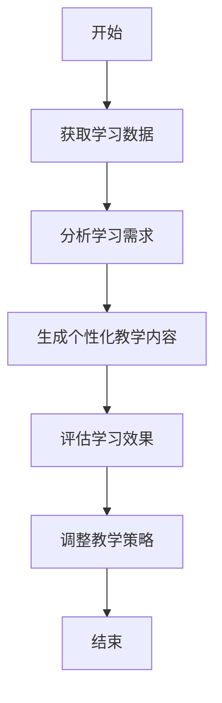
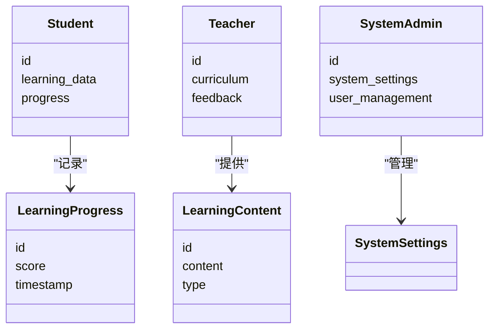
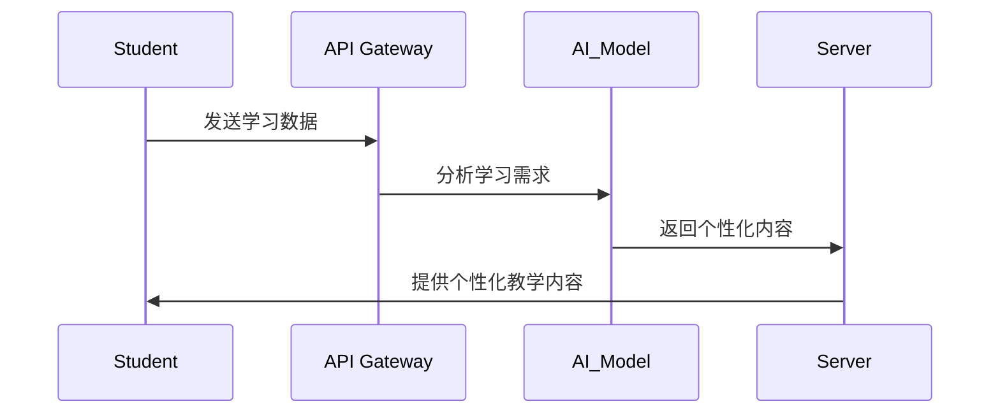

                 


# 自适应学习AI Agent：个性化的LLM教育系统

## 关键词：自适应学习，AI Agent，个性化教育，LLM，教育系统

## 摘要：  
本文探讨了如何通过自适应学习AI Agent实现个性化的LLM教育系统。通过分析当前教育系统的挑战，结合AI技术的核心原理，提出了一种基于强化学习和生成模型的自适应学习算法，并详细讲解了系统的架构设计与实现方案。本文旨在为教育科技领域提供一种创新的解决方案，帮助学生实现高效、个性化的学习体验。

---

# 第一部分: 自适应学习AI Agent的背景与核心概念

## 第1章: 自适应学习与AI Agent概述

### 1.1 问题背景与问题描述
#### 1.1.1 当前教育系统的挑战
传统教育系统往往采用“一刀切”的教学方式，难以满足不同学生的个性化学习需求。教师精力有限，难以针对每个学生的特点制定专属的学习计划。此外，学生的学习进度差异较大，部分学生可能因为跟不上进度而失去学习兴趣，而其他学生则可能因为缺乏挑战而感到厌倦。

#### 1.1.2 学生学习需求的多样性
每个学生的学习能力、兴趣爱好和认知风格都存在差异。例如，有些学生更适合视觉化学习，而有些学生则更适合听觉化学习。此外，学生的知识基础和学习目标也各不相同，这些差异使得传统的一对一教学难以大规模实施。

#### 1.1.3 AI在教育领域的潜力
人工智能技术的发展为教育领域带来了新的可能性。通过AI技术，可以实时分析学生的学习数据，了解学生的学习状态、知识掌握程度和兴趣偏好，从而为每个学生提供个性化的学习建议和教学内容。

### 1.2 自适应学习AI Agent的核心概念
#### 1.2.1 自适应学习的定义
自适应学习是一种基于学生个体特征和学习数据，动态调整教学内容、教学策略和学习路径的方法。其核心在于通过实时反馈和数据分析，为每个学生提供最适合的学习体验。

#### 1.2.2 AI Agent的基本原理
AI Agent是一种能够感知环境、做出决策并执行任务的智能体。在教育领域，AI Agent可以用于分析学生的学习数据，理解学生的需求，并根据这些信息提供个性化的教学支持。

#### 1.2.3 个性化LLM教育系统的特征
个性化LLM（Large Language Model）教育系统是一种基于大语言模型的教育系统，能够根据学生的学习数据生成个性化的教学内容。其主要特征包括：动态调整教学内容、实时反馈学习进度、个性化学习路径设计等。

### 1.3 问题解决与边界
#### 1.3.1 自适应学习AI Agent的解决方案
通过结合强化学习和生成模型，AI Agent可以动态调整教学策略，为学生提供个性化的学习内容。例如，当学生在某个知识点上出现困难时，系统会自动生成相关的练习题或解释性内容，帮助学生巩固知识。

#### 1.3.2 边界与外延
自适应学习AI Agent的核心功能包括数据分析、决策制定和内容生成。其边界在于不直接替代教师的角色，而是作为辅助工具为教师和学生提供支持。外延则包括与其他教育系统的集成和数据安全问题的处理。

#### 1.3.3 核心要素与组成结构
自适应学习AI Agent的组成结构包括：数据采集模块、数据分析模块、决策制定模块和内容生成模块。这些模块协同工作，为学生提供个性化的学习体验。

### 1.4 本章小结
本章介绍了自适应学习AI Agent的背景和核心概念，分析了传统教育系统的挑战和AI技术在教育领域的潜力。通过定义和特征的描述，明确了自适应学习AI Agent的核心要素和组成结构。

---

## 第2章: 自适应学习AI Agent的核心概念与联系

### 2.1 核心概念原理
#### 2.1.1 自适应学习的算法原理
自适应学习的核心在于实时分析学生的学习数据，并根据这些数据动态调整教学策略。例如，通过强化学习算法，系统可以不断优化教学内容，以提高学生的学习效果。

#### 2.1.2 AI Agent的决策机制
AI Agent的决策机制基于学生的学习数据和目标。系统通过分析学生的行为数据、知识掌握程度和兴趣偏好，制定个性化的教学策略。

#### 2.1.3 个性化LLM的实现方式
个性化LLM的实现依赖于大语言模型的强大生成能力。通过训练模型理解学生的语言偏好和知识需求，系统可以生成符合学生特点的教学内容。

### 2.2 核心概念属性对比
#### 2.2.1 自适应学习与传统教育的对比
| 特性       | 自适应学习             | 传统教育             |
|------------|-----------------------|----------------------|
| 教学策略   | 动态调整                | 固定统一              |
| 学习进度   | 实时跟踪                | 定期评估              |
| 教学内容   | 个性化生成              | 标准化内容              |

#### 2.2.2 AI Agent与传统教育工具的对比
| 特性       | AI Agent               | 传统教育工具           |
|------------|-----------------------|-----------------------|
| 智能性     | 高度智能                | 较低智能              |
| 交互性     | 实时互动                | 单向传递              |
| 数据处理   | 大数据分析              | 简单数据处理          |

#### 2.2.3 个性化LLM与其他教育系统的对比
个性化LLM的优势在于其强大的生成能力和灵活性。与其他教育系统相比，个性化LLM能够更精准地满足学生的学习需求。

### 2.3 ER实体关系图
```mermaid
er
  actor: 学生
  actor: 教师
  actor: 系统管理员
  entity: 学生数据
  entity: 教学内容
  entity: 学习进度
  entity: 系统设置
  relation: 学生 -> 学生数据: "拥有"
  relation: 教师 -> 教学内容: "提供"
  relation: 系统管理员 -> 系统设置: "管理"
  relation: 学生 -> 学习进度: "记录"
```

### 2.4 本章小结
本章通过对比分析，明确了自适应学习AI Agent的核心概念及其与其他教育工具的区别。通过ER图的展示，进一步理清了系统的实体关系和数据流动方式。

---

## 第3章: 自适应学习AI Agent的算法原理

### 3.1 算法原理概述
#### 3.1.1 强化学习在自适应学习中的应用
强化学习是一种通过试错机制优化决策的算法。在自适应学习中，强化学习被用于动态调整教学策略，以提高学生的学习效果。

#### 3.1.2 生成模型在个性化教育中的应用
生成模型（如GPT）可以生成符合学生需求的教学内容。通过训练模型理解学生的语言偏好和知识需求，系统可以生成高质量的个性化教学材料。

#### 3.1.3 联合学习机制的实现
联合学习机制结合了强化学习和生成模型的优势，通过不断优化教学策略和生成个性化内容，实现自适应学习的目标。

### 3.2 算法流程图


### 3.3 算法实现代码
```python
def adaptive_learning_algorithm(student_data):
    import numpy as np
    # 数据预处理
    processed_data = preprocess(student_data)
    # 分析学习需求
    learning_demand = analyze_demand(processed_data)
    # 生成个性化内容
    personalized_content = generate_content(learning_demand)
    # 评估学习效果
    effect = evaluate_effect(personalized_content)
    # 调整策略
    adjusted_strategy = adjust_strategy(effect)
    return adjusted_strategy
```

### 3.4 算法数学模型
自适应学习的核心算法基于强化学习，其数学模型如下：
$$
Q(s, a) = r + \gamma \max_{a'} Q(s', a')
$$
其中，$Q(s, a)$表示在状态$s$下执行动作$a$的期望回报，$r$是当前的奖励，$\gamma$是折扣因子，$s'$是下一个状态。

### 3.5 本章小结
本章详细讲解了自适应学习AI Agent的算法原理，包括强化学习和生成模型的应用，以及联合学习机制的实现。通过流程图和代码示例，帮助读者更好地理解算法的实现过程。

---

## 第4章: 系统分析与架构设计

### 4.1 问题场景介绍
本系统的目标是为学生提供个性化的学习体验，通过AI Agent实时分析学生的学习数据，动态调整教学内容和策略。

### 4.2 系统功能设计
#### 4.2.1 领域模型类图


#### 4.2.2 系统架构设计


#### 4.2.3 系统交互设计


### 4.3 本章小结
本章通过系统架构设计和交互设计，展示了自适应学习AI Agent的实现方式。类图和架构图帮助读者更好地理解系统的组成和功能关系。

---

## 第5章: 项目实战与案例分析

### 5.1 环境安装
要运行本系统，需要安装以下工具：
- Python 3.8+
- TensorFlow 2.0+
- PyTorch 1.0+
- Hugging Face库

### 5.2 系统核心实现
#### 5.2.1 数据预处理代码
```python
def preprocess(student_data):
    import pandas as pd
    df = pd.DataFrame(student_data)
    # 数据清洗
    df.dropna(inplace=True)
    # 数据标准化
    df = df.astype('float32')
    return df
```

#### 5.2.2 算法实现代码
```python
def adaptive_learning_algorithm(student_data):
    # 数据分析
    learning_demand = analyze_demand(student_data)
    # 生成内容
    personalized_content = generate_content(learning_demand)
    # 评估效果
    effect = evaluate_effect(personalized_content)
    # 调整策略
    adjusted_strategy = adjust_strategy(effect)
    return adjusted_strategy
```

### 5.3 案例分析
通过一个实际案例，展示了系统的实现过程和效果。例如，一个学生在数学学习中遇到困难，系统会根据其学习数据生成相关的练习题和解释性内容，帮助学生提高成绩。

### 5.4 本章小结
本章通过项目实战和案例分析，展示了自适应学习AI Agent的实际应用。代码实现和案例分析帮助读者更好地理解系统的实现过程和效果。

---

## 第6章: 最佳实践与总结

### 6.1 小结
本文详细探讨了自适应学习AI Agent的实现方式，结合强化学习和生成模型，提出了个性化的LLM教育系统。

### 6.2 注意事项
在实际应用中，需要注意数据隐私和模型的泛化能力。此外，系统的可解释性也是一个重要的问题。

### 6.3 拓展阅读
推荐读者阅读相关领域的书籍和论文，深入理解自适应学习和AI Agent的核心技术。

### 6.4 本章小结
本章总结了全文的核心内容，并提出了未来的研究方向和应用前景。

---

## 作者：AI天才研究院/AI Genius Institute & 禅与计算机程序设计艺术 /Zen And The Art of Computer Programming

---

通过以上结构，您可以逐步完成对《自适应学习AI Agent：个性化的LLM教育系统》的深入分析和详细阐述。

