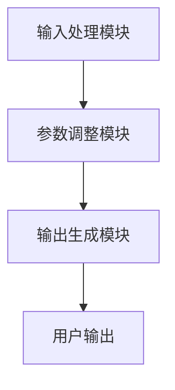
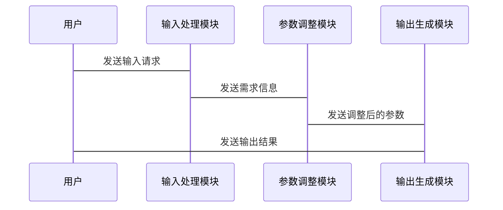

                 


# AI Agent 的个性化定制：调教 LLM 以适应不同用户

## 关键词：AI Agent，个性化定制，LLM，大语言模型，参数调整，微调，系统架构

## 摘要：本文详细探讨了如何通过个性化定制大语言模型（LLM）来适应不同用户的需求。文章从AI Agent的基本概念出发，分析了个性化定制的必要性与挑战，介绍了LLM的参数调整与微调技术，详细讲解了系统架构设计与实现，最后通过项目实战展示了个性化定制的具体实施步骤。文章内容涵盖理论与实践，旨在帮助读者全面理解并掌握AI Agent的个性化定制方法。

---

## 第一部分: AI Agent 的个性化定制基础

### 第1章: AI Agent 的基本概念与背景

#### 1.1 AI Agent 的定义与核心概念

##### 1.1.1 什么是AI Agent
AI Agent（人工智能代理）是指能够感知环境并采取行动以实现目标的智能体。它可以是一个软件程序、一个机器人或其他智能系统，通过与环境交互来完成特定任务。

##### 1.1.2 AI Agent 的核心特征
AI Agent的核心特征包括：
- **自主性**：能够在没有外部干预的情况下独立运作。
- **反应性**：能够感知环境并实时调整行为。
- **目标导向性**：有明确的目标，并采取行动以实现目标。
- **学习能力**：能够通过经验改进自身性能。

##### 1.1.3 AI Agent 的分类与应用场景
AI Agent可以分为以下几类：
1. **简单反射型**：基于当前输入直接生成固定输出，常用于简单的自动化任务。
2. **基于模型的反射型**：使用内部状态模型来生成输出，适用于需要复杂决策的任务。
3. **目标驱动型**：通过目标和规划来驱动行为，常用于复杂问题求解。
4. **效用驱动型**：通过最大化效用来驱动行为，适用于资源优化和决策优化。

应用场景包括：
- 自然语言处理
- 机器人控制
- 智能推荐系统
- 自动驾驶

#### 1.2 LLM 的基本原理与工作方式

##### 1.2.1 大语言模型的定义与特点
大语言模型（LLM）是指基于大量数据训练的大型语言模型，具有以下特点：
- **大数据量**：通常使用数百万甚至数十亿的训练数据。
- **深度神经网络**：采用多层神经网络结构，能够捕捉复杂的语言模式。
- **生成能力**：能够生成自然语言文本，具有较高的生成质量。

##### 1.2.2 LLM 的训练机制
LLM的训练通常采用监督学习和强化学习相结合的方式：
1. **监督学习**：模型在大量标注数据上进行训练，学习输入与输出之间的映射关系。
2. **强化学习**：通过奖励机制，模型学习如何生成更符合期望的输出。

##### 1.2.3 LLM 的输出机制与生成原理
LLM的输出机制基于概率生成模型，通过计算每个可能的下一个词的概率分布，选择概率最高的词生成输出。这种机制可以通过调整模型参数来影响生成内容的方向和风格。

#### 1.3 个性化定制的必要性与挑战

##### 1.3.1 个性化定制的背景与意义
随着AI技术的广泛应用，用户对AI代理的需求日益多样化。不同用户可能有不同的语言习惯、文化背景和使用场景，需要AI代理能够灵活适应这些差异。

##### 1.3.2 个性化定制的核心问题
个性化定制的核心问题包括：
- 如何根据用户需求调整模型参数。
- 如何设计高效的定制方法，确保定制后的模型性能优良。
- 如何在定制过程中平衡通用性和专化性。

##### 1.3.3 个性化定制的常见挑战
个性化定制的常见挑战包括：
- 数据不足：定制化模型需要特定领域的数据，获取高质量数据可能困难。
- 计算资源：定制化模型的训练通常需要大量的计算资源。
- 模型漂移：定制化模型可能在后续使用中出现性能下降，需要持续优化。

#### 1.4 本章小结
本章介绍了AI Agent和LLM的基本概念，分析了个性化定制的必要性与挑战，为后续章节的深入讨论奠定了基础。

---

## 第二部分: LLM 的个性化定制方法论

### 第2章: 个性化定制的需求分析与目标设定

#### 2.1 用户需求的多样性与差异性

##### 2.1.1 不同用户的个性化需求
不同用户可能有不同的语言风格、表达习惯和使用场景，需要AI代理能够灵活适应这些差异。

##### 2.1.2 用户需求的动态变化
用户的个性化需求可能会随着时间和场景的变化而变化，AI代理需要能够实时调整以满足这些变化。

##### 2.1.3 用户需求的优先级与权重
在个性化定制过程中，需要对不同需求进行优先级排序，并根据其权重进行调整。

#### 2.2 个性化定制的目标与范围

##### 2.2.1 定制化目标的设定
个性化定制的目标通常包括：
- 提高生成内容的相关性。
- 优化生成内容的风格和语气。
- 提升用户体验和满意度。

##### 2.2.2 定制化范围的界定
个性化定制的范围需要根据具体场景和需求进行界定，通常包括：
- 语言风格的调整。
- 生成内容的长度和格式。
- 响应时间的优化。

##### 2.2.3 定制化与通用性的平衡
在个性化定制过程中，需要在定制化和通用性之间找到平衡点，避免过度定制导致模型的泛化能力下降。

#### 2.3 需求分析的方法与工具

##### 2.3.1 用户调研与需求收集
通过问卷调查、用户访谈等方式收集用户需求，了解用户的痛点和期望。

##### 2.3.2 需求分析的流程与步骤
需求分析的流程通常包括：
1. **需求收集**：通过多种渠道收集用户需求。
2. **需求整理**：对收集到的需求进行分类和整理。
3. **需求分析**：分析需求的优先级和可行性。
4. **需求确认**：与用户确认需求的准确性。

##### 2.3.3 需求分析的工具与技术
常用的需求分析工具包括：
- **问卷调查工具**：如SurveyMonkey、Google Forms。
- **数据分析工具**：如Excel、Python的Pandas库。
- **用户画像工具**：如Mixpanel、Google Analytics。

#### 2.4 本章小结
本章探讨了个性化定制的需求分析与目标设定，强调了需求分析的重要性，并介绍了相关的方法与工具。

---

## 第三部分: LLM 的个性化定制实现技术

### 第3章: LLM 的参数调整与微调

#### 3.1 参数调整的基本原理

##### 3.1.1 模型参数的可调性
大语言模型的参数通常包括权重系数、偏置项等，可以通过调整这些参数来改变模型的输出行为。

##### 3.1.2 参数调整的影响因素
参数调整的影响因素包括：
- 调整幅度：参数调整的幅度越大，模型的变化越显著。
- 调整范围：参数调整的范围不同，对模型性能的影响也不同。
- 调整方法：采用不同的调整方法（如随机调整、梯度下降）会影响参数调整的效果。

##### 3.1.3 参数调整的数学模型
参数调整的数学模型通常包括损失函数和优化器。例如，使用交叉熵损失函数和Adam优化器进行参数调整。

$$
\text{损失函数} = -\sum_{i=1}^{n} y_i \log(p_i) + (1 - y_i) \log(1 - p_i)
$$

其中，$y_i$ 是真实标签，$p_i$ 是模型预测的概率。

#### 3.2 微调（Fine-tuning）技术

##### 3.2.1 微调的定义与作用
微调是指在预训练模型的基础上，针对特定任务进行进一步的训练，以提高模型在该任务上的性能。

##### 3.2.2 微调的实现步骤
微调的实现步骤通常包括：
1. **预训练模型加载**：加载已经预训练好的模型。
2. **数据准备**：准备特定任务的训练数据。
3. **微调训练**：在特定任务的数据上进行微调训练。
4. **模型评估**：评估微调后的模型性能。

##### 3.2.3 微调的效果评估
微调的效果可以通过以下指标进行评估：
- 准确率
- 召回率
- F1分数

$$
F1 = 2 \times \frac{\text{Precision} \times \text{Recall}}{\text{Precision} + \text{Recall}}
$$

#### 3.3 参数调整的策略与技巧

##### 3.3.1 参数调整的常见策略
常见的参数调整策略包括：
- **逐步调整**：逐步调整参数，观察模型性能的变化。
- **批量调整**：同时调整多个参数，观察整体效果。
- **基于梯度的调整**：根据梯度信息进行参数调整，通常使用优化器进行。

##### 3.3.2 参数调整的优化技巧
参数调整的优化技巧包括：
- **学习率调整**：适当调整学习率，避免训练过程中的震荡和收敛过慢。
- **批量大小调整**：调整批量大小，优化训练效率和模型性能。
- **正则化技术**：使用正则化技术（如L2正则化）防止过拟合。

##### 3.3.3 参数调整的注意事项
在参数调整过程中需要注意以下几点：
- 避免过度调整，导致模型过拟合。
- 定期评估模型性能，及时调整参数。
- 记录调整过程中的关键参数和性能指标，便于后续分析。

#### 3.4 本章小结
本章详细介绍了LLM的参数调整与微调技术，探讨了参数调整的基本原理和实现策略，为后续章节的系统架构设计奠定了基础。

---

## 第四部分: LLM 的个性化定制系统架构

### 第4章: 系统架构设计与实现

#### 4.1 系统架构的整体设计

##### 4.1.1 系统模块划分
个性化定制系统的模块划分通常包括：
- **输入处理模块**：负责接收用户的输入请求。
- **参数调整模块**：负责根据用户需求调整模型参数。
- **输出生成模块**：负责生成符合用户需求的输出结果。

##### 4.1.2 系统功能设计
系统功能设计通常包括：
- **用户输入处理**：解析用户的输入请求，提取需求信息。
- **参数调整**：根据需求信息调整模型参数。
- **输出生成**：生成符合用户需求的输出结果。

##### 4.1.3 系统架构图（Mermaid）


#### 4.2 各模块的功能实现

##### 4.2.1 输入处理模块
输入处理模块的主要功能包括：
- 接收用户的输入请求。
- 解析输入请求，提取需求信息。
- 转换需求信息为模型可处理的格式。

##### 4.2.2 参数调整模块
参数调整模块的主要功能包括：
- 根据需求信息调整模型参数。
- 使用优化算法（如Adam）进行参数微调。
- 监控和记录参数调整过程中的性能指标。

##### 4.2.3 输出生成模块
输出生成模块的主要功能包括：
- 根据调整后的模型参数生成输出结果。
- 转换输出结果为用户可理解的格式。
- 返回输出结果给用户。

#### 4.3 系统接口设计与交互流程

##### 4.3.1 系统接口定义
系统接口通常包括：
- **输入接口**：用于接收用户的输入请求。
- **输出接口**：用于返回生成的输出结果。
- **状态接口**：用于监控和报告系统状态。

##### 4.3.2 系统交互流程图（Mermaid）


#### 4.4 本章小结
本章探讨了个性化定制系统的整体架构设计，介绍了各模块的功能实现和系统接口设计，为后续章节的项目实战奠定了基础。

---

## 第五部分: 个性化定制的项目实战

### 第5章: 个性化定制项目的实施与落地

#### 5.1 项目环境的搭建与配置

##### 5.1.1 开发环境的选择
推荐使用Python作为开发语言，常用框架包括TensorFlow和PyTorch。

##### 5.1.2 工具链的安装与配置
安装必要的工具和库，如：
- Python 3.x
- TensorFlow或PyTorch
- Numpy
- Pandas

##### 5.1.3 数据集的准备与预处理
需要准备特定领域的数据集，并进行清洗、标注和格式转换。

#### 5.2 项目核心代码的实现

##### 5.2.1 输入处理模块的实现
```python
class InputHandler:
    def __init__(self):
        self.model = None
        self.tokenizer = None

    def load_model(self, model_path, tokenizer_path):
        self.model = load_model(model_path)
        self.tokenizer = load_tokenizer(tokenizer_path)

    def process_input(self, input_text):
        inputs = self.tokenizer.encode(input_text)
        return inputs
```

##### 5.2.2 参数调整模块的实现
```python
class ParameterTuner:
    def __init__(self, model, tokenizer):
        self.model = model
        self.tokenizer = tokenizer
        self.optimizer = Adam(self.model.parameters(), lr=1e-5)

    def fine_tune(self, train_data, num_epochs=3):
        for epoch in range(num_epochs):
            for batch in train_data:
                inputs, labels = self.preprocess_batch(batch)
                outputs = self.model(inputs)
                loss = self.compute_loss(outputs, labels)
                loss.backward()
                self.optimizer.step()
                self.model.zero_grad()

    def preprocess_batch(self, batch):
        # 具体的预处理逻辑
        pass

    def compute_loss(self, outputs, labels):
        # 具体的损失计算逻辑
        pass
```

##### 5.2.3 输出生成模块的实现
```python
class OutputGenerator:
    def __init__(self, model, tokenizer):
        self.model = model
        self.tokenizer = tokenizer

    def generate_output(self, inputs, max_length=50):
        outputs = self.model.generate(inputs, max_length=max_length)
        return self.tokenizer.decode(outputs[0])
```

#### 5.3 项目核心代码的功能解读
- **输入处理模块**：负责接收用户的输入请求，并将其转换为模型可处理的格式。
- **参数调整模块**：根据用户需求调整模型参数，优化模型性能。
- **输出生成模块**：根据调整后的模型参数生成输出结果，并返回给用户。

#### 5.4 项目实战案例分析
以一个简单的文本生成任务为例，展示个性化定制的具体实施步骤。

##### 5.4.1 数据集准备
准备一个特定领域的文本数据集，如科技新闻。

##### 5.4.2 模型微调
在数据集上进行微调，调整模型的参数，使其更适合生成科技新闻。

##### 5.4.3 模型评估
评估微调后的模型性能，计算准确率、召回率和F1分数。

##### 5.4.4 模型部署
将微调后的模型部署到实际应用中，提供文本生成服务。

#### 5.5 项目小结
本章通过一个具体案例，展示了个性化定制项目的实施与落地过程，详细介绍了环境搭建、代码实现和案例分析。

---

## 第六部分: 总结与展望

### 第6章: 总结与展望

#### 6.1 核心内容总结
个性化定制AI Agent的过程包括需求分析、参数调整、系统设计和项目实施等多个环节，需要综合运用多种技术手段。

#### 6.2 个性化定制的未来展望
随着AI技术的不断发展，个性化定制将更加智能化和自动化，模型的可解释性和通用性也将进一步提升。

#### 6.3 最佳实践 Tips
- 在个性化定制过程中，需要充分考虑用户需求的多样性和动态变化。
- 参数调整需要结合具体场景，采用合适的调整策略。
- 系统架构设计需要注重模块化和可扩展性。

#### 6.4 本章小结
本章总结了个性化定制的核心内容，展望了未来的发展方向，并给出了最佳实践建议。

---

## 作者信息

作者：AI天才研究院/AI Genius Institute & 禅与计算机程序设计艺术 /Zen And The Art of Computer Programming

---

## 拓展阅读

- [Transformers: State-of-the-art language models](https://huggingface.co/transformers)
- [Parameter-efficient fine-tuning](https://arxiv.org/abs/2103.00152)
- [Large language models for personalized dialogue systems](https://arxiv.org/abs/2005.00876)

--- 

希望这篇文章能够为您提供有价值的信息，欢迎在评论区留下您的问题和建议！

