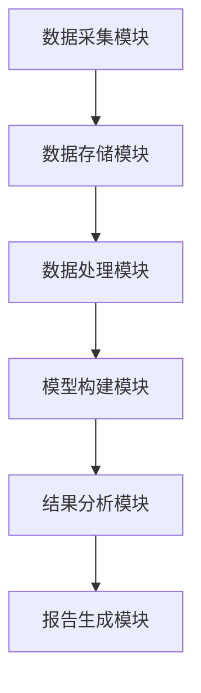

                 


# AI驱动的公司文化量化分析：无形资产估值新方法

> 关键词：AI驱动，公司文化，无形资产，量化分析，企业估值

> 摘要：随着人工智能技术的快速发展，公司文化的量化分析成为企业管理和价值评估的重要方向。本文通过AI技术，提出一种新型的公司文化无形资产估值方法，为企业提供更精准的决策支持。

---

## 第1章: AI驱动的公司文化量化分析背景与基础

### 1.1 公司文化的定义与内涵

#### 1.1.1 公司文化的定义
公司文化是指企业在长期经营过程中形成的共同价值观、行为准则和思维方式。它包括企业愿景、使命、核心价值观、员工关系、团队协作等多个方面。

#### 1.1.2 公司文化的核心要素
- **愿景与使命**：企业的长期目标和发展方向。
- **价值观**：企业在经营活动中所遵循的基本原则。
- **员工关系**：员工之间的互动和合作方式。
- **组织结构**：企业内部的分工和权力分配。
- **行为规范**：员工在日常工作中必须遵守的规则。

#### 1.1.3 无形资产的特性
无形资产是指企业没有实物形态的资产，主要包括品牌价值、商誉、技术专利、客户关系、员工凝聚力等。这些资产无法通过简单的财务指标来衡量，但对企业整体价值具有重要影响。

### 1.2 公司文化与无形资产的关系

#### 1.2.1 公司文化对无形资产的影响
- **正面影响**：良好的企业文化可以提升员工的凝聚力、创造力和忠诚度，从而增强企业的品牌价值和市场竞争力。
- **负面影响**：负面的文化氛围可能导致员工士气低落、创造力受限，进而影响企业的整体价值。

#### 1.2.2 无形资产对公司价值的贡献
- 无形资产是企业核心竞争力的重要组成部分。
- 无形资产的价值往往决定了企业的市场地位和盈利能力。

#### 1.2.3 无形资产量化评估的挑战
- **数据获取难度**：公司文化的表现往往隐性，难以直接测量。
- **主观性**：不同人的主观判断可能影响评估结果。
- **动态变化**：企业文化会随着企业战略和外部环境的变化而不断调整。

### 1.3 AI技术在无形资产估值中的应用前景

#### 1.3.1 AI技术的基本概念
人工智能（AI）是指通过计算机技术模拟人类智能的活动，包括学习、推理、自我改进等能力。AI技术可以处理大量非结构化数据，发现数据中的隐藏模式和规律。

#### 1.3.2 AI在无形资产估值中的优势
- **数据处理能力**：AI能够处理大量非结构化数据，如文本、语音、图像等，提取有价值的信息。
- **自动化分析**：AI可以通过机器学习模型自动分析数据，提供客观的评估结果。
- **动态调整能力**：AI模型可以根据实时数据不断优化评估结果，适应企业的动态变化。

#### 1.3.3 未来发展趋势与挑战
- **发展趋势**：AI技术在无形资产估值中的应用将更加广泛，评估方法将更加精准。
- **挑战**：如何确保AI模型的透明性和可解释性，如何处理数据隐私问题。

---

## 第2章: 文化量化分析的核心概念与框架

### 2.1 文化量化分析的理论基础

#### 2.1.1 企业文化评估指标体系
为了量化分析公司文化，我们需要建立一套科学的评估指标体系。常见的指标包括：
- 员工满意度
- 员工忠诚度
- 团队协作能力
- 创新能力
- 企业凝聚力

#### 2.1.2 无形资产价值评估模型
无形资产的价值评估模型需要考虑以下几个方面：
- **品牌价值**：企业的品牌知名度和美誉度。
- **商誉**：企业的市场声誉和客户信任度。
- **员工凝聚力**：员工的归属感和忠诚度。

#### 2.1.3 文化与绩效的关系模型
文化与绩效的关系模型是用来分析企业文化对企业绩效的影响。常见的模型包括：
- **文化-绩效匹配模型**
- **文化-战略匹配模型**

### 2.2 AI驱动的文化量化分析框架

#### 2.2.1 数据采集与处理流程
AI驱动的文化量化分析需要收集大量的数据，包括：
- 员工反馈数据
- 客户满意度数据
- 销售数据
- 市场数据

#### 2.2.2 模型构建与训练方法
AI驱动的文化量化分析模型需要通过机器学习算法进行训练。常见的算法包括：
- 支持向量机（SVM）
- 线性回归
- 神经网络

#### 2.2.3 结果分析与应用策略
分析结果可以帮助企业识别文化中存在的问题，并制定相应的改进策略。例如：
- 提高员工满意度
- 增强团队协作能力
- 提升品牌价值

### 2.3 核心概念对比与关系图

#### 2.3.1 文化评估指标对比表
| 指标 | 定义 | 重要性 | 数据来源 |
|------|------|--------|----------|
| 员工满意度 | 员工对工作环境的满意程度 | 高 | 调查问卷 |
| 员工忠诚度 | 员工对企业忠诚度的高低 | 高 | 调查问卷 |
| 团队协作能力 | 团队成员之间的合作程度 | 中 | 团队评估 |
| 创新能力 | 员工的创新意识和能力 | 高 | 创新项目评估 |

#### 2.3.2 AI模型属性特征对比
| 模型 | 优点 | 缺点 | 适用场景 |
|------|------|------|----------|
| 支持向量机（SVM） | 高精度 | 适合小数据集 | 分类问题 |
| 线性回归 | 简单易懂 | 适合线性关系 | 预测问题 |
| 神经网络 | 高精度 | 需要大量数据 | 复杂问题 |

#### 2.3.3 实体关系ER图

```mermaid
erDiagram
    employee [员工] {
        +int 员工ID
        +string 员工姓名
        +int 部门ID
    }
    department [部门] {
        +int 部门ID
        +string 部门名称
    }
    culture_assessment [文化评估] {
        +int 评估ID
        +float 评估分数
        +date 评估日期
    }
    employee --> department : "属于部门"
    employee --> culture_assessment : "参与评估"
    department --> culture_assessment : "关联评估"
```

---

## 第3章: AI驱动的文化量化分析算法原理

### 3.1 自然语言处理在文化评估中的应用

#### 3.1.1 NLP技术的核心原理
自然语言处理（NLP）是AI技术的重要组成部分，用于处理和分析文本数据。NLP的核心步骤包括：
1. 文本分词
2. 词干提取
3. 情感分析
4. 实体识别

#### 3.1.2 NLP在员工反馈分析中的应用
企业可以通过分析员工的反馈文本，了解员工的情绪和态度。例如：
- 使用情感分析技术判断员工对公司的满意度。
- 使用主题模型（如LDA）提取员工反馈的主要内容。

#### 3.1.3 NLP算法实现代码

```python
from nltk.tokenize import word_tokenize
from nltk.sentiment import SentimentIntensityAnalyzer

text = "员工对公司的管理非常不满意，认为管理层缺乏沟通。"
tokens = word_tokenize(text)
sia = SentimentIntensityAnalyzer()
sentiment = sia.polarity_scores(' '.join(tokens))
print(sentiment)
```

#### 3.1.4 文本分析结果解读
上述代码可以输出文本的情感倾向，帮助企业识别员工反馈中的负面情绪。例如：
```python
{'neg': 0.85, 'neu': 0.1, 'pos': 0.05, 'compound': -0.75}
```
这表明员工的反馈具有强烈的负面情绪。

### 3.2 机器学习模型在文化评估中的应用

#### 3.2.1 机器学习模型的核心原理
机器学习模型通过训练数据学习特征和标签之间的关系，从而实现对新数据的预测。常见的机器学习模型包括：
- 支持向量机（SVM）
- 线性回归
- 神经网络

#### 3.2.2 机器学习在文化评估中的应用
企业可以通过机器学习模型预测员工的离职率、团队协作能力等关键指标。例如：
- 使用逻辑回归模型预测员工的离职概率。
- 使用随机森林模型分析影响员工满意度的主要因素。

#### 3.2.3 机器学习算法实现代码

```python
from sklearn.svm import SVC
from sklearn.model_selection import train_test_split
from sklearn.metrics import accuracy_score

# 数据预处理
X = ... # 特征矩阵
y = ... # 标签向量

# 划分训练集和测试集
X_train, X_test, y_train, y_test = train_test_split(X, y, test_size=0.2)

# 训练SVM模型
model = SVC()
model.fit(X_train, y_train)

# 预测测试集
y_pred = model.predict(X_test)

# 计算准确率
accuracy = accuracy_score(y_test, y_pred)
print(f"模型准确率：{accuracy}")
```

#### 3.2.4 评估模型性能
模型的性能可以通过准确率、召回率、F1分数等指标进行评估。例如：
- 准确率：模型预测正确的样本比例。
- 召回率：模型正确识别的正样本比例。
- F1分数：准确率和召回率的调和平均数。

### 3.3 算法优化与调优

#### 3.3.1 超参数优化
通过调整模型的超参数（如学习率、正则化系数等），可以提高模型的性能。例如：
- 使用网格搜索（Grid Search）进行参数调优。

#### 3.3.2 模型集成
通过集成多个模型的结果，可以进一步提高模型的性能。例如：
- 使用投票分类器（Voting Classifier）集成多个模型的预测结果。

#### 3.3.3 模型解释性
为了确保模型的透明性和可解释性，可以使用特征重要性分析等方法。例如：
- 使用SHAP值（SHapley Additive exPlanations）解释模型的预测结果。

---

## 第4章: 系统分析与架构设计

### 4.1 项目背景与目标

#### 4.1.1 项目背景
随着企业竞争的加剧，文化管理逐渐成为企业核心竞争力的重要组成部分。如何利用AI技术量化分析公司文化，成为企业面临的重要课题。

#### 4.1.2 项目目标
本项目旨在通过AI技术，建立一套公司文化量化分析系统，帮助企业准确评估无形资产的价值，优化企业管理和决策。

### 4.2 系统功能设计

#### 4.2.1 数据采集模块
- 收集员工反馈、客户满意度、销售数据等多源数据。
- 数据预处理：清洗、转换和标准化。

#### 4.2.2 模型构建模块
- 选择合适的机器学习模型（如SVM、随机森林）。
- 训练模型并进行优化。

#### 4.2.3 结果分析模块
- 可视化分析结果，提供直观的报告。
- 提供改进建议，帮助企业优化文化管理。

### 4.3 系统架构设计

#### 4.3.1 系统架构图



#### 4.3.2 接口设计
- 数据接口：与企业内部系统对接，获取相关数据。
- 报告接口：提供API，供企业调用分析结果。

#### 4.3.3 交互设计
- 用户可以通过Web界面提交数据。
- 系统生成报告后，用户可以通过邮件或短信收到通知。

---

## 第5章: 项目实战与案例分析

### 5.1 项目环境与安装

#### 5.1.1 环境要求
- Python 3.8+
- Jupyter Notebook
- Scikit-learn、NLTK等Python库

#### 5.1.2 安装依赖
```bash
pip install numpy pandas scikit-learn nltk
```

### 5.2 系统核心实现

#### 5.2.1 数据采集与处理
```python
import pandas as pd
import nltk
from sklearn.feature_extraction.text import TfidfVectorizer

# 加载数据
data = pd.read_csv('employee_feedback.csv')

# 文本预处理
nltk.download('punkt')
nltk.download('stopwords')
vectorizer = TfidfVectorizer(stop_words='english')
X = vectorizer.fit_transform(data['反馈'])
```

#### 5.2.2 模型训练与预测
```python
from sklearn.svm import SVC
from sklearn.metrics import accuracy_score

# 划分训练集和测试集
X_train, X_test, y_train, y_test = train_test_split(X, data['满意度'], test_size=0.2)

# 训练模型
model = SVC()
model.fit(X_train, y_train)

# 预测结果
y_pred = model.predict(X_test)
print(f"准确率：{accuracy_score(y_test, y_pred)}")
```

#### 5.2.3 结果分析与可视化
```python
from sklearn.metrics import confusion_matrix, classification_report
import matplotlib.pyplot as plt

# 绘制混淆矩阵
cm = confusion_matrix(y_test, y_pred)
plt.matshow(cm, cmap='viridis')
plt.colorbar()
plt.show()

# 分类报告
print(classification_report(y_test, y_pred))
```

### 5.3 案例分析与解读

#### 5.3.1 案例背景
某科技公司希望通过分析员工反馈，优化企业文化管理。

#### 5.3.2 数据分析结果
- 员工满意度：70%
- 主要问题：团队协作效率低、员工归属感差
- 改进建议：加强团队建设、提升员工福利

#### 5.3.3 改进措施
- 组织团队建设活动，提高员工凝聚力。
- 定期进行员工满意度调查，及时发现并解决问题。

---

## 第6章: 最佳实践与注意事项

### 6.1 小结
本文通过AI技术，提出了一种新型的公司文化量化分析方法。通过自然语言处理和机器学习算法，帮助企业准确评估无形资产的价值，优化企业管理和决策。

### 6.2 注意事项
- 数据隐私问题：在处理员工反馈时，需要保护员工的隐私。
- 模型透明性：确保模型的预测结果具有可解释性。
- 持续优化：定期更新模型，适应企业的动态变化。

### 6.3 拓展阅读
- 《人工智能：一种现代方法》
- 《机器学习实战》
- 《自然语言处理入门》

---

## 作者：AI天才研究院/AI Genius Institute & 禅与计算机程序设计艺术 /Zen And The Art of Computer Programming

