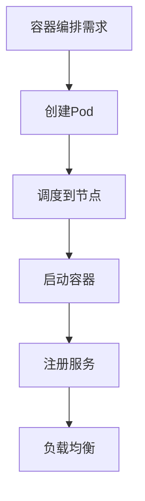
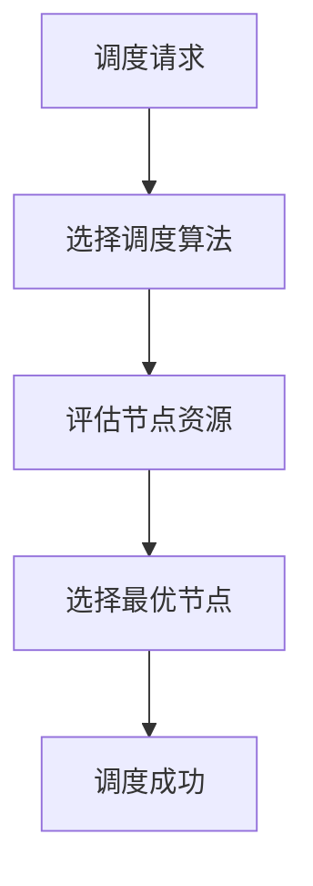
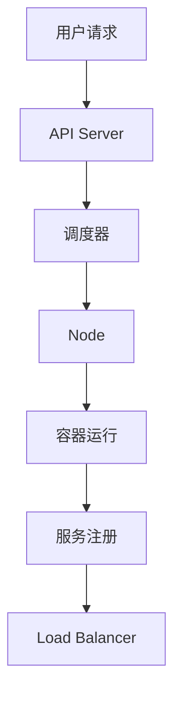
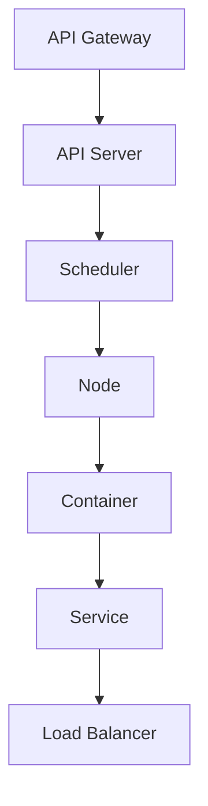
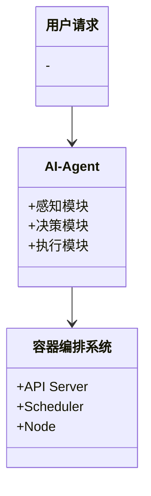
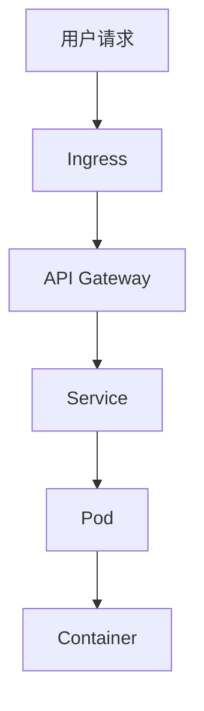

                 


# 企业AI Agent的容器化部署策略

## 关键词：企业AI Agent，容器化部署，Kubernetes，Docker，微服务架构

## 摘要：企业AI Agent的容器化部署策略探讨了在企业环境中如何高效部署和管理AI代理，利用容器化技术如Docker和Kubernetes实现灵活、可扩展的部署方案，涵盖背景、原理、架构设计、实战案例及最佳实践。

---

# 第1章: 企业AI Agent的容器化部署背景与基础

## 1.1 AI Agent的基本概念

### 1.1.1 AI Agent的定义与特点
AI Agent（人工智能代理）是能够感知环境、自主决策并执行任务的智能实体。其特点包括自主性、反应性、目标导向和学习能力。AI Agent广泛应用于企业场景，如智能客服、自动化决策支持和流程自动化。

### 1.1.2 AI Agent在企业中的应用场景
企业中AI Agent的应用场景包括智能客服、流程自动化、决策支持和数据分析。例如，AI Agent可以自动处理客户请求，优化业务流程，提升决策效率。

### 1.1.3 容器化技术的原理
容器化技术通过轻量级虚拟化实现应用程序的隔离运行。Docker容器包括运行时环境、文件系统和配置，确保应用程序在不同环境中一致运行。

## 1.2 容器化部署的核心优势

### 1.2.1 容器化与虚拟化技术的对比
容器与虚拟机的主要区别在于资源消耗和隔离性。容器共享宿主机的操作系统，资源占用低，启动速度快；虚拟机则提供完全隔离的环境，资源消耗较高。

### 1.2.2 容器化部署对企业IT架构的影响
容器化推动企业IT架构向微服务架构转型，提高了系统的模块化和可扩展性。容器编排技术如Kubernetes简化了应用部署和管理，提升了运维效率。

### 1.2.3 容器化部署的灵活性与可扩展性
容器化部署支持快速迭代和弹性扩展，适用于企业中动态变化的应用需求。容器编排工具能够自动管理容器的生命周期，确保系统的高可用性。

## 1.3 企业AI Agent容器化部署的背景

### 1.3.1 企业数字化转型的驱动力
企业数字化转型需求推动了AI技术的广泛应用，容器化部署成为实现高效管理和灵活扩展的重要手段。

### 1.3.2 AI Agent在企业中的价值
AI Agent通过自动化处理任务，提高企业运营效率，降低成本，并提升用户体验。

### 1.3.3 容器化部署的必要性与挑战
容器化部署的必要性在于其灵活性和可扩展性，但同时也面临技术复杂性和运维挑战。企业需要克服技术难题，建立完善的运维体系。

---

# 第2章: 容器化技术的核心概念与原理

## 2.1 容器化技术的体系结构

### 2.1.1 容器运行时环境
容器运行时环境包括容器运行时、容器存储和网络配置。Docker运行时负责管理容器的启动、运行和终止，容器存储提供数据持久化，网络配置确保容器间的通信。

### 2.1.2 容器镜像的构建与管理
容器镜像通过Dockerfile构建，包含应用程序及其依赖。镜像仓库用于存储和分发镜像，Docker Registry是常用的镜像仓库。

### 2.1.3 容器编排工具的作用
容器编排工具如Kubernetes负责管理容器的生命周期，包括部署、扩展和自愈。编排工具通过定义配置文件（如Kubernetes的YAML）实现自动化管理。

## 2.2 容器编排技术的原理

### 2.2.1 Docker容器编排的基本流程
Docker容器编排涉及服务发现、负载均衡和自动扩缩容。通过Kubernetes的Pod、Service和ReplicaSet实现容器编排。

### 2.2.2 Kubernetes的调度算法
Kubernetes使用Node Affinity和Node Selector进行节点选择，基于资源需求和节点负载进行调度。调度算法包括随机调度和最短队列调度。

### 2.2.3 容器编排的高可用性机制
Kubernetes通过ReplicaSet和Horizontal Pod Autoscaler实现高可用性，确保服务始终可用。滚动更新和回滚机制保证了版本升级的安全性。

---

## 图2-1: 容器编排流程图


---

# 第3章: 企业AI Agent容器化部署的算法原理

## 3.1 容器编排算法的实现

### 3.1.1 Kubernetes的调度算法
Kubernetes的调度算法包括随机调度、最短队列调度和资源利用率调度。调度器根据节点资源和Pod需求选择最优节点。

### 3.1.2 容器编排的负载均衡算法
负载均衡算法包括轮询、随机和基于权重的负载均衡。Kubernetes的Ingress Controller实现外部访问的负载均衡。

### 3.1.3 自动扩缩容算法
自动扩缩容基于CPU和内存使用率，通过Horizontal Pod Autoscaler实现动态调整。

## 3.2 容器编排算法的数学模型

### 3.2.1 调度算法的数学表达
调度问题可以表示为优化问题，目标是最小化完成时间。调度算法的复杂度与任务数量和节点资源相关。

### 3.2.2 自动扩缩容的数学模型
自动扩缩容基于资源使用趋势，通过预测模型确定扩缩容时机。数学模型可以基于时间序列分析，如ARIMA模型。

---

## 图3-1: Kubernetes调度算法流程图


---

## 3.3 算法实现的Python代码示例

### 3.3.1 Kubernetes调度算法实现
```python
def schedule_pod(pod_resources, node_resources):
    # 简单的最短队列调度算法
    best_node = None
    best_node_load = float('inf')
    for node in node_resources:
        node_load = node['used'] / node['capacity']
        if node_load < best_node_load:
            best_node_load = node_load
            best_node = node['name']
    return best_node
```

### 3.3.2 负载均衡算法实现
```python
def load_balance(pods, weights):
    # 基于权重的负载均衡算法
    total_weight = sum(weights)
    pod_index = 0
    for i in range(len(weights)):
        pod_index = (pod_index + weights[i]) % total_weight
    return pod_index
```

---

## 图3-2: 容器编排系统架构图


---

# 第4章: 企业AI Agent容器化部署的系统架构设计

## 4.1 系统功能设计

### 4.1.1 AI Agent功能模块
AI Agent系统包括感知模块、决策模块和执行模块。感知模块负责数据采集和分析，决策模块基于分析结果制定策略，执行模块负责任务执行。

### 4.1.2 容器化部署的模块划分
系统划分为前端服务、后端API、AI推理引擎和数据库。前端服务处理用户请求，后端API提供业务逻辑，AI推理引擎负责模型推理，数据库存储数据。

## 4.2 系统架构设计

### 4.2.1 微服务架构设计
系统采用微服务架构，各服务独立部署和扩展。服务间通过API Gateway通信，实现松耦合设计。

### 4.2.2 容器编排的架构图


---

## 图4-1: 系统类图


---

## 4.3 系统接口设计

### 4.3.1 API接口定义
系统提供RESTful API，包括创建、查询和删除容器实例的接口。API Gateway负责流量管理和服务发现。

### 4.3.2 容器与服务的交互
容器通过Docker API与宿主机通信，服务通过网络通信实现交互。容器间通过共享存储实现数据通信。

---

# 第5章: 企业AI Agent容器化部署的项目实战

## 5.1 环境安装与配置

### 5.1.1 Docker的安装与配置
安装Docker并配置镜像加速器，确保Docker能够快速拉取镜像。

### 5.1.2 Kubernetes集群搭建
使用kubeadm工具搭建Kubernetes集群，配置网络插件如flannel。

## 5.2 项目核心实现

### 5.2.1 AI Agent服务的代码实现
编写AI Agent服务，包括数据采集、模型推理和结果返回的逻辑。使用Python编写服务，并使用Flask框架提供API接口。

### 5.2.2 容器化镜像构建
编写Dockerfile，定义基础镜像、安装依赖和启动命令。使用docker build命令构建镜像，并推送到镜像仓库。

---

## 图5-1: Dockerfile示例
```dockerfile
FROM python:3.8-slim
WORKDIR /app
COPY requirements.txt .
RUN pip install --no-cache-dir -r requirements.txt
COPY app.py .
CMD ["python", "app.py"]
```

---

## 5.3 代码解读与分析

### 5.3.1 AI Agent服务代码
```python
from flask import Flask
import json

app = Flask(__name__)

@app.route('/process', methods=['POST'])
def process_request():
    data = json.loads(request.data)
    # 处理逻辑
    return json.dumps({'result': 'success'})
```

### 5.3.2 Kubernetes部署配置
```yaml
apiVersion: apps/v1
kind: Deployment
metadata:
  name: aiagent-deployment
spec:
  replicas: 3
  selector:
    matchLabels:
      app: aiagent
  template:
    metadata:
      labels:
        app: aiagent
    spec:
      containers:
      - name: aiagent
        image: aiagent:v1
        ports:
        - containerPort: 5000
```

---

## 5.4 实际案例分析

### 5.4.1 案例背景
企业需要部署一个AI Agent用于智能客服系统。系统需要处理大量的客户请求，要求高可用性和弹性扩展能力。

### 5.4.2 部署实施
使用Kubernetes部署AI Agent服务，配置自动扩缩容策略。通过Ingress暴露服务，设置负载均衡和SSL证书。

### 5.4.3 系统性能优化
优化容器资源配额，使用Horizontal Pod Autoscaler动态调整副本数。配置日志收集和监控，实时跟踪系统运行状态。

---

## 图5-2: Kubernetes部署架构图


---

# 第6章: 企业AI Agent容器化部署的最佳实践

## 6.1 部署策略与优化建议

### 6.1.1 容器资源配额管理
设置容器的资源请求和限制，避免资源争抢。使用Vertical Pod Autoscaling动态调整资源配额。

### 6.1.2 系统监控与日志管理
部署Prometheus和Grafana进行系统监控，配置ELK实现日志管理。实时监控系统状态，快速定位问题。

### 6.1.3 安全策略与权限管理
设置Docker和Kubernetes的安全策略，限制容器的权限。使用RBAC管理用户权限，确保系统的安全性。

## 6.2 小结与总结

### 6.2.1 小结
企业AI Agent的容器化部署需要结合容器化技术和系统架构设计。通过合理的架构设计和高效的部署策略，可以提升系统的性能和稳定性。

### 6.2.2 总结
容器化部署为企业AI Agent提供了灵活、高效和可扩展的解决方案。通过持续优化和改进，企业可以充分发挥AI Agent的潜力，推动业务发展。

## 6.3 注意事项与风险提示

### 6.3.1 容器化部署的复杂性
容器化部署涉及多个工具和技术，需要专业的运维团队支持。企业需要投入资源进行培训和体系建设。

### 6.3.2 安全风险
容器化部署面临容器逃逸和镜像篡改等安全风险，企业需要加强安全防护，定期进行安全审计。

### 6.3.3 性能优化挑战
系统的性能优化需要深入分析和持续调整，企业需要建立完善的监控和优化机制。

## 6.4 拓展阅读与学习资源

### 6.4.1 容器化技术
推荐学习Docker和Kubernetes的官方文档，深入理解容器化技术的原理和实践。

### 6.4.2 AI Agent开发
学习机器学习和深度学习的基础知识，掌握AI Agent的设计和实现方法。

### 6.4.3 系统架构设计
阅读《架构师的案头工作》等书籍，提升系统架构设计的能力。

---

# 作者：AI天才研究院 & 禅与计算机程序设计艺术

---

这篇文章系统地探讨了企业AI Agent的容器化部署策略，从背景到实战，详细讲解了核心概念、算法原理和系统架构设计。通过实际案例分析和最佳实践，为企业提供了可行的部署方案和优化建议。希望对读者在AI Agent的容器化部署中有所帮助。

