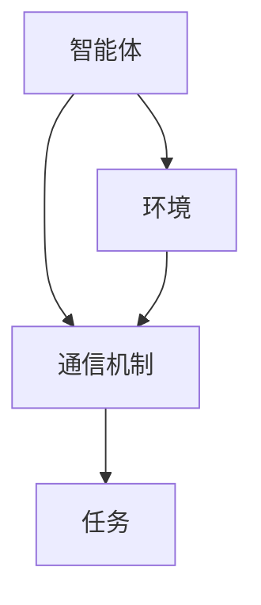
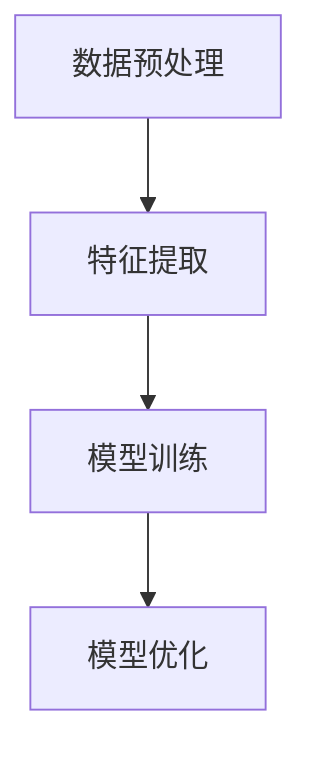
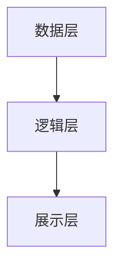
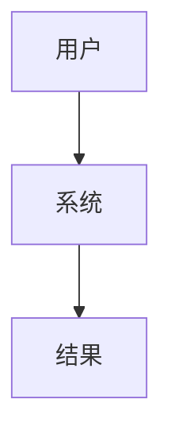

                 


```markdown
# 基于多智能体的动态行业分析模型在价值投资中的应用

> 关键词：多智能体系统、动态行业分析模型、价值投资、数学模型、系统架构、项目实战

> 摘要：本文介绍了基于多智能体的动态行业分析模型在价值投资中的应用。通过分析多智能体系统的核心概念、动态行业分析模型的构建方法、算法原理、数学模型、系统架构、项目实战、案例分析等方面，详细阐述了如何利用多智能体模型进行行业分析和价值投资。本文旨在为金融领域的技术从业者提供理论支持和实践指导，帮助他们更好地理解和应用多智能体模型。

---

## 第一部分: 基于多智能体的动态行业分析模型概述

### 第1章: 多智能体系统与动态行业分析模型概述

#### 1.1 多智能体系统的定义与特点
- **1.1.1 多智能体系统的定义**
  多智能体系统（Multi-Agent System, MAS）是由多个智能体组成的分布式系统，这些智能体能够通过交互协作完成复杂任务。智能体是指具备感知环境、自主决策、执行动作能力的实体。

- **1.1.2 多智能体系统的特性**
  - **自主性**：每个智能体都能自主决策。
  - **反应性**：智能体能够实时感知环境并做出反应。
  - **协作性**：多个智能体通过协作完成共同目标。
  - **分布式性**：智能体之间通过分布式架构进行通信和协作。

- **1.1.3 多智能体系统与传统单智能体模型的区别**
  - 多智能体系统由多个智能体组成，每个智能体负责不同的任务。
  - 单智能体模型通常由一个中心化决策单元完成任务。
  - 多智能体系统更具灵活性和适应性，适用于复杂场景。

#### 1.2 动态行业分析模型的背景与意义
- **1.2.1 行业分析的传统方法**
  - 传统行业分析主要依赖人工经验和统计分析。
  - 分析效率低，难以捕捉行业动态变化。

- **1.2.2 动态行业分析模型的提出**
  - 利用多智能体系统的优势，构建动态行业分析模型。
  - 模型能够实时捕捉行业动态，提供精准的分析结果。

- **1.2.3 动态行业分析模型在价值投资中的应用前景**
  - 提高行业分析的效率和准确性。
  - 为价值投资提供数据支持和决策依据。

#### 1.3 价值投资的核心概念
- **1.3.1 价值投资的基本原理**
  - 价值投资强调以低于内在价值的价格买入优质资产。
  - 长期持有，等待价值回归。

- **1.3.2 价值投资的关键要素**
  - 财务分析：包括收入、利润、资产负债等。
  - 行业分析：了解行业发展趋势和竞争格局。
  - 公司基本面：评估公司的核心竞争力。

- **1.3.3 价值投资与动态行业分析模型的结合**
  - 动态行业分析模型提供实时行业动态数据。
  - 为价值投资提供数据支持和决策依据。

#### 1.4 本章小结
- **1.4.1 多智能体系统的核心特点**
  - 自主性、反应性、协作性和分布式性。

- **1.4.2 动态行业分析模型的创新点**
  - 利用多智能体系统的优势，实现行业动态的实时分析。

- **1.4.3 价值投资与动态行业分析模型的结合意义**
  - 提高行业分析效率，为价值投资提供数据支持。

---

## 第二部分: 多智能体模型的核心概念与联系

### 第2章: 多智能体模型的核心概念与联系

#### 2.1 多智能体模型的核心原理
- **2.1.1 多智能体模型的组成要素**
  - 智能体：具备感知、决策、执行能力。
  - 环境：智能体所处的外部环境。
  - 通信机制：智能体之间的交互方式。

- **2.1.2 多智能体模型的交互机制**
  - 通信：智能体之间通过消息传递信息。
  - 协作：多个智能体协同完成任务。
  - 冲突解决：智能体之间的利益冲突和协调。

- **2.1.3 多智能体模型的决策过程**
  - 感知：获取环境信息。
  - 决策：基于信息做出决策。
  - 执行：根据决策执行动作。

#### 2.2 多智能体模型与动态行业分析模型的关系
- **2.2.1 多智能体模型在动态行业分析中的作用**
  - 每个智能体负责不同的行业分析任务。
  - 智能体之间协作完成综合分析。

- **2.2.2 动态行业分析模型的构建过程**
  - 数据采集：获取行业动态数据。
  - 模型训练：构建多智能体模型。
  - 应用测试：验证模型的准确性。

- **2.2.3 多智能体模型与动态行业分析模型的结合**
  - 利用多智能体模型的优势，构建动态行业分析模型。
  - 模型能够实时更新行业动态，提供精准的分析结果。

#### 2.3 多智能体模型的实体关系图
- **2.3.1 实体关系图的定义**
  - 实体关系图（ER图）用于描述系统中的实体及其关系。
  - 在多智能体系统中，实体包括智能体、环境、通信机制等。

- **2.3.2 多智能体模型的实体关系图（mermaid）**


#### 2.4 本章小结
- **2.4.1 多智能体模型的核心原理**
  - 智能体的组成要素、交互机制和决策过程。

- **2.4.2 多智能体模型与动态行业分析模型的关系**
  - 多智能体模型为动态行业分析模型提供技术支持。

- **2.4.3 多智能体模型的实体关系图**
  - 描述了智能体、环境、通信机制之间的关系。

---

## 第三部分: 动态行业分析模型的算法原理

### 第3章: 动态行业分析模型的算法原理

#### 3.1 动态行业分析模型的算法流程
- **3.1.1 数据预处理**
  - 数据清洗：去除无效数据。
  - 数据转换：将数据转换为模型可识别的格式。

- **3.1.2 特征提取**
  - 从原始数据中提取关键特征。
  - 特征选择：选择对行业分析影响较大的特征。

- **3.1.3 模型训练**
  - 使用机器学习算法训练模型。
  - 模型优化：调整参数以提高准确性。

#### 3.2 动态行业分析模型的算法实现
- **3.2.1 算法选择**
  - 选择适合的机器学习算法，如支持向量机、随机森林等。

- **3.2.2 算法实现步骤（mermaid）**


- **3.2.3 算法实现的数学模型**
  - 使用数学公式描述算法的核心原理。

#### 3.3 动态行业分析模型的数学模型
- **3.3.1 状态空间模型**
  $$ S_t = \beta_1 S_{t-1} + \beta_2 X_{t-1} $$
  其中，$S_t$ 表示当前状态，$S_{t-1}$ 表示前一状态，$X_{t-1}$ 表示前一状态的输入。

- **3.3.2 转移矩阵模型**
  $$ P = \begin{bmatrix}
  p_{11} & p_{12} & \cdots & p_{1n} \\
  p_{21} & p_{22} & \cdots & p_{2n} \\
  \vdots & \vdots & \ddots & \vdots \\
  p_{n1} & p_{n2} & \cdots & p_{nn}
  \end{bmatrix} $$
  其中，$P$ 表示转移概率矩阵，$p_{ij}$ 表示从状态 $i$ 转移到状态 $j$ 的概率。

#### 3.4 本章小结
- **3.4.1 动态行业分析模型的算法流程**
  - 数据预处理、特征提取、模型训练和优化。

- **3.4.2 算法实现的数学模型**
  - 状态空间模型和转移矩阵模型的数学表达。

- **3.4.3 算法实现的步骤**
  - 使用mermaid图展示算法实现的流程。

---

## 第四部分: 数学模型与公式

### 第4章: 数学模型与公式

#### 4.1 状态空间模型的详细推导
- **4.1.1 状态空间模型的定义**
  - 状态空间模型用于描述系统的动态行为。
  - 系统的状态由状态向量 $S_t$ 表示。

- **4.1.2 状态空间模型的推导过程**
  - 假设系统的输入为 $X_t$，输出为 $Y_t$。
  - 状态方程：$S_t = \beta_1 S_{t-1} + \beta_2 X_{t-1}$
  - 输出方程：$Y_t = \alpha_1 S_t + \alpha_2 X_t$

#### 4.2 转移矩阵模型的详细推导
- **4.2.1 转移矩阵模型的定义**
  - 转移矩阵模型用于描述系统状态之间的转移概率。
  - 状态转移概率矩阵 $P$ 是一个 $n \times n$ 的矩阵。

- **4.2.2 转移矩阵模型的推导过程**
  - 假设系统有 $n$ 个状态，每个状态之间的转移概率由矩阵 $P$ 描述。
  - 状态转移概率矩阵 $P$ 满足：$\sum_{j=1}^{n} p_{ij} = 1$，对于所有 $i$。

#### 4.3 本章小结
- **4.3.1 状态空间模型的详细推导**
  - 状态方程和输出方程的数学表达。

- **4.3.2 转移矩阵模型的详细推导**
  - 状态转移概率矩阵的定义和性质。

- **4.3.3 数学模型的应用**
  - 状态空间模型和转移矩阵模型在动态行业分析中的应用。

---

## 第五部分: 系统分析与架构设计

### 第5章: 系统分析与架构设计

#### 5.1 系统分析
- **5.1.1 系统功能需求**
  - 行业数据采集：从多个数据源采集行业动态数据。
  - 行业分析：利用多智能体模型进行行业分析。
  - 价值投资建议：根据分析结果提供投资建议。

- **5.1.2 系统性能需求**
  - 响应时间：实时分析行业动态。
  - 数据准确性：确保分析结果的准确性。

#### 5.2 系统架构设计
- **5.2.1 系统架构的分层设计**
  - 数据层：存储行业数据。
  - 逻辑层：实现行业分析算法。
  - 展示层：展示分析结果。

- **5.2.2 系统架构图（mermaid）**


#### 5.3 系统接口设计
- **5.3.1 系统接口的定义**
  - 数据接口：与数据源对接。
  - 用户接口：供用户输入查询请求。

- **5.3.2 系统接口的实现**
  - 使用API接口实现数据交互。

#### 5.4 系统交互设计
- **5.4.1 系统交互流程**
  - 用户输入查询请求。
  - 系统处理请求并返回结果。

- **5.4.2 系统交互图（mermaid）**


#### 5.5 本章小结
- **5.5.1 系统分析**
  - 系统功能需求和性能需求的定义。

- **5.5.2 系统架构设计**
  - 系统的分层设计和架构图。

- **5.5.3 系统接口设计**
  - 系统接口的定义和实现。

---

## 第六部分: 项目实战

### 第6章: 项目实战

#### 6.1 环境安装与配置
- **6.1.1 环境需求**
  - 安装Python 3.8及以上版本。
  - 安装TensorFlow、Keras、Pandas等库。

- **6.1.2 环境配置**
  - 配置虚拟环境。
  - 安装必要的依赖库。

#### 6.2 数据采集与预处理
- **6.2.1 数据源选择**
  - 从金融数据源获取行业动态数据。

- **6.2.2 数据预处理**
  - 清洗数据，去除无效数据。
  - 数据转换，将数据转换为模型可识别的格式。

#### 6.3 模型训练与优化
- **6.3.1 模型训练**
  - 使用训练数据训练多智能体模型。
  - 调整模型参数以提高准确性。

- **6.3.2 模型优化**
  - 使用交叉验证优化模型。
  - 调整超参数提高模型性能。

#### 6.4 系统实现与测试
- **6.4.1 系统实现**
  - 实现多智能体模型的各个模块。
  - 集成系统各部分，完成系统整体实现。

- **6.4.2 系统测试**
  - 测试系统功能，确保系统正常运行。
  - 测试系统性能，确保系统满足性能需求。

#### 6.5 本章小结
- **6.5.1 项目实战的环境配置**
  - Python版本和依赖库的安装。

- **6.5.2 数据采集与预处理**
  - 数据源选择和数据预处理步骤。

- **6.5.3 模型训练与优化**
  - 模型训练和优化的实现步骤。

---

## 第七部分: 案例分析与应用

### 第7章: 案例分析与应用

#### 7.1 案例背景介绍
- **7.1.1 案例选择**
  - 选择一个具体的行业进行分析。

- **7.1.2 案例分析目标**
  - 使用多智能体模型进行行业分析。
  - 提供价值投资建议。

#### 7.2 案例分析过程
- **7.2.1 数据分析**
  - 分析行业动态数据，提取关键特征。
  - 使用多智能体模型进行行业分析。

- **7.2.2 投资建议**
  - 根据分析结果，提供价值投资建议。
  - 确定投资标的和投资策略。

#### 7.3 案例分析结果
- **7.3.1 分析结果展示**
  - 展示分析结果，包括行业趋势和投资建议。

- **7.3.2 分析结果解读**
  - 解读分析结果，说明结果的含义。

#### 7.4 本章小结
- **7.4.1 案例分析的背景**
  - 行业选择和分析目标的定义。

- **7.4.2 案例分析过程**
  - 数据分析和投资建议的提供。

- **7.4.3 案例分析结果**
  - 分析结果的展示和解读。

---

## 第八部分: 总结与展望

### 第8章: 总结与展望

#### 8.1 总结
- **8.1.1 多智能体系统的应用价值**
  - 多智能体系统在动态行业分析中的优势。

- **8.1.2 动态行业分析模型的核心价值**
  - 提供实时行业动态分析，支持价值投资决策。

- **8.1.3 价值投资与动态行业分析模型的结合**
  - 提高投资效率和准确性。

#### 8.2 展望
- **8.2.1 当前的挑战**
  - 模型的可解释性。
  - 模型的计算效率。

- **8.2.2 未来的发展方向**
  - 引入新的算法，提高模型的准确性和效率。
  - 优化系统架构，提高系统的可扩展性和可维护性。

#### 8.3 本章小结
- **8.3.1 总结**
  - 多智能体系统和动态行业分析模型的应用价值。

- **8.3.2 展望**
  - 当前的挑战和未来的发展方向。

---

## 作者

作者：AI天才研究院/AI Genius Institute & 禅与计算机程序设计艺术/Zen And The Art of Computer Programming
```

