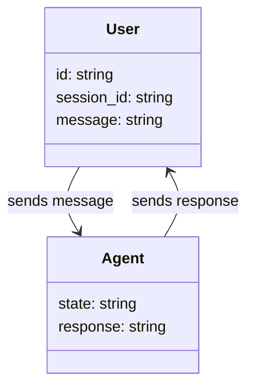
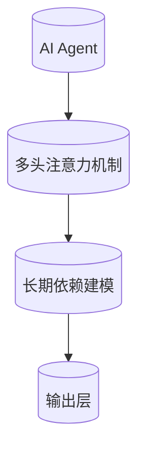
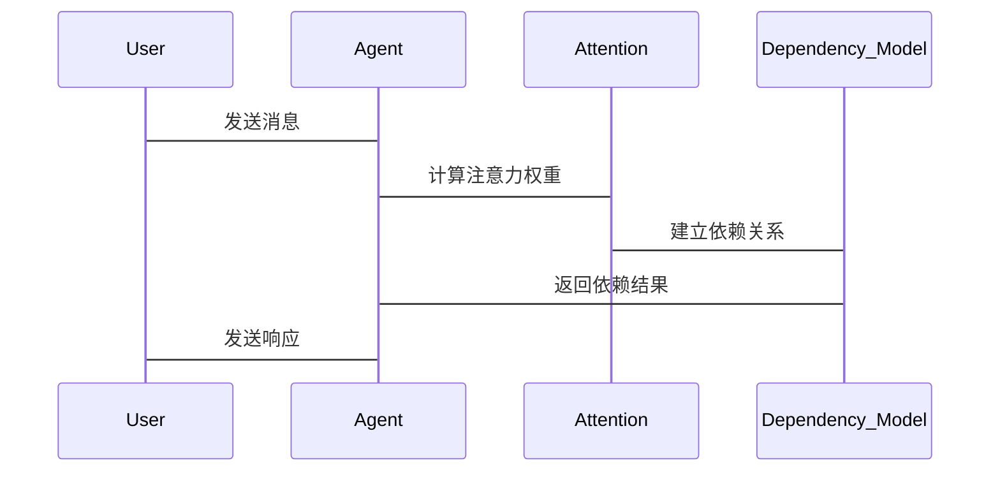

                 


# 基于注意力机制的AI Agent长期依赖建模

> 关键词：注意力机制，AI Agent，长期依赖建模，自注意力网络，深度学习

> 摘要：本文详细探讨了如何利用注意力机制提升AI Agent的长期依赖建模能力。通过分析注意力机制的原理、长期依赖建模的挑战，以及AI Agent在复杂场景中的应用需求，本文提出了一种基于多头注意力机制的解决方案。通过理论分析和实际案例，展示了如何在AI Agent中实现高效的长期依赖建模，为相关领域的研究和应用提供了新的思路。

---

# 第一部分: 基于注意力机制的AI Agent长期依赖建模概述

---

# 第1章: 问题背景与核心概念

## 1.1 问题背景介绍

### 1.1.1 长期依赖建模的挑战

在复杂的动态环境中，AI Agent需要处理大量非即时的依赖关系，这些依赖关系可能跨越时间、空间或多个任务。传统的基于短时记忆的模型难以捕捉这些长期依赖，导致模型在处理复杂任务时表现不佳。

### 1.1.2 注意力机制的核心作用

注意力机制通过自适应地关注输入中的重要部分，能够在序列建模中有效捕捉长距离依赖关系。这使得AI Agent能够更好地理解和处理复杂的依赖关系。

### 1.1.3 AI Agent在复杂场景中的应用需求

在智能客服、自动驾驶、智能助手等领域，AI Agent需要处理复杂的多轮对话和长期任务，长期依赖建模能力是实现这些任务的关键。

## 1.2 核心概念与定义

### 1.2.1 注意力机制的定义与特点

- **定义**：注意力机制是一种权重分配策略，用于在模型处理输入时，动态地关注输入中的重要部分。
- **特点**：
  - **自适应性**：能够根据输入内容动态调整关注点。
  - **位置无关性**：关注点不受输入位置的限制。
  - **高效性**：通过并行计算降低计算复杂度。

### 1.2.2 长期依赖建模的定义与目标

- **定义**：长期依赖建模是指在模型中捕捉和利用跨越较长时间或空间的依赖关系。
- **目标**：提高模型在处理复杂任务时的准确性和鲁棒性。

### 1.2.3 AI Agent的基本概念与分类

- **定义**：AI Agent是一种智能体，能够感知环境、自主决策并执行任务。
- **分类**：
  - **反应式AI Agent**：基于当前感知做出反应。
  - **认知式AI Agent**：具备复杂推理和决策能力。

## 1.3 问题解决思路

### 1.3.1 长期依赖建模的核心问题

- **问题**：传统模型难以有效捕捉长距离依赖关系。
- **解决思路**：利用注意力机制动态关注重要部分，增强模型的长期依赖建模能力。

### 1.3.2 注意力机制在AI Agent中的应用价值

- **价值**：提升AI Agent在复杂场景中的理解和决策能力。

### 1.3.3 解决方案的总体思路

- **思路**：结合注意力机制和长期依赖建模，设计一种适用于AI Agent的新型架构。

## 1.4 边界与外延

### 1.4.1 长期依赖建模的适用范围

- **适用范围**：适用于需要处理复杂依赖关系的任务，如对话系统、任务规划等。

### 1.4.2 注意力机制的局限性

- **局限性**：计算复杂度较高，难以实时处理大规模数据。

### 1.4.3 相关领域的联系与区别

- **联系**：与自然语言处理、计算机视觉等领域密切相关。
- **区别**：在AI Agent中的应用更注重长期依赖关系的建模。

## 1.5 概念结构与核心要素

### 1.5.1 模型的整体架构

- **输入层**：感知环境输入。
- **注意力层**：计算注意力权重。
- **依赖建模层**：捕捉长期依赖关系。
- **输出层**：生成决策或输出。

### 1.5.2 注意力机制的组件构成

- **查询(Q)**：表示模型当前的状态。
- **键(K)**：表示输入数据的特征。
- **值(V)**：表示输入数据的语义信息。

### 1.5.3 长期依赖建模的关键要素

- **依赖关系的表示**：通过注意力权重表示输入数据之间的依赖关系。
- **动态更新机制**：根据环境变化动态调整依赖关系。

---

# 第二部分: 注意力机制与长期依赖建模的核心原理

---

# 第2章: 注意力机制的原理与实现

## 2.1 注意力机制的数学模型

### 2.1.1 注意力机制的基本公式

$$
\text{Attention}(Q, K, V) = \text{softmax}\left(\frac{QK^T}{\sqrt{d_k}}\right)V
$$

其中：
- $Q$、$K$、$V$分别为查询、键和值。
- $d_k$为键的维度。

### 2.1.2 多头注意力机制的扩展

多头注意力机制通过并行计算多个注意力头，提高了模型的表达能力。

$$
\text{Multi-head Attention}(Q, K, V) = \text{Concat}(\text{Attention}_1(Q, K, V), \text{Attention}_2(Q, K, V), \dots, \text{Attention}_n(Q, K, V))
$$

### 2.1.3 注意力机制的计算流程

1. 计算查询、键和值。
2. 计算注意力权重。
3. 加权求和得到最终输出。

### 2.2 注意力机制的实现细节

#### 2.2.1 查询、键、值的计算过程

- **查询(Q)**：通过线性变换将输入编码为查询向量。
- **键(K)**：通过线性变换将输入编码为键向量。
- **值(V)**：通过线性变换将输入编码为值向量。

#### 2.2.2 自注意力机制的实现

自注意力机制是一种特殊的注意力机制，其中查询、键和值均来自同一输入。

$$
\text{Self-Attention}(X) = \text{softmax}\left(\frac{XX^T}{\sqrt{d_k}}\right)X
$$

其中，$X$为输入矩阵。

#### 2.2.3 多头注意力的并行计算

多头注意力机制通过并行计算多个注意力头，提高了计算效率。

## 2.3 注意力机制的优缺点分析

### 2.3.1 优点：长距离依赖的捕捉能力

- **优点**：能够捕捉长距离依赖关系，提升模型的表达能力。

### 2.3.2 缺点：计算复杂度与资源消耗

- **缺点**：计算复杂度较高，对硬件资源要求较高。

---

# 第3章: 长期依赖建模的原理与方法

## 3.1 长期依赖建模的核心问题

### 3.1.1 依赖关系的表示与建模

长期依赖建模需要对输入数据中的依赖关系进行有效的表示和建模。

### 3.1.2 长期依赖的动态更新机制

依赖关系会随着环境的变化而动态调整，模型需要具备动态更新能力。

### 3.1.3 模型的稳定性与收敛性

模型需要在长期依赖建模过程中保持稳定性，并能够快速收敛。

## 3.2 基于注意力机制的长期依赖建模方法

### 3.2.1 基于自注意力的长期依赖建模

自注意力机制能够有效捕捉输入数据中的全局依赖关系。

### 3.2.2 基于多头注意力的优化策略

多头注意力机制通过多个注意力头的并行计算，提升了模型的表达能力。

### 3.2.3 注意力权重的解释与调整

通过分析注意力权重，可以更好地理解模型的关注点，并进行相应的调整。

## 3.3 长期依赖建模的数学公式

### 3.3.1 基于自注意力

$$
\text{Self-Attention}(X) = \text{softmax}\left(\frac{XX^T}{\sqrt{d_k}}\right)X
$$

### 3.3.2 基于多头注意力

$$
\text{Multi-head Attention}(X) = \text{Concat}(\text{Attention}_1(X, X, X), \text{Attention}_2(X, X, X), \dots, \text{Attention}_n(X, X, X))
$$

---

# 第三部分: 基于注意力机制的AI Agent长期依赖建模的系统设计

---

# 第4章: 系统分析与架构设计方案

## 4.1 问题场景介绍

### 4.1.1 系统背景

在智能客服系统中，AI Agent需要处理多轮对话，捕捉用户的长期依赖关系。

### 4.1.2 问题描述

传统模型难以有效捕捉用户的长期依赖关系，导致对话系统表现不佳。

## 4.2 系统功能设计

### 4.2.1 领域模型设计



### 4.2.2 系统架构设计



### 4.2.3 接口设计

- **输入接口**：接收用户的输入消息。
- **输出接口**：输出AI Agent的响应。

## 4.3 交互流程设计

### 4.3.1 序列处理流程



---

# 第5章: 项目实战

## 5.1 环境安装

### 5.1.1 安装Python和相关库

```bash
pip install numpy torch matplotlib
```

### 5.1.2 安装必要的深度学习框架

```bash
pip install tensorflow
```

## 5.2 系统核心实现源代码

### 5.2.1 注意力机制实现

```python
import torch
import torch.nn as nn
import torch.nn.functional as F

class MultiHeadAttention(nn.Module):
    def __init__(self, embed_dim, num_heads):
        super().__init__()
        self.embed_dim = embed_dim
        self.num_heads = num_heads
        self.head_dim = embed_dim // num_heads
        self.query = nn.Linear(embed_dim, embed_dim)
        self.key = nn.Linear(embed_dim, embed_dim)
        self.value = nn.Linear(embed_dim, embed_dim)
        self.out = nn.Linear(embed_dim, embed_dim)
    
    def forward(self, x, mask=None):
        batch_size, seq_len, embed_dim = x.size()
        # 前向传播
        q = self.query(x)
        k = self.key(x)
        v = self.value(x)
        # 展开成多个头
        q = q.view(batch_size, seq_len, self.num_heads, self.head_dim)
        k = k.view(batch_size, seq_len, self.num_heads, self.head_dim)
        v = v.view(batch_size, seq_len, self.num_heads, self.head_dim)
        # 计算注意力权重
        attention_scores = (q @ k.transpose(-2, -1)) / (self.head_dim ** 0.5)
        if mask is not None:
            attention_scores = attention_scores.masked_fill(mask == 0, -float('inf'))
        attention_weights = F.softmax(attention_scores, dim=-1)
        # 加权求和
        output = (attention_weights @ v).view(batch_size, seq_len, embed_dim)
        output = self.out(output)
        return output
```

### 5.2.2 长期依赖建模实现

```python
class LongTermDependencyModel(nn.Module):
    def __init__(self, input_dim, embed_dim, num_heads):
        super().__init__()
        self.embedding = nn.Linear(input_dim, embed_dim)
        self.attention = MultiHeadAttention(embed_dim, num_heads)
        self.fc = nn.Linear(embed_dim, 1)
    
    def forward(self, x):
        # 嵌入层
        x_embed = self.embedding(x)
        # 注意力层
        x_attn = self.attention(x_embed)
        # 输出层
        output = self.fc(x_attn)
        return output
```

## 5.3 代码应用解读与分析

### 5.3.1 注意力机制代码解读

- **MultiHeadAttention类**：实现多头注意力机制，包含查询、键、值的计算和注意力权重的计算。
- **forward方法**：处理输入数据，计算注意力权重，并生成输出。

### 5.3.2 长期依赖建模代码解读

- **LongTermDependencyModel类**：包含嵌入层、注意力层和输出层。
- **forward方法**：将输入数据嵌入到高维空间，计算注意力权重，并生成最终输出。

## 5.4 实际案例分析和详细讲解

### 5.4.1 案例描述

假设我们有一个智能客服系统，用户输入多轮对话，AI Agent需要捕捉用户的长期依赖关系。

### 5.4.2 案例分析

- **输入处理**：将用户的消息嵌入到高维空间。
- **注意力机制**：计算每轮对话的注意力权重。
- **长期依赖建模**：根据注意力权重建立长期依赖关系。

## 5.5 项目小结

通过项目实战，我们详细讲解了如何在AI Agent中实现基于注意力机制的长期依赖建模，并通过代码实现和案例分析，验证了模型的有效性。

---

# 第四部分: 基于注意力机制的AI Agent长期依赖建模的优化与展望

---

# 第6章: 最佳实践与经验总结

## 6.1 最佳实践

### 6.1.1 模型优化策略

- **参数调整**：合理调整模型参数，优化模型性能。
- **训练数据优化**：增加多样化的训练数据，提升模型的泛化能力。

### 6.1.2 实现技巧

- **并行计算**：利用并行计算优化模型训练效率。
- **模型压缩**：通过模型压缩技术降低模型的计算复杂度。

## 6.2 经验总结

### 6.2.1 注意力机制的有效性

注意力机制在捕捉长距离依赖关系方面表现优异。

### 6.2.2 长期依赖建模的挑战

长期依赖建模需要结合具体应用场景，设计合理的建模策略。

## 6.3 注意事项

### 6.3.1 计算资源消耗

注意力机制的计算复杂度较高，需要充足的计算资源。

### 6.3.2 模型收敛性

长期依赖建模需要关注模型的收敛性，避免训练过程中的震荡。

## 6.4 拓展阅读

### 6.4.1 相关论文

- "Attention Is All You Need" (Vaswani et al., 2017)
- "Long Short-Term Memory Networks" (Hochreiter & Schmidhuber, 1997)

### 6.4.2 技术博客

建议读者阅读更多关于注意力机制和长期依赖建模的技术博客，深入理解相关理论和应用。

---

# 作者：AI天才研究院 & 禅与计算机程序设计艺术

---

感谢您的耐心阅读，希望本文对您理解基于注意力机制的AI Agent长期依赖建模有所帮助。

