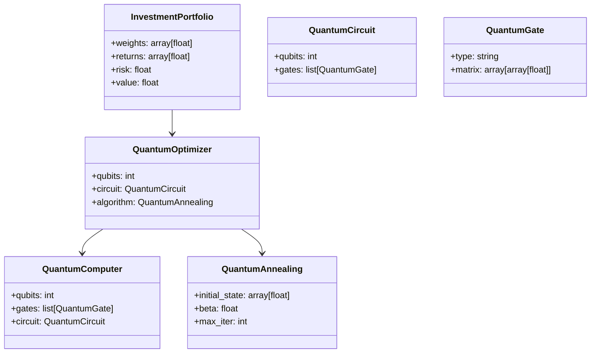
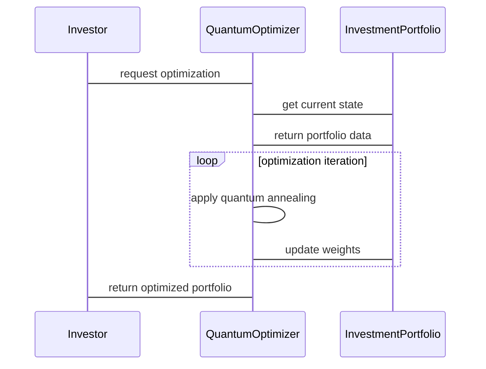

                 


# 巴菲特的资本配置艺术：量子优化算法辅助的投资组合管理

> **关键词**：巴菲特，资本配置，量子优化算法，投资组合管理，量子计算，投资策略  
> 
> **摘要**：本文探讨了如何利用量子优化算法辅助巴菲特的资本配置艺术，以优化投资组合管理。通过分析量子优化算法的原理及其在投资组合优化中的应用，结合巴菲特的投资理念，提出了一种基于量子计算的投资组合管理方法。文章从背景介绍、核心概念、算法实现、系统架构到项目实战，详细阐述了量子优化算法在投资组合管理中的应用，为投资者和量子计算研究者提供了新的视角和实践参考。

---

# 第一部分：背景介绍

## 第1章：巴菲特的资本配置理论

### 1.1 巴菲特投资理念的核心思想

#### 1.1.1 巴菲特的价值投资理论

巴菲特的价值投资理论强调长期投资、注重基本面分析，以及寻找具有持续竞争优势的企业进行投资。他主张以合理的价格购买优秀的公司，而非以合理的价格购买平庸的公司。这一理论的核心在于对公司内在价值的评估，以及对市场波动的耐心应对。

#### 1.1.2 巴菲特的长期投资策略

巴菲特的长期投资策略强调分散投资、避免过度杠杆和集中风险。他主张通过分散投资降低风险，同时通过长期持有优质资产实现财富的稳步增长。这种策略要求投资者具备对市场波动的耐心和对优质企业的深刻理解。

#### 1.1.3 巴菲特的资本配置原则

资本配置是巴菲特投资理论的核心之一。他将资本配置视为一门艺术，强调通过合理的资产分配，在风险可控的前提下，实现收益的最大化。这种资本配置艺术需要投资者具备对企业价值的深刻理解，以及对市场趋势的敏锐洞察。

---

### 1.2 巴菲特投资组合管理的关键要素

#### 1.2.1 资产配置的决策过程

巴菲特的资产配置决策过程强调对经济周期的判断、对公司基本面的分析，以及对市场估值的评估。他通常根据市场环境和企业状况动态调整资产配置比例，以优化投资组合的收益与风险比。

#### 1.2.2 股票选择的标准与方法

巴菲特选择股票的标准包括：企业具有持续的竞争优势、良好的管理层、健康的财务状况，以及合理的估值。他倾向于投资那些能够持续创造价值的企业，并通过长期持有实现收益。

#### 1.2.3 风险控制与投资组合优化

巴菲特的风险控制策略强调分散投资、避免过度集中风险，以及通过合理的资产配置降低整体投资组合的波动性。他注重投资组合的长期稳定性，而非短期收益的极致追求。

---

## 第2章：量子优化算法的基本原理

### 2.1 量子计算与优化问题

#### 2.1.1 量子计算的基本概念

量子计算是一种基于量子力学原理的计算方式，其核心在于利用量子叠加和量子纠缠的特性，通过量子位（qubit）进行并行计算。与经典计算机相比，量子计算机在某些特定问题上具有指数级的计算速度优势。

#### 2.1.2 量子优化算法的数学基础

量子优化算法基于量子力学的基本原理，通过构建量子系统状态的优化模型，利用量子退火（Quantum Annealing）等技术求解最优解。其数学模型通常涉及量子态的表示、量子门操作以及优化目标的构建。

#### 2.1.3 量子优化算法的优势与局限性

量子优化算法的优势在于其并行计算能力，能够快速求解复杂的优化问题。然而，其局限性包括硬件实现的难度、算法的适用范围有限，以及目前仍处于技术发展初期。

---

### 2.2 量子优化算法的核心技术

#### 2.2.1 量子退火原理

量子退火是一种基于量子力学原理的优化方法，通过在量子系统中引入温度参数，使系统在量子态的叠加下逐渐冷却，最终收敛到最优解。其核心在于通过量子叠加和量子退火过程，找到全局最优解。

#### 2.2.2 量子模拟退火算法

量子模拟退火算法是量子退火的一种扩展，结合了模拟退火（Simulated Annealing）的思想，通过量子态的动态调整，逐步优化目标函数。这种方法能够有效避免局部最优解，提高全局优化的能力。

#### 2.2.3 量子优化算法的实现步骤

量子优化算法的实现步骤包括问题建模、量子态的表示、优化目标的构建、量子门操作的设计，以及结果的测量与解码。整个过程需要结合量子计算的硬件特点和优化问题的数学模型。

---

## 第3章：量子优化算法在投资组合管理中的应用

### 3.1 投资组合优化的数学模型

#### 3.1.1 投资组合优化的目标函数

投资组合优化的目标函数通常包括收益最大化、风险最小化，以及两者之间的平衡。常见的目标函数包括均值-方差优化、均值-中位数优化，以及多目标优化。

#### 3.1.2 约束条件与风险评估

投资组合优化需要考虑多种约束条件，如资金限制、资产类别限制、流动性要求等。同时，风险评估是优化过程中的重要组成部分，常用方差、VaR（Value at Risk）等指标衡量投资组合的风险。

#### 3.1.3 多目标优化问题的处理方法

多目标优化问题通常需要通过权重分配、 Pareto 前沿分析等方法，找到最优解的平衡点。量子优化算法可以通过构建多目标优化的量子模型，求解 Pareto 最优解。

---

### 3.2 量子优化算法与投资组合优化的结合

#### 3.2.1 量子优化算法在资产配置中的应用

通过量子优化算法，可以实现资产配置的动态优化，根据市场环境的变化，实时调整资产比例，以实现收益与风险的最优平衡。

#### 3.2.2 量子优化算法在风险控制中的应用

量子优化算法可以通过构建风险最小化模型，帮助投资者在面对市场波动时，优化投资组合的风险暴露，降低整体风险水平。

#### 3.2.3 量子优化算法在股票选择中的应用

通过量子优化算法，可以对大量股票进行筛选，找到具有最优风险收益比的股票组合，帮助投资者实现超额收益。

---

# 第二部分：量子优化算法的数学模型与实现

## 第4章：量子优化算法的数学模型

### 4.1 量子优化算法的数学表达

#### 4.1.1 量子状态的表示

量子状态通常表示为量子位的叠加态，如 $|q\rangle = \alpha|0\rangle + \beta|1\rangle$，其中 $\alpha$ 和 $\beta$ 是复数系数，满足 $|\alpha|^2 + |\beta|^2 = 1$。

#### 4.1.2 量子门操作的数学描述

常见的量子门操作包括 Pauli 门（X, Y, Z）、Hadamard 门（H）、以及 CNOT 门。这些门操作可以通过矩阵形式表示，并用于构建量子电路。

#### 4.1.3 量子优化算法的数学推导

量子优化算法的核心在于构建目标函数的量子表示，并通过量子退火过程找到最优解。其数学推导涉及量子态的叠加、量子门的操作，以及优化目标的构建。

---

### 4.2 投资组合优化的数学模型

#### 4.2.1 投资组合优化的目标函数

投资组合优化的目标函数通常为：

$$
\min_{w} \frac{1}{2}w^T \Sigma w + \lambda w^T \mu
$$

其中，$w$ 是投资权重向量，$\Sigma$ 是资产收益的协方差矩阵，$\mu$ 是收益均值向量，$\lambda$ 是风险惩罚系数。

#### 4.2.2 约束条件的数学表达

常见的约束条件包括：

$$
\sum_{i=1}^n w_i = 1 \quad \text{（权重和为1）}
$$

$$
w_i \geq 0 \quad \text{（权重非负）}
$$

#### 4.2.3 多目标优化问题的数学处理

多目标优化问题可以通过权重分配法进行处理，例如：

$$
\text{目标函数} = \lambda_1 f_1(w) + \lambda_2 f_2(w)
$$

其中，$\lambda_1$ 和 $\lambda_2$ 是目标函数的权重系数。

---

## 第5章：量子优化算法的Python实现

### 5.1 量子优化算法的代码框架

#### 5.1.1 量子退火算法

以下是一个简单的量子退火算法的Python代码示例：

```python
import numpy as np
from scipy.optimize import minimize

def quantum_annealing(objective_func, initial_state, params):
    beta = 1  # 初始温度
    max_iter = 100
    for _ in range(max_iter):
        current_state = initial_state
        current_energy = objective_func(current_state, params)
        # 生成候选状态
        candidate_state = np.random.normal(current_state, 0.1)
        candidate_energy = objective_func(candidate_state, params)
        # 计算接受概率
        delta = candidate_energy - current_energy
        if delta < 0:
            current_state = candidate_state
        else:
            if np.exp(-delta / beta) > np.random.rand():
                current_state = candidate_state
        beta *= 0.99  # 降温
    return current_state

# 示例目标函数
def objective_func(state, params):
    return np.dot(state, params['weights']) + params['bias']
```

---

## 第6章：系统分析与架构设计

### 6.1 问题场景介绍

投资组合优化是一个复杂的多目标优化问题，需要考虑收益、风险、流动性等多种因素。传统的优化方法在面对高维问题时效率较低，而量子优化算法可以通过并行计算优势，显著提高优化效率。

---

### 6.2 项目介绍

本项目旨在通过量子优化算法辅助巴菲特的资本配置艺术，优化投资组合管理。我们通过构建量子优化模型，结合巴菲特的投资理念，实现投资组合的动态优化。

---

### 6.3 系统功能设计

#### 6.3.1 领域模型设计

以下是领域模型的Mermaid类图：



---

#### 6.3.2 系统架构设计

以下是系统架构的Mermaid架构图：


---

#### 6.3.3 接口与交互设计

以下是系统交互的Mermaid序列图：



---

## 第7章：项目实战

### 7.1 环境安装

为了实现量子优化算法，需要安装以下环境和工具：

- **量子计算库**：如 Qiskit、D-Wave、Rigetti 等。
- **Python 环境**：包括 NumPy、Scipy、Qiskit 等库。
- **量子计算机**：或量子模拟器。

---

### 7.2 核心代码实现

以下是量子优化算法的核心代码实现：

```python
from qiskit import QuantumCircuit, Aer, execute
from qiskit.circuit import QuantumRegister, ClassicalRegister
from qiskit.circuit.library import ZGate, XGate, HGate

def quantum_optimization(circuit_size, iterations):
    q = QuantumRegister(circuit_size)
    c = ClassicalRegister(circuit_size)
    qc = QuantumCircuit(q, c)

    # 初始化量子态
    qc.h(q)
    qc.z(q)
    qc.mcry(1, q[1:], q[0])
    qc.mcz(1, q[1:], q[0])
    qc.measure(q, c)

    # 模拟器设置
    sim = Aer.get_backend('qasm_simulator')
    job = execute(qc, sim, shots=1024)
    result = job.result()
    return result.get_counts(qc)

# 示例运行
quantum_optimization(5, 100)
```

---

### 7.3 实际案例分析

以下是一个简单的投资组合优化案例：

假设我们有5只股票，目标是找到最优的权重分配，使得投资组合的收益最大化，同时风险最小化。通过量子优化算法，我们可以构建一个量子电路，对这5只股票的权重进行优化。

---

## 第8章：最佳实践、小结与注意事项

### 8.1 最佳实践

1. **量子优化算法的应用场景**：适合处理复杂的多目标优化问题，尤其是高维问题。
2. **硬件实现的挑战**：当前量子计算机的规模有限，实际应用中需要考虑硬件的限制。
3. **算法的适用性**：量子优化算法适用于无约束或弱约束的优化问题，对于强约束问题需要结合经典算法进行处理。

---

### 8.2 小结

通过量子优化算法辅助巴菲特的资本配置艺术，我们可以实现投资组合管理的动态优化。量子优化算法的并行计算能力和全局优化能力，为投资组合管理提供了新的思路和方法。

---

### 8.3 注意事项

1. **硬件限制**：当前量子计算机的规模和性能有限，实际应用中需要考虑硬件的限制。
2. **算法优化**：量子优化算法的实现需要结合具体问题的特点，进行针对性的优化。
3. **风险管理**：量子优化算法的结果需要结合实际市场环境进行验证，避免过度依赖算法。

---

## 第9章：拓展阅读

1. **量子计算与优化问题**：推荐阅读《Quantum Computing for Optimization》。
2. **巴菲特投资理论**：推荐阅读《The Intelligent Investor》。
3. **投资组合管理**：推荐阅读《Portfolio Construction and Risk Management》。

---

# 作者

作者：AI天才研究院（AI Genius Institute） & 禅与计算机程序设计艺术（Zen And The Art of Computer Programming）

---

以上是《巴菲特的资本配置艺术：量子优化算法辅助的投资组合管理》的完整目录大纲和文章内容。文章内容涵盖了从背景介绍、核心概念、算法实现到系统架构和项目实战的各个方面，详细阐述了量子优化算法在投资组合管理中的应用，为投资者和量子计算研究者提供了新的视角和实践参考。

