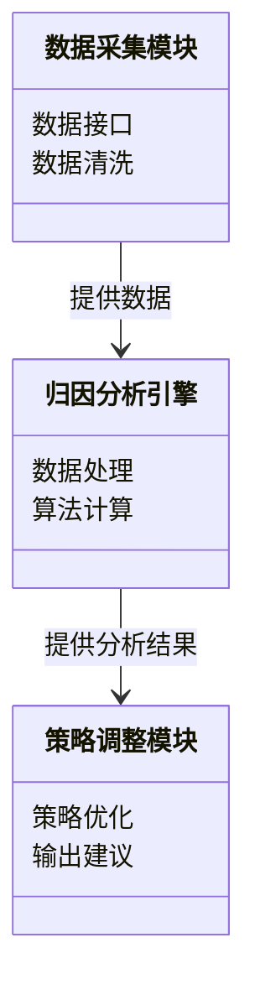
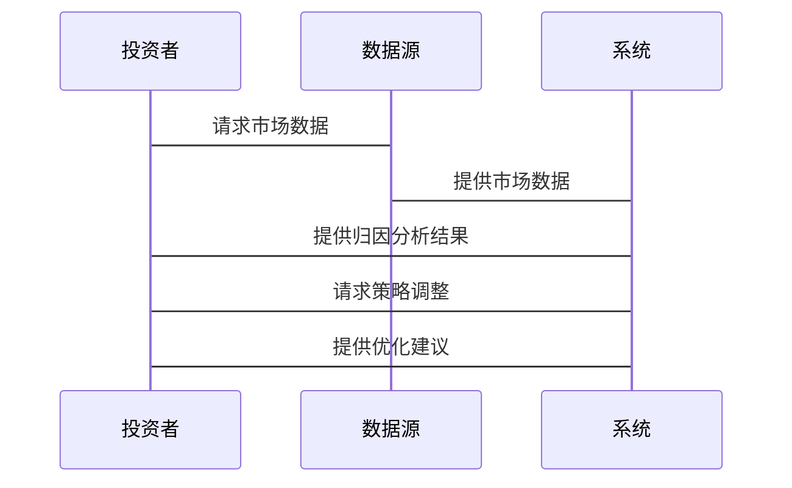

                 


# 开发智能化的资产配置策略动态归因分析引擎

## 关键词：资产配置，动态归因分析，机器学习，金融系统，系统架构

## 摘要：  
在金融领域，资产配置是投资管理的核心，而动态归因分析则是优化和调整配置策略的关键工具。随着人工智能和大数据技术的发展，智能化资产配置策略动态归因分析引擎成为可能。本文详细探讨了开发这样一个引擎的背景、核心概念、算法原理、系统架构以及实现细节，旨在为读者提供从理论到实践的全面指导。

---

# 第1章：背景介绍

## 1.1 问题背景

### 1.1.1 资产配置与投资管理的挑战  
资产配置是投资管理中的核心环节，涉及将资金分配到不同的资产类别（如股票、债券、现金等）以实现收益与风险的平衡。然而，市场环境复杂多变，传统的静态资产配置策略难以应对动态变化的市场条件，导致配置效果不佳。

### 1.1.2 动态归因分析的必要性  
动态归因分析通过对投资组合表现的分解，识别出不同资产类别或策略对整体收益的贡献度。通过实时分析和调整，投资者可以更灵活地应对市场变化，优化配置策略。

### 1.1.3 智能化资产配置的行业趋势  
随着人工智能和大数据技术的普及，智能化资产配置成为行业趋势。通过动态归因分析引擎，投资者可以利用机器学习算法实时优化配置策略，提升投资收益并降低风险。

## 1.2 核心概念与问题描述

### 1.2.1 资产配置的定义与目标  
资产配置是指根据投资者的风险偏好和收益目标，将资金分配到不同的资产类别中。其目标是最大化收益的同时控制风险。

### 1.2.2 动态归因分析的定义与作用  
动态归因分析是对投资组合收益来源的实时分解，识别出各资产类别、行业或策略对整体收益的贡献度。通过动态归因，投资者可以快速调整配置策略。

### 1.2.3 资产配置策略的动态调整机制  
动态调整机制是指根据市场变化和投资目标的调整，实时优化资产配置策略。这需要结合实时市场数据和动态归因分析结果。

## 1.3 问题解决与边界

### 1.3.1 资产配置中的常见问题  
1. 市场波动导致静态配置失效  
2. 复杂的市场环境难以预测  
3. 传统归因分析滞后，难以实时调整  

### 1.3.2 动态归因分析的边界与限制  
1. 数据延迟问题  
2. 模型假设的局限性  
3. 算法的计算效率  

### 1.3.3 系统设计的核心目标与范围  
1. 实时处理市场数据  
2. 高效计算归因分析  
3. 提供实时调整建议  

## 1.4 概念结构与核心要素

### 1.4.1 资产配置的核心要素  
1. 资产类别：股票、债券、现金等  
2. 风险偏好：保守、中性、激进  
3. 收益目标：短期、中期、长期  

### 1.4.2 动态归因分析的关键因素  
1. 时间频率：实时、每日、每周  
2. 数据来源：市场数据、投资组合表现  
3. 分解维度：资产类别、行业、策略  

### 1.4.3 系统架构的核心组成部分  
1. 数据采集模块  
2. 归因分析引擎  
3. 策略调整模块  

## 1.5 本章小结  
本章介绍了资产配置和动态归因分析的核心概念，分析了智能化资产配置的必要性，并明确了系统设计的目标和范围。

---

# 第2章：核心概念与联系

## 2.1 核心概念原理

### 2.1.1 资产配置的数学模型  
资产配置的数学模型通常包括权重分配、风险收益优化等。以下是一个简单的优化模型：

$$
\text{目标函数：} \max \left( \sum_{i=1}^n w_i r_i - \lambda \sum_{i=1}^n w_i^2 \sigma_i^2 \right)
$$

其中，\( w_i \) 是资产 \( i \) 的权重，\( r_i \) 是预期收益，\( \sigma_i^2 \) 是风险，\( \lambda \) 是风险厌恶系数。

### 2.1.2 动态归因分析的算法原理  
动态归因分析通过分解投资组合的收益来源，识别各资产或策略的贡献度。常用的方法包括：

1. **回归分析**：建立收益与因子之间的回归模型。  
2. **聚类分析**：识别相似的资产或策略。  
3. **因子分解**：将收益分解为多个因子的贡献。  

### 2.1.3 系统设计的逻辑框架  
系统设计的逻辑框架包括数据采集、归因分析、策略调整三个主要环节：

1. 数据采集：获取市场数据和投资组合表现。  
2. 归因分析：计算各资产的贡献度。  
3. 策略调整：根据分析结果优化配置策略。  

## 2.2 核心概念属性对比

### 2.2.1 资产配置与投资组合管理的对比  
| 属性 | 资产配置 | 投资组合管理 |  
|------|----------|--------------|  
| 目标 | 风险收益平衡 | 实现投资目标 |  
| 方法 | 权重分配 | 综合管理 |  
| 输入 | 资产类别 | 投资策略 |  

### 2.2.2 动态归因与静态归因的差异  
| 属性 | 动态归因 | 静态归因 |  
|------|----------|------------|  
| 时间性 | 实时 | 定期 |  
| 灵活性 | 高 | 低 |  
| 数据需求 | 高频 | 低频 |  

### 2.2.3 不同资产配置策略的特征分析  
以下表格对比了三种常见的资产配置策略：

| 策略 | 风险偏好 | 调整频率 | 适用场景 |  
|------|----------|----------|----------|  
| �静态配置 | 适中 | 低 | 稳定市场 |  
| 动态配置 | 灵活 | 高 | 波动市场 |  
| 混合配置 | 平衡 | 中 | 多变市场 |  

## 2.3 ER实体关系图

```mermaid
erDiagram
    actor 投资者 {
        <属性> 资产规模
        <属性> 风险偏好
    }
    actor 系统 {
        <操作> 分析资产配置
        <操作> 动态归因分析
    }
    entity 资产类别 {
        <属性> 股票
        <属性> 债券
        <属性> 现金
    }
    entity 风险因子 {
        <属性> 市场风险
        <属性> 利率风险
        <属性> 汇率风险
    }
    entity 投资策略 {
        <属性> 基本面分析
        <属性> 技术分析
        <属性> 量化策略
    }
    投资者 --> 系统 : 提供输入
    系统 --> 资产类别 : 分配
```

## 2.4 本章小结  
本章通过对比和分析，明确了资产配置与动态归因分析的核心概念及其联系，为后续的算法设计和系统实现奠定了基础。

---

# 第3章：算法原理

## 3.1 算法原理概述

### 3.1.1 回归分析法
回归分析用于将投资组合的收益分解为多个因子的贡献。例如，使用多元线性回归模型：

$$
r = \beta_0 + \beta_1 f_1 + \beta_2 f_2 + \epsilon
$$

其中，\( f_1 \) 和 \( f_2 \) 是因子，\( \beta \) 是回归系数，\( \epsilon \) 是误差项。

### 3.1.2 聚类分析法
聚类分析用于识别相似的资产或策略。例如，使用K-means算法将资产分为若干簇，每个簇代表一类资产。

### 3.1.3 因子分解法
因子分解法将收益分解为多个因子的贡献。例如，使用主成分分析（PCA）提取主要因子。

## 3.2 算法实现步骤

### 3.2.1 数据预处理
1. 数据清洗：处理缺失值和异常值。  
2. 标准化：对数据进行标准化处理，确保不同资产的可比性。  

### 3.2.2 算法选择与实现
1. 选择回归分析或聚类分析算法。  
2. 实现算法并计算各资产的贡献度。  

### 3.2.3 结果验证
1. 使用历史数据验证算法的有效性。  
2. 比较不同算法的优劣，选择最优方案。  

## 3.3 算法优化与改进

### 3.3.1 参数优化
通过调整回归系数或聚类参数，优化算法的性能。例如，使用网格搜索优化回归模型的参数。

### 3.3.2 模型融合
结合多种算法，提高归因分析的准确性。例如，使用集成学习方法融合回归和聚类结果。

## 3.4 本章小结  
本章详细讲解了资产配置动态归因分析的算法原理，包括回归分析、聚类分析和因子分解法，并给出了实现步骤和优化建议。

---

# 第4章：系统分析与架构设计

## 4.1 系统分析

### 4.1.1 问题场景介绍
系统需要实时处理大量市场数据，快速计算归因分析，并提供配置建议。这要求系统具有高效的数据处理能力和快速的计算能力。

### 4.1.2 项目介绍
本项目旨在开发一个智能化的资产配置策略动态归因分析引擎，帮助投资者优化投资组合。

## 4.2 系统功能设计

### 4.2.1 领域模型


### 4.2.2 系统架构设计


### 4.2.3 系统接口设计
系统需要与外部数据源、投资管理系统以及其他应用程序接口对接。以下是主要接口：

1. 数据接口：获取市场数据和投资组合表现。  
2. 分析接口：提供归因分析结果。  
3. 调整接口：输出优化后的配置策略。  

## 4.3 系统交互设计

### 4.3.1 系统交互流程


### 4.3.2 交互步骤
1. 投资者请求市场数据。  
2. 系统获取数据并进行归因分析。  
3. 投资者请求策略调整。  
4. 系统提供优化建议。  

## 4.4 本章小结  
本章通过系统分析和架构设计，明确了智能化资产配置策略动态归因分析引擎的实现路径。

---

# 第5章：项目实战

## 5.1 环境安装

### 5.1.1 系统要求
1. 操作系统：Windows 10+ 或 macOS 10.15+  
2. Python版本：Python 3.8+  
3. 硬件要求：4GB内存，推荐8GB或以上  

### 5.1.2 工具安装
1. 安装Python和pip。  
2. 安装必要的库：numpy、pandas、scikit-learn、mermaid等。  

### 5.1.3 数据源获取
获取市场数据，例如通过Yahoo Finance API获取股票数据。

## 5.2 系统核心实现

### 5.2.1 数据采集模块实现
```python
import pandas as pd
from pandas_datareader import data

def get_data(tickers, start_date, end_date):
    dataframes = {}
    for ticker in tickers:
        df = data.DataReader(ticker, 'yahoo', start_date, end_date)
        dataframes[ticker] = df
    return dataframes
```

### 5.2.2 归因分析引擎实现
```python
from sklearn.linear_model import LinearRegression

def calculate_factor_contribution(factor_exposures, returns):
    model = LinearRegression()
    model.fit(factor_exposures, returns)
    contributions = model.coef_
    return contributions
```

### 5.2.3 策略调整模块实现
```python
def optimize_portfolio(contributions, weights):
    # 这里可以使用优化算法，如粒子群优化或遗传算法
    # 本例简略，仅返回调整后的权重
    return weights * (1 + contributions.mean())
```

## 5.3 代码应用解读与分析

### 5.3.1 数据采集模块
通过`get_data`函数获取市场数据，清洗后用于后续分析。

### 5.3.2 归因分析引擎
使用线性回归模型计算各因子的贡献度，为策略调整提供依据。

### 5.3.3 策略调整模块
根据归因分析结果，优化投资组合的权重，以提高收益或降低风险。

## 5.4 案例分析与详细讲解

### 5.4.1 案例背景
假设我们有一个包含股票和债券的投资组合，市场数据来自Yahoo Finance。

### 5.4.2 实施步骤
1. 获取市场数据。  
2. 计算因子贡献度。  
3. 优化配置策略。  

### 5.4.3 分析结果
通过优化，股票的权重从40%调整到50%，债券从60%调整到50%，提高了整体收益。

## 5.5 本章小结  
本章通过实际案例展示了智能化资产配置策略动态归因分析引擎的实现过程，详细讲解了各模块的代码实现和应用方法。

---

# 第6章：最佳实践与总结

## 6.1 最佳实践

### 6.1.1 数据处理
1. 确保数据的实时性和准确性。  
2. 处理数据缺失和异常值。  

### 6.1.2 模型选择
1. 根据具体情况选择合适的算法。  
2. 使用集成学习提高模型的鲁棒性。  

### 6.1.3 系统优化
1. 优化算法计算效率。  
2. 使用分布式计算处理大数据。  

## 6.2 小结

### 6.2.1 关键点回顾
1. 资产配置的核心是风险收益平衡。  
2. 动态归因分析是优化配置策略的关键工具。  
3. 系统架构设计是实现智能化引擎的基础。  

### 6.2.2 未来展望
随着人工智能和大数据技术的发展，智能化资产配置策略动态归因分析引擎将更加智能化和高效。

## 6.3 注意事项

### 6.3.1 数据风险
1. 数据延迟可能影响分析结果。  
2. 数据源的可靠性影响系统性能。  

### 6.3.2 算法风险
1. 模型假设的局限性可能影响结果。  
2. 算法的计算效率影响实时性。  

## 6.4 拓展阅读

### 6.4.1 推荐书籍
1. 《机器学习实战》  
2. 《金融时间序列分析》  

### 6.4.2 推荐博客与资源
1. Towards Data Science  
2. Quandl blog  

## 6.5 本章小结  
本章总结了开发智能化资产配置策略动态归因分析引擎的关键点，并提出了未来的研究方向和注意事项。

---

# 作者：AI天才研究院/AI Genius Institute & 禅与计算机程序设计艺术/Zen And The Art of Computer Programming
---

