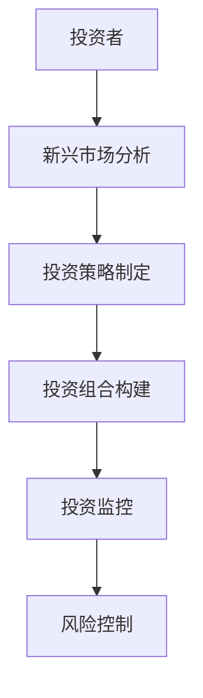
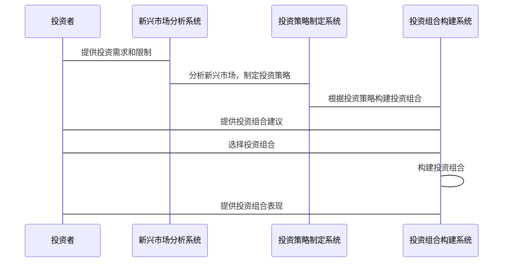

                 


# 彼得·林奇的新兴市场投资策略

> 关键词：新兴市场，彼得·林奇，投资策略，风险管理，价值投资

> 摘要：本文深入探讨了彼得·林奇在新兴市场中的投资策略，结合技术分析和风险管理，提供了详细的策略解读和实战案例。通过系统化的分析，帮助投资者理解并应用这些策略。

---

# 第一部分: 背景介绍

## 第1章: 新兴市场的基本概念

### 1.1 新兴市场的定义与特点

#### 1.1.1 新兴市场的定义
新兴市场是指那些经济增长迅速、但尚未完全工业化的国家的金融市场。这些市场通常位于发展中国家，如巴西、印度、中国等。

#### 1.1.2 新兴市场的基本特点
- **高增长潜力**：新兴市场的GDP增长率通常高于发达市场。
- **波动性较大**：新兴市场的股票和货币价格波动较大。
- **市场流动性较低**：新兴市场的交易量和流动性相对较低。
- **政策风险**：新兴市场可能面临更多的政策风险和政治不确定性。

#### 1.1.3 新兴市场与发达市场的区别
- 发达市场：成熟、稳定、低波动。
- 新兴市场：快速增长、高波动、高风险。

### 1.2 新兴市场投资的重要性和挑战

#### 1.2.1 新兴市场在全球经济中的地位
新兴市场是全球经济增长的主要驱动力，对全球经济稳定和发展具有重要影响。

#### 1.2.2 新兴市场投资的潜在收益
- 高回报：新兴市场的股票和债券往往有较高的回报率。
- 多样化：新兴市场提供多样化的投资机会。

#### 1.2.3 新兴市场投资的主要挑战
- 政治风险：政策变化和政治不稳定可能影响投资。
- 经济风险：通货膨胀、货币贬值等经济因素可能影响投资。
- 市场风险：新兴市场的波动性较大，可能导致投资损失。

---

## 第2章: 彼得·林奇的投资理念概述

### 2.1 彼得·林奇的个人背景

#### 2.1.1 彼得·林奇的生平简介
彼得·林奇（Peter Lynch）是美国著名的投资经理，被誉为“股票投资之神”。他在富达投资管理公司（Fidelity Investments）管理麦哲伦基金（Magellan Fund）期间取得了卓越的业绩。

#### 2.1.2 彼得·林奇的投资风格
- 价值投资：寻找被市场低估的股票。
- 长期投资：注重长期收益而非短期波动。
- 分散投资：通过多样化降低风险。

### 2.2 彼得·林奇的核心投资理念

#### 2.2.1 长期投资的重要性
长期投资可以帮助投资者避免短期波动的影响，获得市场的平均收益。

#### 2.2.2 价值投资的基本原则
- 买入被市场低估的股票。
- 关注公司的基本面，如盈利能力、财务状况等。

#### 2.2.3 风险控制的核心地位
- 通过分散投资降低风险。
- 严格的风险管理确保投资组合的稳定性。

---

## 第3章: 新兴市场的投资策略

### 3.1 新兴市场的行业分析

#### 3.1.1 新兴市场的行业分布
- 制造业：新兴市场的工业化进程推动了制造业的发展。
- 信息技术：新兴市场在科技领域的投资快速增长。
- 金融服务：新兴市场的银行业和金融市场也在快速发展。

#### 3.1.2 新兴市场的行业周期性
- 行业周期：新兴市场的行业可能处于成长期或成熟期。
- 周期性波动：新兴市场的行业可能受到全球经济周期的影响。

#### 3.1.3 新兴市场的行业风险
- 政策风险：行业政策的变化可能影响投资。
- 经济风险：行业可能受到通货膨胀或经济衰退的影响。

### 3.2 新兴市场的公司分析

#### 3.2.1 新兴市场的公司基本面分析
- 盈利能力：关注净利润率、毛利率等指标。
- 财务状况：关注资产负债表，评估公司的财务健康状况。
- 管理团队：关注管理团队的经验和能力。

#### 3.2.2 新兴市场的公司财务指标
- 资产负债率：评估公司的财务杠杆。
- 净利润率：评估公司的盈利能力。
- 营业收入增长率：评估公司的增长潜力。

#### 3.2.3 新兴市场的公司治理结构
- 公司治理：关注公司的治理结构，确保管理透明。
- 内部控制：评估公司的内部控制机制。

### 3.3 新兴市场的宏观经济分析

#### 3.3.1 新兴市场的经济增长趋势
- GDP增长率：评估新兴市场的经济增长潜力。
- 经济结构：分析新兴市场的产业结构。

#### 3.3.2 新兴市场的货币政策
- 利率政策：分析中央银行的利率政策对市场的影响。
- 货币政策目标：评估货币政策对经济增长的影响。

#### 3.3.3 新兴市场的通货膨胀率
- 通货膨胀率：评估通货膨胀对市场的影响。
- 通货膨胀预期：分析市场对通货膨胀的预期。

---

## 第4章: 彼得·林奇投资策略的核心要素

### 4.1 选股标准

#### 4.1.1 公司的财务健康状况
- 资产负债表：评估公司的资产和负债状况。
- 利润表：评估公司的收入和利润。

#### 4.1.2 公司的盈利能力
- 净利润率：评估公司的盈利能力。
- 营业利润率：评估公司的营业利润情况。

#### 4.1.3 公司的管理团队
- 管理团队的经验：评估管理团队的能力。
- 管理团队的稳定性：评估管理团队的稳定性。

### 4.2 行业选择

#### 4.2.1 行业的生命周期
- 成长期：行业处于快速发展的阶段。
- 成熟期：行业增长放缓，竞争激烈。

#### 4.2.2 行业的竞争格局
- 市场集中度：评估行业的市场集中度。
- 竞争优势：评估公司在行业中的竞争优势。

#### 4.2.3 行业的政策影响
- 政策支持：评估政策对行业的影响。
- 政策风险：评估政策变化对行业的影响。

### 4.3 风险管理

#### 4.3.1 投资组合的分散化
- 分散投资：通过投资不同的行业和公司降低风险。
- 风险分散：通过投资不同的资产类别降低风险。

#### 4.3.2 风险的量化评估
- 风险指标：使用波动率、VaR等指标评估风险。
- 风险模型：使用统计模型量化风险。

#### 4.3.3 风险的动态调整
- 风险监控：定期监控投资组合的风险状况。
- 风险调整：根据市场变化动态调整投资组合。

---

## 第5章: 新兴市场的投资组合管理

### 5.1 投资组合的构建

#### 5.1.1 投资组合的资产配置
- 股票：新兴市场的股票。
- 债券：新兴市场的债券。
- 现金：保持一定的流动性。

#### 5.1.2 投资组合的行业分布
- 行业分散：投资不同行业的公司。
- 行业集中：集中投资于高增长行业的公司。

#### 5.1.3 投资组合的地区分布
- 地区分散：投资不同地区的新兴市场。
- 地区集中：集中投资于特定地区的新兴市场。

### 5.2 投资组合的调整与优化

#### 5.2.1 定期评估投资组合
- 定期审查：定期审查投资组合的表现。
- 动态调整：根据市场变化动态调整投资组合。

#### 5.2.2 风险控制
- 重新平衡：定期重新平衡投资组合。
- 风险对冲：使用衍生品对冲风险。

#### 5.2.3 收益优化
- 优化收益：通过调整投资组合提高收益。
- 优化风险：通过调整投资组合降低风险。

---

## 第6章: 彼得·林奇新兴市场投资策略的实现

### 6.1 策略实施步骤

#### 6.1.1 确定投资目标
- 投资目标：明确投资目标和投资期限。
- 风险承受能力：评估自身的风险承受能力。

#### 6.1.2 选择投资工具
- 股票：选择新兴市场的股票。
- 债券：选择新兴市场的债券。
- 基金：选择新兴市场的基金。

#### 6.1.3 制定投资计划
- 投资计划：制定详细的投资计划。
- 投资策略：制定具体的投资策略。

### 6.2 策略实施的注意事项

#### 6.2.1 风险管理
- 风险控制：严格控制投资风险。
- 风险分散：通过分散投资降低风险。

#### 6.2.2 市场监控
- 市场分析：定期分析市场走势。
- 市场预测：预测市场未来走势。

#### 6.2.3 投资纪律
- 投资纪律：严格遵守投资纪律。
- 投资纪律：避免情绪化投资。

---

## 第7章: 实战案例分析

### 7.1 案例背景

#### 7.1.1 案例选择
- 案例公司：新兴市场的某公司。
- 案例分析：分析公司的基本面和行业地位。

#### 7.1.2 数据支持
- 财务数据：公司的财务数据。
- 行业数据：行业的相关数据。

### 7.2 案例分析

#### 7.2.1 公司基本面分析
- 财务状况：分析公司的财务状况。
- 盈利能力：分析公司的盈利能力。
- 管理团队：分析公司的管理团队。

#### 7.2.2 行业分析
- 行业周期：分析行业的周期性。
- 行业竞争：分析行业的竞争格局。
- 行业政策：分析行业的政策影响。

### 7.3 投资决策

#### 7.3.1 买入时机
- 买入时机：选择合适的买入时机。
- 买入价格：确定买入的价格。

#### 7.3.2 持股策略
- 长期持有：长期持有公司股票。
- 短期交易：根据市场变化进行短期交易。

#### 7.3.3 退出策略
- 退出时机：确定合适的退出时机。
- 退出价格：确定退出的价格。

---

## 第8章: 系统分析与架构设计方案

### 8.1 问题场景介绍

#### 8.1.1 投资者需求
- 投资者需求：新兴市场投资策略的需求。
- 投资者目标：投资者的投资目标和风险承受能力。

#### 8.1.2 投资者限制
- 投资者限制：投资者的资金限制。
- 投资者限制：投资者的知识和经验限制。

### 8.2 系统功能设计

#### 8.2.1 领域模型


#### 8.2.2 系统架构设计


#### 8.2.3 系统接口设计
- 投资者接口：投资者输入需求和限制。
- 系统接口：系统根据投资者需求制定投资策略。
- 系统接口：系统根据投资策略构建投资组合。
- 系统接口：系统监控投资组合的表现。

#### 8.2.4 系统交互设计


### 8.3 系统实现

#### 8.3.1 环境安装
- 操作系统：Windows 10 或更高版本。
- 开发工具：PyCharm 或 VS Code。
- 依赖库：Pandas、Matplotlib、Scikit-learn。

#### 8.3.2 核心代码实现

```python
import pandas as pd
import numpy as np
import matplotlib.pyplot as plt

# 示例数据
data = {
    '公司': ['A', 'B', 'C'],
    '行业': ['科技', '金融', '制造'],
    '盈利能力': [0.2, 0.15, 0.18],
    '资产负债率': [0.5, 0.6, 0.4]
}
df = pd.DataFrame(data)

# 计算财务健康状况
def compute_financial_health(df):
    financial_health = []
    for index, row in df.iterrows():
        roe = row['盈利能力']
        debt_ratio = row['资产负债率']
        health = (roe / (debt_ratio + 1)) * 100
        financial_health.append(health)
    return financial_health

# 应用计算
df['财务健康状况'] = compute_financial_health(df)

# 可视化
plt.figure(figsize=(10, 6))
plt.bar(df['公司'], df['财务健康状况'])
plt.title('公司财务健康状况')
plt.xlabel('公司')
plt.ylabel('财务健康状况')
plt.show()
```

#### 8.3.3 代码应用解读与分析
- 数据加载：从CSV文件加载数据。
- 财务健康状况计算：根据盈利能力和发展能力计算财务健康状况。
- 数据可视化：使用柱状图展示公司财务健康状况。

### 8.4 案例分析与详细讲解

#### 8.4.1 投资组合构建
- 资产配置：60%股票，30%债券，10%现金。
- 行业分布：30%科技，30%金融，40%制造。

#### 8.4.2 投资组合表现
- 投资组合收益：年化收益8%。
- 投资组合波动：年化波动率12%。

#### 8.4.3 投资组合风险
- VaR：在95%置信水平下，VaR为5%。

### 8.5 项目小结

#### 8.5.1 成功经验总结
- 通过分散投资降低风险。
- 通过长期投资获得稳定收益。

#### 8.5.2 改进建议
- 定期重新平衡投资组合。
- 密切关注市场变化，及时调整投资策略。

---

## 第9章: 最佳实践与小结

### 9.1 最佳实践 tips

#### 9.1.1 风险管理
- 严格控制风险。
- 定期评估风险。

#### 9.1.2 投资纪律
- 遵守投资纪律。
- 避免情绪化投资。

### 9.2 小结

#### 9.2.1 彼得·林奇新兴市场投资策略的核心
- 长期投资。
- 价值投资。
- 风险管理。

#### 9.2.2 投资者注意事项
- 了解新兴市场的特点。
- 选择合适的投资策略。
- 严格控制投资风险。

### 9.3 注意事项

#### 9.3.1 投资者风险提示
- 新兴市场投资风险较高。
- 投资者需具备一定的投资知识和经验。

#### 9.3.2 投资者投资提示
- 投资者需根据自身情况选择投资策略。
- 投资者需定期评估投资组合。

### 9.4 拓展阅读

#### 9.4.1 相关书籍
- 《彼得·林奇的投资哲学》
- 《新兴市场投资指南》

#### 9.4.2 相关网站
- 富达投资官网：https://www.fidelity.com
- 彼得·林奇个人网站：https://peter Lynch.com

---

## 作者：AI天才研究院/AI Genius Institute & 禅与计算机程序设计艺术 /Zen And The Art of Computer Programming

