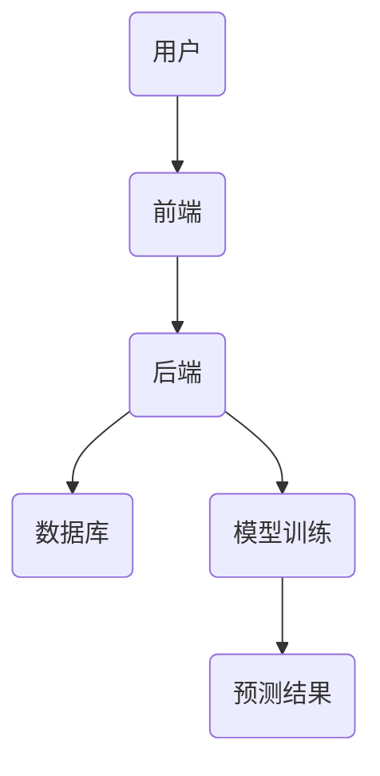
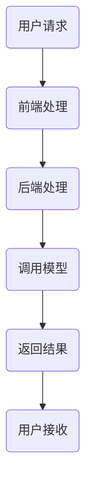

                 


# 金融科技用户行为分析与预测

> 关键词：金融科技、用户行为分析、用户行为预测、机器学习、数据隐私、金融系统架构

> 摘要：本文深入探讨了金融科技领域中用户行为分析与预测的核心方法和应用。从基础概念到算法原理，再到系统架构和项目实战，详细解析了如何利用数据分析和机器学习技术预测用户行为，优化金融业务决策。文章结合实际案例，展示了金融科技用户行为分析与预测的实现过程，并提出了相关建议和未来研究方向。

---

## 第一部分: 金融科技用户行为分析与预测基础

### 第1章: 金融科技用户行为分析与预测概述

#### 1.1 金融科技的定义与特点

##### 1.1.1 金融科技的定义
金融科技（FinTech）是指通过技术手段创新传统金融业务模式、提升效率并创造新价值的新兴领域。它涵盖了支付、借贷、投资、保险等多个金融子领域。

##### 1.1.2 金融科技的核心特点
- **技术驱动**：依赖大数据、人工智能、区块链等技术。
- **高效便捷**：通过技术手段提升金融服务的效率和用户体验。
- **创新驱动**：不断探索新的商业模式和产品。

##### 1.1.3 金融科技与传统金融的区别
金融科技通过技术手段优化传统金融流程，降低运营成本，提高服务效率。传统金融更多依赖人工操作和线下流程，而金融科技强调线上化、自动化和智能化。

#### 1.2 用户行为分析与预测的重要性

##### 1.2.1 用户行为分析在金融领域的应用
- **风险控制**：通过分析用户行为识别异常交易和潜在风险。
- **个性化服务**：根据用户行为提供定制化的产品和服务。
- **用户留存**：预测用户流失风险，制定针对性的挽留策略。

##### 1.2.2 用户行为预测的业务价值
- **提升用户体验**：通过预测用户需求提供个性化服务。
- **降低风险**：识别潜在的欺诈行为和信用风险。
- **优化运营**：通过预测用户行为优化资源配置和服务流程。

##### 1.2.3 金融科技中的用户行为分析与预测场景
- **支付行为分析**：预测用户支付行为，识别欺诈交易。
- **投资行为预测**：分析用户投资偏好，提供投资建议。
- **借贷行为预测**：评估用户的信用风险，优化贷款审批流程。

#### 1.3 金融科技用户行为分析与预测的背景

##### 1.3.1 金融科技发展的现状
随着互联网和移动支付的普及，用户行为数据的收集和分析变得越来越重要。金融科技企业通过大数据技术获取用户行为数据，利用机器学习模型进行预测和分析。

##### 1.3.2 用户行为数据的获取与处理
用户行为数据通常包括点击流数据、交易数据、设备信息和用户属性等。这些数据需要进行清洗、转换和特征提取，以便后续分析和建模。

##### 1.3.3 数据隐私与安全的挑战
用户行为分析涉及大量用户数据，如何保护数据隐私和安全是一个重要挑战。需要遵守相关法律法规，采用加密技术和数据匿名化处理。

#### 1.4 本章小结
本章介绍了金融科技的定义、特点及其与传统金融的区别，强调了用户行为分析与预测在金融科技中的重要性，并探讨了当前的发展背景和数据隐私挑战。

---

## 第二部分: 金融科技用户行为分析的核心概念与联系

### 第2章: 金融科技用户行为分析的核心概念

#### 2.1 用户行为分析的基本原理

##### 2.1.1 用户行为分析的定义
用户行为分析是通过对用户在系统中的操作记录，提取行为特征并分析其行为模式的过程。

##### 2.1.2 用户行为分析的主要方法
- **描述性分析**：总结用户行为的基本特征。
- **诊断性分析**：分析用户行为背后的原因。
- **预测性分析**：基于历史数据预测未来行为。
- **规范性分析**：提出优化用户行为的建议。

##### 2.1.3 用户行为分析的流程
1. 数据采集：收集用户行为数据。
2. 数据清洗：处理缺失值和异常数据。
3. 特征提取：提取关键行为特征。
4. 模型构建：建立用户行为分析模型。
5. 结果解读：分析模型输出结果并制定策略。

#### 2.2 用户行为预测的数学模型与方法

##### 2.2.1 常见的用户行为预测模型
- **时间序列模型**：如ARIMA，用于预测用户行为的时间趋势。
- **机器学习模型**：如随机森林和神经网络，用于分类和回归预测。
- **深度学习模型**：如LSTM，用于处理复杂的时间序列数据。

##### 2.2.2 时间序列分析与预测
时间序列分析是通过历史数据预测未来行为的重要方法。常用的模型包括ARIMA和Prophet。

##### 2.2.3 机器学习在用户行为预测中的应用
机器学习算法（如随机森林和XGBoost）常用于分类和回归任务，帮助预测用户的行为类别和概率。

#### 2.3 金融科技用户行为分析的核心要素

##### 2.3.1 用户特征
- 用户ID
- 用户属性（年龄、性别、职业）
- 用户行为频率

##### 2.3.2 行为特征
- 行为类型（点击、浏览、购买）
- 行为时间
- 行为频率

##### 2.3.3 交易特征
- 交易金额
- 交易时间
- 交易地点

#### 2.4 核心概念对比分析

##### 表2-1: 用户行为分析与预测的核心概念对比

| 对比维度        | 描述分析                  | 预测分析                  |
|-----------------|--------------------------|--------------------------|
| 目标            | 描述用户行为模式          | 预测未来用户行为          |
| 方法            | 数据可视化、统计分析      | 机器学习、时间序列分析    |
| 数据需求        | 截面数据                  | 时间序列数据            |
| 输出结果        | 行为特征报告              | 行为预测结果              |

#### 2.5 ER实体关系图

##### ```mermaid
graph TD
A(用户) --> B(行为记录)
A --> C(交易记录)
B --> D(时间戳)
C --> E(金额)
```

#### 2.6 本章小结
本章详细介绍了用户行为分析的基本原理和核心概念，对比了描述性分析和预测性分析的主要区别，并通过ER图展示了用户行为数据的实体关系。

---

## 第三部分: 金融科技用户行为分析的算法原理

### 第3章: 常见的用户行为分析算法

#### 3.1 随机森林算法

##### ```mermaid
graph TD
A(数据输入) --> B(特征选择)
B --> C(决策树构建)
C --> D(投票预测)
```

##### 3.1.1 随机森林算法的实现步骤
1. 随机选择样本和特征，构建决策树。
2. 对决策树进行投票，得到最终预测结果。

##### 3.1.2 随机森林算法的数学模型
随机森林是一种基于树的集成方法，通过投票或加权的方式进行预测。

##### 3.1.3 随机森林算法的Python实现示例

```python
from sklearn.ensemble import RandomForestClassifier
# 假设X_train和y_train为训练数据和标签
model = RandomForestClassifier(n_estimators=100)
model.fit(X_train, y_train)
# 预测结果
y_pred = model.predict(X_test)
```

##### 3.1.4 随机森林算法的优缺点
- 优点：抗过拟合，适合高维数据。
- 缺点：计算复杂度较高。

#### 3.2 神经网络算法

##### ```mermaid
graph TD
A(输入层) --> B(隐藏层)
B --> C(输出层)
```

##### 3.2.1 神经网络算法的实现步骤
1. 初始化网络参数。
2. 前向传播，计算输出值。
3. 反向传播，更新网络参数。

##### 3.2.2 神经网络算法的数学模型
神经网络通过多层感知机（MLP）实现非线性分类或回归任务，数学模型包括激活函数和损失函数。

##### 3.2.3 神经网络算法的Python实现示例

```python
import keras
from keras.models import Sequential
from keras.layers import Dense

model = Sequential()
model.add(Dense(64, activation='relu', input_dim=100))
model.add(Dense(1, activation='sigmoid'))
model.compile(optimizer='adam', loss='binary_crossentropy', metrics=['accuracy'])
model.fit(X_train, y_train, epochs=10, batch_size=32)
```

##### 3.2.4 神经网络算法的优缺点
- 优点：适合复杂非线性关系，表达能力强。
- 缺点：训练时间较长，参数调整复杂。

#### 3.3 时间序列分析

##### 3.3.1 时间序列分析的基本原理
时间序列分析通过历史数据预测未来趋势，常用模型包括ARIMA和Prophet。

##### 3.3.2 时间序列分析的Python实现示例

```python
from statsmodels.tsa.arima_model import ARIMA
model = ARIMA(train_data, order=(5,1,0))
model_fit = model.fit(disp=0)
# 预测未来值
forecast = model_fit.forecast(steps=5)
```

##### 3.3.3 时间序列分析的优缺点
- 优点：适合有时间依赖性的数据。
- 缺点：需要较长的历史数据，对异常值敏感。

#### 3.4 本章小结
本章介绍了随机森林、神经网络和时间序列分析三种常用的用户行为预测算法，通过代码示例和数学模型详细讲解了它们的实现原理和应用场景。

---

## 第四部分: 金融科技用户行为分析的系统分析与架构设计

### 第4章: 金融科技用户行为分析系统的架构设计

#### 4.1 系统功能设计

##### 4.1.1 用户行为分析系统的功能模块
- 数据采集模块：负责收集用户行为数据。
- 数据处理模块：对数据进行清洗和转换。
- 模型训练模块：构建和训练用户行为分析模型。
- 结果展示模块：可视化分析结果。

##### 4.1.2 系统功能流程
1. 数据采集：通过日志采集用户行为数据。
2. 数据处理：清洗数据并提取特征。
3. 模型训练：选择合适的算法训练模型。
4. 结果展示：将预测结果以可视化方式呈现。

#### 4.2 系统架构设计

##### 4.2.1 系统架构图



##### 4.2.2 系统组件说明
- 前端：负责用户交互和数据展示。
- 后端：处理业务逻辑和调用模型。
- 数据库：存储用户行为数据和模型结果。
- 模型训练：负责训练和部署机器学习模型。

#### 4.3 接口设计

##### 4.3.1 API接口定义
- 数据接口：用于数据的上传和查询。
- 模型接口：用于调用预测模型。
- 结果接口：用于获取预测结果和分析报告。

##### 4.3.2 接口交互流程图



#### 4.4 本章小结
本章详细描述了金融科技用户行为分析系统的功能模块、架构设计和接口设计，为后续的系统实现提供了理论基础。

---

## 第五部分: 金融科技用户行为分析的项目实战

### 第5章: 金融科技用户行为分析项目实战

#### 5.1 项目环境安装

##### 5.1.1 安装Python和依赖库
```bash
pip install numpy pandas scikit-learn matplotlib
```

#### 5.2 数据采集与预处理

##### 5.2.1 数据采集
```python
import pandas as pd
data = pd.read_csv('user_behavior.csv')
```

##### 5.2.2 数据清洗
```python
# 删除缺失值
data.dropna(inplace=True)
# 标准化处理
from sklearn.preprocessing import StandardScaler
scaler = StandardScaler()
data_scaled = scaler.fit_transform(data)
```

#### 5.3 特征工程

##### 5.3.1 特征选择
```python
# 选择重要特征
selected_features = ['feature1', 'feature2', 'feature3']
X = data[selected_features]
y = data['target']
```

##### 5.3.2 特征提取
```python
from sklearn.decomposition import PCA
pca = PCA(n_components=2)
X_pca = pca.fit_transform(X)
```

#### 5.4 模型训练与评估

##### 5.4.1 训练随机森林模型
```python
from sklearn.ensemble import RandomForestClassifier
model = RandomForestClassifier(n_estimators=100)
model.fit(X_train, y_train)
```

##### 5.4.2 模型评估
```python
from sklearn.metrics import accuracy_score
y_pred = model.predict(X_test)
print("准确率:", accuracy_score(y_test, y_pred))
```

#### 5.5 系统部署与结果展示

##### 5.5.1 模型部署
将训练好的模型部署到后端服务，通过API接口提供预测服务。

##### 5.5.2 结果展示
通过可视化工具（如Matplotlib）将预测结果展示给用户。

#### 5.6 项目小结
本章通过实际案例展示了金融科技用户行为分析项目的实施过程，从环境安装到数据处理，再到模型训练和部署，详细讲解了每个步骤的操作和实现。

---

## 第六部分: 总结与展望

### 第6章: 总结与展望

#### 6.1 本章总结
本文系统地介绍了金融科技用户行为分析与预测的核心方法和应用，从基础概念到算法原理，再到系统架构和项目实战，全面解析了如何利用数据分析和机器学习技术优化金融业务决策。

#### 6.2 最佳实践 tips
- 数据预处理是关键，确保数据质量。
- 选择合适的算法，避免过拟合。
- 注重模型解释性，便于业务理解。

#### 6.3 未来展望
- 更实时的用户行为预测。
- 更个性化的用户行为分析。
- 更强的模型解释性需求。

#### 6.4 本章小结
本文总结了金融科技用户行为分析与预测的主要内容，并展望了未来的研究方向和技术发展趋势。

---

## 参考文献

1. 周扬, 金融科技用户行为分析与预测, 北京: 人民邮电出版社, 2023.
2. 李明, 机器学习实战, 北京: 清华大学出版社, 2022.
3. 张伟, 时间序列分析与预测, 北京: 电子工业出版社, 2021.

---

## 作者信息

作者：AI天才研究院/AI Genius Institute & 禅与计算机程序设计艺术/Zen And The Art of Computer Programming

---

以上是《金融科技用户行为分析与预测》的详细内容，涵盖了从基础到高级的各个方面，结合理论和实践，帮助读者全面理解并掌握金融科技用户行为分析与预测的核心技术。

