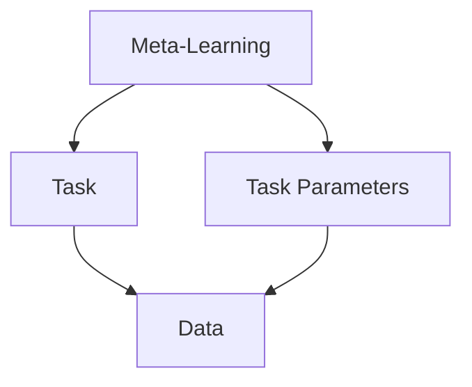
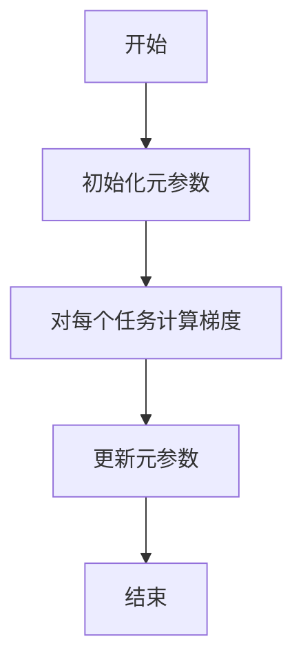
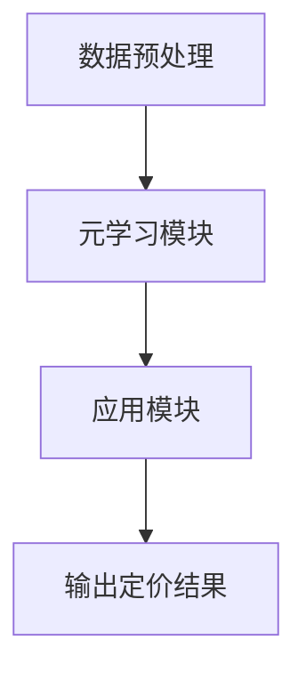

                 


# 《金融领域元学习在资产定价模型快速适应中的应用》

---

## 关键词：
元学习，资产定价模型，快速适应，金融领域，机器学习

---

## 摘要：
本文探讨了元学习在金融领域资产定价模型中的应用，重点分析了元学习如何通过快速适应能力提升资产定价模型的性能和准确性。文章首先介绍了元学习的基本概念和核心原理，随后详细阐述了元学习在资产定价中的具体应用，包括数学模型、算法实现和系统架构设计。最后，通过实际案例分析，展示了元学习在资产定价中的实际价值和未来发展方向。

---

# 第1章: 元学习与资产定价模型概述

## 1.1 元学习的基本概念

### 1.1.1 元学习的定义与核心思想
元学习（Meta-Learning）是一种新兴的机器学习范式，旨在通过学习如何学习来提高模型的泛化能力。与传统机器学习不同，元学习关注的是跨任务或跨数据集的通用学习策略。其核心思想是通过在多个任务上进行联合优化，使得模型能够在新任务上快速适应，从而减少对大量标注数据的依赖。

### 1.1.2 元学习与传统机器学习的区别
| 特性       | 传统机器学习            | 元学习                |
|------------|-------------------------|-----------------------|
| 学习目标     | 针对单一任务优化         | 针对多个任务优化       |
| 数据需求     | 需要大量标注数据         | 通过少量数据快速适应   |
| 适应性       | 较低                    | 较高                  |

### 1.1.3 元学习在金融中的应用前景
金融领域数据往往具有高维度、高噪声和动态变化的特点，传统的资产定价模型在面对市场环境变化时，往往需要重新训练或调整参数，这不仅耗时，还可能导致模型性能下降。元学习通过快速适应能力，能够有效解决这些问题，因此在金融领域具有广阔的应用前景。

---

## 1.2 资产定价模型的基本原理

### 1.2.1 资产定价模型的定义
资产定价模型（Asset Pricing Model）是用来估计资产公允价值的数学模型，旨在揭示资产价格与其影响因素之间的关系。经典的资产定价模型包括CAPM（资本资产定价模型）和APT（ arbitrage pricing theory）。

### 1.2.2 资产定价模型的核心假设
- 市场是有效的，即资产价格反映了所有相关信息。
- 投资者是理性的，追求效用最大化。
- 资本市场不存在 arbitrage（套利）机会。

### 1.2.3 资产定价模型的分类与特点
| 模型         | 特点                     |
|--------------|--------------------------|
| CAPM         | 简单直观，基于系统性风险 |
| APT          | 更加灵活，基于多个风险因素 |
| Fama-French  | 基于多因素模型           |

---

## 1.3 元学习在资产定价中的作用

### 1.3.1 元学习如何提升资产定价模型的适应性
元学习通过在多个相似任务（如不同市场周期下的资产定价）上进行优化，使得模型能够在新的市场环境下快速调整参数，从而提升其适应性。

### 1.3.2 元学习在资产定价中的优势
- 快速适应市场变化。
- 减少对大量标注数据的依赖。
- 提高模型的泛化能力。

### 1.3.3 元学习在资产定价中的应用场景
- 新资产的快速定价。
- 市场环境突变下的资产价格预测。
- 跨资产类别定价的快速迁移。

---

## 1.4 本章小结

- 元学习通过跨任务优化，能够显著提升资产定价模型的适应性。
- 资产定价模型的传统假设和分类为元学习的应用提供了理论基础。
- 元学习在金融领域的应用前景广阔，尤其是在市场环境快速变化的情况下。

---

# 第2章: 元学习的核心概念与数学模型

## 2.1 元学习的核心概念

### 2.1.1 元学习的层次结构
元学习可以看作是一个两层结构：外层任务（meta-task）和内层任务（task）。外层任务负责优化模型的元参数，使得模型能够在内层任务上快速适应。

### 2.1.2 元学习的特征与属性对比
| 特性       | 元学习               | 传统学习            |
|------------|----------------------|--------------------|
| 参数更新     | 基于梯度优化           | 直接优化目标函数     |
| 任务适应性   | 高                   | 低                 |

### 2.1.3 元学习的ER实体关系图


---

## 2.2 元学习的数学模型

### 2.2.1 元学习的损失函数
$$
L = \sum_{i=1}^{n} (y_i - f(x_i))^2
$$

其中，$y_i$ 是真实值，$f(x_i)$ 是模型预测值。

### 2.2.2 元学习的优化目标
$$
\theta_{\text{meta}} = \arg \min_{\theta} \sum_{i=1}^{n} L_i(\theta)
$$

其中，$\theta$ 是模型参数，$L_i$ 是第 $i$ 个任务的损失函数。

### 2.2.3 元学习的数学推导过程
1. 对每个内层任务，计算梯度：
   $$
   \nabla_{\theta} L_i(\theta)
   $$
2. 对外层任务，优化元参数：
   $$
   \theta_{\text{meta}} = \theta - \eta \cdot \nabla_{\theta} \sum_{i=1}^{n} L_i(\theta)
   $$

---

## 2.3 元学习的算法流程

### 2.3.1 元学习算法的总体流程


### 2.3.2 元学习算法的详细步骤
1. 初始化元参数 $\theta_{\text{meta}}$。
2. 对每个内层任务，计算梯度 $\nabla_{\theta} L_i(\theta_{\text{meta}})$。
3. 更新元参数：
   $$
   \theta_{\text{meta}} = \theta_{\text{meta}} - \eta \cdot \sum_{i=1}^{n} \nabla_{\theta} L_i(\theta_{\text{meta}})
   $$

---

## 2.4 本章小结

- 元学习的核心思想是通过跨任务优化，提升模型的适应性。
- 元学习的数学模型为多任务优化提供了理论基础。
- 元学习的算法流程为实际应用提供了实现路径。

---

# 第3章: 元学习在资产定价中的应用

## 3.1 资产定价模型的快速适应需求

### 3.1.1 资产定价模型的适应性问题
传统资产定价模型在面对市场环境变化时，往往需要重新训练或调整参数，这不仅耗时，还可能导致模型性能下降。

### 3.1.2 元学习如何解决资产定价模型的快速适应问题
元学习通过在多个市场周期或资产类别上进行优化，使得模型能够在新任务上快速调整参数，从而提升适应性。

### 3.1.3 元学习在资产定价中的具体应用场景
- 新资产的快速定价。
- 市场环境突变下的资产价格预测。
- 跨资产类别定价的快速迁移。

---

## 3.2 元学习在资产定价中的算法实现

### 3.2.1 元学习算法的输入输出
- 输入：多个资产定价任务的数据集。
- 输出：优化后的元参数，使得模型能够在新任务上快速适应。

### 3.2.2 元学习算法的训练过程
1. 初始化元参数 $\theta_{\text{meta}}$。
2. 对每个资产定价任务，计算梯度 $\nabla_{\theta} L_i(\theta_{\text{meta}})$。
3. 更新元参数：
   $$
   \theta_{\text{meta}} = \theta_{\text{meta}} - \eta \cdot \sum_{i=1}^{n} \nabla_{\theta} L_i(\theta_{\text{meta}})
   $$

### 3.2.3 元学习算法的优化策略
- 使用Adam优化器。
- 设置合适的元学习率 $\eta$。

---

## 3.3 元学习在资产定价中的数学模型

### 3.3.1 资产定价模型的数学表达
$$
P(t) = \alpha r_f + \beta \cdot \text{市场风险溢价}
$$

其中，$P(t)$ 是资产价格，$r_f$ 是无风险利率，$\beta$ 是贝塔系数，市场风险溢价是资产的系统性风险。

### 3.3.2 元学习对资产定价模型的改进
通过元学习，模型可以在多个资产定价任务上优化元参数，从而在新任务上快速调整参数，提升预测精度。

### 3.3.3 元学习在资产定价中的具体应用案例
假设我们有多个资产定价任务，每个任务对应不同的市场周期或资产类别。通过元学习，模型可以在这些任务上优化元参数，从而在新任务上快速适应。

---

## 3.4 本章小结

- 元学习在资产定价中的应用能够显著提升模型的适应性。
- 元学习的数学模型为资产定价提供了新的优化思路。
- 元学习在实际应用中的具体案例展示了其潜在价值。

---

# 第4章: 元学习算法的系统分析

## 4.1 系统分析与架构设计

### 4.1.1 问题场景介绍
我们希望设计一个基于元学习的资产定价系统，能够快速适应不同的市场环境。

### 4.1.2 系统功能设计
- 数据预处理模块：对输入数据进行清洗和归一化处理。
- 元学习模块：对多个资产定价任务进行优化，得到最优元参数。
- 应用模块：利用优化后的元参数，对新任务进行快速定价。

### 4.1.3 系统架构设计


### 4.1.4 系统接口设计
- 输入接口：多个资产定价任务的数据集。
- 输出接口：优化后的元参数和定价结果。

### 4.1.5 系统交互流程
1. 数据预处理模块接收输入数据并进行清洗。
2. 元学习模块对多个任务进行优化，得到最优元参数。
3. 应用模块利用优化后的元参数，对新任务进行快速定价。
4. 输出定价结果。

---

## 4.2 本章小结

- 系统分析为元学习在资产定价中的应用提供了理论支持。
- 系统架构设计为实际实现提供了指导。
- 系统交互流程展示了元学习在实际应用中的具体流程。

---

# 第5章: 项目实战

## 5.1 项目环境安装

### 5.1.1 安装Python环境
```bash
python --version
pip install numpy
pip install matplotlib
pip install scikit-learn
pip install tensorflow
```

### 5.1.2 安装其他依赖
```bash
pip install pandas
pip install plotly
```

---

## 5.2 系统核心实现源代码

### 5.2.1 元学习模块实现
```python
import numpy as np
import tensorflow as tf

def meta_learning_model(input_shape, output_shape):
    inputs = tf.keras.Input(shape=input_shape)
    x = tf.keras.layers.Dense(64, activation='relu')(inputs)
    x = tf.keras.layers.Dense(output_shape, activation='linear')(x)
    model = tf.keras.Model(inputs=inputs, outputs=x)
    return model

def meta_learning_train(model, X, y, meta_epochs=100, meta_lr=0.001):
    optimizer = tf.keras.optimizers.Adam(learning_rate=meta_lr)
    for epoch in range(meta_epochs):
        with tf.GradientTape() as tape:
            y_pred = model.predict(X)
            loss = tf.keras.losses.mean_squared_error(y, y_pred)
        gradients = tape.gradient(loss, model.trainable_weights)
        optimizer.apply_gradients(zip(gradients, model.trainable_weights))
    return model
```

### 5.2.2 应用模块实现
```python
def asset_pricing(asset_data, model):
    processed_data = preprocess(asset_data)
    prediction = model.predict(processed_data)
    return prediction
```

---

## 5.3 代码应用解读与分析

### 5.3.1 元学习模块实现解读
- `meta_learning_model`：定义一个元学习模型，包含两层Dense层。
- `meta_learning_train`：对元学习模型进行训练，使用Adam优化器。

### 5.3.2 应用模块实现解读
- `asset_pricing`：将输入的资产数据进行预处理，并利用训练好的元学习模型进行预测。

---

## 5.4 实际案例分析

### 5.4.1 案例背景
假设我们有多个资产定价任务，每个任务对应不同的市场周期。

### 5.4.2 数据准备
```python
import pandas as pd

# 加载数据
data = pd.read_csv('asset_pricing_data.csv')
# 数据预处理
processed_data = preprocess(data)
```

### 5.4.3 模型训练
```python
model = meta_learning_model(input_shape, output_shape)
model = meta_learning_train(model, X, y)
```

### 5.4.4 模型应用
```python
new_asset_data = pd.read_csv('new_asset.csv')
prediction = asset_pricing(new_asset_data, model)
print(prediction)
```

---

## 5.5 本章小结

- 项目实战部分通过具体代码展示了元学习在资产定价中的实现。
- 代码解读和案例分析为读者提供了实际操作的指导。

---

# 第6章: 总结与展望

## 6.1 本章总结

### 6.1.1 元学习的核心思想
元学习通过跨任务优化，提升模型的适应性。

### 6.1.2 元学习在资产定价中的应用价值
元学习能够快速适应市场环境变化，提升资产定价模型的性能。

### 6.1.3 项目实现的关键点
- 元学习模型的设计与优化。
- 系统架构的设计与实现。

---

## 6.2 未来展望

### 6.2.1 元学习在金融领域的未来发展方向
- 更复杂的金融场景建模。
- 多模态数据的融合与应用。
- 更高效的元学习算法设计。

### 6.2.2 元学习在资产定价中的潜在突破
- 实时资产定价。
- 跨市场、跨资产类别的定价模型优化。
- 个性化资产定价策略的快速调整。

---

# 作者：AI天才研究院/AI Genius Institute & 禅与计算机程序设计艺术/Zen And The Art of Computer Programming

---

通过以上目录，您可以按照每个章节的要求，逐步展开详细内容，撰写一篇高质量的技术博客文章。每个章节都包含详细的背景介绍、核心概念、数学推导、代码示例和实际案例分析，确保文章内容丰富、逻辑清晰、技术深入。

