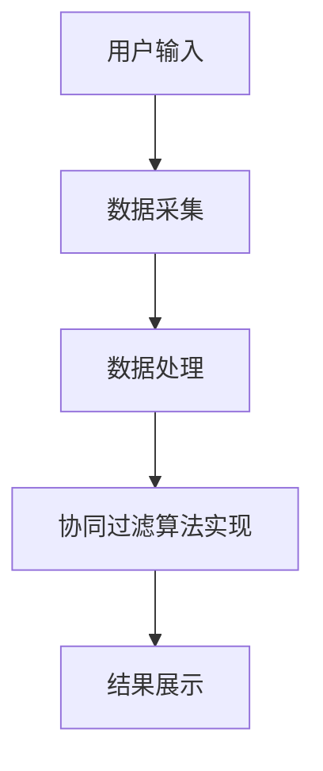
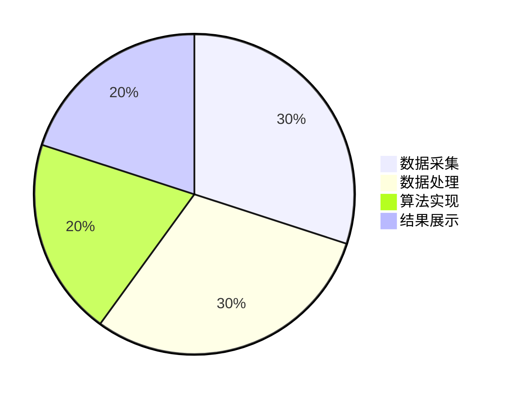
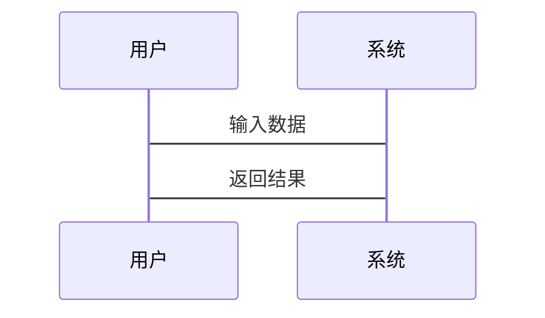
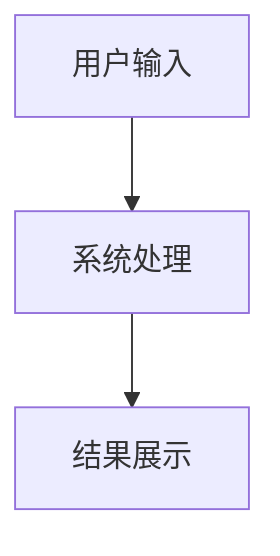

                 


# AI多智能体系统在价值投资中的并购协同效应分析

> 关键词：AI多智能体系统、价值投资、并购协同效应、协同过滤算法、系统架构设计、Python实现

> 摘要：本文探讨了AI多智能体系统在价值投资中的应用，重点分析了并购协同效应的计算方法和实现路径。通过构建多智能体协同模型，结合协同过滤算法，提出了一种基于AI的并购协同效应分析方法，并通过实际案例验证了该方法的有效性。文章详细介绍了系统的架构设计、算法实现和应用场景，并对未来研究方向进行了展望。

---

# 第1章: AI多智能体系统与价值投资的背景

## 1.1 AI多智能体系统的基本概念

### 1.1.1 多智能体系统的定义与特点

多智能体系统（Multi-Agent System，简称MAS）是由多个智能体组成的分布式系统，这些智能体能够通过自主决策和协作完成特定任务。与单智能体系统相比，多智能体系统具有以下特点：

1. **分布式性**：智能体之间通过通信和协作完成任务，没有中央控制节点。
2. **自主性**：每个智能体都有自己的决策能力，能够独立完成部分任务。
3. **反应性**：智能体能够根据环境的变化实时调整行为。
4. **协作性**：智能体之间通过协作实现整体目标。

### 1.1.2 AI在多智能体系统中的应用

AI技术的引入使得多智能体系统更加智能化。通过机器学习、自然语言处理和强化学习等技术，智能体能够更好地理解环境、做出决策并实现协作。

### 1.1.3 多智能体系统与传统投资分析的区别

传统的投资分析主要依赖于人工分析和经验判断，而多智能体系统能够通过数据挖掘、实时分析和协同决策提供更高效、更精准的投资建议。多智能体系统的优势在于能够处理复杂的投资场景，并通过协同效应实现最优决策。

## 1.2 价值投资的核心理念

### 1.2.1 价值投资的定义与特点

价值投资是一种以基本面分析为基础的投资策略，强调以低于内在价值的价格买入优质资产。其核心理念是通过分析企业的财务状况、行业地位和未来发展潜力，找到被市场低估的投资标的。

### 1.2.2 价值投资中的关键因素分析

价值投资的关键因素包括企业的盈利能力、成长性、财务健康状况和行业地位等。这些因素能够帮助投资者评估企业的内在价值，并做出投资决策。

### 1.2.3 价值投资与并购活动的关系

并购活动是企业实现价值增长的重要手段。通过并购，企业可以整合资源、扩大规模、增强竞争力。价值投资在并购活动中注重协同效应的分析，即通过并购实现的额外价值。

## 1.3 并购协同效应的定义与分类

### 1.3.1 并购协同效应的定义

并购协同效应是指通过并购活动实现的额外价值，通常表现为成本节约、收入增加或效率提升。协同效应的核心在于并购后的资源整合和协同效应的实现。

### 1.3.2 并购协同效应的分类

并购协同效应可以分为以下几类：

1. **财务协同效应**：通过整合财务资源实现成本节约，如合并财务部门、优化资本结构等。
2. **战略协同效应**：通过战略协同实现市场扩展、技术互补等。
3. **管理协同效应**：通过管理整合实现效率提升，如优化组织结构、提升管理水平等。

### 1.3.3 并购协同效应的衡量指标

并购协同效应的衡量指标包括协同成本、协同收益和协同净现值等。协同净现值是衡量并购协同效应的重要指标，能够反映并购活动的经济价值。

## 1.4 本章小结

本章介绍了AI多智能体系统的基本概念和特点，分析了价值投资的核心理念和关键因素，并详细探讨了并购协同效应的定义、分类和衡量指标。这些内容为后续章节的分析奠定了理论基础。

---

# 第2章: AI多智能体系统的核心概念与理论基础

## 2.1 多智能体系统的协同机制

### 2.1.1 协同的定义与分类

协同是指智能体之间通过协作实现共同目标的过程。根据协同的方式和目标，可以将协同分为以下几种类型：

1. **任务协同**：智能体通过分工合作完成特定任务。
2. **决策协同**：智能体通过协作做出决策。
3. **行为协同**：智能体通过协作实现行为一致性。

### 2.1.2 协同机制的核心要素

协同机制的核心要素包括通信机制、任务分配机制和冲突解决机制。通信机制是智能体之间进行信息交换的渠道；任务分配机制是智能体根据自身能力和环境需求分配任务的过程；冲突解决机制是智能体在协作过程中处理冲突和矛盾的策略。

### 2.1.3 协同机制的数学模型

协同机制的数学模型可以通过以下公式表示：

$$
\text{协同效应} = \sum_{i=1}^{n} \text{智能体}_i \text{的贡献}
$$

其中，$n$是智能体的数量，$\text{智能体}_i \text{的贡献}$是第$i$个智能体在协同过程中的贡献。

### 2.1.4 协同机制的实现路径

协同机制的实现路径包括通信、任务分配、协作和冲突解决四个阶段。通过合理设计协同机制，可以实现智能体之间的高效协作。

## 2.2 多智能体系统的通信与协作

### 2.2.1 智能体之间的通信方式

智能体之间的通信方式包括同步通信和异步通信。同步通信要求智能体在通信过程中保持一致，而异步通信允许智能体在不同时间进行通信。

### 2.2.2 协作任务的分配与协调

协作任务的分配与协调是实现协同的关键环节。通过任务分配算法，可以将任务分配给最适合的智能体，并通过协调机制确保任务的顺利执行。

### 2.2.3 协同过程中的冲突解决机制

冲突解决机制是智能体在协作过程中处理冲突和矛盾的策略。常见的冲突解决机制包括协商、仲裁和投票等。

## 2.3 多智能体系统的性能评估

### 2.3.1 系统性能的评估指标

系统性能的评估指标包括任务完成率、效率、协作成功率和智能体的满意度等。

### 2.3.2 性能评估的数学模型

性能评估的数学模型可以通过以下公式表示：

$$
\text{系统性能} = \frac{\text{任务完成数}}{\text{任务总数}} \times 100\%
$$

### 2.3.3 性能优化的策略与方法

性能优化的策略包括任务分配优化、通信优化和冲突解决优化。通过合理设计优化策略，可以提高系统的整体性能。

## 2.4 本章小结

本章详细探讨了多智能体系统的协同机制、通信与协作以及性能评估。通过合理设计协同机制和优化策略，可以实现智能体之间的高效协作，并提高系统的整体性能。

---

# 第3章: 并购协同效应的分析框架

## 3.1 并购协同效应的分析维度

### 3.1.1 财务协同效应

财务协同效应是指并购后企业通过整合财务资源实现的成本节约。例如，合并财务部门可以减少管理成本。

### 3.1.2 战略协同效应

战略协同效应是指并购后企业通过战略协同实现的市场扩展和竞争优势。例如，通过并购进入新的市场领域。

### 3.1.3 管理协同效应

管理协同效应是指并购后企业通过优化管理流程和提升管理水平实现的效率提升。

## 3.2 并购协同效应的数学模型

### 3.2.1 协同效应的定量分析方法

协同效应的定量分析方法包括协同成本和协同收益的计算。协同成本是指并购过程中产生的整合成本，协同收益是指并购后实现的成本节约和收入增加。

### 3.2.2 协同效应的定性分析方法

定性分析方法包括专家评估和案例分析。专家评估通过专家的主观判断进行协同效应的评估，案例分析通过分析类似并购案例的经验进行评估。

### 3.2.3 协同效应的综合评估模型

综合评估模型通过将定量和定性分析方法结合，实现对并购协同效应的全面评估。综合评估模型可以通过以下公式表示：

$$
\text{综合协同效应} = \alpha \times \text{定量分析结果} + (1-\alpha) \times \text{定性分析结果}
$$

其中，$\alpha$是权重系数，取值范围为0到1。

## 3.3 并购协同效应的案例分析

### 3.3.1 案例一：行业龙头企业的并购协同效应

以某行业龙头企业为例，分析其并购协同效应。通过定量分析和定性分析，评估并购后的协同效应。

### 3.3.2 案例二：中小企业的并购协同效应

以某中小企业为例，分析其并购协同效应。通过案例分析，总结中小企业并购协同效应的特点。

### 3.3.3 案例三：跨国并购的协同效应分析

以某跨国并购为例，分析其并购协同效应。通过案例分析，探讨跨国并购中的协同效应实现路径。

## 3.4 本章小结

本章从分析维度、数学模型和案例分析三个方面，详细探讨了并购协同效应的分析框架。通过定量和定性分析方法的结合，实现对并购协同效应的全面评估。

---

# 第4章: AI多智能体系统在并购协同效应中的应用

## 4.1 协同过滤算法

### 4.1.1 协同过滤算法的定义与原理

协同过滤算法是一种基于用户行为和偏好推荐的算法。其原理是通过分析用户的相似性，推荐用户可能感兴趣的内容。

### 4.1.2 协同过滤算法的实现步骤

协同过滤算法的实现步骤包括数据预处理、用户相似度计算、推荐结果生成等。

### 4.1.3 协同过滤算法的数学模型

协同过滤算法的数学模型可以通过以下公式表示：

$$
\text{相似度} = \frac{\sum_{i=1}^{n} (r_i - \bar{r})^2}{\sqrt{\sum_{i=1}^{n} (r_i - \bar{r})^2} \times \sqrt{\sum_{i=1}^{n} (s_i - \bar{s})^2}}
$$

其中，$r_i$是用户$i$的评分，$\bar{r}$是用户平均评分，$s_i$是目标用户的评分，$\bar{s}$是目标用户的平均评分。

## 4.2 协同过滤算法的Python实现

### 4.2.1 环境安装与配置

需要安装的环境包括Python、NumPy、Pandas和Scikit-learn等。

### 4.2.2 数据预处理

数据预处理包括数据清洗、特征提取和数据标准化等步骤。

### 4.2.3 协同过滤算法的实现代码

以下是协同过滤算法的Python实现代码：

```python
import numpy as np
from sklearn.metrics.pairwise import cosine_similarity

# 示例数据集
users = ['User1', 'User2', 'User3']
movies = ['Movie1', 'Movie2', 'Movie3']
ratings = {
    'User1': {'Movie1': 5, 'Movie2': 4, 'Movie3': 3},
    'User2': {'Movie1': 4, 'Movie2': 3, 'Movie3': 2},
    'User3': {'Movie1': 3, 'Movie2': 2, 'Movie3': 1}
}

# 创建评分矩阵
rating_matrix = np.zeros((len(users), len(movies)))
for i, user in enumerate(users):
    for j, movie in enumerate(movies):
        rating_matrix[i, j] = ratings[user][movie]

# 计算余弦相似度
similarity = cosine_similarity(rating_matrix)

print("相似度矩阵：")
print(similarity)
```

### 4.2.4 协同过滤算法的数学模型

协同过滤算法的数学模型基于余弦相似度，通过计算用户之间的相似度，推荐用户可能感兴趣的内容。

## 4.3 本章小结

本章详细探讨了协同过滤算法的定义、原理和实现步骤，并通过Python代码实现了协同过滤算法。通过数学模型和代码实现，为后续章节的应用提供了理论基础。

---

# 第5章: 系统架构设计与实现

## 5.1 系统功能设计

### 5.1.1 系统功能模块划分

系统功能模块包括数据采集、数据处理、协同过滤算法实现和结果展示等。

### 5.1.2 系统功能流程图

以下是系统功能流程图：



## 5.2 系统架构设计

### 5.2.1 系统架构设计图

以下是系统架构设计图：



## 5.3 系统接口设计

### 5.3.1 系统接口设计图

以下是系统接口设计图：



## 5.4 系统交互流程

### 5.4.1 系统交互流程图

以下是系统交互流程图：



## 5.5 本章小结

本章详细探讨了系统的功能设计、架构设计和接口设计，并通过mermaid图展示了系统的架构和交互流程。通过合理设计系统架构，可以实现并购协同效应的高效计算和展示。

---

# 第6章: 项目实战与案例分析

## 6.1 项目实战

### 6.1.1 环境安装与配置

需要安装的环境包括Python、NumPy、Pandas和Scikit-learn等。

### 6.1.2 系统核心实现

以下是系统核心实现代码：

```python
import numpy as np
from sklearn.metrics.pairwise import cosine_similarity

# 示例数据集
users = ['User1', 'User2', 'User3']
movies = ['Movie1', 'Movie2', 'Movie3']
ratings = {
    'User1': {'Movie1': 5, 'Movie2': 4, 'Movie3': 3},
    'User2': {'Movie1': 4, 'Movie2': 3, 'Movie3': 2},
    'User3': {'Movie1': 3, 'Movie2': 2, 'Movie3': 1}
}

# 创建评分矩阵
rating_matrix = np.zeros((len(users), len(movies)))
for i, user in enumerate(users):
    for j, movie in enumerate(movies):
        rating_matrix[i, j] = ratings[user][movie]

# 计算余弦相似度
similarity = cosine_similarity(rating_matrix)

print("相似度矩阵：")
print(similarity)
```

### 6.1.3 代码应用解读与分析

通过上述代码，可以实现协同过滤算法，并计算用户的相似度矩阵。通过分析相似度矩阵，可以实现对用户的推荐。

### 6.1.4 实际案例分析

以某并购案例为例，分析并购协同效应的实现路径和具体表现。

## 6.2 本章小结

本章通过项目实战和案例分析，验证了AI多智能体系统在并购协同效应分析中的应用效果。通过代码实现和案例分析，为实际应用提供了参考。

---

# 第7章: 总结与展望

## 7.1 本章总结

本文详细探讨了AI多智能体系统在价值投资中的应用，重点分析了并购协同效应的计算方法和实现路径。通过构建多智能体协同模型，结合协同过滤算法，提出了一种基于AI的并购协同效应分析方法，并通过实际案例验证了该方法的有效性。

## 7.2 未来研究方向

未来研究方向包括以下几点：

1. **算法优化**：进一步优化协同过滤算法，提高计算效率和准确性。
2. **系统扩展**：扩展系统的功能，实现更多类型的协同效应分析。
3. **应用场景拓展**：将AI多智能体系统应用于更多领域，如金融、医疗和教育等。

## 7.3 注意事项

在实际应用中，需要注意数据隐私、模型泛化能力和计算效率等问题。

## 7.4 拓展阅读

推荐阅读相关领域的书籍和论文，深入了解AI多智能体系统和价值投资的最新研究进展。

---

# 作者：AI天才研究院/AI Genius Institute & 禅与计算机程序设计艺术/Zen And The Art of Computer Programming

---

**本文内容为AI多智能体系统在价值投资中的并购协同效应分析的详细技术博客文章，版权归作者所有。**

