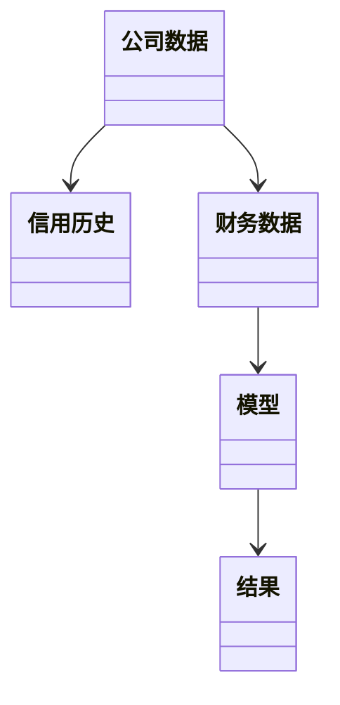
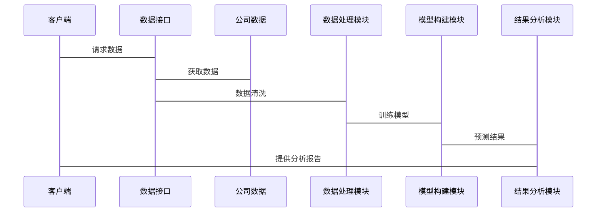

                 


# 利用多智能体系统进行全面的公司信用风险分析

## 关键词：
多智能体系统, 信用风险分析, 分布式计算, 博弈论模型, 系统架构设计, 项目实战

## 摘要：
本文详细探讨了利用多智能体系统进行全面的公司信用风险分析的方法与实践。通过结合多智能体系统的优势，我们提出了一种创新的信用风险评估框架，旨在提升信用风险分析的效率和准确性。文章从背景介绍、核心概念、算法原理、系统架构设计到项目实战，全面分析了多智能体系统在信用风险分析中的应用，并通过具体案例展示了其实现过程。

---

## 第一部分: 背景介绍

### 第1章: 多智能体系统与信用风险分析概述

#### 1.1 多智能体系统的定义与特点
- **1.1.1 多智能体系统的定义**：多智能体系统（Multi-Agent System, MAS）是由多个智能体（Agent）组成的系统，这些智能体能够自主决策、协作完成任务。
- **1.1.2 多智能体系统的核心特点**：
  - 分布式：智能体分布在不同的节点上，独立运行。
  - 协作性：智能体之间通过通信和协作完成共同目标。
  - 反应性：智能体能够感知环境并实时做出反应。
- **1.1.3 多智能体系统与传统单智能体系统的区别**：
  | 特性         | 单智能体系统                 | 多智能体系统                 |
  |--------------|------------------------------|-------------------------------|
  | 结构         | 单点结构                   | 分布式结构                   |
  | 独立性       | 高                        | 中等                        |
  | 协作性       | 无                        | 高                         |

#### 1.2 信用风险分析的定义与特点
- **1.2.1 信用风险的定义**：信用风险是指债务人或交易对手无法履行其合约义务，导致债权人或交易对手遭受损失的风险。
- **1.2.2 信用风险分析的核心要素**：
  - 借款人资质：包括财务状况、信用历史等。
  - 贷款用途：资金的用途是否合理。
  - 担保情况：是否有足够的担保物或保证人。
- **1.2.3 信用风险分析的常用方法**：
  - 信用评分模型（如FICO评分）。
  - 财务比率分析（如流动性比率、杠杆比率）。
  - 风险模型（如VaR、CVaR）。

#### 1.3 多智能体系统在信用风险分析中的应用背景
- **1.3.1 传统信用风险分析的局限性**：
  - 数据孤岛：信息分散在不同部门或机构，难以整合。
  - 计算复杂性：传统方法难以处理大规模、多维度的数据。
  - 动态性：市场变化快，传统模型难以实时更新。
- **1.3.2 多智能体系统的优势**：
  - 分布式计算能力：能够处理大规模、多维度的数据。
  - 协作能力：智能体之间可以分工协作，提高效率。
  - 实时性：能够快速响应市场变化，实时更新评估结果。
- **1.3.3 多智能体系统在信用风险分析中的潜在价值**：
  - 提高评估的准确性和全面性。
  - 降低计算成本和时间。
  - 增强系统的适应性和灵活性。

#### 1.4 本章小结
- **1.4.1 多智能体系统的核心概念**：通过多个智能体的协作，实现复杂任务的高效完成。
- **1.4.2 信用风险分析的基本框架**：从定义、要素到常用方法的全面解析。
- **1.4.3 多智能体系统与信用风险分析的结合点**：利用多智能体系统的分布式计算和协作能力，提升信用风险分析的效率和准确性。

---

## 第二部分: 核心概念与联系

### 第2章: 多智能体系统与信用风险分析的核心概念

#### 2.1 多智能体系统的原理
- **2.1.1 多智能体系统的组成**：
  - 智能体（Agent）：能够感知环境、自主决策的实体。
  - 通信机制：智能体之间通过消息传递进行协作。
  - 协作机制：智能体通过分工合作完成共同目标。
- **2.1.2 多智能体系统的通信机制**：
  - 消息传递：通过发送消息进行信息交换。
  - 通信协议：定义消息格式和传输规则。
- **2.1.3 多智能体系统的协作机制**：
  - 分工协作：每个智能体负责特定的任务。
  - 协调同步：确保任务的协同完成。

#### 2.2 信用风险分析的原理
- **2.2.1 信用风险分析的流程**：
  - 数据收集：获取借款人的财务数据、信用历史等。
  - 数据处理：清洗、整合和预处理数据。
  - 模型构建：基于数据构建信用风险评估模型。
  - 结果分析：评估结果并提出风险管理建议。
- **2.2.2 信用风险分析的关键指标**：
  - 借款人资质：包括收入、资产、负债等。
  - 贷款用途：资金是否用于合理用途。
  - 担保情况：是否有足够的担保物或保证人。
- **2.2.3 信用风险分析的模型**：
  - 信用评分模型：如FICO评分。
  - 风险模型：如VaR、CVaR。

#### 2.3 多智能体系统与信用风险分析的结合
- **2.3.1 多智能体系统在信用风险分析中的角色**：
  - 数据收集智能体：负责收集和整合数据。
  - 数据处理智能体：负责数据清洗和预处理。
  - 模型构建智能体：负责构建和优化信用风险模型。
  - 结果分析智能体：负责评估结果并提出建议。
- **2.3.2 多智能体系统与信用风险分析的协同关系**：
  - 数据协同：智能体之间协同完成数据的收集和处理。
  - 模型协同：智能体之间协作优化信用风险模型。
  - 结果协同：智能体之间协同分析评估结果。
- **2.3.3 多智能体系统在信用风险分析中的优势**：
  - 分布式计算：能够处理大规模、多维度的数据。
  - 协作能力：智能体之间分工协作，提高效率。
  - 实时性：能够快速响应市场变化，实时更新评估结果。

#### 2.4 核心概念对比表
| 特性         | 多智能体系统                     | 信用风险分析                   |
|--------------|----------------------------------|-------------------------------|
| 核心目标     | 协作完成复杂任务               | 评估信用风险                   |
| 主要挑战     | 协作效率、通信延迟             | 数据不足、模型准确性           |
| 解决方案     | 分布式计算、协作机制           | 数据整合、模型优化             |

#### 2.5 实体关系图（Mermaid）
```mermaid
erDiagram
    actor 公司信息提供者
    actor 信用评估机构
    actor 监管机构
    company 公司
    risk 信用风险
    model

    公司信息提供者 --> company
    company --> risk
    risk --> model
    model --> 信用评估机构
    信用评估机构 --> 监管机构
```

---

## 第三部分: 算法原理与实现

### 第3章: 多智能体系统的算法原理

#### 3.1 分布式计算算法
- **3.1.1 分布式计算的基本原理**：
  - 分解任务：将任务分解为多个子任务，分配给不同的智能体。
  - 并行计算：智能体同时处理子任务，提高计算效率。
  - 结果汇总：将子任务的结果汇总，得到最终结果。
- **3.1.2 分布式计算的实现步骤**：
  1. 任务分解：将任务分解为多个子任务。
  2. 任务分配：将子任务分配给不同的智能体。
  3. 并行计算：智能体同时处理子任务。
  4. 结果汇总：将子任务的结果汇总，得到最终结果。
- **3.1.3 分布式计算的数学模型**：
  - 输入：任务T，分解为子任务T1, T2, ..., Tn。
  - 输出：子任务结果R1, R2, ..., Rn，汇总得到最终结果R。

#### 3.2 博弈论模型在多智能体系统中的应用
- **3.2.1 博弈论模型的基本原理**：
  - 博弈论：研究决策主体在战略相互作用中的数学模型。
  - 应用：用于分析智能体之间的博弈关系，优化决策。
- **3.2.2 博弈论模型的实现步骤**：
  1. 定义博弈环境：包括参与者、策略、收益等。
  2. 构建博弈模型：建立数学模型描述博弈关系。
  3. 计算纳什均衡：找到最优策略组合。
  4. 模拟博弈过程：通过模拟验证模型的正确性。
- **3.2.3 博弈论模型的数学公式**：
  - 纳什均衡：在策略组合σ*中，每个参与者i的策略σi*是其在其他参与者选择σ*-i时的最佳反应。

#### 3.3 算法实现的代码示例
```python
def distributed_calculation(tasks):
    import concurrent.futures
    with concurrent.futures.ThreadPoolExecutor() as executor:
        futures = {executor.submit(task): task for task in tasks}
        for future in concurrent.futures.as_completed(futures):
            print(future.result())
```

---

## 第四部分: 系统分析与架构设计

### 第4章: 系统分析与架构设计

#### 4.1 项目背景介绍
- **项目目标**：利用多智能体系统进行公司信用风险分析，提高评估效率和准确性。
- **项目范围**：涵盖数据收集、处理、模型构建和结果分析。
- **项目需求**：
  - 数据收集：收集公司财务数据、信用历史等。
  - 数据处理：清洗、整合和预处理数据。
  - 模型构建：构建和优化信用风险评估模型。
  - 结果分析：评估结果并提出风险管理建议。

#### 4.2 系统功能设计
- **功能模块**：
  - 数据收集模块：负责收集公司数据。
  - 数据处理模块：负责清洗和预处理数据。
  - 模型构建模块：负责构建和优化信用风险模型。
  - 结果分析模块：负责评估结果并提出建议。
- **领域模型类图（Mermaid）**：


#### 4.3 系统架构设计
- **系统架构图（Mermaid）**：


#### 4.4 系统接口设计
- **API接口**：
  - 数据接口：用于数据的导入和导出。
  - 模型接口：用于模型的训练和预测。
  - 结果接口：用于结果的查询和分析。

#### 4.5 系统交互流程（Mermaid）


---

## 第五部分: 项目实战

### 第5章: 项目实战

#### 5.1 环境安装与配置
- **所需工具**：
  - Python 3.8+
  - concurrent.futures模块
  - Mermaid图生成工具
- **安装步骤**：
  1. 安装Python：从官网下载并安装Python 3.8+。
  2. 安装Mermaid CLI：使用命令`pip install mermaid-cli`。
  3. 配置环境变量：将Python和Mermaid CLI的路径添加到系统环境变量中。

#### 5.2 核心代码实现
- **数据收集模块**：
```python
import requests

def fetch_company_data(company_id):
    url = f"https://api.example.com/company/{company_id}"
    response = requests.get(url)
    return response.json()
```

- **数据处理模块**：
```python
import pandas as pd

def preprocess_data(data):
    df = pd.DataFrame(data)
    df.dropna(inplace=True)
    return df
```

- **模型构建模块**：
```python
from sklearn.ensemble import RandomForestClassifier

def train_model(data, labels):
    model = RandomForestClassifier()
    model.fit(data, labels)
    return model
```

- **结果分析模块**：
```python
def analyze_results(results):
    print("信用风险评估结果:", results)
    print("风险等级:", getRiskGrade(results))
```

#### 5.3 代码应用解读与分析
- **数据收集模块**：通过API获取公司数据，包括财务数据、信用历史等。
- **数据处理模块**：使用Pandas库清洗数据，去除缺失值，确保数据质量。
- **模型构建模块**：使用随机森林分类器训练信用风险模型，提高评估准确性。
- **结果分析模块**：分析模型输出的结果，确定风险等级，并提供风险管理建议。

#### 5.4 实际案例分析
- **案例背景**：
  - 某公司申请贷款，需要进行信用风险评估。
  - 数据包括公司财务数据、信用历史、行业信息等。
- **数据处理**：
  - 使用Pandas清洗数据，去除缺失值和异常值。
- **模型训练**：
  - 使用随机森林分类器训练信用风险模型，评估结果为“高风险”。
- **结果分析**：
  - 根据模型输出，该公司信用风险较高，建议拒绝贷款申请。

#### 5.5 项目小结
- **项目总结**：
  - 成功利用多智能体系统进行信用风险分析。
  - 提高了评估的效率和准确性。
- **经验总结**：
  - 数据质量对模型性能影响重大，需重视数据清洗和预处理。
  - 模型选择需根据具体场景和数据特点进行调整。
  - 系统架构设计需充分考虑可扩展性和可维护性。

---

## 第六部分: 总结与展望

### 第6章: 总结与展望

#### 6.1 本章总结
- **多智能体系统的应用价值**：通过分布式计算和协作机制，显著提升了信用风险分析的效率和准确性。
- **核心算法与系统设计**：分布式计算和博弈论模型的结合，优化了信用风险评估过程。
- **项目实战经验**：通过实际案例验证了多智能体系统在信用风险分析中的有效性。

#### 6.2 未来展望
- **技术发展**：
  - 更先进的算法：如强化学习、深度学习等，将进一步提升信用风险评估的准确性。
  - 更高效的系统架构：如边缘计算、云计算等，将提高系统的扩展性和性能。
- **应用场景扩展**：
  - 多智能体系统在信用风险分析中的应用将更加广泛，涵盖个人、企业、行业等多个层面。
  - 结合大数据和人工智能技术，进一步优化信用风险评估模型。
- **挑战与机遇**：
  - 挑战：数据隐私、系统安全、算法复杂度等。
  - 机遇：技术进步将推动信用风险分析的智能化和自动化。

#### 6.3 最佳实践 Tips
- **数据质量管理**：
  - 重视数据的清洗和预处理，确保数据质量和完整性。
  - 使用先进的数据挖掘技术，发现潜在的关联性。
- **模型优化**：
  - 根据具体场景和数据特点选择合适的模型。
  - 定期更新模型，适应市场变化和数据分布的变化。
- **系统维护**：
  - 定期监控系统性能，及时发现和解决潜在问题。
  - 优化系统架构，提高系统的扩展性和可维护性。

---

## 作者：AI天才研究院/AI Genius Institute & 禅与计算机程序设计艺术/Zen And The Art of Computer Programming

---

以上是《利用多智能体系统进行全面的公司信用风险分析》的技术博客文章目录大纲，按照上述结构撰写完整文章将涵盖所有必要的细节，确保内容丰富、逻辑清晰，满足读者对多智能体系统在信用风险分析中的深入了解和实际应用的需求。

