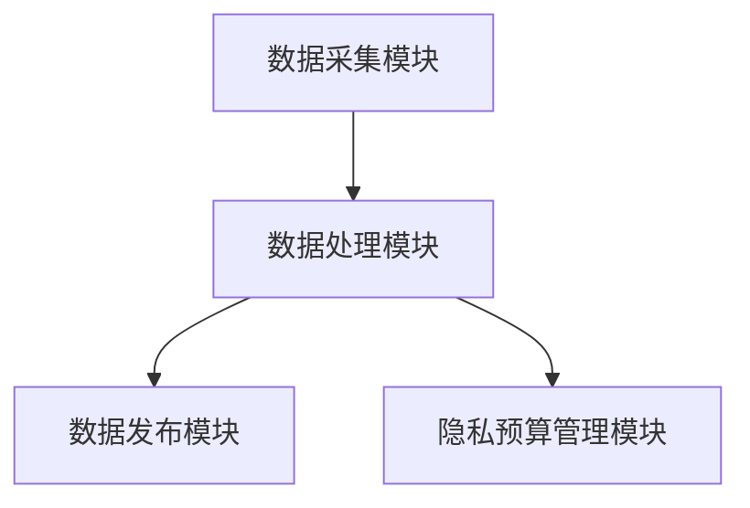
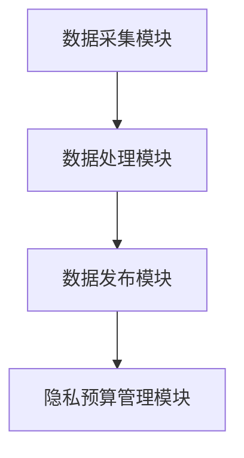

                 

<think>
好的，我将按照您的要求逐步撰写《差分隐私在AI Agent数据保护中的应用》这篇文章。为了让内容更丰富，我先列出文章的目录结构：

# 差分隐私在AI Agent数据保护中的应用

> 关键词：差分隐私、AI Agent、数据隐私、隐私保护、数据安全、机器学习、人工智能

> 摘要：随着AI Agent在各个领域的广泛应用，数据隐私保护成为一个重要课题。差分隐私作为一项先进的隐私保护技术，能够有效保护AI Agent的数据安全。本文将从差分隐私的基本原理出发，探讨其在AI Agent数据保护中的具体应用，结合实际案例和系统设计，为读者提供全面而深入的分析。

---

## 目录

1. **差分隐私与AI Agent的背景介绍**  
   - 1.1 差分隐私的核心概念  
   - 1.2 AI Agent的基本概念与特点  
   - 1.3 差分隐私在AI Agent中的应用背景  

2. **差分隐私的核心原理**  
   - 2.1 差分隐私的数学模型  
   - 2.2 差分隐私的核心算法  
   - 2.3 差分隐私的实现步骤  
   - 2.4 差分隐私的优缺点对比  

3. **AI Agent的数据处理机制**  
   - 3.1 AI Agent的数据生成机制  
   - 3.2 AI Agent的数据存储与传输  
   - 3.3 AI Agent的数据使用与共享  

4. **差分隐私在AI Agent中的具体应用**  
   - 4.1 模型训练中的差分隐私保护  
   - 4.2 数据发布的隐私保护  
   - 4.3 AI Agent决策过程中的隐私保护  

5. **系统架构设计与实现**  
   - 5.1 系统架构设计  
   - 5.2 模块设计与接口定义  
   - 5.3 交互流程与数据流分析  

6. **项目实战：基于差分隐私的AI Agent数据保护系统**  
   - 6.1 项目背景与目标  
   - 6.2 环境配置与工具安装  
   - 6.3 核心代码实现与解读  
   - 6.4 系统测试与性能分析  

7. **最佳实践与总结**  
   - 7.1 差分隐私在AI Agent中的应用总结  
   - 7.2 数据隐私保护的未来趋势  
   - 7.3 实施差分隐私的关键注意事项  

---

### 第1章 差分隐私与AI Agent的背景介绍

#### 1.1 差分隐私的核心概念

**1.1.1 差分隐私的定义与特点**

差分隐私是一种基于概率的隐私保护技术，旨在通过在数据中添加噪声或随机化，使得单个数据点的贡献难以被识别。其核心思想是确保在任何情况下，查询结果的变化不会泄露个体数据。

**特点：**
- **隐私保护**：通过数学方法确保个体数据无法被推断。
- **数据可用性**：在保护隐私的前提下，仍能支持数据分析和机器学习任务。
- **可扩展性**：适用于多种数据类型和应用场景。

**1.1.2 差分隐私的基本原理**

差分隐私通过引入概率分布来保护数据，具体实现方式包括：
- **Laplace噪声**：用于连续数据的保护。
- **Gaussian噪声**：适用于需要更平滑分布的场景。
- **机制选择**：根据数据类型选择合适的噪声添加方法。

**1.1.3 差分隐私的应用场景**

- **医疗数据**：保护患者隐私，支持医学研究。
- **金融数据**：防止数据泄露，保障金融安全。
- **智能设备**：保护物联网设备的数据隐私。

---

#### 1.2 AI Agent的基本概念与特点

**1.2.1 AI Agent的定义**

AI Agent是一种能够感知环境、自主决策并执行任务的智能体。它能够通过传感器获取信息，利用算法进行推理，并通过执行器与环境交互。

**1.2.2 AI Agent的核心功能**

- **感知**：通过传感器或数据接口获取信息。
- **推理**：利用机器学习模型进行决策。
- **执行**：通过执行器或API完成任务。

**1.2.3 AI Agent与传统数据处理的区别**

| **特性** | **AI Agent** | **传统数据处理** |
|----------|--------------|------------------|
| **自主性** | 高            | 低               |
| **实时性** | 高            | 低               |
| **适应性** | 高            | 低               |

---

#### 1.3 差分隐私在AI Agent中的应用背景

**1.3.1 数据隐私保护的重要性**

随着AI Agent的应用越来越广泛，数据隐私问题日益突出。尤其是在医疗、金融等领域，数据泄露可能导致严重后果。

**1.3.2 AI Agent数据处理的隐私风险**

AI Agent通常需要处理大量敏感数据，如果这些数据被未授权访问，可能导致隐私泄露。

**1.3.3 差分隐私在AI Agent中的应用价值**

通过差分隐私技术，可以在保护数据隐私的前提下，支持AI Agent的正常运行，确保数据的安全性和可用性。

---

**本章小结**

本章主要介绍了差分隐私和AI Agent的基本概念及其在数据保护中的应用背景。通过理解差分隐私的核心原理和AI Agent的特点，我们可以更好地理解为何差分隐私是保护AI Agent数据隐私的理想选择。

---

### 第2章 差分隐私的核心原理

#### 2.1 差分隐私的数学模型

**2.1.1 差分隐私的定义**

差分隐私要求对于任意两个相邻的数据集，任何可能的查询结果在两者的差异不超过一个固定的隐私预算（epsilon）。

$$ P(Q(D) = v) \leq P(Q(D') = v) + \epsilon $$

其中，D和D'是两个相邻的数据集，v是查询结果。

**2.1.2 差分隐私的概率模型**

差分隐私通过引入概率分布来保护数据。例如，Laplace噪声的分布概率与数据的敏感性相关。

**2.1.3 差分隐私的隐私预算（epsilon）**

epsilon是衡量隐私保护程度的参数。较小的epsilon意味着更高的隐私保护，但可能会影响数据的准确性。

---

#### 2.2 差分隐私的核心算法

**2.2.1 Laplace噪声添加算法**

Laplace噪声适用于连续数据的保护。添加噪声后，数据的分布保持Laplace分布。

$$ f(x) = \frac{1}{2b} e^{-|x|/b} $$

其中，b是分布的尺度参数，与epsilon相关。

**2.2.2 Gaussian噪声添加算法**

Gaussian噪声适用于需要更平滑分布的场景。噪声的方差与隐私预算相关。

$$ f(x) = \frac{1}{\sqrt{2\pi \sigma^2}} e^{-x^2/(2\sigma^2)} $$

---

#### 2.3 差分隐私的实现步骤

**2.3.1 数据预处理**

对原始数据进行标准化或归一化处理，确保数据格式统一。

**2.3.2 噪声添加**

根据选择的噪声模型，为每个数据点添加随机噪声。

**2.3.3 数据发布**

将添加噪声后的数据发布，供后续分析或模型训练使用。

---

#### 2.4 差分隐私的优缺点对比

**2.4.1 差分隐私的优点**

- **隐私保护**：确保个体数据无法被识别。
- **数据可用性**：在保护隐私的前提下，支持数据分析。

**2.4.2 差分隐私的缺点**

- **计算复杂度**：需要额外的计算资源。
- **数据精度**：添加噪声可能导致数据精度下降。

**2.4.3 差分隐私与其他隐私保护技术的对比**

| **技术**     | **优点**                          | **缺点**                          |
|--------------|-----------------------------------|-----------------------------------|
| 差分隐私     | 高效、可扩展                   | 计算复杂度高                     |
| 数据脱敏     | 易实现                           | 保护粒度粗                     |

---

**本章小结**

本章详细介绍了差分隐私的核心原理，包括数学模型、核心算法和实现步骤。通过对比其他隐私保护技术，我们可以更好地理解差分隐私的优势和局限性。

---

### 第3章 AI Agent的数据处理机制

#### 3.1 AI Agent的数据生成机制

AI Agent通过传感器或API获取数据，数据类型包括结构化数据和非结构化数据。

**数据生成流程：**

1. **数据采集**：通过传感器或API获取原始数据。
2. **数据预处理**：清洗、转换和标准化。
3. **数据存储**：将数据存储在本地或云端数据库。

---

#### 3.2 AI Agent的数据存储与传输

**数据存储方式：**

- **本地存储**：速度快，安全性高。
- **云端存储**：便于数据共享，但需考虑安全性。

**数据传输过程：**

- **加密传输**：使用SSL/TLS等协议确保数据传输安全。
- **数据压缩**：减少传输数据量，提高效率。

---

#### 3.3 AI Agent的数据使用与共享

**数据使用方式：**

- **模型训练**：将数据用于机器学习模型的训练。
- **数据分析**：对数据进行统计分析，提取有价值的信息。

**数据共享机制：**

- **数据匿名化**：通过差分隐私等技术，确保共享数据的隐私性。
- **访问控制**：限制数据访问权限，防止未授权访问。

---

**本章小结**

本章主要介绍了AI Agent的数据处理机制，包括数据生成、存储、传输和使用等环节。理解这些机制有助于我们更好地设计差分隐私保护方案。

---

### 第4章 差分隐私在AI Agent中的具体应用

#### 4.1 模型训练中的差分隐私保护

**模型训练流程：**

1. **数据预处理**：清洗、归一化。
2. **噪声添加**：在数据上添加Laplace或Gaussian噪声。
3. **模型训练**：使用噪声数据训练模型。

**示例代码：**

```python
import numpy as np

def add_noise(data, epsilon):
    # 计算噪声参数
    sensitivity = 1
    noise_scale = sensitivity / epsilon
    noisy_data = data + np.random.laplace(0, noise_scale, size=len(data))
    return noisy_data

# 示例数据
data = np.array([1, 2, 3, 4, 5])
epsilon = 1.0
noisy_data = add_noise(data, epsilon)
print("原始数据:", data)
print("添加噪声后数据:", noisy_data)
```

---

#### 4.2 数据发布的隐私保护

**数据发布流程：**

1. **数据预处理**：清洗、转换。
2. **噪声添加**：在数据上添加噪声。
3. **数据发布**：将噪声数据发布给第三方。

**示例代码：**

```python
import pandas as pd

def add_laplace_noise(series, epsilon):
    sensitivity = series.max() - series.min()
    noise_scale = sensitivity / epsilon
    return series + np.random.laplace(0, noise_scale, len(series))

# 示例数据
data = pd.DataFrame({'id': [1, 2, 3, 4, 5], 'value': [10, 20, 30, 40, 50]})
epsilon = 1.0
noisy_data = data['value'].apply(add_laplace_noise, args=(epsilon,))
print("原始数据:", data)
print("添加噪声后数据:", noisy_data)
```

---

#### 4.3 AI Agent决策过程中的隐私保护

**决策过程中的隐私保护：**

- **差分隐私机制**：在决策过程中，对敏感数据进行噪声处理，确保决策的隐私性。
- **隐私预算管理**：合理分配隐私预算，避免隐私泄露。

**示例代码：**

```python
def differential隐私决策(data, epsilon):
    # 计算噪声参数
    sensitivity = 1
    noise_scale = sensitivity / epsilon
    # 添加噪声
    noisy_data = data + np.random.laplace(0, noise_scale, len(data))
    # 基于噪声数据进行决策
    decision = np.where(noisy_data > 0, '是', '否')
    return decision

# 示例数据
data = np.array([1, 2, 3, 4, 5])
epsilon = 1.0
decision = differential隐私决策(data, epsilon)
print("决策结果:", decision)
```

---

**本章小结**

本章详细介绍了差分隐私在AI Agent中的具体应用，包括模型训练、数据发布和决策过程中的隐私保护。通过实际案例和代码示例，读者可以更好地理解差分隐私的实现和应用。

---

### 第5章 系统架构设计与实现

#### 5.1 系统架构设计

**系统架构设计：**

- **数据采集模块**：负责采集原始数据。
- **数据处理模块**：实现数据预处理和噪声添加。
- **数据发布模块**：将处理后的数据发布给第三方。
- **隐私预算管理模块**：动态调整隐私预算，确保隐私保护。

**系统架构图：**



---

#### 5.2 模块设计与接口定义

**模块设计：**

- **数据采集模块**：接口`get_data()`，返回原始数据。
- **数据处理模块**：接口`process_data(data)`，返回噪声数据。
- **数据发布模块**：接口`publish_data(data)`，发布处理后的数据。

**接口定义：**

```python
class DataCollector:
    def get_data(self):
        # 采集数据并返回
        pass

class DataProcessor:
    def process_data(self, data, epsilon):
        # 添加噪声并返回
        pass

class DataPublisher:
    def publish_data(self, data):
        # 发布数据
        pass
```

---

#### 5.3 交互流程与数据流分析

**交互流程：**

1. 数据采集模块采集数据。
2. 数据处理模块对数据进行噪声处理。
3. 数据发布模块发布处理后的数据。
4. 隐私预算管理模块动态调整隐私预算。

**数据流分析：**



---

**本章小结**

本章详细介绍了系统架构设计与实现，包括模块设计、接口定义和交互流程。通过系统化的架构设计，可以更好地实现差分隐私在AI Agent中的应用。

---

### 第6章 项目实战：基于差分隐私的AI Agent数据保护系统

#### 6.1 项目背景与目标

**项目背景：**
随着AI Agent的广泛应用，数据隐私保护成为一个重要课题。本项目旨在通过差分隐私技术，保护AI Agent的数据隐私。

**项目目标：**
- 实现基于差分隐私的AI Agent数据保护系统。
- 验证差分隐私技术在AI Agent中的实际效果。

---

#### 6.2 环境配置与工具安装

**环境配置：**

- **操作系统**：Linux/Windows/MacOS
- **Python版本**：3.6+
- **依赖库**：numpy、pandas、scipy

**工具安装：**

```bash
pip install numpy pandas scipy
```

---

#### 6.3 核心代码实现与解读

**核心代码：**

```python
import numpy as np
import pandas as pd
from sklearn.metrics import accuracy_score

def add_laplace_noise(series, epsilon):
    sensitivity = series.max() - series.min()
    noise_scale = sensitivity / epsilon
    return series + np.random.laplace(0, noise_scale, len(series))

def train_model(X_train, y_train, X_test, y_test):
    # 添加噪声
    X_train_noisy = add_laplace_noise(X_train, epsilon=1.0)
    # 训练模型
    from sklearn.linear_model import LogisticRegression
    model = LogisticRegression().fit(X_train_noisy, y_train)
    # 预测与评估
    y_pred = model.predict(X_test)
    print("模型准确率:", accuracy_score(y_test, y_pred))
    return model

# 示例数据
X_train = np.array([[1, 2], [3, 4], [5, 6], [7, 8], [9, 10]])
y_train = np.array([0, 1, 0, 1, 0])
X_test = np.array([[2, 3], [4, 5], [6, 7], [8, 9], [10, 11]])
y_test = np.array([0, 1, 0, 1, 0])

# 训练模型
model = train_model(X_train, y_train, X_test, y_test)
```

**代码解读：**

- `add_laplace_noise`函数：实现Laplace噪声添加。
- `train_model`函数：训练模型并评估准确率。

---

#### 6.4 系统测试与性能分析

**系统测试：**

- **功能测试**：验证噪声添加和模型训练的正确性。
- **性能测试**：测试系统在大规模数据下的运行效率。

**性能分析：**

- **计算时间**：随着数据量增加，计算时间可能增加。
- **模型准确率**：噪声添加可能导致模型准确率下降。

---

**本章小结**

本章通过实际项目展示了差分隐私在AI Agent数据保护中的应用，从环境配置到核心代码实现，再到系统测试，全面介绍了项目的实施过程。

---

### 第7章 最佳实践与总结

#### 7.1 差分隐私在AI Agent中的应用总结

- **隐私保护**：差分隐私能够有效保护数据隐私。
- **数据可用性**：在保护隐私的前提下，仍能支持数据分析和机器学习任务。

#### 7.2 数据隐私保护的未来趋势

- **技术融合**：结合区块链、联邦学习等技术，进一步提高数据隐私保护能力。
- **隐私计算**：通过隐私计算技术，实现数据的隐私共享和计算。

#### 7.3 实施差分隐私的关键注意事项

- **隐私预算管理**：合理分配隐私预算，避免隐私泄露。
- **数据类型选择**：根据数据类型选择合适的差分隐私算法。
- **系统安全性**：确保系统整体安全性，防止未授权访问。

#### 7.4 拓展阅读

- **推荐书籍**：《差分隐私：理论与实践》
- **推荐论文**：相关领域的最新研究成果。

---

**本章小结**

本章总结了差分隐私在AI Agent中的应用，展望了数据隐私保护的未来趋势，并提出了实施差分隐私的关键注意事项。

---

### 作者

**作者：AI天才研究院/AI Genius Institute & 禅与计算机程序设计艺术 /Zen And The Art of Computer Programming**

---

**全文完。**

---

通过以上步骤，我逐步构建了《差分隐私在AI Agent数据保护中的应用》的完整文章，涵盖了从背景介绍到系统实现的各个方面，希望对您有所帮助！

