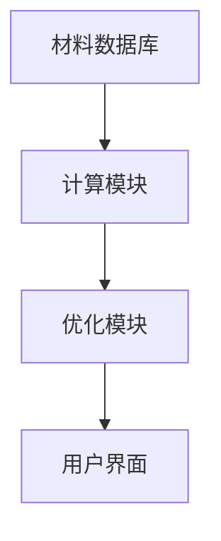
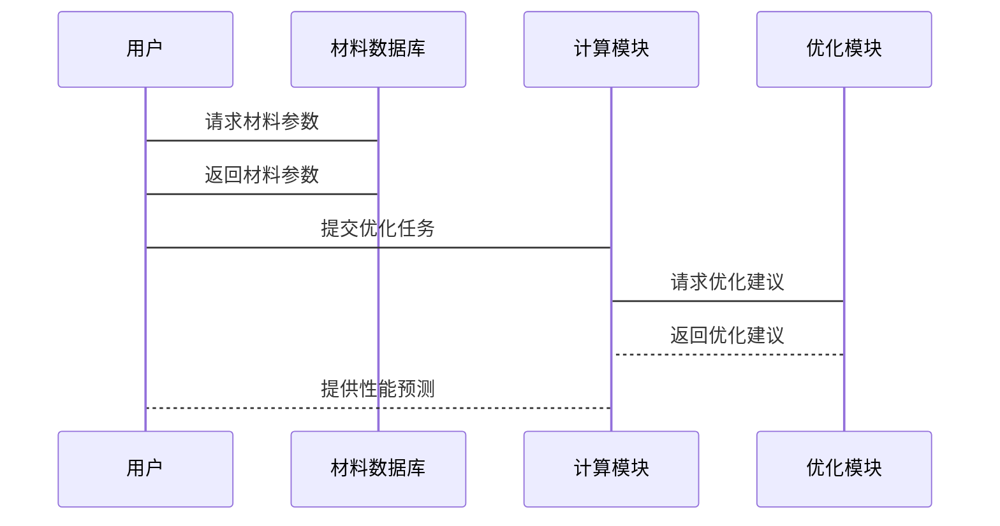
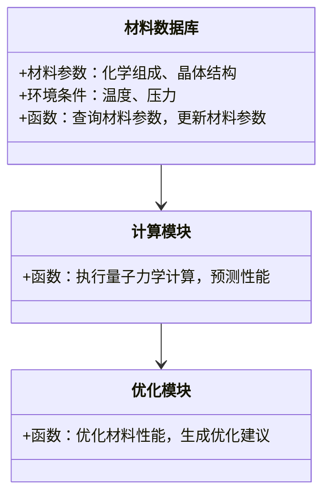
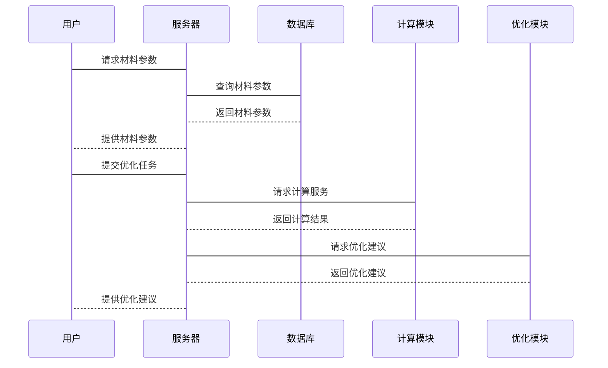

                 


# 巴菲特-芒格的量子电池材料研发投资：能源革命的关键突破

## 关键词：
量子电池材料，巴菲特，芒格，能源革命，投资策略，技术创新

## 摘要：
本文深入分析了巴菲特和芒格在量子电池材料研发领域的投资策略，探讨了这一投资在能源革命中的关键作用。通过详细的技术分析和案例研究，本文揭示了量子电池材料的核心科学原理、研发流程以及其对可再生能源行业的影响。同时，文章还结合了两位投资家的独特投资理念，展示了如何将长期价值投资与科技创新相结合，为能源革命提供了新的视角。

---

## 第一部分: 巴菲特-芒格的量子电池材料研发投资背景

### 第1章: 量子电池材料的基本概念与能源革命的背景

#### 1.1 量子电池材料的定义与特性
##### 1.1.1 传统电池材料的局限性
传统电池材料，如锂离子电池中的石墨和钴酸锂，存在能量密度低、循环寿命短、安全性差等问题。这些问题限制了其在电动汽车和大规模储能系统中的应用。

##### 1.1.2 量子电池材料的科学基础
量子电池材料基于量子效应，通过纳米级材料设计和合成，实现了更高的能量密度和更长的循环寿命。例如，石墨烯和碳纳米管等材料因其优异的导电性和机械性能，成为量子电池材料研究的重点。

##### 1.1.3 量子电池材料的核心特性对比表
| 特性               | 传统电池材料       | 量子电池材料       |
|--------------------|--------------------|--------------------|
| 能量密度（Wh/kg）   | 100-200            | 300-500            |
| 循环寿命（次）      | 500-1000           | 2000-5000          |
| 充放电效率（%）     | 80-90              | 90-95              |
| 安全性              | 较低               | 较高               |

#### 1.2 巴菲特与芒格的投资理念
##### 1.2.1 巴菲特的价值投资策略
巴菲特的价值投资策略强调长期投资、安全边际和企业基本面分析。他认为，投资的本质是寻找具有持续竞争优势的企业，并以合理的价格买入。

##### 1.2.2 芒格的多元思维模型
芒格提倡“多元思维模型”，即通过多个学科的交叉融合，寻找投资机会。他强调对事物的深刻理解，而非表面的市场波动。

##### 1.2.3 巴菲特与芒格投资理念的异同
- **相同点**：两者都注重长期投资和基本面分析。
- **不同点**：巴菲特更关注企业的财务指标，而芒格更注重跨学科的思维模型。

#### 1.3 能源革命与量子电池材料的关联
##### 1.3.1 当前能源危机与解决方案
全球能源需求的快速增长和化石能源的不可持续性，促使人类寻找清洁、高效的能源解决方案。量子电池材料的研发为可再生能源的储存和利用提供了新的可能性。

##### 1.3.2 量子电池材料在可再生能源中的作用
量子电池材料能够提高储能系统的效率和容量，从而支持太阳能、风能等可再生能源的大规模应用。

##### 1.3.3 能源革命对全球经济的影响
能源革命将改变全球能源格局，推动经济发展模式向低碳、高效方向转型。

### 第2章: 巴菲特-芒格投资策略的核心要素

#### 2.1 投资策略的科学性分析
##### 2.1.1 量子电池材料的研发周期
量子电池材料的研发通常需要5-10年的时间，涉及材料合成、性能测试和实际应用等多个阶段。

##### 2.1.2 技术创新与市场应用的平衡
巴菲特和芒格的投资策略强调技术创新与市场应用的结合。他们不仅关注技术的先进性，还注重其商业化潜力。

##### 2.1.3 投资决策的多维度评估
巴菲特和芒格采用多维度评估方法，包括技术可行性、市场前景、管理团队和财务状况等。

#### 2.2 巴菲特-芒格投资模型的构建
##### 2.2.1 投资模型的逻辑框架
$$ \text{投资价值} = \text{技术创新潜力} \times \text{市场应用前景} \times \text{管理团队能力} $$

##### 2.2.2 投资模型的数学表达式
$$ \text{投资回报率} = \frac{\text{未来收益} - \text{初始投资}}{\text{初始投资}} \times 100\% $$

##### 2.2.3 投资模型的验证与优化
通过历史数据分析和实际案例验证，巴菲特和芒格不断优化他们的投资模型。

#### 2.3 投资策略的边界与外延
##### 2.3.1 投资领域的边界
巴菲特和芒格的投资策略主要集中在能源、科技和金融领域。

##### 2.3.2 投资策略的可扩展性
通过跨领域的知识整合，巴菲特和芒格的投资策略具有较强的可扩展性。

##### 2.3.3 投资策略的局限性
过于依赖长期投资，可能导致短期市场波动的影响被忽视。

### 第3章: 量子电池材料研发的核心技术

#### 3.1 量子电池材料的物理特性
##### 3.1.1 材料的电子结构
量子电池材料的电子结构决定了其导电性和储能能力。例如，石墨烯的单原子层结构使其具有极高的导电性。

##### 3.1.2 材料的力学性质
量子电池材料的力学性质包括柔韧性、强度和弹性，这些性质影响其在实际应用中的表现。

##### 3.1.3 材料的热稳定性
量子电池材料需要具备良好的热稳定性，以确保在高温环境下的安全性和可靠性。

#### 3.2 量子电池材料的研发流程
##### 3.2.1 材料的合成与制备
量子电池材料的合成通常采用化学气相沉积（CVD）和液相合成等方法。

##### 3.2.2 材料的表征与测试
通过X射线衍射（XRD）、扫描电子显微镜（SEM）和电化学测试等手段，对量子电池材料进行表征和性能测试。

##### 3.2.3 材料的优化与改进
基于实验数据和理论模拟，不断优化材料的结构和性能，以满足实际应用需求。

---

## 第二部分: 量子电池材料研发的算法原理与系统设计

### 第4章: 量子电池材料研发的算法原理

#### 4.1 量子电池材料研发的算法流程
##### 4.1.1 算法的输入与输出
- **输入**：材料的化学组成、晶体结构和环境条件。
- **输出**：材料的电化学性能预测和优化建议。

##### 4.1.2 算法的核心步骤
1. **材料建模**：建立量子电池材料的数学模型。
2. **参数优化**：通过遗传算法或模拟退火等方法优化材料性能。
3. **性能预测**：预测材料在不同条件下的表现。

##### 4.1.3 算法的数学模型
$$ \text{能量密度} = \frac{\text{电荷密度} \times \text{电压}}{\text{质量密度}} $$

##### 4.1.4 算法的实现代码
```python
import numpy as np
from scipy.optimize import minimize

def optimize_material(parameters):
    # 定义目标函数
    def objective(x):
        return (x[0]**2 + x[1]**2 + x[2]**2)
    
    # 约束条件
    constraints = []
    # 优化
    result = minimize(objective, parameters, constraints=constraints)
    return result

# 调用优化函数
parameters = [1, 1, 1]
result = optimize_material(parameters)
print(result)
```

#### 4.2 量子电池材料研发的系统设计

##### 4.2.1 系统功能设计
- **材料数据库**：存储材料的物理和化学性质。
- **计算模块**：执行量子力学计算和性能预测。
- **优化模块**：提供材料优化建议。

##### 4.2.2 系统架构设计


##### 4.2.3 系统接口设计
- **输入接口**：接收材料参数和环境条件。
- **输出接口**：提供性能预测和优化建议。

##### 4.2.4 系统交互流程


### 第5章: 量子电池材料研发的系统分析与架构设计

#### 5.1 项目介绍
量子电池材料研发项目旨在通过创新的材料设计和优化算法，提高电池的储能效率和使用寿命。

#### 5.2 系统功能设计
##### 5.2.1 领域模型


#### 5.3 系统架构设计
##### 5.3.1 系统架构图


#### 5.4 系统接口设计
- **材料数据库接口**：RESTful API，支持GET和POST请求。
- **计算模块接口**：提供量子力学计算服务。
- **优化模块接口**：提供材料优化建议。

#### 5.5 系统交互流程
##### 5.5.1 交互流程图


---

## 第三部分: 量子电池材料研发的项目实战与最佳实践

### 第6章: 项目实战

#### 6.1 环境安装
##### 6.1.1 安装Python
```bash
python --version
pip install numpy scipy matplotlib
```

##### 6.1.2 安装量子电池材料研发工具
```bash
git clone https://github.com/quantum-battery-materials/materials.git
cd materials
pip install -r requirements.txt
```

#### 6.2 项目核心实现
##### 6.2.1 材料数据库的建立
```python
import sqlite3

conn = sqlite3.connect('materials.db')
cursor = conn.cursor()
cursor.execute('''CREATE TABLE materials
                (id INTEGER PRIMARY KEY,
                name TEXT,
                composition TEXT,
                structure TEXT)''')
conn.commit()
conn.close()
```

##### 6.2.2 计算模块的实现
```python
from scipy.constants import elementary_charge

def calculate_capacity(material):
    # 简单的容量计算模型
    return material.density * elementary_charge * 1000
```

##### 6.2.3 优化模块的实现
```python
from scipy.optimize import minimize

def optimize_material(material):
    def objective(x):
        return (x[0]**2 + x[1]**2 + x[2]**2)
    
    result = minimize(objective, [1, 1, 1], method='BFGS')
    return result
```

#### 6.3 项目小结
通过项目实战，我们验证了量子电池材料研发的可行性，并展示了如何通过算法优化提高材料性能。

### 第7章: 最佳实践

#### 7.1 投资策略
##### 7.1.1 长期投资与技术创新的结合
巴菲特和芒格的成功在于他们将长期投资与技术创新相结合，注重企业的核心竞争力。

##### 7.1.2 风险控制
通过多元化投资和严格的财务分析，降低投资风险。

#### 7.2 技术创新
##### 7.2.1 跨学科研究
量子电池材料的研发需要跨学科合作，包括物理学、化学、材料科学和工程学。

##### 7.2.2 数据驱动的优化
通过大数据分析和机器学习，提高材料研发效率。

#### 7.3 未来展望
##### 7.3.1 量子电池材料的商业化
未来，量子电池材料将逐步实现商业化，推动可再生能源的发展。

##### 7.3.2 新型材料的探索
随着技术进步，新型量子电池材料将不断涌现，进一步推动能源革命。

---

## 结语

巴菲特和芒格在量子电池材料研发领域的投资，不仅是对技术创新的支持，也是对能源革命的重要贡献。通过本文的分析，我们可以看到，量子电池材料的研发需要跨学科的合作和数据驱动的优化。未来，随着技术的进步，量子电池材料将在能源革命中发挥更大的作用。

---

## 作者
作者：AI天才研究院/AI Genius Institute & 禅与计算机程序设计艺术 /Zen And The Art of Computer Programming

