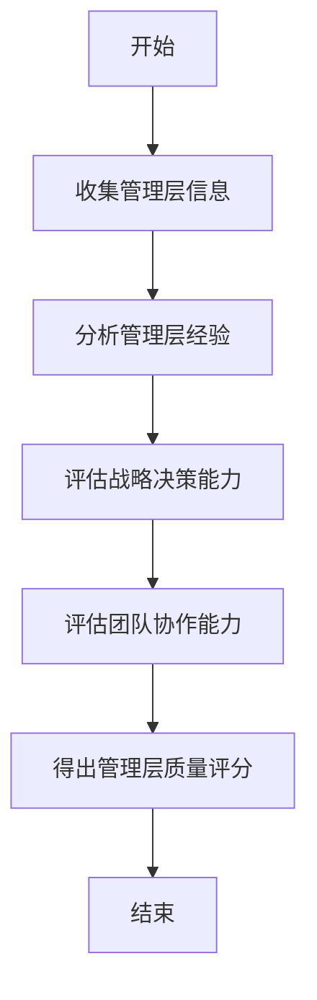
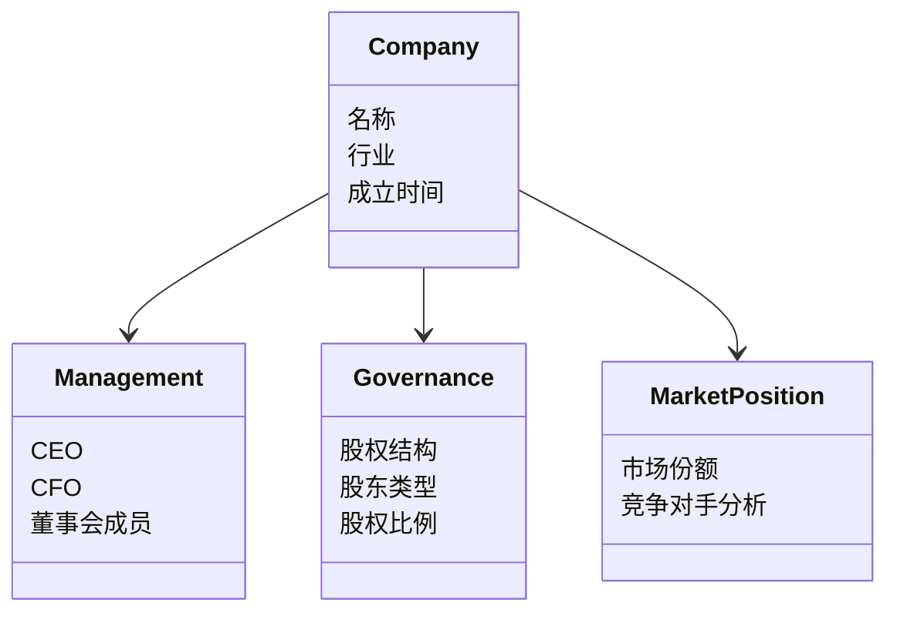
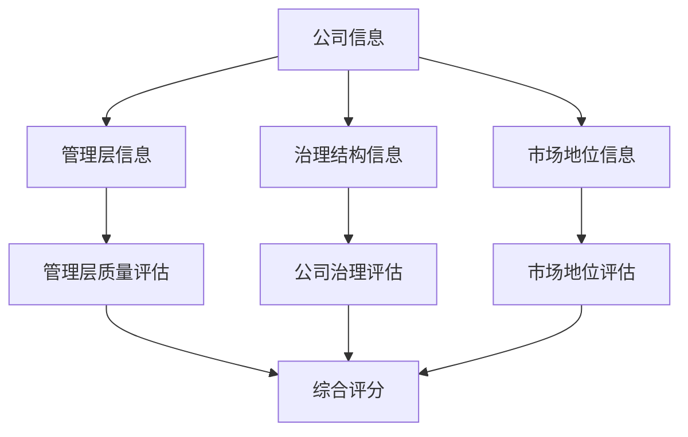
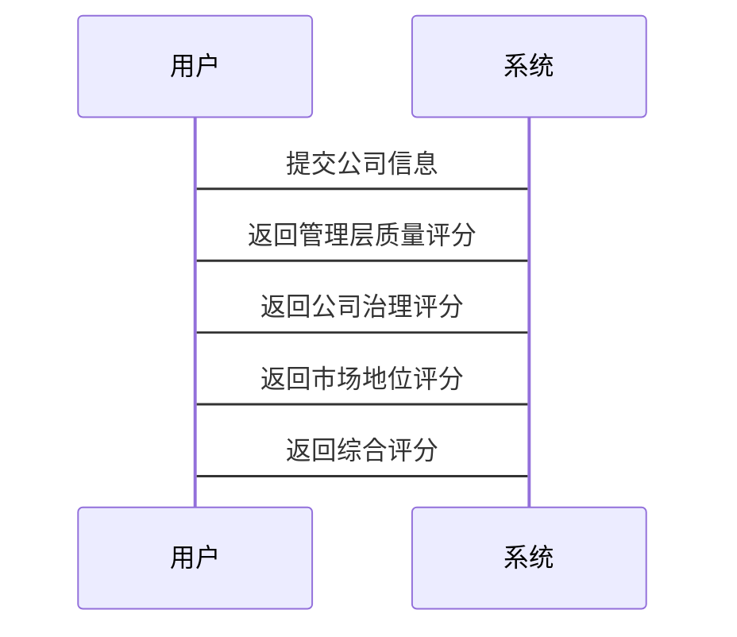

                 


# 彼得林奇对公司非财务报告质量的评估方法

> 关键词：彼得·林奇，非财务报告，公司质量评估，管理层质量，公司治理，市场地位

> 摘要：本文深入探讨了投资大师彼得·林奇在其投资实践中对公司非财务报告质量的评估方法。通过分析非财务报告的核心概念、评估方法、系统架构设计以及实际案例，本文详细解读了林奇如何通过非财务信息来评估公司质量，从而做出明智的投资决策。

---

## 第一部分: 彼得·林奇对公司非财务报告质量评估方法概述

### 第1章: 公司非财务报告质量评估的背景与意义

#### 1.1 非财务报告的核心概念

##### 1.1.1 非财务报告的定义与范围
非财务报告是指公司通过非财务数据向投资者、债权人和其他利益相关者传递的重要信息。这些信息通常包括公司战略、管理层质量、公司治理、市场地位、研发能力、员工管理、客户关系等方面的内容。

##### 1.1.2 非财务报告与财务报告的区别
- **数据来源**：财务报告主要依赖会计数据，而非财务报告则涉及更多的定性数据。
- **内容侧重点**：财务报告关注企业的财务状况、经营成果和现金流量，而非财务报告关注企业的管理能力、市场竞争力和未来增长潜力。
- **分析方法**：财务报告通常采用定量分析，而非财务报告更多依赖于定性分析和综合判断。

##### 1.1.3 非财务报告在投资决策中的作用
在投资决策中，非财务报告能够帮助投资者更好地理解公司的管理质量、战略规划和市场竞争力，从而弥补财务数据的局限性。特别是在评估新兴行业或成长型企业时，非财务报告往往更具参考价值。

#### 1.2 彼得·林奇的评估方法简介

##### 1.2.1 彼得·林奇的投资者背景
彼得·林奇是美国著名投资家，曾管理富达麦哲伦基金，创造了卓越的投资业绩。他强调通过深入研究公司基本面，特别是非财务信息，来评估公司的投资价值。

##### 1.2.2 林奇对公司非财务报告的重视
林奇认为，财务数据只能反映公司过去的经营状况，而非财务信息则能揭示公司的未来潜力。他特别关注管理层的质量、公司治理结构和市场地位等因素。

##### 1.2.3 林奇方法的核心理念
- **管理层质量**：管理层的能力和决策直接影响公司的未来发展。
- **公司治理**：良好的治理结构能够保障公司长期健康发展。
- **市场地位**：公司在市场中的地位决定了其竞争优势和增长潜力。

### 第2章: 非财务报告质量评估的核心概念与联系

#### 2.1 核心概念原理

##### 2.1.1 管理层质量评估
管理层质量是公司非财务报告评估的重要组成部分。林奇认为，一个优秀的管理层应具备以下特点：
- **行业经验**：管理层成员在行业内的丰富经验。
- **战略决策能力**：能够制定并执行有效的战略规划。
- **团队协作能力**：管理层内部能够高效协作。

##### 2.1.2 公司治理结构分析
公司治理结构直接影响公司的运营效率和风险控制。林奇特别关注以下方面：
- **股权结构**：控股股东的持股比例和股东类型。
- **董事会构成**：董事会成员的背景和职责分工。
- **透明度**：公司信息披露的及时性和完整性。

##### 2.1.3 市场地位与竞争优势
市场地位是衡量公司竞争力的重要指标。林奇关注以下几点：
- **市场份额**：公司在市场中的占有率。
- **竞争对手分析**：主要竞争对手的优劣势分析。
- **品牌影响力**：公司品牌的市场认知度和忠诚度。

##### 2.1.4 企业战略与未来发展
企业战略决定了公司未来的增长方向。林奇强调：
- **战略目标**：公司未来3-5年的主要发展目标。
- **实施计划**：为实现目标制定的具体行动计划。
- **资源分配**：公司如何分配资源以支持战略实施。

#### 2.2 核心概念属性对比表
以下表格对比了非财务报告评估中的核心概念及其属性：

| 概念               | 属性               | 描述                                   |
|--------------------|--------------------|----------------------------------------|
| 管理层质量         | 经验与能力         | 管理层的行业经验与专业能力               |
|                    | 战略决策能力       | 管理层制定和执行战略的能力               |
| 公司治理结构       | 股权结构           | 股东的股权分布情况                     |
|                    | 董事会构成         | 董事会成员的背景与职责                   |
| 市场地位           | 市场份额           | 公司在市场中的占有率                     |
|                    | 竞争对手分析       | 主要竞争对手的优劣势分析                 |
| 企业战略           | 战略目标           | 公司未来发展的主要方向                   |
|                    | 实施计划           | 达成目标的具体行动计划                   |

#### 2.3 ER实体关系图
以下是公司非财务报告评估的实体关系图：

```mermaid
erd
  Company
    - 名称
    - 行业
    - 成立时间
  Management
    - CEO
    - CFO
    - 董事会成员
  Governance
    - 股权结构
    - 股东类型
    - 股权比例
  MarketPosition
    - 市场份额
    - 主要竞争对手
```

---

## 第二部分: 非财务报告质量评估方法与工具

### 第3章: 非财务报告质量评估的算法原理

#### 3.1 算法概述
非财务报告质量评估主要依赖于定性分析和综合判断。以下是林奇常用的几种评估方法：

##### 3.1.1 基于管理层质量的评估模型
该模型通过分析管理层的背景、经验和决策能力，评估公司管理团队的质量。

##### 3.1.2 基于公司治理的评估模型
该模型通过分析公司的股权结构、董事会构成和透明度，评估公司的治理能力。

##### 3.1.3 基于市场地位的评估模型
该模型通过分析公司的市场份额和竞争对手情况，评估公司的市场竞争力。

#### 3.2 算法流程图
以下是基于管理层质量的评估流程图：



#### 3.3 数学模型与公式
以下是基于市场地位的评估模型：

$$
\text{市场地位评分} = \frac{(\text{市场份额} \times 0.4) + (\text{竞争对手分析} \times 0.6)}{1}
$$

---

## 第三部分: 非财务报告质量评估的系统分析与架构设计

### 第4章: 系统分析与架构设计方案

#### 4.1 问题场景介绍
本文将从系统架构设计的角度，分析如何通过非财务报告数据评估公司质量。

#### 4.2 系统功能设计

##### 4.2.1 领域模型
以下是领域模型的类图：



#### 4.3 系统架构设计

##### 4.3.1 系统架构图
以下是系统架构图：



#### 4.4 系统交互设计

##### 4.4.1 序列图
以下是系统交互序列图：



---

## 第四部分: 项目实战

### 第5章: 项目实战与案例分析

#### 5.1 环境安装
- **工具安装**：安装Mermaid和Markdown编辑器。
- **数据准备**：收集公司非财务报告数据。

#### 5.2 核心代码实现

##### 5.2.1 管理层质量评估代码

```python
def calculate_management_score(management_info):
    experience_score = management_info['experience'] * 0.3
    decision_making_score = management_info['decision_making'] * 0.5
    collaboration_score = management_info['collaboration'] * 0.2
    return experience_score + decision_making_score + collaboration_score
```

##### 5.2.2 公司治理评估代码

```python
def calculate_governance_score(governance_info):
    equity_structure_score = governance_info['equity_structure'] * 0.4
    board_constituent_score = governance_info['board_constituent'] * 0.4
    transparency_score = governance_info['transparency'] * 0.2
    return equity_structure_score + board_constituent_score + transparency_score
```

##### 5.2.3 市场地位评估代码

```python
def calculate_market_position_score(market_info):
    market_share_score = market_info['market_share'] * 0.4
    competitor_analysis_score = market_info['competitor_analysis'] * 0.6
    return market_share_score + competitor_analysis_score
```

#### 5.3 案例分析

##### 5.3.1 某公司非财务报告评估案例

```python
company_info = {
    'management': {
        'experience': 0.8,
        'decision_making': 0.7,
        'collaboration': 0.6
    },
    'governance': {
        'equity_structure': 0.7,
        'board_constituent': 0.8,
        'transparency': 0.6
    },
    'market_position': {
        'market_share': 0.6,
        'competitor_analysis': 0.5
    }
}

management_score = calculate_management_score(company_info['management'])
governance_score = calculate_governance_score(company_info['governance'])
market_position_score = calculate_market_position_score(company_info['market_position'])

total_score = (management_score + governance_score + market_position_score) / 3
print(f"管理层质量评分: {management_score:.2f}")
print(f"公司治理评分: {governance_score:.2f}")
print(f"市场地位评分: {market_position_score:.2f}")
print(f"综合评分: {total_score:.2f}")
```

#### 5.4 项目小结
通过上述代码实现，我们可以清晰地看到如何通过非财务报告数据评估公司质量，并为投资决策提供有力支持。

---

## 第五部分: 总结与扩展

### 第6章: 总结与最佳实践

#### 6.1 总结
本文深入分析了彼得·林奇对公司非财务报告质量的评估方法，从核心概念、评估方法到系统架构设计，全面解读了如何通过非财务信息评估公司质量。

#### 6.2 最佳实践 tips
- **数据收集**：确保非财务数据的准确性和完整性。
- **模型优化**：根据具体行业特点调整评估模型。
- **案例分析**：通过实际案例验证模型的有效性。

#### 6.3 拓展阅读
- 彼得·林奇的其他投资方法。
- 非财务报告在其他领域的应用。

---

## 作者信息

作者：AI天才研究院/AI Genius Institute & 禅与计算机程序设计艺术 /Zen And The Art of Computer Programming

---

以上是《彼得林奇对公司非财务报告质量的评估方法》的技术博客文章，涵盖了从核心概念到实际应用的详细内容。

