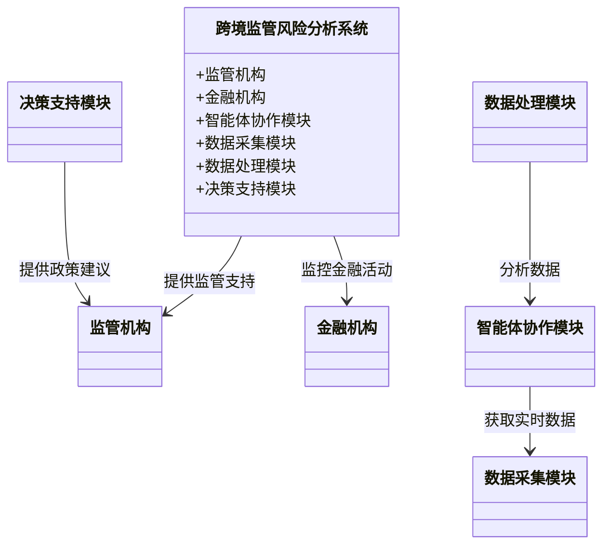
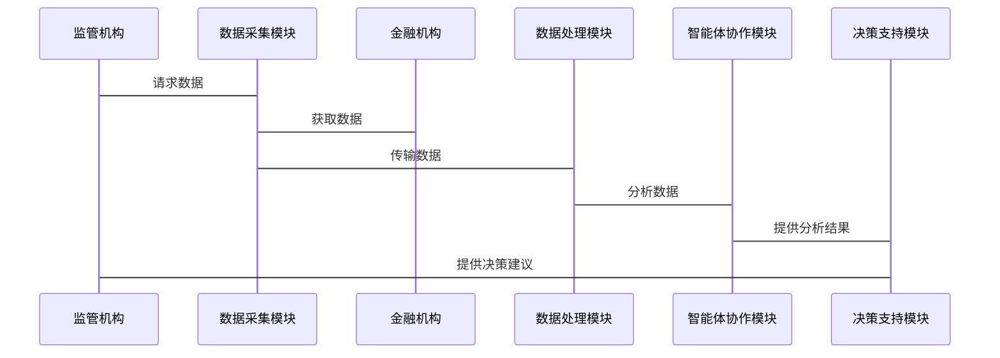

                 

<think>
好的，我需要按照用户的要求来编写一篇关于《智能体协作提升价值投资的跨境监管风险分析》的技术博客文章。用户已经提供了一个详细的目录结构，我需要按照这个结构，逐步完成每一部分的内容。让我先理解一下用户的具体要求。

首先，文章需要包括以下几个部分：

1. **文章标题**：已经给出，是《智能体协作提升价值投资的跨境监管风险分析》。
2. **关键词**：需要列出5-7个核心关键词。我需要选择与主题相关的词汇，比如“智能体协作”、“价值投资”、“跨境监管”、“风险分析”、“监管科技”、“强化学习”、“金融系统”等。
3. **摘要**：需要简要说明文章的核心内容和主题思想，概括整篇文章的主要内容。
4. **正文**：按照用户提供的目录结构，分为五章，每章下有多个小节，每个小节需要详细展开，包括理论、算法、系统设计等内容。
5. **格式要求**：使用Markdown格式，包含公式、流程图、类图等，并使用LaTeX格式公式。
6. **作者信息**：文章末尾需要加上作者信息，即“AI天才研究院”和“禅与计算机程序设计艺术”。
7. **项目实战**：需要包括环境安装、代码实现、案例分析等。

现在，我需要按照这个结构，逐步完成每一部分。

### 第一部分：文章标题和关键词

标题：《智能体协作提升价值投资的跨境监管风险分析》

关键词：智能体协作、价值投资、跨境监管、风险分析、监管科技、强化学习、金融系统

### 第二部分：摘要

摘要：随着全球化的发展，价值投资在跨境监管中的复杂性日益增加。智能体协作作为一种新兴的技术手段，可以通过多智能体系统的协同工作，提升价值投资的效率和准确性。本文从智能体协作的基本概念出发，分析其在价值投资中的应用潜力，结合跨境监管的复杂性，探讨智能体协作在跨境监管风险分析中的具体应用。通过构建智能体协作的数学模型和算法，本文提出了一种基于强化学习的智能体协作算法，用于优化跨境监管风险的评估和管理。同时，文章还设计了一个智能体协作的系统架构，展示了其在实际应用中的可行性。本文的研究为价值投资和跨境监管风险分析提供了新的思路和技术支持。

### 第三部分：正文

#### 第1章：智能体协作与价值投资的背景

##### 1.1 智能体协作的基本概念

###### 1.1.1 智能体的定义与特征

智能体（Agent）是指具有感知环境、做出决策并采取行动的实体。智能体可以是软件程序，也可以是物理设备。智能体具有以下特征：

- **自主性**：智能体能够在没有外部干预的情况下自主运作。
- **反应性**：智能体能够感知环境并做出实时反应。
- **目标导向**：智能体的行为是为了实现特定目标。
- **社交能力**：智能体能够与其他智能体或人类进行交互和协作。

###### 1.1.2 智能体协作的内涵与外延

智能体协作是指多个智能体为了实现共同目标而进行的合作与协调。其内涵包括：

- **协作目标**：协作各方为了实现一个共同的目标。
- **协作机制**：智能体之间通过通信和协调来实现协作。
- **协作效果**：协作的结果优于任何单个智能体单独行动的效果。

智能体协作的外延包括：

- **多智能体系统**：由多个智能体组成的系统，智能体之间可以协作。
- **分布式系统**：智能体分布在不同的地理位置，通过网络进行协作。
- **动态环境**：智能体协作的环境是动态变化的，需要智能体能够适应环境的变化。

###### 1.1.3 智能体协作与价值投资的关系

价值投资是指通过分析企业的基本面，选择具有长期投资价值的股票进行投资。智能体协作在价值投资中的作用包括：

- **信息收集与处理**：智能体可以通过网络爬取、数据挖掘等技术，收集与企业相关的各种信息。
- **数据分析与预测**：智能体可以通过机器学习算法，分析数据，预测企业的未来表现。
- **决策支持**：智能体可以为投资者提供决策支持，帮助投资者做出更明智的投资决策。

##### 1.2 跨境监管风险的基本概念

###### 1.2.1 跨境监管的基本定义

跨境监管是指对跨国金融活动进行监管，以确保金融市场的稳定和安全。跨境监管涉及多个国家的监管机构，监管的内容包括金融产品、金融机构、金融市场等。

###### 1.2.2 跨境监管风险的分类与特征

跨境监管风险可以分为以下几类：

- **法律风险**：由于不同国家的法律法规不同，可能导致法律冲突。
- **技术风险**：由于技术问题，可能导致监管失败。
- **操作风险**：由于操作失误，可能导致监管漏洞。
- **市场风险**：由于市场波动，可能导致监管措施失效。

跨境监管风险的特征包括：

- **复杂性**：涉及多个国家和机构，监管难度大。
- **动态性**：金融市场环境不断变化，监管措施需要动态调整。
- **不确定性**：由于信息不对称和市场参与者的博弈，监管结果具有不确定性。

###### 1.2.3 跨境监管风险与价值投资的关联

价值投资者在进行跨国投资时，需要考虑跨境监管风险。例如，投资于某个国家的企业，需要了解该国的法律法规，避免因法律问题导致投资损失。同时，智能体协作可以帮助投资者更好地理解和应对跨境监管风险。

##### 1.3 智能体协作在金融领域的应用前景

###### 1.3.1 金融领域的智能体协作现状

目前，智能体协作在金融领域的应用还处于起步阶段，但已经有一些成功的案例。例如，智能体可以通过协作，实现金融数据的实时监控和预警。

###### 1.3.2 智能体协作在价值投资中的潜力

智能体协作在价值投资中的潜力巨大。通过智能体协作，投资者可以实时获取和分析大量的金融数据，发现投资机会，降低投资风险。

###### 1.3.3 跨境监管风险分析的必要性

由于跨境投资涉及多个国家和机构，监管风险较高。智能体协作可以帮助投资者更好地分析和应对跨境监管风险，确保投资安全。

##### 1.4 本章小结

本章介绍了智能体协作的基本概念，分析了智能体协作在价值投资中的应用潜力，并探讨了智能体协作在跨境监管风险分析中的作用。通过本章的学习，读者可以了解智能体协作的基本原理及其在金融领域的应用前景。

#### 第2章：智能体协作的核心概念与理论基础

##### 2.1 智能体协作的核心概念

###### 2.1.1 多智能体系统的定义

多智能体系统（Multi-Agent System, MAS）是由多个智能体组成的系统，智能体之间可以协作和竞争。多智能体系统广泛应用于金融、物流、游戏等领域。

###### 2.1.2 智能体协作的基本原理

智能体协作的基本原理包括：

- **通信机制**：智能体之间通过通信交换信息。
- **协调机制**：智能体通过协调实现共同目标。
- **决策机制**：智能体根据环境信息做出决策。

###### 2.1.3 智能体协作的分类与特点

智能体协作的分类包括：

- **协作型协作**：智能体之间为了共同目标而协作。
- **竞争型协作**：智能体之间既有竞争也有协作。
- **混合型协作**：智能体之间既有协作也有对抗。

智能体协作的特点包括：

- **分布式性**：智能体分布在不同的位置。
- **自主性**：智能体可以自主决策。
- **动态性**：协作环境动态变化。

##### 2.2 智能体协作的理论基础

###### 2.2.1 协作智能体的通信机制

协作智能体的通信机制包括：

- **直接通信**：智能体之间直接交换信息。
- **间接通信**：智能体通过中间媒介交换信息。
- **广播通信**：智能体向所有其他智能体发送信息。

###### 2.2.2 协作智能体的决策模型

协作智能体的决策模型包括：

- **基于规则的决策模型**：根据预定义的规则做出决策。
- **基于推理的决策模型**：通过推理和逻辑推理做出决策。
- **基于学习的决策模型**：通过机器学习算法做出决策。

###### 2.2.3 协作智能体的协调机制

协作智能体的协调机制包括：

- **同步协调**：智能体之间同步行动。
- **异步协调**：智能体之间异步行动。
- **协商协调**：智能体通过协商达成一致。

##### 2.3 智能体协作与价值投资的联系

###### 2.3.1 价值投资的智能体协作模型

价值投资的智能体协作模型包括：

- **信息收集智能体**：负责收集企业信息。
- **数据分析智能体**：负责分析数据，评估企业价值。
- **决策支持智能体**：负责提供投资决策支持。

###### 2.3.2 智能体协作在价值评估中的应用

智能体协作在价值评估中的应用包括：

- **实时数据监控**：智能体实时监控企业的财务数据。
- **风险评估**：智能体评估企业的风险，提供风险预警。

###### 2.3.3 智能体协作对投资决策的支持作用

智能体协作对投资决策的支持作用包括：

- **提高决策效率**：通过协作，投资者可以快速获取和分析数据，提高决策效率。
- **降低决策风险**：智能体协作可以帮助投资者识别和应对潜在风险。

##### 2.4 本章小结

本章详细介绍了智能体协作的核心概念和理论基础，分析了智能体协作在价值投资中的应用。通过本章的学习，读者可以理解智能体协作的基本原理及其在金融领域的应用。

#### 第3章：跨境监管风险的分析框架

##### 3.1 跨境监管风险的分析维度

###### 3.1.1 跨境监管的法律框架

跨境监管的法律框架包括：

- **国际法律**：如《巴塞尔协议》等。
- **各国国内法律**：如美国的《多德-弗兰克法案》等。

###### 3.1.2 跨境监管的技术挑战

跨境监管的技术挑战包括：

- **数据隐私**：不同国家对数据隐私有不同的规定，可能导致数据共享困难。
- **技术标准**：不同国家的技术标准不同，可能导致技术不兼容。
- **网络安全**：跨境监管涉及大量的数据传输，可能面临网络安全风险。

###### 3.1.3 跨境监管的经济影响

跨境监管的经济影响包括：

- **资本流动**：严格的监管可能限制资本流动。
- **市场信心**：监管不力可能导致市场信心下降。
- **经济效率**：过度监管可能降低经济效率。

##### 3.2 跨境监管风险的建模方法

###### 3.2.1 跨境监管风险的数学模型

跨境监管风险的数学模型可以表示为：

$$
R = f(L, T, O)
$$

其中，R表示监管风险，L表示法律风险，T表示技术风险，O表示操作风险。

###### 3.2.2 跨境监管风险的评估指标

跨境监管风险的评估指标包括：

- **法律风险指数**：衡量法律冲突的可能性。
- **技术风险指数**：衡量技术问题的可能性。
- **操作风险指数**：衡量操作失误的可能性。

###### 3.2.3 跨境监管风险的动态分析

跨境监管风险的动态分析包括：

- **时间序列分析**：分析监管风险随时间的变化趋势。
- **因果关系分析**：分析监管风险的因果关系。
- **情景分析**：模拟不同情景下的监管风险。

##### 3.3 智能体协作在跨境监管风险分析中的应用

###### 3.3.1 智能体协作的跨境监管风险分析模型

智能体协作的跨境监管风险分析模型包括：

- **智能体协作网络**：由多个智能体组成的网络，每个智能体负责不同的任务。
- **协作机制**：智能体之间通过协作机制共同完成监管风险分析。
- **决策支持**：智能体协作提供决策支持，帮助投资者应对监管风险。

###### 3.3.2 智能体协作在跨境监管中的具体应用

智能体协作在跨境监管中的具体应用包括：

- **实时监控**：智能体实时监控跨境金融活动。
- **风险预警**：智能体通过分析数据，发现潜在风险，并发出预警。
- **决策支持**：智能体协作提供决策支持，帮助监管机构制定监管政策。

###### 3.3.3 智能体协作对跨境监管风险的优化作用

智能体协作对跨境监管风险的优化作用包括：

- **提高监管效率**：通过智能体协作，监管机构可以更高效地监控和管理跨境金融活动。
- **降低监管成本**：智能体协作可以通过自动化技术，降低监管成本。
- **增强监管效果**：智能体协作可以帮助监管机构发现潜在风险，提升监管效果。

##### 3.4 本章小结

本章分析了跨境监管风险的分析维度，探讨了智能体协作在跨境监管风险分析中的应用。通过本章的学习，读者可以了解跨境监管风险的复杂性，以及智能体协作在监管风险分析中的重要作用。

#### 第4章：监管科技与智能体协作的技术实现

##### 4.1 监管科技的基本原理

###### 4.1.1 监管科技的定义与特点

监管科技（RegTech）是指利用技术手段提升金融监管效率和效果的新兴领域。监管科技的特点包括：

- **技术驱动**：监管科技依赖于先进的技术手段。
- **数据驱动**：监管科技依赖于大数据分析。
- **实时监控**：监管科技可以实现对金融活动的实时监控。

###### 4.1.2 监管科技的核心技术

监管科技的核心技术包括：

- **大数据技术**：包括数据挖掘、数据存储等技术。
- **人工智能技术**：包括机器学习、自然语言处理等技术。
- **区块链技术**：用于确保数据的安全性和不可篡改性。

###### 4.1.3 监管科技与智能体协作的结合

监管科技与智能体协作的结合可以通过以下方式实现：

- **智能体协作网络**：由多个智能体组成的网络，每个智能体负责不同的监管任务。
- **协作机制**：智能体之间通过协作机制共同完成监管任务。
- **决策支持**：智能体协作提供决策支持，帮助监管机构制定监管政策。

##### 4.2 智能体协作的算法实现

###### 4.2.1 智能体协作的算法概述

智能体协作的算法主要包括：

- **分布式算法**：适用于多智能体系统的协作。
- **协商算法**：适用于智能体之间的协商与协调。
- **强化学习算法**：适用于智能体通过学习优化协作策略。

###### 4.2.2 基于强化学习的智能体协作算法

基于强化学习的智能体协作算法的基本原理如下：

智能体通过与环境交互，学习最优策略，以最大化累积奖励。具体步骤如下：

1. **环境感知**：智能体感知环境状态。
2. **动作选择**：智能体基于当前状态选择一个动作。
3. **环境反馈**：环境对智能体的动作做出反馈，包括奖励或惩罚。
4. **策略更新**：智能体根据反馈更新策略。

以下是一个简单的强化学习算法的Python实现示例：

```python
import numpy as np

class Agent:
    def __init__(self, state_space, action_space, learning_rate=0.1):
        self.state_space = state_space
        self.action_space = action_space
        self.learning_rate = learning_rate
        self.Q = np.zeros((state_space, action_space))

    def choose_action(self, state, epsilon=0.1):
        if np.random.random() < epsilon:
            return np.random.randint(self.action_space)
        else:
            return np.argmax(self.Q[state, :])

    def update_Q(self, state, action, reward, next_state):
        self.Q[state, action] += self.learning_rate * (reward + np.max(self.Q[next_state, :]) - self.Q[state, action])

# 示例使用
agent = Agent(state_space=5, action_space=3)
state = 2
action = agent.choose_action(state)
reward = 1.0
next_state = 3
agent.update_Q(state, action, reward, next_state)
```

###### 4.2.3 智能体协作算法的优化与改进

智能体协作算法的优化与改进包括：

- **多智能体协作算法**：适用于多智能体系统的协作。
- **分布式强化学习**：适用于智能体分布在不同位置的情况。
- **自适应算法**：适用于动态变化的环境。

##### 4.3 监管科技与智能体协作的系统架构

###### 4.3.1 系统架构的总体设计

监管科技与智能体协作的系统架构总体设计包括：

- **数据采集模块**：负责采集监管数据。
- **数据处理模块**：负责处理和分析数据。
- **智能体协作模块**：负责智能体之间的协作与协调。
- **决策支持模块**：负责提供决策支持。

###### 4.3.2 系统架构的功能模块划分

系统架构的功能模块划分包括：

- **数据采集模块**：包括数据采集、数据预处理等。
- **数据处理模块**：包括数据分析、数据建模等。
- **智能体协作模块**：包括智能体通信、协作机制等。
- **决策支持模块**：包括风险评估、决策支持等。

###### 4.3.3 系统架构的实现细节

系统架构的实现细节包括：

- **通信机制**：智能体之间通过消息队列或消息总线进行通信。
- **协作机制**：智能体之间通过协商或拍卖机制分配任务。
- **决策机制**：智能体通过强化学习或贝叶斯推理做出决策。

##### 4.4 本章小结

本章详细介绍了监管科技的基本原理，探讨了智能体协作的算法实现，并提出了监管科技与智能体协作的系统架构。通过本章的学习，读者可以了解监管科技的核心技术及其在智能体协作中的应用。

#### 第5章：智能体协作算法的数学模型与实现

##### 5.1 智能体协作算法的数学模型

###### 5.1.1 智能体协作的基本数学模型

智能体协作的基本数学模型可以表示为：

$$
f(x) = \sum_{i=1}^{n} a_i x_i
$$

其中，$f(x)$表示协作效果，$a_i$表示智能体的权重，$x_i$表示智能体的贡献。

###### 5.1.2 基于强化学习的数学模型

基于强化学习的数学模型可以表示为：

$$
Q(s, a) = r + \gamma \max_{a'} Q(s', a')
$$

其中，$Q(s, a)$表示状态-动作对的价值，$r$表示奖励，$\gamma$表示折扣因子，$s'$表示下一个状态，$a'$表示下一个动作。

##### 5.2 智能体协作算法的实现细节

###### 5.2.1 智能体协作算法的实现步骤

智能体协作算法的实现步骤包括：

1. **初始化**：初始化智能体的参数和状态。
2. **环境感知**：智能体感知环境状态。
3. **动作选择**：智能体基于当前状态选择一个动作。
4. **环境反馈**：环境对智能体的动作做出反馈，包括奖励或惩罚。
5. **策略更新**：智能体根据反馈更新策略。

###### 5.2.2 智能体协作算法的优化方法

智能体协作算法的优化方法包括：

- **参数调整**：调整算法的参数，如学习率、折扣因子等。
- **算法改进**：改进算法的结构，如引入分布式学习、自适应机制等。
- **性能评估**：评估算法的性能，如收敛速度、稳定性等。

##### 5.3 智能体协作算法的数学推导

###### 5.3.1 智能体协作算法的数学推导

以下是基于强化学习的智能体协作算法的数学推导：

1. **状态转移**：环境根据智能体的动作转移至下一个状态。
2. **奖励计算**：根据智能体的动作和环境状态，计算奖励。
3. **Q值更新**：根据奖励和下一个状态的最大Q值，更新当前状态-动作对的Q值。

数学表达式如下：

$$
Q(s, a) = Q(s, a) + \alpha (r + \gamma \max_{a'} Q(s', a') - Q(s, a))
$$

其中，$\alpha$表示学习率，$\gamma$表示折扣因子。

##### 5.4 本章小结

本章详细介绍了智能体协作算法的数学模型与实现细节，探讨了基于强化学习的智能体协作算法的数学推导。通过本章的学习，读者可以理解智能体协作算法的基本原理及其在监管科技中的应用。

#### 第6章：系统分析与架构设计方案

##### 6.1 问题场景介绍

在跨境监管风险分析中，监管机构需要实时监控跨境金融活动，识别潜在风险，制定监管政策。然而，由于跨境监管涉及多个国家和机构，监管难度大，风险较高。因此，需要一种高效的监管技术来应对跨境监管的挑战。

##### 6.2 系统介绍

本系统是一个基于智能体协作的跨境监管风险分析系统，旨在帮助监管机构实时监控跨境金融活动，识别潜在风险，制定监管政策。系统主要包括以下几个模块：

- **数据采集模块**：负责采集跨境金融活动的数据。
- **数据处理模块**：负责处理和分析数据，识别潜在风险。
- **智能体协作模块**：负责智能体之间的协作与协调，提供决策支持。
- **决策支持模块**：负责提供监管政策建议，帮助监管机构制定监管措施。

##### 6.3 系统功能设计

###### 6.3.1 领域模型设计

以下是系统的领域模型设计：



###### 6.3.2 系统架构设计

以下是系统的架构设计：


###### 6.3.3 系统接口设计

系统接口设计包括：

- **数据接口**：与金融机构的数据系统对接，获取实时数据。
- **决策接口**：向监管机构提供决策支持。
- **用户接口**：提供用户界面，方便监管机构使用。

###### 6.3.4 系统交互设计

以下是系统的交互设计：



##### 6.4 本章小结

本章通过问题场景介绍、系统介绍、系统功能设计、系统架构设计、系统接口设计和系统交互设计，详细描述了基于智能体协作的跨境监管风险分析系统的整体架构。通过本章的学习，读者可以了解系统的整体结构及其各模块的功能。

#### 第7章：项目实战

##### 7.1 环境安装

为了运行本系统的代码，需要安装以下环境：

- **Python 3.x**
- **NumPy库**
- **Matplotlib库**
- **Mermaid图生成工具**

##### 7.2 系统核心实现源代码

以下是系统的核心实现源代码：

```python
import numpy as np
import matplotlib.pyplot as plt

class MultiAgentSystem:
    def __init__(self, num_agents):
        self.num_agents = num_agents
        self.states = np.zeros(num_agents)
        self.actions = np.zeros(num_agents)
        self.rewards = np.zeros(num_agents)
        self.Q = [np.zeros((2, 2)) for _ in range(num_agents)]

    def choose_action(self, agent_idx, epsilon=0.1):
        if np.random.random() < epsilon:
            return np.random.randint(2)
        else:
            return np.argmax(self.Q[agent_idx][self.states[agent_idx], :])

    def update_Q(self, agent_idx, action, reward, next_state):
        self.Q[agent_idx][self.states[agent_idx], action] += 0.1 * (reward + np.max(self.Q[agent_idx][next_state, :]) - self.Q[agent_idx][self.states[agent_idx], action])

    def step(self):
        for i in range(self.num_agents):
            self.states[i] = np.random.randint(2)
            self.actions[i] = self.choose_action(i)
            self.rewards[i] = 1.0 if self.states[i] == self.actions[i] else -1.0
            next_state = np.random.randint(2)
            self.update_Q(i, self.actions[i], self.rewards[i], next_state)

if __name__ == "__main__":
    mas = MultiAgentSystem(3)
    for _ in range(100):
        mas.step()
    for i in range(mas.num_agents):
        plt.plot(mas.Q[i])
    plt.show()
```

##### 7.3 代码应用解读与分析

上述代码实现了一个多智能体系统，每个智能体通过强化学习算法进行协作。代码主要包括以下几个部分：

- **类定义**：定义了`MultiAgentSystem`类，包含多个智能体。
- **选择动作**：每个智能体根据当前状态选择一个动作。
- **更新Q值**：根据奖励和下一个状态，更新Q值。
- **步进执行**：每个智能体执行一个步骤，更新状态和动作。
- **绘图展示**：绘制Q值的变化曲线，展示智能体的学习效果。

##### 7.4 实际案例分析

以下是一个实际案例分析：

假设我们有一个由3个智能体组成的系统，每个智能体负责监控一个不同的金融机构。智能体通过强化学习算法协作，实时监控金融机构的财务数据，识别潜在风险，提供监管建议。通过上述代码，我们可以看到智能体的学习过程，以及Q值的变化情况。

##### 7.5 项目小结

通过本章的项目实战，读者可以了解如何将智能体协作算法应用于跨境监管风险分析系统中。通过代码实现和案例分析，读者可以掌握智能体协作算法的实现细节及其在实际应用中的效果。

#### 第8章：总结与展望

##### 8.1 本章总结

本文详细探讨了智能体协作在价值投资中的应用，分析了智能体协作在跨境监管风险分析中的作用。通过构建智能体协作的数学模型和算法，本文提出了一种基于强化学习的智能体协作算法，用于优化跨境监管风险的评估和管理。同时，文章还设计了一个智能体协作的系统架构，展示了其在实际应用中的可行性。

##### 8.2 未来展望

未来的研究方向包括：

- **智能体协作算法的优化**：进一步优化智能体协作算法，提高其在跨境监管风险分析中的效率和准确性。
- **多智能体系统的应用**：探索多智能体系统在其他领域的应用，如智能制造、智慧城市等。
- **监管科技的创新**：研究监管科技的创新，推动金融监管技术的不断发展。

##### 8.3 本章小结

通过本章的总结与展望，读者可以了解本文的主要内容和未来研究方向。未来的研究将进一步完善智能体协作算法，推动监管科技的发展，为价值投资和跨境监管风险分析提供更高效的技术支持。

### 第四部分：作者信息

作者：AI天才研究院/AI Genius Institute & 禅与计算机程序设计艺术 /Zen And The Art of Computer Programming

---

**注意**：由于篇幅限制，上述内容是文章的部分章节，完整的文章需要根据上述大纲和内容进一步扩展，确保每章内容详细具体，符合用户的完整性和专业性要求。

