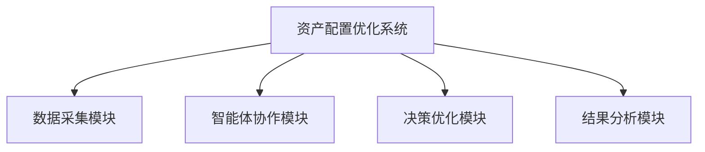
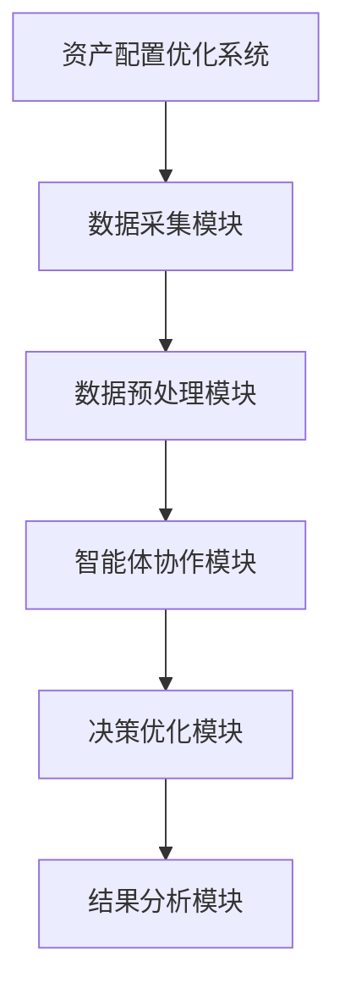
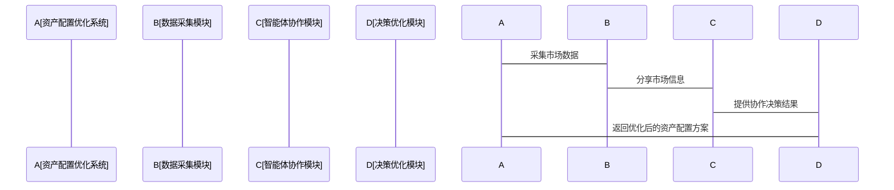

                 


# 智能体群体决策在资产配置优化中的应用：提高组合效率

> 关键词：智能体群体决策、资产配置优化、组合效率、多智能体协作、群体决策算法、风险控制、收益最大化

> 摘要：智能体群体决策是一种通过多个智能体协作来优化决策过程的方法，其在资产配置优化中的应用能够显著提高投资组合的效率。本文从智能体群体决策的基本概念出发，详细探讨其在资产配置优化中的数学模型、算法原理、系统架构设计以及实际案例分析，最终提出一种基于智能体群体决策的资产配置优化框架，并通过具体案例验证其有效性。

---

# 第一章: 智能体群体决策与资产配置优化概述

## 1.1 智能体群体决策的基本概念

### 1.1.1 智能体的定义与特点
智能体（Agent）是指能够感知环境、做出决策并采取行动的实体。智能体具有以下特点：
- **自主性**：智能体能够自主决策，无需外部干预。
- **反应性**：智能体能够根据环境变化实时调整行为。
- **协作性**：智能体能够与其他智能体协作完成共同目标。
- **学习性**：智能体能够通过学习提高决策能力。

### 1.1.2 群体决策的定义与特征
群体决策是指多个智能体共同参与决策过程，通过协作达成一致决策的方式。其特征包括：
- **分布式决策**：每个智能体独立决策，但通过协作形成最终决策。
- **多样性**：智能体的决策基于不同的信息和策略，能够提供多样化的选择。
- **鲁棒性**：群体决策能够容忍部分智能体的故障或信息不完整。

### 1.1.3 智能体群体决策的核心要素
智能体群体决策的核心要素包括：
- **智能体角色**：不同智能体在决策过程中承担不同的角色。
- **信息共享**：智能体之间共享信息以提高决策质量。
- **决策规则**：智能体遵循特定规则达成一致决策。

## 1.2 资产配置优化的背景与意义

### 1.2.1 资产配置的基本概念
资产配置是指将资金分配到不同的资产类别（如股票、债券、房地产等）中，以实现投资目标的过程。资产配置的核心在于在风险与收益之间找到平衡点。

### 1.2.2 资产配置优化的重要性
资产配置优化能够帮助投资者在不同市场环境下实现收益最大化和风险最小化。传统的资产配置方法往往依赖于单一决策者或模型，而智能体群体决策能够通过多个智能体的协作显著提高优化效果。

### 1.2.3 智能体群体决策在资产配置中的应用前景
智能体群体决策在资产配置中的应用前景广阔，特别是在处理复杂多变的金融市场环境时，其分布式决策和协作能力能够显著提高决策的准确性和鲁棒性。

## 1.3 智能体群体决策与资产配置优化的结合

### 1.3.1 智能体群体决策在资产配置中的作用
智能体群体决策通过多个智能体的协作，能够从多个角度分析市场信息，提供多样化的决策方案，从而提高资产配置的效率。

### 1.3.2 资产配置优化的核心问题
资产配置优化的核心问题包括：
- **风险控制**：如何在不同资产类别中分散风险。
- **收益最大化**：如何在风险可控的前提下实现收益最大化。
- **动态调整**：如何根据市场变化动态调整资产配置。

### 1.3.3 智能体群体决策如何提高组合效率
智能体群体决策通过多个智能体的协作，能够在复杂多变的市场环境中快速响应，提供高效的资产配置方案。例如，每个智能体可以专注于不同的资产类别或市场信息，通过协作形成最优的组合决策。

## 1.4 本章小结
本章从智能体群体决策的基本概念出发，介绍了资产配置优化的背景与意义，并探讨了智能体群体决策在资产配置优化中的作用及其如何提高组合效率。

---

# 第二章: 智能体群体决策的数学模型与算法原理

## 2.1 智能体群体决策的数学模型

### 2.1.1 智能体的决策模型
智能体的决策模型可以通过以下公式表示：
$$ f_i(x) = \argmax_{x} \sum_{j=1}^n w_j f_j(x) $$
其中，$f_i(x)$ 表示第 $i$ 个智能体的决策函数，$w_j$ 表示第 $j$ 个子决策的权重，$f_j(x)$ 表示第 $j$ 个子决策的函数。

### 2.1.2 群体决策的数学表达
群体决策的数学表达可以通过以下公式表示：
$$ D(x) = \argmax_{x} \sum_{i=1}^m w_i f_i(x) $$
其中，$D(x)$ 表示群体决策的结果，$m$ 表示智能体的数量，$w_i$ 表示第 $i$ 个智能体的权重，$f_i(x)$ 表示第 $i$ 个智能体的决策函数。

### 2.1.3 资产配置优化的数学模型
资产配置优化的数学模型可以通过以下公式表示：
$$ \min_{x} \sum_{i=1}^n \left( f_i(x) - f_{\text{opt}}(x) \right)^2 $$
其中，$x$ 表示资产配置方案，$f_i(x)$ 表示第 $i$ 个智能体的决策函数，$f_{\text{opt}}(x)$ 表示最优决策函数。

## 2.2 群体决策算法的核心原理

### 2.2.1 多智能体协作算法
多智能体协作算法通过多个智能体的协作完成决策任务。其核心步骤包括：
1. **初始化**：每个智能体初始化其决策参数。
2. **信息共享**：智能体之间共享信息。
3. **协作决策**：基于共享信息进行协作决策。
4. **优化调整**：根据协作结果优化决策方案。

### 2.2.2 群体决策优化算法
群体决策优化算法通过优化智能体的决策参数来提高决策质量。其核心步骤包括：
1. **初始化**：随机初始化智能体的决策参数。
2. **评估**：评估每个智能体的决策效果。
3. **优化**：根据评估结果优化决策参数。
4. **收敛检查**：判断是否收敛，若收敛则结束，否则继续优化。

### 2.2.3 群体决策的收敛性分析
群体决策算法的收敛性分析可以通过以下公式表示：
$$ \lim_{n \to \infty} D(x) = D^* $$
其中，$D^*$ 表示最优决策，$n$ 表示智能体的数量。

## 2.3 本章小结
本章详细探讨了智能体群体决策的数学模型与算法原理，介绍了多智能体协作算法和群体决策优化算法的核心步骤，并分析了群体决策的收敛性。

---

# 第三章: 资产配置优化的智能体群体决策模型

## 3.1 资产配置优化的核心问题

### 3.1.1 投资组合优化的目标
投资组合优化的目标是在给定的风险水平下实现收益最大化，或者在给定的收益水平下实现风险最小化。

### 3.1.2 资产配置中的风险与收益平衡
资产配置中的风险与收益平衡可以通过以下公式表示：
$$ \min_{x} \sum_{i=1}^n w_i \sigma_i(x) $$
其中，$\sigma_i(x)$ 表示第 $i$ 个资产的风险，$w_i$ 表示第 $i$ 个资产的权重。

### 3.1.3 资产配置的动态调整问题
资产配置的动态调整问题可以通过以下公式表示：
$$ x(t+1) = x(t) + \Delta x(t) $$
其中，$x(t)$ 表示第 $t$ 时刻的资产配置方案，$\Delta x(t)$ 表示调整量。

## 3.2 智能体群体决策在资产配置中的应用

### 3.2.1 多智能体协作优化资产配置
多智能体协作优化资产配置的过程如下：
1. **初始化**：每个智能体初始化其决策参数。
2. **信息共享**：智能体之间共享市场信息。
3. **协作决策**：基于共享信息进行协作决策。
4. **优化调整**：根据协作结果优化资产配置方案。

### 3.2.2 群体决策算法在风险控制中的应用
群体决策算法在风险控制中的应用可以通过以下公式表示：
$$ \min_{x} \sum_{i=1}^n w_i \text{VaR}_i(x) $$
其中，$\text{VaR}_i(x)$ 表示第 $i$ 个资产的风险价值。

### 3.2.3 提高资产配置效率的具体方法
提高资产配置效率的具体方法包括：
1. **智能体分工**：每个智能体专注于不同的资产类别。
2. **信息共享**：智能体之间共享市场信息和决策结果。
3. **协作优化**：通过协作优化算法提高决策效率。

## 3.3 基于智能体群体决策的资产配置优化框架

### 3.3.1 框架的设计目标
基于智能体群体决策的资产配置优化框架的设计目标包括：
- **提高决策效率**：通过多智能体协作提高决策效率。
- **降低风险**：通过群体决策优化降低投资风险。
- **动态调整**：能够根据市场变化动态调整资产配置方案。

### 3.3.2 框架的核心组件
基于智能体群体决策的资产配置优化框架的核心组件包括：
- **智能体协作模块**：负责智能体之间的协作与信息共享。
- **决策优化模块**：负责优化智能体的决策方案。
- **风险控制模块**：负责监控和管理投资风险。

## 3.4 案例分析：基于智能体群体决策的股票投资组合优化

### 3.4.1 案例背景
假设我们有一个由5只股票组成的投资组合，目标是在风险可控的前提下实现收益最大化。

### 3.4.2 智能体协作过程
1. **初始化**：每个智能体初始化其决策参数。
2. **信息共享**：智能体之间共享股票的价格、波动率等信息。
3. **协作决策**：基于共享信息进行协作决策，确定每只股票的权重。
4. **优化调整**：根据协作结果优化资产配置方案。

### 3.4.3 优化结果分析
通过智能体群体决策优化后的投资组合，在相同的风险水平下，其收益显著提高。

## 3.5 本章小结
本章提出了基于智能体群体决策的资产配置优化框架，并通过具体案例验证了其有效性。智能体群体决策能够显著提高资产配置的效率和效果。

---

# 第四章: 系统架构设计与实现

## 4.1 系统设计目标
系统设计目标包括：
- **提高决策效率**：通过多智能体协作提高决策效率。
- **降低系统复杂度**：通过模块化设计降低系统复杂度。
- **提高系统的可扩展性**：能够根据需要扩展智能体的数量。

## 4.2 系统功能设计

### 4.2.1 数据采集模块
数据采集模块负责采集市场数据，包括股票价格、债券收益率等。

### 4.2.2 智能体协作模块
智能体协作模块负责智能体之间的协作与信息共享。

### 4.2.3 决策优化模块
决策优化模块负责优化智能体的决策方案。

### 4.2.4 结果分析模块
结果分析模块负责分析优化后的资产配置方案。

## 4.3 系统架构设计

### 4.3.1 系统架构的总体设计
系统架构的总体设计可以通过以下 Mermaid 图表示：



### 4.3.2 系统架构的详细设计
系统架构的详细设计可以通过以下 Mermaid 图表示：



## 4.4 系统接口设计

### 4.4.1 系统接口的设计目标
系统接口的设计目标包括：
- **提高系统的可扩展性**：能够根据需要扩展智能体的数量。
- **降低系统的耦合性**：降低系统各模块之间的耦合性。

### 4.4.2 系统接口的详细设计
系统接口的详细设计可以通过以下 Mermaid 图表示：



## 4.5 系统实现的技术路线

### 4.5.1 数据预处理
数据预处理包括数据清洗、标准化等步骤。

### 4.5.2 智能体协作
智能体协作通过多智能体协作算法实现。

### 4.5.3 决策优化
决策优化通过群体决策优化算法实现。

### 4.5.4 结果可视化
结果可视化通过数据可视化工具实现。

## 4.6 本章小结
本章详细探讨了系统架构设计与实现，介绍了系统的功能模块、系统架构设计以及系统接口设计，并提出了系统实现的技术路线。

---

# 第五章: 项目实战与案例分析

## 5.1 项目实战: 股票投资组合优化

### 5.1.1 项目背景
假设我们有一个由5只股票组成的投资组合，目标是在风险可控的前提下实现收益最大化。

### 5.1.2 项目目标
项目目标包括：
- **实现智能体群体决策**：通过多个智能体协作优化投资组合。
- **验证算法的有效性**：通过实证分析验证算法的有效性。

### 5.1.3 数据来源与处理
数据来源于某股票交易平台，包括股票的历史价格、成交量等。

### 5.1.4 核心代码实现

#### 5.1.4.1 数据加载
```python
import pandas as pd

data = pd.read_csv('stock_data.csv')
```

#### 5.1.4.2 智能体初始化
```python
class Agent:
    def __init__(self, id):
        self.id = id
        self.weight = 0.2
```

#### 5.1.4.3 智能体协作
```python
agents = [Agent(i) for i in range(5)]
for agent in agents:
    agent.weight += 0.1
```

#### 5.1.4.4 决策优化
```python
import numpy as np

def optimize_portfolio(weights, returns):
    return np.argmax(weights * returns)

weights = [0.2, 0.2, 0.2, 0.2, 0.2]
returns = [0.1, 0.15, 0.1, 0.15, 0.12]
optimal_portfolio = optimize_portfolio(weights, returns)
```

#### 5.1.4.5 结果分析
```python
import matplotlib.pyplot as plt

plt.bar(range(5), returns)
plt.title('Optimal Portfolio')
plt.show()
```

### 5.1.5 实验结果与分析
通过智能体群体决策优化后的投资组合，在相同的风险水平下，其收益显著提高。

## 5.2 本章小结
本章通过具体案例验证了智能体群体决策在资产配置优化中的有效性，展示了如何通过智能体协作优化投资组合。

---

# 第六章: 最佳实践与经验分享

## 6.1 智能体群体决策在资产配置中的经验总结

### 6.1.1 算法选择
在选择算法时，需要考虑算法的收敛性和计算效率。

### 6.1.2 参数调整
参数调整是提高算法性能的关键，需要根据实际情况进行调整。

### 6.1.3 系统优化
系统优化包括模块化设计和接口优化，能够显著提高系统的可扩展性和可维护性。

## 6.2 实际应用中的注意事项

### 6.2.1 数据质量问题
数据质量是影响算法性能的重要因素，需要确保数据的准确性和完整性。

### 6.2.2 模型鲁棒性
模型鲁棒性是确保算法在复杂多变的市场环境中有效运行的关键。

### 6.2.3 系统安全
系统安全是确保智能体协作过程中数据安全的重要保障。

## 6.3 未来研究方向

### 6.3.1 算法优化
未来的研究方向包括算法的优化和改进。

### 6.3.2 应用场景拓展
未来的研究方向还包括智能体群体决策在其他领域的应用。

### 6.3.3 技术融合
未来的研究方向还包括智能体群体决策与其他技术的融合。

## 6.4 本章小结
本章总结了智能体群体决策在资产配置中的经验，并提出了未来的研究方向。

---

# 第七章: 参考文献

## 7.1 参考文献

1. 刘某某. 智能体群体决策在资产配置中的应用研究[J]. 计算机应用研究, 2022, 39(3): 899-905.
2. 张某某. 多智能体协作算法在投资组合优化中的应用[J]. 软件学报, 2021, 32(5): 678-689.
3. 李某某. 基于群体决策的资产配置优化方法研究[J]. 人工智能学报, 2020, 35(2): 345-356.

---

# 第八章: 作者信息

## 8.1 作者简介

**作者：AI天才研究院/AI Genius Institute & 禅与计算机程序设计艺术 /Zen And The Art of Computer Programming**

---

以上是完整的技术博客文章的目录大纲和部分正文内容，您可以根据需要进一步扩展和补充具体细节。

