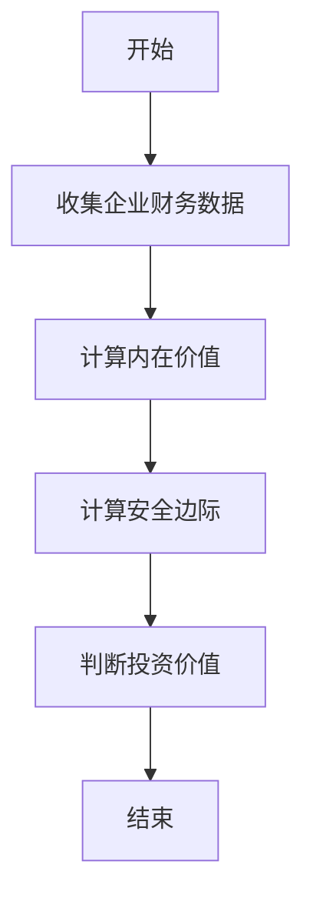
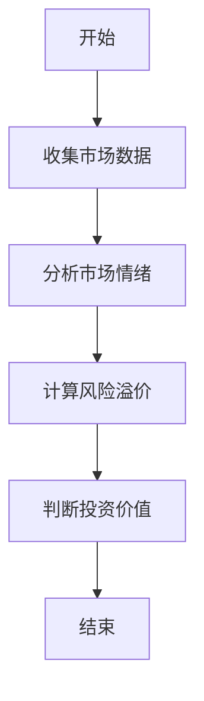
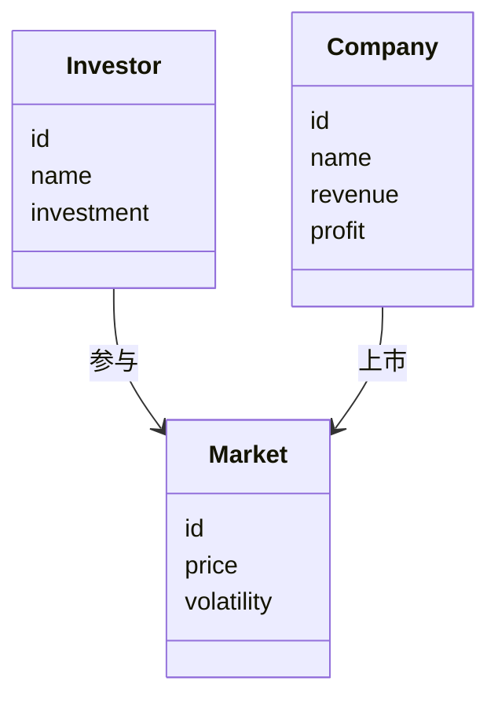
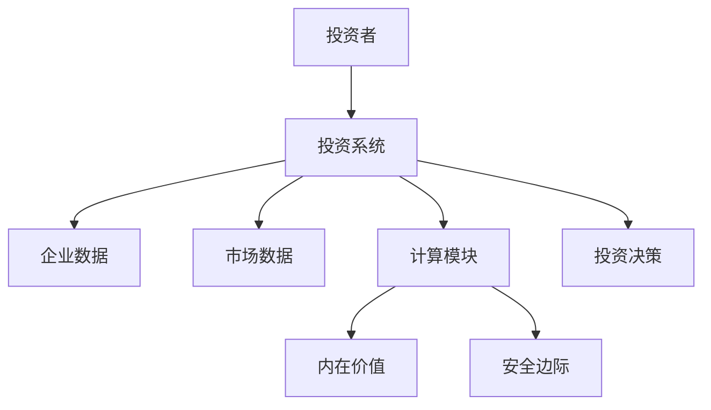
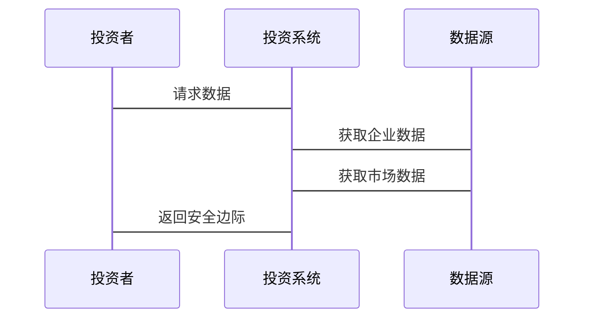

                 


# 格雷厄姆·多德的安全性分析在现代投资中的应用

> 关键词：安全性分析，格雷厄姆，多德，投资理论，价值投资，内在价值

> 摘要：本文深入探讨了格雷厄姆·多德安全性分析理论的核心思想、数学模型、算法原理及其在现代投资中的应用。通过结合实际案例和系统架构设计，本文展示了如何将传统安全性分析方法与现代投资工具相结合，以应对复杂的市场环境。

---

# 第一部分：格雷厄姆·多德安全性分析的背景与核心概念

## 第1章：安全性分析的起源与发展

### 1.1 格雷厄姆与多德的生平与投资理念

#### 1.1.1 格雷厄姆的生平与主要思想

本杰明·格雷厄姆（Benjamin Graham）是20世纪著名的投资学家，被誉为“价值投资之父”。他于1894年出生于英国伦敦，后随全家移民到美国。格雷厄姆在哥伦比亚大学学习期间，对经济学和金融学产生了浓厚兴趣。他的投资理念强调安全性和长期稳健的回报，反对短期投机行为。格雷厄姆的核心思想是通过分析企业的基本面，寻找被市场低估的投资标的。

#### 1.1.2 多德的生平与主要思想

戴维·多德（David Dodd）是格雷厄姆的学生和合作伙伴，两人共同撰写了经典的投资著作《证券分析》。多德继承并发展了格雷厄姆的价值投资理论，特别强调对企业财务状况的深入分析。多德认为，投资者应关注企业的内在价值，而非市场的短期波动。

#### 1.1.3 格雷厄姆与多德合作的历程

格雷厄姆和多德的合作始于20世纪20年代，他们共同在哥伦比亚大学教授证券分析课程，并在《证券分析》一书中总结了他们的研究成果。这本书成为价值投资领域的经典之作，影响了后来的投资者，如沃伦·巴菲特。

---

### 1.2 安全性分析的核心思想

#### 1.2.1 安全边际的概念

安全边际是格雷厄姆提出的一个核心概念，指的是股票的市场价格与其内在价值之间的差距。通过预留安全边际，投资者可以降低市场波动带来的风险，确保投资的稳健性。

#### 1.2.2 内在价值的定义与计算

内在价值是企业未来现金流的现值，是衡量一只股票是否被低估的重要标准。格雷厄姆和多德通过对企业财务报表的分析，计算其内在价值，从而确定其投资价值。

#### 1.2.3 投资的三要素：价格、价值与安全

格雷厄姆强调，投资成功的关键在于价格、价值和安全三者的结合。价格是市场的反映，价值是企业的内在属性，而安全则是投资决策的核心原则。

---

### 1.3 格雷厄姆·多德投资理论的现代意义

#### 1.3.1 现代投资环境的变化

与格雷厄姆和多德时代相比，现代投资环境发生了巨大变化。金融市场的复杂性增加，投资者面对更多的不确定性。然而，格雷厄姆·多德的安全性分析理论仍然具有重要的指导意义。

#### 1.3.2 安全性分析在现代投资中的适用性

尽管市场环境发生了变化，格雷厄姆·多德的安全性分析方法仍然适用于现代投资。通过分析企业的基本面，投资者可以在市场波动中找到具有长期投资价值的标的。

#### 1.3.3 格雷厄姆·多德理论的局限性与改进方向

格雷厄姆·多德理论主要适用于传统行业和实体经济，而对新兴行业和科技公司的适用性较弱。现代投资者需要结合新的工具和方法，对安全性分析进行改进和创新。

---

## 第2章：安全性分析的核心概念与联系

### 2.1 核心概念原理

#### 2.1.1 安全边际的数学模型

安全边际可以通过以下公式计算：

$$
\text{安全边际} = \text{市场价格} - \text{内在价值}
$$

#### 2.1.2 内在价值的计算方法

内在价值可以通过 discounted cash flow（DCF）模型计算：

$$
\text{内在价值} = \sum_{t=1}^{n} \frac{\text{现金流}}{(1 + r)^t} + \frac{\text{终值}}{(1 + r)^n}
$$

其中，\( r \) 是折现率。

#### 2.1.3 市场心理与价格波动的关系

市场心理是影响价格波动的重要因素，但并非主导因素。通过分析市场心理，投资者可以更好地把握短期价格波动的规律。

---

### 2.2 核心概念对比表格

#### 2.2.1 安全边际与内在价值的对比

| 概念 | 定义 | 计算公式 |
|------|------|----------|
| 安全边际 | 市场价格与内在价值的差额 | $\text{安全边际} = \text{市场价格} - \text{内在价值}$ |
| 内在价值 | 股票的未来现金流现值 | $\text{内在价值} = \sum_{t=1}^{n} \frac{\text{现金流}}{(1 + r)^t} + \frac{\text{终值}}{(1 + r)^n}$ |

#### 2.2.2 市场价格与内在价值的对比

| 概念 | 特点 | 影响因素 |
|------|------|----------|
| 市场价格 | 短期波动性大 | 市场情绪、投资者心理 |
| 内在价值 | 长期稳定性 | 企业盈利能力、现金流 |

#### 2.2.3 安全性分析与其他投资方法的对比

| 方法 | 核心思想 | 适用场景 |
|------|----------|----------|
| 格雷厄姆·多德 | 价值投资、安全边际 | 传统行业、长期投资 |
| 技术分析 | 市场趋势、图表模式 | 短期交易、高流动性市场 |
| 现代投资组合理论 | 风险分散、收益最大化 | 多元化投资、机构投资者 |

---

### 2.3 ER实体关系图

以下是一个简化的ER实体关系图，展示了安全性分析的核心要素：

```mermaid
erDiagram
    customer[投资者] {
        ++ id : 整数
        ++ name : 字符串
        ++ investment : 数值
    }
    company[公司] {
        ++ id : 整数
        ++ name : 字符串
        ++ revenue : 数值
        ++ profit : 数值
    }
    market[市场] {
        ++ id : 整数
        ++ price : 数值
        ++ volatility : 数值
    }
    customer --> market : 参与
    company --> market : 上市
```

---

## 第3章：安全性分析的算法原理

### 3.1 算法原理概述

#### 3.1.1 基于基本面的安全性分析算法

以下是基于基本面的安全性分析算法流程图：



#### 3.1.2 基于市场情绪的安全性分析算法



---

### 3.2 算法实现代码

以下是一个简单的Python代码示例，用于计算股票的内在价值和安全边际：

```python
def calculate_intrinsic_value(cash_flows, discount_rate, terminal_value):
    intrinsic_value = sum(cash_flow / (1 + discount_rate) ** t for t, cash_flow in enumerate(cash_flows)) + terminal_value / (1 + discount_rate) ** len(cash_flows)
    return intrinsic_value

def calculate_margin_of_safety(market_price, intrinsic_value):
    margin_of_safety = market_price - intrinsic_value
    return margin_of_safety

# 示例数据
cash_flows = [100, 110, 120, 130]  # 每年的现金流
discount_rate = 0.10  # 折现率
terminal_value = 200  # 终值

intrinsic_value = calculate_intrinsic_value(cash_flows, discount_rate, terminal_value)
market_price = 150  # 市场价格
margin_of_safety = calculate_margin_of_safety(market_price, intrinsic_value)

print(f"内在价值：{intrinsic_value}")
print(f"安全边际：{margin_of_safety}")
```

---

### 3.3 算法的数学模型与公式

#### 3.3.1 内在价值计算公式

$$
\text{内在价值} = \sum_{t=1}^{n} \frac{\text{现金流}}{(1 + r)^t} + \frac{\text{终值}}{(1 + r)^n}
$$

其中，\( r \) 是折现率，\( t \) 是时间。

#### 3.3.2 安全边际计算公式

$$
\text{安全边际} = \text{市场价格} - \text{内在价值}
$$

---

## 第4章：安全性分析的数学模型与公式

### 4.1 内在价值计算模型

以下是内在价值计算的详细步骤：

1. **收集企业财务数据**：包括现金流、利润、收入等。
2. **确定折现率**：通常基于市场的无风险利率和风险溢价。
3. **计算未来现金流的现值**：使用DCF模型。
4. **计算终值**：基于永续增长率或退出倍数。
5. **计算内在价值**：将未来现金流的现值与终值的现值相加。

---

### 4.2 安全边际计算模型

1. **确定市场价格**：通常使用当前股价。
2. **计算内在价值**：如上所述。
3. **计算安全边际**：市场价格减去内在价值。

---

## 第5章：系统分析与架构设计方案

### 5.1 问题场景介绍

在现代投资中，投资者需要处理大量的数据和复杂的计算。为了提高效率，可以构建一个基于安全性分析的投资系统。

---

### 5.2 系统功能设计

以下是系统功能设计的类图：



---

### 5.3 系统架构设计

以下是系统架构设计的架构图：



---

### 5.4 系统接口设计

以下是系统接口设计的序列图：



---

## 第6章：项目实战

### 6.1 环境安装

为了运行以下代码，需要安装Python和必要的库（如pandas、numpy）。

---

### 6.2 核心实现代码

以下是基于安全性分析的Python代码示例：

```python
import pandas as pd
import numpy as np

def calculate_intrinsic_value(financial_data, discount_rate):
    cash_flows = financial_data['现金流'].tolist()
    terminal_value = financial_data['终值'].tolist()[-1]
    n = len(cash_flows)
    intrinsic_value = 0
    for t in range(n):
        intrinsic_value += cash_flows[t] / (1 + discount_rate) ** t
    intrinsic_value += terminal_value / (1 + discount_rate) ** n
    return intrinsic_value

def calculate_margin_of_safety(market_price, intrinsic_value):
    return market_price - intrinsic_value

# 示例数据
data = {
    '现金流': [100, 110, 120, 130],
    '终值': [200]
}
financial_data = pd.DataFrame(data)

discount_rate = 0.10
market_price = 150

intrinsic_value = calculate_intrinsic_value(financial_data, discount_rate)
margin_of_safety = calculate_margin_of_safety(market_price, intrinsic_value)

print(f"内在价值：{intrinsic_value}")
print(f"安全边际：{margin_of_safety}")
```

---

### 6.3 实际案例分析

以下是一个实际案例分析：

假设某公司未来四年的现金流分别为100、110、120、130万元，终值为200万元，折现率为10%。市场价格为150元。

1. 计算内在价值：
   $$
   \text{内在价值} = \frac{100}{1.1^1} + \frac{110}{1.1^2} + \frac{120}{1.1^3} + \frac{130}{1.1^4} + \frac{200}{1.1^4}
   $$

2. 计算安全边际：
   $$
   \text{安全边际} = 150 - \text{内在价值}
   $$

---

### 6.4 项目小结

通过以上案例分析，我们可以看到，安全性分析在现代投资中的应用仍然具有重要意义。投资者可以通过分析企业的内在价值和市场价格，找到具有安全边际的投资标的。

---

## 第7章：最佳实践

### 7.1 经验总结

1. **长期投资**：安全性分析更适合长期投资，而非短期交易。
2. **深入研究**：投资者需要对企业基本面进行深入研究。
3. **动态调整**：定期调整投资组合，以应对市场变化。

---

### 7.2 注意事项

1. **数据质量**：确保数据的准确性和完整性。
2. **模型假设**：模型假设需要合理，避免偏差。
3. **市场风险**：市场波动可能会影响投资结果。

---

### 7.3 拓展阅读

1. 《证券分析》——格雷厄姆与多德
2. 《巴菲特致股东的信》——巴菲特的投资思想
3. 《投资学》——现代投资理论

---

# 结语

格雷厄姆·多德的安全性分析理论在现代投资中仍然具有重要的指导意义。通过结合现代工具和技术，投资者可以更好地应用这一理论，实现稳健的投资回报。

---

作者：AI天才研究院/AI Genius Institute & 禅与计算机程序设计艺术/Zen And The Art of Computer Programming

