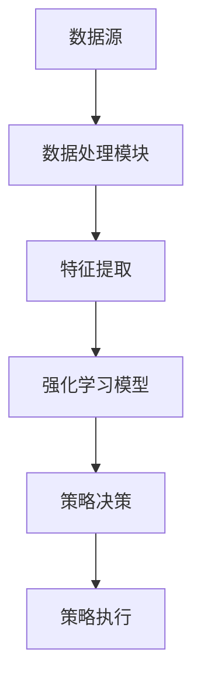

                 


# 《金融领域强化学习在期权对冲策略中的应用》

> 关键词：强化学习、期权对冲、风险管理、量化交易、人工智能、金融市场

> 摘要：本文深入探讨了强化学习在金融领域期权对冲策略中的应用，从强化学习的基本原理到期权对冲的核心问题，再到具体的算法实现和系统架构设计，全面分析了强化学习如何优化期权对冲策略。通过实际案例和项目实战，展示了强化学习在金融交易中的巨大潜力。

---

## 第1章 强化学习与期权对冲概述

### 1.1 强化学习的基本概念

#### 1.1.1 强化学习的定义与特点
强化学习（Reinforcement Learning, RL）是一种机器学习范式，通过智能体与环境的交互，学习最优策略以最大化累积奖励。其特点包括：
- **延迟反馈**：奖励通常在多个动作之后才会给出。
- **探索与利用**：平衡探索新策略和利用已知好的策略。
- **马尔可夫性**：当前状态仅依赖于当前观测，与历史无关。

#### 1.1.2 期权对冲的基本原理
期权对冲是通过买入或卖出标的资产来抵消期权头寸的风险。常见的对冲策略包括：
- **delta中性**：通过调整标的资产的头寸，使期权组合的delta为零。
- **gamma中性**：进一步调整组合对标的资产价格波动的敏感性。
- **vega中性**：对冲波动率风险。

#### 1.1.3 强化学习在金融领域的应用价值
强化学习能够处理金融市场中的不确定性问题，尤其适用于动态对冲策略的优化。通过学习最优交易策略，强化学习可以帮助投资者在复杂市场环境中实现风险可控、收益最大化的对冲目标。

### 1.2 期权对冲的核心问题

#### 1.2.1 期权定价与对冲的基本原理
期权定价的核心是Black-Scholes模型，假设标的资产价格服从几何布朗运动。对冲策略则通过动态调整头寸，抵消价格波动带来的风险。

#### 1.2.2 风险中性定价与 Greeks
在风险中性定价框架下，期权的期望回报等于其标的资产的风险调整回报。Greeks（delta、gamma、vega等）是衡量期权价格对各类风险因素敏感性的指标。

#### 1.2.3 动态对冲策略的挑战
动态对冲需要实时调整头寸，面临以下挑战：
- 市场冲击：频繁交易可能导致价格波动。
- 交易成本：佣金、滑点等成本会侵蚀收益。
- 模型风险：定价模型的假设可能与实际市场不符。

### 1.3 强化学习在期权对冲中的应用背景

#### 1.3.1 传统对冲策略的局限性
传统对冲策略基于静态模型，难以适应市场环境的快速变化。例如，Black-Scholes模型假设波动率恒定，但在实际市场中，波动率可能呈现跳跃性变化。

#### 1.3.2 强化学习的优势与适用场景
强化学习能够处理非线性、多变量的复杂问题，适用于动态对冲策略的优化。其优势包括：
- **自适应性**：能够根据市场变化动态调整策略。
- **全局优化**：能够在复杂环境中找到最优解。
- **并行学习**：可以同时优化多个目标。

#### 1.3.3 当前研究与实践中的热点问题
当前的研究主要集中在以下方面：
- 如何设计有效的状态表示。
- 如何平衡探索与利用以避免过度交易。
- 如何处理高频交易中的延迟和滑点问题。

### 1.4 本章小结
本章介绍了强化学习的基本概念和期权对冲的核心问题，强调了强化学习在动态对冲策略中的应用价值，并总结了当前研究中的热点问题。

---

## 第2章 强化学习算法原理

### 2.1 马尔可夫决策过程（MDP）

#### 2.1.1 状态、动作、奖励的定义
- **状态（State）**：描述环境当前情况的观测，例如当前资产价格、波动率等。
- **动作（Action）**：智能体在给定状态下采取的行动，例如买入或卖出标的资产。
- **奖励（Reward）**：智能体在采取动作后获得的反馈，通常表示对策略的好坏的度量。

#### 2.1.2 策略与价值函数
- **策略（Policy）**：描述智能体在给定状态下采取动作的概率分布。
- **价值函数（Value Function）**：衡量一个状态或状态-动作对的长期收益。

#### 2.1.3 动态规划与策略迭代
动态规划通过迭代更新价值函数，找到最优策略。策略迭代包括两种方法：
- **值迭代（Value Iteration）**：直接优化价值函数。
- **策略迭代（Policy Iteration）**：交替优化策略和价值函数。

#### 2.1.4 马尔可夫决策过程的数学模型
MDP可以用以下公式描述：
$$
\text{目标：} \max_{\pi} \mathbb{E}[R_t]
$$
其中，$R_t$ 是第 $t$ 步的奖励，$\pi$ 是策略。

### 2.2 基于值函数的强化学习算法

#### 2.2.1 Q-learning算法
Q-learning通过学习Q值函数 $Q(s, a)$ 来优化策略。算法步骤如下：
1. 初始化Q表。
2. 与环境交互，获取状态 $s$ 和动作 $a$。
3. 计算新状态下的Q值：$$ Q(s, a) = Q(s, a) + \alpha (r + \gamma \max Q(s', a')) $$
4. 重复步骤2-3，直到收敛。

#### 2.2.2 动态规划与策略迭代
动态规划通过迭代更新Q值函数，策略迭代通过交替更新策略和Q值函数，最终找到最优策略。

#### 2.2.3 离线与在线学习的对比
- **离线学习**：在历史数据上训练，不实时更新。
- **在线学习**：实时与环境交互，动态更新策略。

### 2.3 基于策略的强化学习算法

#### 2.3.1 政策梯度方法
政策梯度通过优化策略的参数，直接最大化期望奖励。常用算法包括：
- **REINFORCE算法**：基于蒙特卡洛方法。
- **PPO（Proximal Policy Optimization）**：通过限制策略更新幅度，确保稳定性。

#### 2.3.2 近端策略优化（PPO）
PPO通过限制策略更新幅度，确保优化过程的稳定性。算法步骤如下：
1. 计算当前策略的损失。
2. 优化目标：$$ \min_{\theta} \mathbb{E}[ \min( r(\theta), r(\theta)^2 ) ] $$
3. 更新策略参数 $\theta$。

#### 2.3.3 策略评估与更新的数学模型
策略评估的目标是最大化期望奖励：
$$
\max_{\theta} \mathbb{E}_{\pi_\theta}[R]
$$

### 2.4 深度强化学习简介

#### 2.4.1 DQN算法及其改进版
DQN通过使用深度神经网络近似Q值函数，解决了传统Q-learning的离散化问题。改进版包括：
- **DQN**：深度Q网络。
- **Double DQN**：分离动作选择和Q值更新。
- ** Dueling DQN**：同时学习状态值和动作优势。

#### 2.4.2 Actor-Critic架构
Actor-Critic架构通过同时学习策略（Actor）和价值函数（Critic），实现更高效的策略优化。算法步骤如下：
1. 初始化Actor和Critic网络。
2. 通过Actor选择动作。
3. 更新Critic：$$ Q(s, a) = r + \gamma Q(s', a') $$
4. 更新Actor：$$ \theta = \theta + \alpha \nabla_\theta J(\theta) $$

#### 2.4.3 强化学习中的探索与利用平衡
探索：尝试新动作以发现更好的策略。
利用：利用当前最优策略获取最大奖励。
平衡方法包括：
- **ε-greedy**：以概率ε选择随机动作，否则选择最优动作。
- **softmax**：动作概率与Q值的指数相关。

### 2.5 本章小结
本章介绍了强化学习的核心算法，包括Q-learning、PPO和DQN，并分析了深度强化学习的Actor-Critic架构，强调了探索与利用平衡的重要性。

---

## 第3章 期权对冲的强化学习建模

### 3.1 金融市场的特征与建模

#### 3.1.1 金融市场数据的特征分析
- **波动性**：资产价格的短期剧烈波动。
- **非线性关系**：价格变化与市场情绪密切相关。
- **噪声与信号**：市场数据中存在大量噪声，强化学习需要识别有效信号。

#### 3.1.2 期权定价模型
- **Black-Scholes模型**：$$ C = S_0 N(d_1) - K e^{-rT} N(d_2) $$
- **蒙特卡洛模拟**：通过模拟价格路径估计期权价值。

#### 3.1.3 市场微观结构与交易成本
- **市场深度**：影响交易价格和成本。
- **滑点**：交易执行时的价格偏差。
- **市场冲击**：大额交易对价格的影响。

### 3.2 期权对冲的强化学习建模

#### 3.2.1 状态空间设计
- **状态定义**：包括当前资产价格、波动率、greeks等。
- **特征提取**：使用技术指标（如移动平均线、RSI）或统计特征（如均值、方差）。

#### 3.2.2 动作空间设计
- **动作定义**：包括买入、卖出或持有标的资产。
- **动作参数化**：例如，定义动作幅度为1%、2%或3%。

#### 3.2.3 奖励函数设计
- **奖励计算**：基于对冲后的收益、风险和交易成本。
- **多目标优化**：平衡收益、波动率和交易成本。

#### 3.2.4 状态转移模型
- **马尔可夫假设**：当前状态仅依赖于历史状态序列中的最新状态。
- **动态模型**：使用ARIMA或GARCH模型预测未来价格。

### 3.3 强化学习在期权对冲中的挑战

#### 3.3.1 状态空间的维度性
高维状态空间会导致“维数灾难”，影响学习效率。

#### 3.3.2 动作空间的复杂性
复杂动作空间需要设计有效的动作参数化方法。

#### 3.3.3 奖励函数的设计难度
如何平衡短期收益与长期风险是关键问题。

### 3.4 本章小结
本章分析了期权对冲的强化学习建模问题，提出了状态空间、动作空间和奖励函数的设计方法，并探讨了相关挑战。

---

## 第4章 强化学习在期权对冲中的策略设计

### 4.1 基于强化学习的对冲策略框架

#### 4.1.1 策略输入与输出的定义
- **输入**：当前市场状态，包括资产价格、波动率等。
- **输出**：对冲头寸调整建议，如买入或卖出标的资产。

#### 4.1.2 动作空间的策略映射
- **映射方法**：将Q值或策略概率映射为具体动作。
- **动作调整**：根据市场环境动态调整动作幅度。

#### 4.1.3 奖励函数的设计与优化
- **奖励函数优化**：引入惩罚项，避免过度交易。
- **多目标优化**：使用加权和方法平衡收益、风险和成本。

### 4.2 动态对冲策略的实现

#### 4.2.1 状态转移模型的构建
- **状态预测**：使用时间序列模型预测未来状态。
- **状态更新**：根据市场反馈实时更新状态。

#### 4.2.2 动作选择与执行
- **动作选择**：基于当前状态选择最优动作。
- **动作执行**：根据选择的动作调整对冲头寸。

#### 4.2.3 回测与优化
- **回测策略**：在历史数据上验证策略的有效性。
- **策略优化**：调整参数以提高回测收益。

### 4.3 强化学习对冲策略的效果分析

#### 4.3.1 策略收益与风险分析
- **收益分析**：比较强化学习策略与传统策略的收益表现。
- **风险分析**：分析策略的波动率、最大回撤等风险指标。

#### 4.3.2 策略鲁棒性测试
- **压力测试**：在极端市场条件下测试策略的稳定性。
- **模型验证**：验证策略在不同市场环境下的适用性。

### 4.4 本章小结
本章设计了基于强化学习的对冲策略框架，并分析了策略的实现效果和鲁棒性。

---

## 第5章 强化学习对冲策略的系统架构设计

### 5.1 系统功能设计

#### 5.1.1 系统输入
- **市场数据**：包括期权价格、标的资产价格、波动率等。
- **模型参数**：包括强化学习算法的超参数。

#### 5.1.2 系统输出
- **对冲建议**：包括买入或卖出标的资产的信号。
- **策略报告**：包括策略表现、风险指标等。

#### 5.1.3 系统功能模块
- **数据处理模块**：负责数据预处理和特征提取。
- **模型训练模块**：负责强化学习模型的训练和优化。
- **策略执行模块**：负责根据模型输出执行对冲操作。

### 5.2 系统架构设计

#### 5.2.1 系统架构图


#### 5.2.2 数据流设计
- **数据输入**：市场数据输入系统。
- **数据处理**：清洗、标准化等预处理。
- **特征提取**：提取有用的特征，如技术指标。
- **模型训练**：训练强化学习模型。
- **策略决策**：生成对冲建议。
- **策略执行**：执行交易操作。

### 5.3 系统接口设计

#### 5.3.1 数据接口
- **数据获取接口**：从数据库或API获取市场数据。
- **数据推送接口**：将数据发送到特征提取模块。

#### 5.3.2 模型接口
- **模型训练接口**：训练强化学习模型。
- **模型预测接口**：生成对冲建议。

### 5.4 本章小结
本章详细设计了强化学习对冲策略的系统架构，包括功能模块、架构图和接口设计。

---

## 第6章 项目实战：基于强化学习的期权对冲策略实现

### 6.1 环境配置与数据准备

#### 6.1.1 环境配置
- **安装依赖**：安装Python、TensorFlow、Keras等工具。
- **数据获取**：从Yahoo Finance获取历史数据。

#### 6.1.2 数据预处理
- **数据清洗**：处理缺失值和异常值。
- **数据标准化**：归一化处理。

### 6.2 系统核心实现

#### 6.2.1 强化学习模型实现
- **DQN模型实现**：编写DQN算法的Python代码。
- **策略评估**：评估模型在测试数据上的表现。

#### 6.2.2 对冲策略实现
- **策略回测**：在历史数据上回测策略。
- **策略优化**：调整模型参数以提高收益。

### 6.3 代码实现与分析

#### 6.3.1 DQN模型代码
```python
class DQN:
    def __init__(self, state_dim, action_dim):
        self.state_dim = state_dim
        self.action_dim = action_dim
        self.gamma = 0.99
        self.epsilon = 0.1
        self.model = self.build_model()

    def build_model(self):
        model = Sequential()
        model.add(Dense(64, activation='relu', input_dim=self.state_dim))
        model.add(Dense(self.action_dim))
        model.compile(optimizer=Adam(lr=0.001), loss='mse')
        return model

    def act(self, state):
        if random.random() < self.epsilon:
            return random.randint(0, self.action_dim-1)
        else:
            q = self.model.predict(state)
            return np.argmax(q[0])

    def remember(self, experience):
        self.memory.append(experience)

    def replay(self, batch_size):
        minibatch = random.sample(self.memory, batch_size)
        states = np.array([exp[0] for exp in minibatch])
        actions = np.array([exp[1] for exp in minibatch])
        rewards = np.array([exp[2] for exp in minibatch])
        next_states = np.array([exp[3] for exp in minibatch])
        targets = self.model.predict(states)
        next_q = self.model.predict(next_states)
        targets[range(batch_size), actions] = rewards + self.gamma * np.max(next_q, axis=1)
        self.model.fit(states, targets, batch_size=batch_size, epochs=1, verbose=0)
```

#### 6.3.2 对冲策略实现
```python
def run_strategy(data, model):
    state = normalize(data)
    action = model.act(state)
    # 执行对冲操作
    # 根据动作调整头寸
    # 计算收益并更新状态
    return reward
```

### 6.4 实际案例分析

#### 6.4.1 数据来源与预处理
- **数据来源**：使用真实市场数据或模拟数据。
- **数据预处理**：标准化、滑动窗口等处理。

#### 6.4.2 模型训练与验证
- **训练过程**：在训练数据上训练模型。
- **验证过程**：在验证数据上评估模型性能。

#### 6.4.3 策略回测与优化
- **回测收益**：计算策略的累计收益。
- **回测风险**：计算最大回撤、波动率等风险指标。
- **参数优化**：调整模型参数以提高回测收益。

### 6.5 本章小结
本章通过实际案例展示了强化学习对冲策略的实现过程，并分析了策略的回测效果和优化方向。

---

## 第7章 总结与展望

### 7.1 本章总结
本文详细探讨了强化学习在期权对冲中的应用，从算法原理到系统架构设计，再到实际案例分析，全面展示了强化学习在金融领域的巨大潜力。

### 7.2 未来研究方向

#### 7.2.1 多资产对冲策略
- **多资产组合优化**：研究多资产组合的动态对冲策略。
- **资产配置问题**：探索强化学习在资产配置中的应用。

#### 7.2.2 高频交易策略
- **高频交易优化**：研究强化学习在高频交易中的应用。
- **算法优化**：探索更高效的强化学习算法。

#### 7.2.3 市场微观结构建模
- **市场微观结构分析**：研究市场微观结构对交易策略的影响。
- **交易成本优化**：探索强化学习在交易成本优化中的应用。

### 7.3 本章小结
本章总结了全文内容，并展望了未来的研究方向。

---

## 附录

### 附录A: 数据集与代码

#### 附录A.1 数据集
- **数据来源**：Yahoo Finance、Quandl等。
- **数据格式**：CSV格式，包含开盘价、收盘价、最高价、最低价等。

#### 附录A.2 源代码
```python
# 附录中提供完整的代码实现，包括数据处理、模型训练、策略执行等部分。
```

### 附录B: 参考文献

#### 附录B.1 参考文献
- 引用相关文献、书籍和论文，提供详细的参考信息。

---

## 作者信息

作者：AI天才研究院/AI Genius Institute & 禅与计算机程序设计艺术 /Zen And The Art of Computer Programming

---

以上是《金融领域强化学习在期权对冲策略中的应用》的完整文章结构和内容，涵盖了从基础理论到实际应用的各个方面，旨在为读者提供一个全面而深入的指导。

