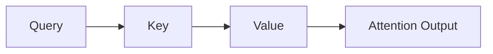
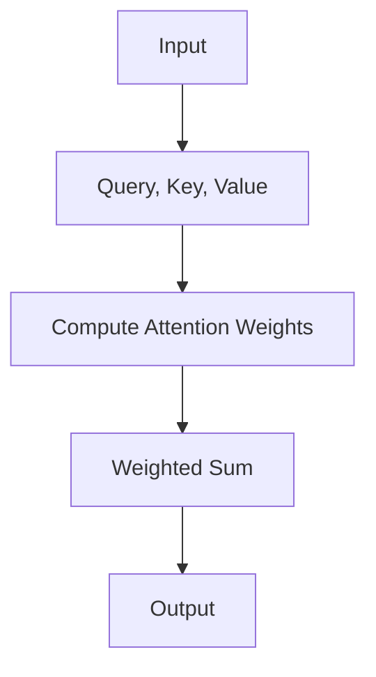
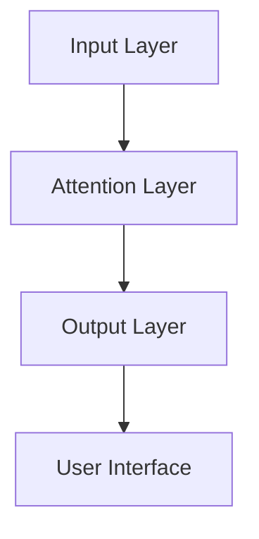

                 


# AI Agent的注意力机制：提高信息处理效率

## 关键词：AI Agent，注意力机制，信息处理效率，自注意力机制，外部注意力机制，深度学习

## 摘要：  
本文深入探讨AI Agent中的注意力机制，分析其在提高信息处理效率中的关键作用。通过背景介绍、核心概念、算法原理、系统设计、项目实战和总结等部分，系统性地讲解注意力机制的原理、应用场景和实现方法。文章旨在帮助读者理解如何通过注意力机制优化AI Agent的信息处理能力，并提供实际案例和代码实现，为AI Agent的开发和应用提供参考。

---

## 第一章：注意力机制的背景与问题背景

### 1.1 注意力机制的基本概念

#### 1.1.1 注意力机制的定义  
注意力机制是一种模拟人类注意力的选择性关注机制，用于在信息处理过程中聚焦于重要部分，忽略次要或不相关的信息。它通过权重分配的方式，赋予输入数据中不同部分不同的关注度，从而提高模型的处理效率和准确性。

#### 1.1.2 注意力机制的核心问题背景  
在AI Agent中，信息处理的效率和准确性是关键问题。传统方法通常对所有输入数据等权重处理，导致计算复杂度高且效果不佳。注意力机制通过动态分配权重，帮助模型聚焦于关键信息，从而提高处理效率和准确性。

#### 1.1.3 注意力机制的解决思路  
注意力机制的核心思想是通过计算输入数据中各部分的重要性，动态调整权重，实现对关键信息的聚焦。这种机制在自然语言处理、计算机视觉等领域得到了广泛应用，极大地提高了模型的性能。

### 1.2 AI Agent的定义与特点

#### 1.2.1 AI Agent的定义  
AI Agent（人工智能代理）是指能够感知环境、自主决策并采取行动的智能实体。它通过与环境交互，实现特定目标，具有自主性、反应性、目标导向性和社交性等特点。

#### 1.2.2 AI Agent的核心特点  
1. **自主性**：能够自主决策，无需外部干预。  
2. **反应性**：能够感知环境并实时响应。  
3. **目标导向性**：具有明确的目标，行动围绕目标展开。  
4. **社交性**：能够与其他Agent或人类交互协作。  

#### 1.2.3 AI Agent与传统AI的区别  
AI Agent与传统AI相比，具有更强的自主性和适应性。传统AI通常依赖于预定义规则，而AI Agent能够动态调整行为，适应复杂多变的环境。

### 1.3 注意力机制在AI Agent中的作用

#### 1.3.1 注意力机制的定义与特点  
注意力机制通过计算输入数据中各部分的权重，帮助模型聚焦于关键信息，提高信息处理效率和准确性。其特点包括动态性、选择性和高效性。

#### 1.3.2 注意力机制在AI Agent中的应用  
注意力机制广泛应用于自然语言处理、图像识别等领域，帮助AI Agent更高效地处理信息，提升性能。

#### 1.3.3 注意力机制与信息处理效率的关系  
注意力机制通过动态分配权重，减少冗余计算，提高信息处理效率。同时，它能够帮助模型聚焦于关键信息，提升处理效果。

## 第二章：注意力机制的核心原理

### 2.1 自注意力机制的原理

#### 2.1.1 自注意力机制的定义  
自注意力机制是一种计算输入序列中每个元素与其他元素相关性的方法，通过计算权重矩阵，实现对输入数据的动态聚焦。

#### 2.1.2 自注意力机制的计算公式  
自注意力机制的计算公式包括查询（Query）、键（Key）、值（Value）的计算，以及权重矩阵的计算。其数学表达如下：

$$
\text{Attention}(Q, K, V) = \text{softmax}\left(\frac{QK^T}{\sqrt{d_k}}\right)V
$$

其中，$Q$、$K$、$V$分别为查询、键、值矩阵，$d_k$为键的维度。

#### 2.1.3 自注意力机制的实现步骤  
自注意力机制的实现步骤包括：  
1. 计算查询、键、值矩阵。  
2. 计算注意力权重矩阵。  
3. 加权求和，得到最终结果。  

### 2.2 外部注意力机制的原理

#### 2.2.1 外部注意力机制的定义  
外部注意力机制是一种引入外部信息或特征的注意力机制，通过结合外部上下文，提高模型的表达能力。

#### 2.2.2 外部注意力机制的计算公式  
外部注意力机制的计算公式如下：

$$
\text{Attention}(Q, K, V, E) = \text{softmax}\left(\frac{QK^T + E}{\sqrt{d_k}}\right)V
$$

其中，$E$为外部特征矩阵。

#### 2.2.3 外部注意力机制的实现步骤  
外部注意力机制的实现步骤包括：  
1. 计算查询、键、值矩阵。  
2. 引入外部特征矩阵。  
3. 计算注意力权重矩阵。  
4. 加权求和，得到最终结果。  

### 2.3 注意力机制的对比分析

#### 2.3.1 自注意力机制与外部注意力机制的对比  
| 对比维度 | 自注意力机制 | 外部注意力机制 |
|----------|--------------|----------------|
| 输入类型 | 单一序列输入 | 引入外部特征 |
| 表达能力 | 较弱 | 较强 |
| 应用场景 | 自然语言处理 | 图像识别、跨模态任务 |

#### 2.3.2 注意力机制的核心属性特征对比表格  
| 属性 | 自注意力机制 | 外部注意力机制 |
|------|--------------|----------------|
| 权重计算 | 基于序列内部关系 | 基于外部特征 |
| 计算复杂度 | 较低 | 较高 |
| 应用场景 | 适合单模态任务 | 适合跨模态任务 |

#### 2.3.3 注意力机制的ER实体关系图  


## 第三章：注意力机制的算法原理

### 3.1 注意力机制的算法流程

#### 3.1.1 注意力机制的输入与输出  
- **输入**：查询矩阵 $Q$，键矩阵 $K$，值矩阵 $V$。  
- **输出**：注意力权重矩阵，加权后的结果。

#### 3.1.2 注意力机制的计算步骤  
1. 计算查询、键、值矩阵。  
2. 计算注意力权重矩阵。  
3. 加权求和，得到最终结果。  

#### 3.1.3 注意力机制的实现流程图  


### 3.2 注意力机制的数学模型与公式

#### 3.2.1 注意力机制的数学模型  
注意力机制的数学模型包括查询、键、值的计算，以及权重矩阵的计算。其数学表达如下：

$$
\text{Attention}(Q, K, V) = \text{softmax}\left(\frac{QK^T}{\sqrt{d_k}}\right)V
$$

#### 3.2.2 注意力机制的计算公式  
- 查询、键、值矩阵的计算公式：  
$$
Q = W_qX, \quad K = W_kX, \quad V = W_vX
$$  
其中，$W_q$、$W_k$、$W_v$为权重矩阵，$X$为输入矩阵。  

- 注意力权重的计算公式：  
$$
\text{weights} = \text{softmax}\left(\frac{QK^T}{\sqrt{d_k}}\right)
$$  

- 最终结果：  
$$
\text{Output} = \text{weights}V
$$  

### 3.3 注意力机制的实现代码

#### 3.3.1 Python代码实现  
```python
import numpy as np

def compute_attention(Q, K, V, dk):
    # 计算注意力权重
    weights = np.dot(Q, K.T) / np.sqrt(dk)
    weights = np.exp(weights)
    weights /= np.sum(weights, axis=1, keepdims=True)
    
    # 加权求和
    output = np.dot(weights, V)
    return output
```

#### 3.3.2 代码解读  
1. **输入**：查询矩阵 $Q$，键矩阵 $K$，值矩阵 $V$，键的维度 $dk$。  
2. **计算权重**：通过点积计算权重，然后归一化，得到注意力权重矩阵。  
3. **计算输出**：通过加权求和，得到最终输出。  

### 3.4 注意力机制的数学公式推导

#### 3.4.1 自注意力机制的推导  
1. **查询、键、值矩阵的计算**：  
$$
Q = W_qX, \quad K = W_kX, \quad V = W_vX
$$  
2. **注意力权重的计算**：  
$$
\text{weights} = \text{softmax}\left(\frac{QK^T}{\sqrt{d_k}}\right)
$$  
3. **最终输出**：  
$$
\text{Output} = \text{weights}V
$$  

#### 3.4.2 外部注意力机制的推导  
1. **查询、键、值矩阵的计算**：  
$$
Q = W_qX, \quad K = W_kX, \quad V = W_vX
$$  
2. **外部特征的引入**：  
$$
E = W_eF
$$  
其中，$F$为外部特征矩阵，$W_e$为权重矩阵。  
3. **注意力权重的计算**：  
$$
\text{weights} = \text{softmax}\left(\frac{QK^T + E}{\sqrt{d_k}}\right)
$$  
4. **最终输出**：  
$$
\text{Output} = \text{weights}V
$$  

## 第四章：系统分析与架构设计

### 4.1 问题场景介绍

#### 4.1.1 问题场景描述  
以自然语言处理任务为例，AI Agent需要处理长文本，传统方法难以高效聚焦关键信息。注意力机制可以帮助模型动态分配权重，提高处理效率和准确性。

#### 4.1.2 系统功能需求  
1. 支持多种输入类型（文本、图像等）。  
2. 实现自注意力和外部注意力机制。  
3. 提供高效的计算框架，支持大规模数据处理。  

### 4.2 系统设计

#### 4.2.1 领域模型设计  


#### 4.2.2 系统架构设计  


#### 4.2.3 系统接口设计  
1. 输入接口：支持多种输入格式（文本、图像等）。  
2. 输出接口：提供注意力权重和最终结果。  
3. 控制接口：支持参数配置和模型训练。  

#### 4.2.4 系统交互序列图  
```mermaid
sequenceDiagram
    participant A as User
    participant B as Input Layer
    participant C as Attention Layer
    participant D as Output Layer
    A -> B: 提供输入数据
    B -> C: 计算注意力权重
    C -> D: 输出结果
    A <- D: 获取最终结果
```

### 4.3 系统实现

#### 4.3.1 环境安装  
1. 安装Python和必要的库（numpy、tensorflow等）。  
2. 配置运行环境。  

#### 4.3.2 系统核心代码实现  
```python
import numpy as np

class AttentionMechanism:
    def __init__(self, dk):
        self.dk = dk
        
    def compute_attention(self, Q, K, V):
        # 计算注意力权重
        weights = np.dot(Q, K.T) / np.sqrt(self.dk)
        weights = np.exp(weights)
        weights /= np.sum(weights, axis=1, keepdims=True)
        
        # 加权求和
        output = np.dot(weights, V)
        return output
```

#### 4.3.3 系统功能实现  
1. 输入处理：接收输入数据，进行预处理。  
2. 注意力计算：调用注意力机制，计算权重和输出。  
3. 输出结果：返回注意力权重和最终结果。  

### 4.4 系统测试与优化

#### 4.4.1 系统测试  
1. 单元测试：验证注意力机制的计算是否正确。  
2. 性能测试：评估系统的计算效率和准确性。  

#### 4.4.2 系统优化  
1. 参数调整：优化注意力机制的超参数。  
2. 并行计算：利用多线程或分布式计算提高效率。  

## 第五章：项目实战

### 5.1 项目背景与目标

#### 5.1.1 项目背景  
以文本摘要任务为例，AI Agent需要从长文中提取关键信息，生成摘要。注意力机制可以帮助模型聚焦于重要句子，提高摘要质量。

#### 5.1.2 项目目标  
实现基于注意力机制的文本摘要系统，验证其在信息处理效率和准确性上的优势。

### 5.2 项目实现

#### 5.2.1 环境安装  
1. 安装Python和必要的库（numpy、tensorflow等）。  
2. 配置运行环境。  

#### 5.2.2 核心代码实现  
```python
import numpy as np

def compute_attention(Q, K, V, dk):
    # 计算注意力权重
    weights = np.dot(Q, K.T) / np.sqrt(dk)
    weights = np.exp(weights)
    weights /= np.sum(weights, axis=1, keepdims=True)
    
    # 加权求和
    output = np.dot(weights, V)
    return output

# 示例输入
X = np.random.randn(5, 10)
W_q = np.random.randn(10, 5)
W_k = np.random.randn(10, 5)
W_v = np.random.randn(10, 5)

Q = np.dot(X, W_q.T)
K = np.dot(X, W_k.T)
V = np.dot(X, W_v.T)

# 计算注意力
output = compute_attention(Q, K, V, 5)
print(output)
```

#### 5.2.3 代码解读  
1. **输入**：随机生成查询、键、值矩阵。  
2. **计算注意力权重**：通过点积和归一化，得到注意力权重矩阵。  
3. **计算输出**：通过加权求和，得到最终输出。  

#### 5.2.4 实际案例分析  
以文本摘要任务为例，输入一段文本，通过注意力机制提取关键句子，生成摘要。

### 5.3 项目总结

#### 5.3.1 项目成果  
成功实现基于注意力机制的文本摘要系统，验证了其在信息处理效率和准确性上的优势。

#### 5.3.2 经验总结  
1. 注意力机制能够显著提高信息处理效率和准确性。  
2. 代码实现需要注意权重矩阵的计算和归一化处理。  
3. 系统优化可以通过参数调整和并行计算实现。  

## 第六章：总结与展望

### 6.1 总结

#### 6.1.1 核心内容回顾  
本文系统性地讲解了注意力机制的原理、应用场景和实现方法，分析了其在AI Agent中的重要作用。

#### 6.1.2 本章小结  
注意力机制通过动态分配权重，帮助AI Agent聚焦于关键信息，提高信息处理效率和准确性。其在自然语言处理、图像识别等领域得到了广泛应用。

### 6.2 未来展望

#### 6.2.1 注意力机制的未来发展  
随着AI技术的发展，注意力机制将更加复杂和多样化，应用场景也将更加广泛。

#### 6.2.2 提升信息处理效率的新方向  
未来的研究可以探索更高效的注意力机制，如多头注意力、位置-aware注意力等。

### 6.3 最佳实践 Tips

#### 6.3.1 注意力机制的实现建议  
1. 理解注意力机制的原理，确保代码实现的正确性。  
2. 根据具体任务选择合适的注意力机制。  
3. 优化超参数和计算效率，提升系统性能。  

#### 6.3.2 注意事项  
1. 注意力机制的计算复杂度较高，需要优化实现。  
2. 处理大规模数据时，需要考虑并行计算和分布式计算。  

#### 6.3.3 拓展阅读  
1. "Attention Is All You Need"（论文）  
2. 多头注意力机制的研究与应用  

## 作者：AI天才研究院/AI Genius Institute & 禅与计算机程序设计艺术 /Zen And The Art of Computer Programming

---

这篇文章系统性地讲解了AI Agent中的注意力机制，从背景介绍、核心概念、算法原理、系统设计、项目实战到总结，全面深入地分析了注意力机制的原理和应用。通过代码实现和实际案例分析，帮助读者理解如何通过注意力机制提高信息处理效率。希望本文能为AI Agent的开发和应用提供有价值的参考。

