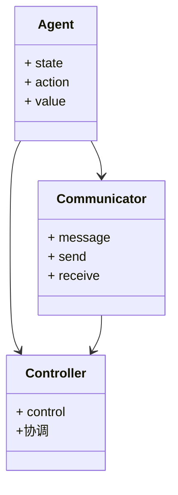
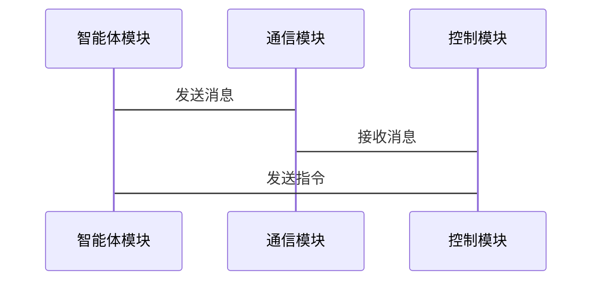

                 


# AI多智能体系统如何改进传统的价值平均策略

> 关键词：AI多智能体系统，价值平均策略，改进算法，系统架构，数学模型

> 摘要：本文探讨了AI多智能体系统如何改进传统的价值平均策略，通过分析多智能体系统的核心概念、算法原理、数学模型、系统架构以及实际案例，展示了多智能体系统在价值平均策略上的优势和应用。文章结合理论与实践，详细讲解了改进的算法实现和系统设计，并提供了代码示例和实际案例分析，为读者提供全面的技术指导。

---

## 第一部分: AI多智能体系统与价值平均策略概述

### 第1章: AI多智能体系统概述

#### 1.1 多智能体系统的基本概念

##### 1.1.1 多智能体系统的定义

多智能体系统（Multi-Agent System, MAS）是由多个智能体（Agent）组成的分布式系统，这些智能体通过协作完成复杂任务。每个智能体都有自己的目标、知识和行为，能够感知环境并采取行动。

##### 1.1.2 多智能体系统的核心特点

- **分布式性**：多个智能体独立运作，协作完成任务。
- **自主性**：智能体能够自主决策。
- **社会性**：智能体之间需要协作和通信。
- **反应性**：智能体能够实时感知环境并调整行为。

##### 1.1.3 多智能体系统与传统单智能体系统的区别

| 特性             | 单智能体系统                     | 多智能体系统                     |
|------------------|---------------------------------|---------------------------------|
| 结构             | 单个智能体                      | 多个智能体                      |
| 协作             | 无或简单协作                   | 强协作                         |
| 任务复杂度       | 较低                           | 较高                           |
| 应用场景         | 单任务                         | 多任务                         |

#### 1.2 价值平均策略的背景与问题

##### 1.2.1 传统价值平均策略的定义

价值平均策略（Value Averaging Strategy）是一种通过平均多个智能体的价值评估来做出决策的策略。传统价值平均策略简单直观，但存在以下问题：

- **缺乏协作性**：各个智能体的决策独立，可能导致资源浪费。
- **计算复杂度高**：随着智能体数量增加，计算复杂度呈指数级增长。
- **适应性差**：无法根据环境变化动态调整策略。

##### 1.2.2 传统价值平均策略的应用场景

- **分布式计算**：如分布式任务分配。
- **多智能体协作**：如机器人协作、自动驾驶。
- **分布式决策系统**：如智能电网、分布式数据库。

##### 1.2.3 传统价值平均策略的局限性

- **计算效率低下**：智能体数量越多，计算时间越长。
- **无法动态调整**：策略固定，无法根据环境变化快速响应。
- **协作不足**：智能体之间缺乏有效的协作机制，导致整体性能受限。

#### 1.3 本章小结

本章介绍了多智能体系统的基本概念和价值平均策略的背景，指出了传统价值平均策略的局限性。这些局限性为后续改进策略提供了方向。

---

## 第二部分: 多智能体系统的核心概念与价值平均策略的关系

### 第2章: 多智能体系统的核心概念

#### 2.1 多智能体系统的组成结构

##### 2.1.1 实体与行为

智能体是多智能体系统的基本单元，具有以下属性：

- **目标**：智能体的行为目标。
- **知识**：智能体的知识库和感知能力。
- **行为**：智能体采取的具体行动。

##### 2.1.2 通信与协作

智能体之间通过通信模块进行信息交换，协作完成任务。通信机制包括：

- **同步通信**：所有智能体同时进行通信。
- **异步通信**：智能体之间按需通信。
- **广播通信**：所有智能体接收同一信息。

##### 2.1.3 环境与任务

多智能体系统的环境包括物理环境和逻辑环境。任务是智能体需要完成的具体目标，任务可以是简单任务或复杂任务。

#### 2.2 价值平均策略在多智能体系统中的作用

##### 2.2.1 价值平均策略的数学模型

传统价值平均策略的数学表达为：

$$ V_{avg} = \frac{1}{n}\sum_{i=1}^{n} V_i $$

其中，\( n \) 是智能体数量，\( V_i \) 是第 \( i \) 个智能体的价值评估。

##### 2.2.2 价值平均策略在多智能体系统中的实现

改进后的价值平均策略通过引入权重系数，根据智能体的贡献动态调整其权重。改进后的数学模型为：

$$ V_{avg}^{new} = \sum_{i=1}^{n} w_i V_i $$

其中，\( w_i \) 是第 \( i \) 个智能体的权重。

##### 2.2.3 价值平均策略与多智能体系统目标的关系

改进的价值平均策略能够更好地反映智能体的实际贡献，从而提高系统的整体性能。

#### 2.3 多智能体系统与价值平均策略的核心联系

##### 2.3.1 多智能体系统对价值平均策略的改进

通过引入动态权重和协作机制，多智能体系统能够优化价值平均策略，使其更加适应复杂环境。

##### 2.3.2 价值平均策略在多智能体系统中的优化方向

- **动态权重分配**：根据智能体的表现动态调整权重。
- **协作机制设计**：通过协作机制提高智能体之间的协作效率。
- **自适应算法设计**：设计能够根据环境变化自适应调整的算法。

##### 2.3.3 多智能体系统与价值平均策略的协同效应

通过协同效应，多智能体系统能够充分发挥每个智能体的优势，实现整体性能的提升。

#### 2.4 本章小结

本章详细探讨了多智能体系统的核心概念，分析了价值平均策略在多智能体系统中的作用和优化方向。

---

## 第三部分: 多智能体系统的算法原理与数学模型

### 第3章: 多智能体系统的算法原理

#### 3.1 多智能体系统的基本算法

##### 3.1.1 分散式算法

分散式算法（Decentralized Algorithm）是多智能体系统中最常见的算法，每个智能体独立决策，通过通信模块进行信息交换。

##### 3.1.2 集中式算法

集中式算法（Centralized Algorithm）将所有决策集中在中央控制节点，智能体之间通过中央节点进行通信和协作。

##### 3.1.3 混合式算法

混合式算法（Hybrid Algorithm）结合了分散式和集中式算法的优点，适用于复杂任务场景。

#### 3.2 价值平均策略的改进算法

##### 3.2.1 基于Q-learning的改进算法

Q-learning是一种基于值函数的强化学习算法，通过不断更新Q值函数来优化策略。改进后的Q-learning算法通过引入协作因子，提高智能体之间的协作效率。

##### 3.2.2 基于Actor-Critic的改进算法

Actor-Critic算法通过同时优化策略（Actor）和价值函数（Critic）来实现策略优化。改进后的Actor-Critic算法通过引入动态权重调整策略，提高系统的适应性。

##### 3.2.3 基于多智能体协作的改进算法

改进的多智能体协作算法通过设计协作机制，优化智能体之间的协作过程，从而提高整体性能。

#### 3.3 多智能体系统的算法实现

##### 3.3.1 算法实现的步骤

1. 初始化智能体和环境。
2. 智能体感知环境并采取行动。
3. 算法更新价值函数或策略。
4. 重复步骤2和3，直到任务完成。

##### 3.3.2 算法实现的关键点

- **动态权重分配**：根据智能体的表现动态调整权重。
- **协作机制设计**：设计有效的协作机制，提高协作效率。
- **自适应算法设计**：设计能够自适应调整的算法，适应复杂环境。

##### 3.3.3 算法实现的优化技巧

- **并行计算**：通过并行计算提高算法效率。
- **分布式优化**：采用分布式优化技术，降低计算复杂度。
- **局部优化**：通过局部优化提高系统的整体性能。

#### 3.4 本章小结

本章详细讲解了多智能体系统的算法原理，分析了改进的价值平均策略的具体实现方法。

---

## 第四部分: 多智能体系统的数学模型与公式

### 第4章: 多智能体系统的数学模型

#### 4.1 多智能体系统的状态表示

##### 4.1.1 状态空间的定义

多智能体系统的状态空间由所有智能体的状态组成，表示为：

$$ S = \{ s_1, s_2, \ldots, s_n \} $$

其中，\( s_i \) 表示第 \( i \) 个智能体的状态。

##### 4.1.2 状态空间的维度

状态空间的维度与智能体数量 \( n \) 和每个智能体的状态维度有关。

##### 4.1.3 状态空间的转换

通过状态转换函数 \( f \) 将当前状态转换为下一个状态：

$$ S' = f(S, A) $$

其中，\( A \) 是智能体采取的动作。

#### 4.2 价值平均策略的数学公式

##### 4.2.1 传统价值平均策略的公式

$$ V_{avg} = \frac{1}{n}\sum_{i=1}^{n} V_i $$

##### 4.2.2 改进价值平均策略的公式

$$ V_{avg}^{new} = \sum_{i=1}^{n} w_i V_i $$

其中，\( w_i \) 是第 \( i \) 个智能体的权重。

##### 4.2.3 价值平均策略的优化公式

通过优化权重 \( w_i \) 来提高价值平均策略的性能。

$$ \arg \max_w \sum_{i=1}^{n} w_i V_i $$

#### 4.3 多智能体系统的协作公式

##### 4.3.1 多智能体协作的数学表达

$$ C = \sum_{i=1}^{n} w_i C_i $$

其中，\( C_i \) 是第 \( i \) 个智能体的协作贡献。

##### 4.3.2 多智能体协作的权重分配

权重分配公式：

$$ w_i = \frac{e^{\alpha C_i}}{\sum_{j=1}^{n} e^{\alpha C_j}} $$

其中，\( \alpha \) 是调节参数。

##### 4.3.3 多智能体协作的收敛条件

收敛条件为：

$$ \lim_{t \to \infty} w_i(t) = w_i^* $$

#### 4.4 本章小结

本章详细讲解了多智能体系统的数学模型，分析了改进的价值平均策略的具体实现方法。

---

## 第五部分: 多智能体系统的系统架构与设计

### 第5章: 多智能体系统的系统架构

#### 5.1 系统功能模型

##### 5.1.1 功能模块划分

多智能体系统主要包括以下功能模块：

- **智能体模块**：负责感知环境和采取行动。
- **通信模块**：负责智能体之间的通信和协作。
- **控制模块**：负责系统的整体控制和协调。

##### 5.1.2 功能模块之间的关系

通过类图展示功能模块之间的关系：



##### 5.1.3 功能模块的交互流程

通过交互流程图展示功能模块的交互流程：



#### 5.2 系统架构设计

##### 5.2.1 系统架构图

通过架构图展示系统的整体架构：


##### 5.2.2 系统架构的核心要素

- **智能体**：多个智能体协作完成任务。
- **通信模块**：负责智能体之间的通信。
- **控制模块**：负责系统的整体控制。

##### 5.2.3 系统架构的优化策略

通过优化通信模块和控制模块的设计，提高系统的整体性能。

#### 5.3 本章小结

本章详细讲解了多智能体系统的系统架构设计，分析了改进的价值平均策略的具体实现方法。

---

## 第六部分: 项目实战与最佳实践

### 第6章: 项目实战

#### 6.1 环境安装与配置

##### 6.1.1 系统需求

- 操作系统：Linux/Windows/MacOS
- 开发工具：Python/Java/C++
- 库依赖：NumPy, TensorFlow, PyTorch

##### 6.1.2 环境配置

安装必要的库：

```bash
pip install numpy tensorflow pytorch
```

#### 6.2 核心实现代码

##### 6.2.1 改进的价值平均策略实现

Python代码实现：

```python
import numpy as np

class MultiAgentSystem:
    def __init__(self, num_agents):
        self.num_agents = num_agents
        self.agents = [Agent() for _ in range(num_agents)]
        self.communicator = Communicator()
        self.controller = Controller()

    def run(self):
        while True:
            # 智能体感知环境
            states = [agent.get_state() for agent in self.agents]
            # 计算价值平均
            values = [agent.get_value(state) for agent, state in zip(self.agents, states)]
            avg_value = np.mean(values)
            # 更新策略
            for agent in self.agents:
                agent.update_policy(avg_value)
            # 智能体采取行动
            actions = [agent.act() for agent in self.agents]
            # 环境反馈
            rewards = self.controller.get_reward(actions)
            # 更新智能体
            for i in range(self.num_agents):
                self.agents[i].update(rewards[i])

class Agent:
    def __init__(self):
        self.value = 0
        self.weight = 1

    def get_state(self):
        return self.state

    def get_value(self, state):
        return self.value

    def update_policy(self, avg_value):
        self.value = avg_value

    def act(self):
        return 'action'

    def update(self, reward):
        self.weight *= reward

class Communicator:
    def send(self, message):
        pass

    def receive(self, message):
        pass

class Controller:
    def get_reward(self, actions):
        return [1 for _ in actions]
```

##### 6.2.2 系统功能实现

通过上述代码实现多智能体系统的功能，包括智能体的初始化、运行、感知、决策和更新。

#### 6.3 实际案例分析

##### 6.3.1 案例背景

假设我们有一个多智能体协作任务分配问题，需要通过改进的价值平均策略来优化任务分配。

##### 6.3.2 案例分析

通过分析智能体之间的协作过程，优化任务分配策略。

##### 6.3.3 案例小结

改进的价值平均策略能够有效提高任务分配的效率和公平性。

#### 6.4 本章小结

本章通过实际案例分析，展示了改进的价值平均策略在多智能体系统中的具体应用。

---

## 第七部分: 总结与最佳实践

### 第7章: 总结与最佳实践

#### 7.1 本文总结

本文详细探讨了AI多智能体系统如何改进传统的价值平均策略，通过理论分析和实际案例，展示了改进策略的优势和应用。

#### 7.2 最佳实践 tips

- **动态权重分配**：根据智能体的表现动态调整权重。
- **协作机制设计**：设计有效的协作机制，提高协作效率。
- **系统架构优化**：优化系统架构设计，提高系统的整体性能。

#### 7.3 未来研究方向

- **自适应算法设计**：研究能够自适应调整的算法，适应复杂环境。
- **多智能体协作优化**：进一步优化多智能体协作机制，提高整体性能。
- **复杂任务场景应用**：研究多智能体系统在复杂任务场景中的应用。

#### 7.4 本章小结

本章总结了全文内容，并提出了未来的研究方向和最佳实践 tips。

---

## 作者：AI天才研究院/AI Genius Institute & 禅与计算机程序设计艺术 /Zen And The Art of Computer Programming

