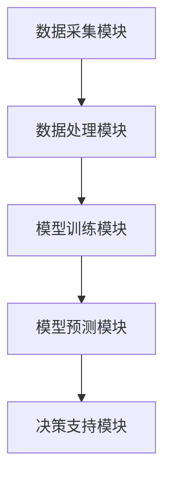

                 


# 利用AI agents构建动态行业生命周期模型：把握产业演变

> 关键词：动态行业生命周期模型，AI agents，产业演变分析，数据驱动建模，智能决策支持

> 摘要：本文探讨了利用AI agents构建动态行业生命周期模型的方法，分析了如何通过AI技术实时捕捉和预测行业演变趋势。文章从行业生命周期模型的基本概念出发，详细阐述了AI agents在模型构建中的应用，包括数据采集与处理、模型训练与优化、系统架构设计等关键环节。通过实际案例分析，展示了如何利用动态行业生命周期模型为企业提供智能决策支持，助力企业在快速变化的市场环境中把握先机。

---

# 第一部分：行业生命周期模型与AI agents概述

# 第1章：行业生命周期模型与AI agents概述

## 1.1 行业生命周期模型的基本概念

### 1.1.1 行业生命周期的定义
行业生命周期（Industry Life Cycle）是指一个行业从诞生到成熟，再到衰退或转型的动态演变过程。这一过程通常包括以下几个阶段：
1. **导入期（Introduction）**：行业初具雏形，市场需求较低，技术不成熟。
2. **增长期（Growth）**：市场需求快速上升，行业规模扩大。
3. **成熟期（Maturity）**：市场趋于饱和，竞争加剧，行业进入稳定发展阶段。
4. **衰退期（Decline）**：市场需求下降，行业逐渐衰退或转型。

### 1.1.2 行业生命周期的阶段划分
行业的生命周期可以通过多种维度进行划分，包括市场规模、市场竞争程度、技术发展水平等。每个阶段的特点如下：

| 阶段 | 市场规模 | 竞争程度 | 技术水平 |
|------|----------|----------|----------|
| 导入期 | 小       | 低       | 初级     |
| 增长期 | 中       | 中       | 发展     |
| 成熟期 | 大       | 高       | 高级     |
| 衰退期 | 缩小     | 高或低   | 静止或衰退 |

### 1.1.3 行业生命周期模型的核心要素
行业生命周期模型的核心要素包括：
- **时间维度**：行业的演变过程需要时间的积累。
- **市场需求**：市场需求的变化是驱动行业演变的核心动力。
- **竞争格局**：行业内企业的数量、市场份额和竞争策略的变化。
- **技术创新**：技术进步推动行业的升级和转型。

## 1.2 AI agents的基本概念

### 1.2.1 AI agents的定义
AI agents（人工智能代理）是指能够感知环境、自主决策并执行任务的智能实体。与传统的算法模型不同，AI agents具有以下特点：
1. **自主性**：能够自主决策，无需外部干预。
2. **反应性**：能够实时感知环境变化并做出响应。
3. **学习能力**：能够通过经验改进自身的决策能力。

### 1.2.2 AI agents的分类
AI agents可以根据功能和应用场景分为以下几类：
1. **简单反射型AI agents**：基于规则的简单决策，适用于低复杂度场景。
2. **基于模型的AI agents**：通过构建模型进行决策，适用于复杂场景。
3. **学习型AI agents**：通过机器学习算法不断优化决策能力。

### 1.2.3 AI agents与传统算法的区别
AI agents与传统算法的主要区别在于：
- **自主性**：AI agents能够自主决策，而传统算法需要人工干预。
- **适应性**：AI agents能够适应环境变化，而传统算法通常需要重新训练。
- **实时性**：AI agents能够实时响应，而传统算法通常需要批处理。

## 1.3 行业生命周期模型与AI agents的结合

### 1.3.1 行业生命周期模型的动态性
行业生命周期模型的动态性体现在以下几个方面：
- **市场需求的变化**：消费者偏好、经济环境等因素的变化会影响行业的发展阶段。
- **竞争格局的变化**：行业内企业的数量、市场份额和竞争策略的变化会影响行业的演变。
- **技术进步的影响**：新技术的出现会推动行业的升级和转型。

### 1.3.2 AI agents在动态模型中的作用
AI agents在动态行业生命周期模型中的作用包括：
- **实时数据采集**：AI agents能够实时采集行业相关的数据，如市场需求、竞争格局等。
- **动态分析**：AI agents能够基于实时数据动态调整模型参数，提高模型的预测精度。
- **智能决策支持**：AI agents能够为企业的战略决策提供实时支持，帮助企业更好地把握行业演变趋势。

### 1.3.3 行业生命周期模型与AI agents的结合优势
行业生命周期模型与AI agents的结合优势主要体现在以下几个方面：
- **实时性**：AI agents能够实时感知行业变化，确保模型的动态性。
- **智能化**：AI agents通过机器学习算法不断优化模型，提高预测精度。
- **灵活性**：AI agents能够根据环境变化动态调整模型，适应不同的行业演变阶段。

## 1.4 本章小结

### 1.4.1 本章核心内容回顾
- 行业生命周期模型的基本概念和阶段划分。
- AI agents的定义、分类及其与传统算法的区别。
- 行业生命周期模型与AI agents结合的优势。

### 1.4.2 下一章内容预告
下一章将详细介绍动态行业生命周期模型的构建方法，包括数据采集与处理、模型训练与优化等关键环节。

---

# 第2章：动态行业生命周期模型的构建方法

## 2.1 数据采集与处理

### 2.1.1 数据来源与采集方法
动态行业生命周期模型的数据来源包括：
1. **公开数据**：如行业报告、市场调研数据等。
2. **企业内部数据**：如销售数据、客户反馈等。
3. **实时数据**：如社交媒体数据、实时市场动态等。

数据采集方法包括：
- **网络爬虫**：通过爬虫技术采集公开数据。
- **API接口**：通过API接口获取实时数据。
- **数据订阅**：通过数据订阅服务获取行业动态。

### 2.1.2 数据清洗与预处理
数据清洗与预处理是构建动态模型的关键步骤，主要包括：
1. **去重**：去除重复数据。
2. **去噪**：去除噪声数据，如异常值。
3. **标准化**：对数据进行标准化处理，确保模型的输入一致。

### 2.1.3 数据特征提取
数据特征提取是构建模型的重要步骤，主要包括：
- **时间序列特征**：如趋势、周期性等。
- **行业特征**：如市场规模、竞争格局等。
- **技术特征**：如技术创新速度、技术成熟度等。

## 2.2 行业生命周期模型的构建

### 2.2.1 模型构建的基本步骤
动态行业生命周期模型的构建步骤如下：
1. **数据采集与处理**：采集和清洗数据。
2. **特征提取**：提取模型所需特征。
3. **模型训练**：基于特征训练模型。
4. **模型验证**：验证模型的准确性和稳定性。
5. **模型优化**：优化模型参数，提高预测精度。

### 2.2.2 模型参数的选择与优化
模型参数的选择与优化是构建动态模型的关键步骤，主要包括：
- **特征选择**：选择对模型预测最重要的特征。
- **模型选择**：选择适合的模型结构，如时间序列模型、机器学习模型等。
- **参数调优**：通过网格搜索等方法优化模型参数。

### 2.2.3 模型的验证与评估
模型的验证与评估是构建动态模型的重要环节，主要包括：
- **交叉验证**：通过交叉验证评估模型的泛化能力。
- **性能指标**：如准确率、召回率、F1值等。
- **实时验证**：通过实时数据验证模型的预测能力。

## 2.3 AI agents在模型构建中的应用

### 2.3.1 AI agents在数据处理中的作用
AI agents在数据处理中的作用包括：
- **实时数据采集**：AI agents能够实时采集行业数据，确保模型的动态性。
- **数据预处理**：AI agents能够自动清洗和标准化数据，提高数据质量。

### 2.3.2 AI agents在模型优化中的应用
AI agents在模型优化中的作用包括：
- **自动参数调优**：AI agents能够通过机器学习算法自动优化模型参数。
- **动态模型更新**：AI agents能够根据实时数据动态更新模型，确保模型的准确性。

### 2.3.3 AI agents在模型预测中的应用
AI agents在模型预测中的作用包括：
- **实时预测**：AI agents能够实时预测行业演变趋势。
- **智能决策支持**：AI agents能够为企业的战略决策提供实时支持。

## 2.4 本章小结

### 2.4.1 本章核心内容回顾
- 数据采集与处理：数据来源、数据清洗与预处理、数据特征提取。
- 模型构建：模型构建的基本步骤、模型参数的选择与优化、模型的验证与评估。
- AI agents在模型构建中的应用：数据处理、模型优化、模型预测。

### 2.4.2 下一章内容预告
下一章将详细介绍AI agents的基本原理，包括AI agents的体系结构、训练方法等。

---

# 第3章：AI agents的基本原理

## 3.1 AI agents的体系结构

### 3.1.1 AI agents的组成要素
AI agents的体系结构主要包括以下要素：
1. **感知层**：负责感知环境，获取实时数据。
2. **决策层**：负责分析数据，制定决策策略。
3. **执行层**：负责执行决策，输出结果。

### 3.1.2 AI agents的通信机制
AI agents的通信机制包括：
- **内部通信**：AI agents内部各模块之间的通信。
- **外部通信**：AI agents与其他系统或AI agents之间的通信。

### 3.1.3 AI agents的协作机制
AI agents的协作机制包括：
- **任务分配**：根据任务需求分配AI agents的角色和任务。
- **协同决策**：多个AI agents协作完成复杂任务。
- **冲突解决**：解决AI agents之间的冲突，确保协作顺利进行。

## 3.2 AI agents的训练方法

### 3.2.1 监督学习
监督学习是AI agents训练的重要方法，主要包括：
- **数据标注**：对数据进行标注，标注数据用于训练模型。
- **模型训练**：基于标注数据训练模型。
- **模型评估**：评估模型的准确性和稳定性。

### 3.2.2 无监督学习
无监督学习是AI agents训练的另一种方法，主要包括：
- **聚类分析**：将数据分成不同的类别，发现数据中的潜在结构。
- **异常检测**：检测数据中的异常值，发现潜在的异常情况。

### 3.2.3 强化学习
强化学习是AI agents训练的重要方法，主要包括：
- **环境定义**：定义AI agents所处的环境。
- **动作选择**：AI agents根据当前状态选择动作。
- **奖励机制**：根据动作的结果给予奖励或惩罚，优化AI agents的决策策略。

---

# 第4章：AI agents在行业分析中的应用

## 4.1 行业数据分析与AI agents

### 4.1.1 数据预处理与特征提取
行业数据分析的关键步骤包括：
- **数据预处理**：清洗和标准化数据。
- **特征提取**：提取对行业分析重要的特征。

### 4.1.2 数据分析与建模
数据分析与建模是行业分析的核心步骤，主要包括：
- **数据可视化**：通过可视化工具展示数据的分布和趋势。
- **模型训练**：基于数据训练行业分析模型。
- **模型评估**：评估模型的准确性和稳定性。

## 4.2 AI agents在行业预测中的应用

### 4.2.1 行业趋势预测
AI agents可以通过机器学习算法预测行业的未来发展趋势，帮助企业提前制定战略。

### 4.2.2 竞争对手分析
AI agents可以通过分析竞争对手的数据，帮助企业制定更有效的竞争策略。

### 4.2.3 市场需求预测
AI agents可以通过分析市场需求数据，帮助企业预测未来的市场需求，优化产品和服务。

## 4.3 案例分析：AI agents在某行业的应用

### 4.3.1 案例背景
以某行业为例，介绍AI agents在该行业的具体应用。

### 4.3.2 模型构建与训练
介绍模型构建与训练的具体步骤，包括数据采集、特征提取、模型选择等。

### 4.3.3 模型预测与分析
介绍模型预测的结果，分析行业未来的发展趋势。

## 4.4 本章小结

### 4.4.1 本章核心内容回顾
- AI agents在行业数据分析中的应用：数据预处理、特征提取、数据分析与建模。
- AI agents在行业预测中的应用：行业趋势预测、竞争对手分析、市场需求预测。
- 案例分析：AI agents在某行业的具体应用。

### 4.4.2 下一章内容预告
下一章将详细介绍动态行业生命周期模型的分析与优化，包括模型评估、优化方法等。

---

# 第5章：动态行业生命周期模型的分析与优化

## 5.1 模型评估

### 5.1.1 评估指标
模型评估的关键指标包括：
- **准确率**：模型预测的准确率。
- **召回率**：模型预测的召回率。
- **F1值**：模型的综合评估指标。

### 5.1.2 评估方法
模型评估的方法包括：
- **交叉验证**：通过交叉验证评估模型的泛化能力。
- **对比实验**：将模型与传统算法进行对比，评估模型的优势。

## 5.2 模型优化

### 5.2.1 参数优化
模型优化的关键步骤包括：
- **网格搜索**：通过网格搜索优化模型参数。
- **随机搜索**：通过随机搜索优化模型参数。

### 5.2.2 模型调优
模型调优的关键步骤包括：
- **特征选择**：选择对模型预测最重要的特征。
- **模型结构优化**：优化模型结构，提高模型的预测精度。

## 5.3 AI agents在模型优化中的应用

### 5.3.1 自动参数调优
AI agents可以通过机器学习算法自动优化模型参数，提高模型的预测精度。

### 5.3.2 动态模型更新
AI agents可以根据实时数据动态更新模型，确保模型的准确性和稳定性。

## 5.4 本章小结

### 5.4.1 本章核心内容回顾
- 模型评估：评估指标、评估方法。
- 模型优化：参数优化、模型调优。
- AI agents在模型优化中的应用：自动参数调优、动态模型更新。

### 5.4.2 下一章内容预告
下一章将详细介绍动态行业生命周期模型的实际应用案例，包括系统架构设计、系统实现等。

---

# 第6章：动态行业生命周期模型的实际应用案例

## 6.1 系统架构设计

### 6.1.1 系统功能设计
系统功能设计包括：
- **数据采集模块**：负责实时采集行业数据。
- **数据处理模块**：负责数据清洗与预处理。
- **模型训练模块**：负责模型训练与优化。
- **模型预测模块**：负责行业演变趋势的预测。
- **决策支持模块**：为企业提供智能决策支持。

### 6.1.2 系统架构图
以下是系统的架构图：



## 6.2 系统实现

### 6.2.1 环境安装
系统实现的环境要求包括：
- **编程语言**：Python 3.8+
- **框架**：TensorFlow 2.0+，Keras 2.0+
- **工具库**：Pandas, Scikit-learn, Matplotlib等。

### 6.2.2 核心代码实现
以下是核心代码实现：

```python
import numpy as np
import pandas as pd
from sklearn.model import Sequential
from sklearn.preprocessing import MinMaxScaler
from tensorflow.keras.layers import LSTM, Dense

# 数据预处理
data = pd.read_csv('industry_data.csv')
scaler = MinMaxScaler()
scaled_data = scaler.fit_transform(data)

# 模型构建
model = Sequential()
model.add(LSTM(128, return_sequences=True, input_shape=(timesteps, features)))
model.add(Dense(1))
model.compile(optimizer='adam', loss='mean_squared_error')

# 模型训练
model.fit(X_train, y_train, epochs=100, batch_size=32)
```

## 6.3 实际案例分析

### 6.3.1 案例背景
以某行业为例，介绍动态行业生命周期模型的实际应用。

### 6.3.2 数据分析与建模
介绍数据分析与建模的具体步骤，包括数据采集、特征提取、模型训练等。

### 6.3.3 模型预测与分析
介绍模型预测的结果，分析行业未来的发展趋势。

## 6.4 本章小结

### 6.4.1 本章核心内容回顾
- 系统架构设计：数据采集模块、数据处理模块、模型训练模块、模型预测模块、决策支持模块。
- 系统实现：环境安装、核心代码实现。
- 实际案例分析：案例背景、数据分析与建模、模型预测与分析。

### 6.4.2 下一章内容预告
下一章将总结全书内容，并展望未来的发展方向。

---

# 第7章：总结与展望

## 7.1 全书总结

### 7.1.1 核心内容回顾
- 行业生命周期模型与AI agents的基本概念。
- 动态行业生命周期模型的构建方法。
- AI agents在行业分析中的应用。
- 模型的分析与优化。
- 实际应用案例分析。

### 7.1.2 本书的核心观点
通过AI agents构建动态行业生命周期模型，能够实时捕捉行业演变趋势，为企业提供智能决策支持。

## 7.2 未来展望

### 7.2.1 技术发展趋势
随着AI技术的不断发展，动态行业生命周期模型将更加智能化和实时化。

### 7.2.2 应用前景
AI agents在行业分析中的应用前景广阔，未来将覆盖更多的行业和领域。

## 7.3 本章小结

### 7.3.1 本章核心内容回顾
- 全书总结：核心内容回顾、本书的核心观点。
- 未来展望：技术发展趋势、应用前景。

### 7.3.2 结束语
感谢读者的阅读，希望本书能为读者提供有价值的见解和启发。

---

# 作者：AI天才研究院/AI Genius Institute & 禅与计算机程序设计艺术 /Zen And The Art of Computer Programming

