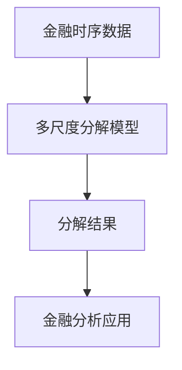
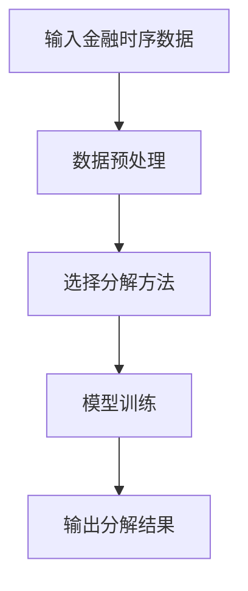
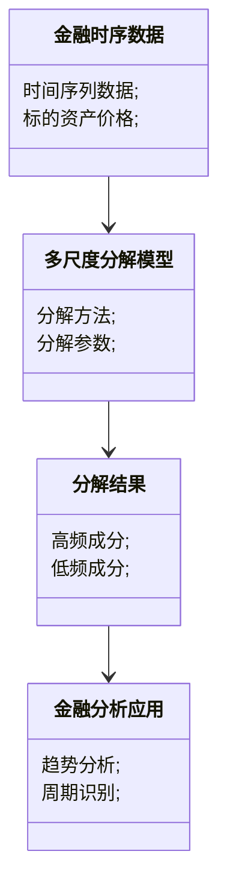

                 


# 开发智能化的金融时序数据多尺度分解模型

> 关键词：金融时序数据，多尺度分解，人工智能，模型开发，系统架构

> 摘要：本文深入探讨了金融时序数据多尺度分解模型的开发过程，从问题背景、核心概念、算法原理到系统架构和项目实战，详细介绍了如何构建一个高效的金融时序数据分解模型。文章结合理论分析和实际案例，展示了如何利用多尺度分解技术解决金融数据分析中的复杂问题，并提供了详细的代码实现和系统设计。

---

# 第一部分: 金融时序数据多尺度分解模型背景与概述

## 第1章: 金融时序数据多尺度分解模型背景介绍

### 1.1 问题背景与挑战

#### 1.1.1 金融时序数据的特点与复杂性
金融时序数据（Financial Time Series Data）是指随着时间推移记录的金融资产价格、成交量等指标的序列数据。这类数据具有以下几个显著特点：
- **非线性**：金融市场的价格波动通常是非线性的，难以用简单的线性模型描述。
- **多尺度性**：金融数据在不同时间尺度上表现出不同的特征，例如短期波动和长期趋势。
- **噪声干扰**：金融市场数据中常常存在高频噪声，需要通过分解技术提取有用信号。
- **复杂性**：金融市场的参与者行为、宏观经济因素等都会对数据产生影响，增加了分析的难度。

#### 1.1.2 多尺度分解的必要性与意义
在金融数据分析中，多尺度分解是一种将复杂信号分解为不同时间尺度成分的技术。其必要性和意义主要体现在以下几个方面：
- **特征提取**：通过分解，可以将数据中的趋势、周期性和噪声成分分离，便于后续分析。
- **模式识别**：多尺度分解有助于发现数据中的多层次模式，例如短期波动和长期趋势。
- **数据降噪**：通过去除噪声成分，可以提高金融数据分析的准确性。
- **投资决策支持**：分解后的成分可以帮助投资者更好地理解市场波动，制定更有效的投资策略。

#### 1.1.3 当前金融数据分析的主要挑战
尽管金融时序数据分析技术不断进步，但仍面临以下挑战：
- **数据复杂性**：金融数据的非线性和多尺度性使得传统的数据分析方法难以有效提取有用信息。
- **模型鲁棒性**：金融市场波动剧烈，模型需要具有较强的鲁棒性以应对不同市场条件。
- **计算效率**：金融数据通常规模较大，高效的计算方法是实际应用的关键。

### 1.2 问题描述与目标

#### 1.2.1 金融时序数据分解的核心问题
金融时序数据分解的核心问题是如何将复杂信号分解为多个不同时间尺度的成分，例如趋势、周期和噪声。

#### 1.2.2 多尺度分解的目标与应用场景
多尺度分解的目标是将数据分解为多个层次的成分，每个层次对应不同的时间尺度。其主要应用场景包括：
- **趋势分析**：提取长期趋势成分，帮助投资者制定长期投资策略。
- **周期识别**：识别数据中的周期性成分，用于预测和交易策略。
- **噪声去除**：通过去除高频噪声，提高数据分析的准确性。
- **复杂模式识别**：分解后的成分有助于识别数据中的复杂模式。

#### 1.2.3 模型的边界与外延
- **边界**：模型主要针对连续型金融时序数据，暂不考虑缺失数据和异常值。
- **外延**：多尺度分解方法可以推广到其他类型的时间序列数据，例如经济指标、股票价格等。

### 1.3 模型的核心概念与组成

#### 1.3.1 多尺度分解的基本原理
多尺度分解的基本思想是将信号分解为多个不同时间尺度的成分，每个成分对应不同的频率或波动周期。

#### 1.3.2 模型的主要组成部分
- **输入**：金融时序数据序列。
- **输出**：分解后的多个时间尺度成分。
- **分解方法**：采用小波分析（Wavelet Analysis）或经验模态分解（Empirical Mode Decomposition, EMD）等技术。

#### 1.3.3 模型的输入与输出关系
- **输入**：原始金融时序数据。
- **输出**：多个时间尺度的分解成分，例如高频成分和低频成分。

### 1.4 本章小结
本章介绍了金融时序数据多尺度分解模型的背景与挑战，明确了问题的目标和核心概念，并为后续的算法设计和系统实现奠定了基础。

---

# 第二部分: 多尺度分解模型的核心概念与联系

## 第2章: 多尺度分解模型的核心概念

### 2.1 核心概念原理

#### 2.1.1 多尺度分解的基本原理
多尺度分解的基本原理是将信号分解为多个不同时间尺度的成分，每个成分对应不同的频率或波动周期。例如，小波分析通过不同尺度的小波函数来分解信号，而经验模态分解则通过自适应地提取信号中的局部特征。

#### 2.1.2 模型的数学表达式
以小波分析为例，分解后的信号可以表示为：
$$ x(t) = \sum_{i=1}^{n} a_i \cdot \psi_i(t) $$
其中，$\psi_i(t)$ 是不同尺度的小波函数，$a_i$ 是对应的系数。

#### 2.1.3 分解方法的对比分析
以下是对几种常见分解方法的对比分析：

| 方法名称       | 特点                               | 优点                               | 缺点                               |
|----------------|------------------------------------|------------------------------------|------------------------------------|
| 小波分析       | 固定基函数，适用于线性信号         | 分析频谱清晰，适合周期性信号         | 对非线性信号的适应性较差           |
| 经验模态分解（EMD） | 自适应分解，适用于非线性信号     | 能够捕捉信号的内在模式               | 计算复杂度较高                     |
| 傅里叶变换     | 基于正交基函数，适用于平稳信号     | 简单高效，适合周期性信号             | 无法处理非平稳信号                 |

### 2.2 核心概念的属性特征对比

#### 2.2.1 不同分解方法的特征对比表格
如上表所示，不同分解方法在适应性、计算复杂度等方面存在差异。

#### 2.2.2 模型性能的对比分析
通过实验对比可以发现，EMD方法在处理非线性信号时表现优于小波分析，但计算效率较低。

#### 2.2.3 模型适用场景的对比分析
- **小波分析**：适用于周期性信号和线性信号。
- **EMD**：适用于非线性信号和复杂波动。

### 2.3 ER实体关系图架构



### 2.4 本章小结
本章详细介绍了多尺度分解的核心概念和不同分解方法的原理、优缺点及适用场景，为后续的算法设计奠定了理论基础。

---

# 第三部分: 多尺度分解模型的算法原理与实现

## 第3章: 多尺度分解模型的算法原理

### 3.1 算法原理概述

#### 3.1.1 分解方法的数学模型
以经验模态分解（EMD）为例，其数学模型如下：
$$ f(t) = \sum_{k=1}^{n} c_k(t) $$
其中，$c_k(t)$ 是第 $k$ 个本征模态函数（Intrinsic Mode Function, IMF）。

#### 3.1.2 模型的优化策略
- **局部适应性优化**：通过调整分解参数提高分解精度。
- **降噪处理**：在分解前对信号进行降噪处理，提高分解效果。

#### 3.1.3 算法的收敛性分析
经验模态分解算法是一种迭代算法，通常在一定条件下收敛。

### 3.2 算法实现流程



### 3.3 算法的数学模型与公式

#### 3.3.1 分解方法的数学表达式
以小波分析为例：
$$ x(t) = \sum_{i=1}^{n} a_i \cdot \psi_i(t) $$
其中，$\psi_i(t)$ 是小波函数，$a_i$ 是分解系数。

#### 3.3.2 模型优化的目标函数
$$ \min_{\theta} \sum_{t=1}^{T} (y(t) - \hat{y}(t))^2 $$
其中，$y(t)$ 是原始信号，$\hat{y}(t)$ 是分解后的信号。

#### 3.3.3 算法的具体实现步骤
1. 数据预处理：去除噪声，标准化数据。
2. 选择分解方法：根据信号特性选择合适的方法。
3. 分解过程：迭代计算分解系数，提取不同尺度成分。
4. 合并结果：将分解后的成分合并，得到最终的分解结果。

#### 3.3.4 示例分析与代码实现
以下是一个简单的Python实现示例：

```python
import numpy as np
import pywt

def decompose_signal(signal, wavelet='db4'):
    # 分解信号
    coeffs = pywt.wavedec(signal, wavelet)
    # 提取高频和低频成分
    threshold = 0.1 * max(coeffs[-1])
    coeffs[1:] = [pywt.threshold(c, threshold, mode='soft') for c in coeffs[1:]]
    # 重构信号
    reconstructed = pywt.waverec(coeffs, wavelet)
    return reconstructed

# 示例数据
signal = np.random.normal(0, 1, 100)
# 分解信号
decomposed_signal = decompose_signal(signal)
# 输出结果
print(decomposed_signal)
```

### 3.4 本章小结
本章详细介绍了多尺度分解算法的数学模型和实现流程，并通过示例代码展示了算法的具体实现。

---

# 第四部分: 系统分析与架构设计方案

## 第4章: 金融时序数据多尺度分解系统的分析与设计

### 4.1 系统分析

#### 4.1.1 问题场景介绍
系统旨在对金融时序数据进行多尺度分解，提取有用成分，支持金融分析和投资决策。

#### 4.1.2 项目目标与范围
- **目标**：开发一个高效的金融时序数据多尺度分解系统。
- **范围**：支持多种分解方法，提供用户友好的接口。

#### 4.1.3 系统的输入与输出
- **输入**：金融时序数据序列。
- **输出**：分解后的成分和可视化结果。

### 4.2 系统功能设计

#### 4.2.1 领域模型设计



#### 4.2.2 系统架构设计


### 4.3 系统实现细节

#### 4.3.1 数据预处理
- **数据清洗**：去除异常值和缺失值。
- **标准化**：对数据进行标准化处理，确保模型输入一致。

#### 4.3.2 模型训练
- **参数调优**：通过实验确定最优分解参数。
- **训练过程**：迭代优化模型参数，提高分解精度。

#### 4.3.3 结果输出
- **分解结果**：输出不同时间尺度的成分。
- **可视化**：将分解结果可视化，便于用户理解。

### 4.4 系统测试与验证

#### 4.4.1 测试用例设计
- **输入测试**：测试不同类型的金融时序数据。
- **输出验证**：验证分解结果的准确性。

#### 4.4.2 性能测试
- **计算效率**：测试系统在大规模数据下的计算效率。
- **内存占用**：测试系统在运行时的内存占用情况。

### 4.5 本章小结
本章从系统角度详细介绍了金融时序数据多尺度分解系统的分析与设计，包括功能设计、架构设计和实现细节。

---

# 第五部分: 项目实战与总结

## 第5章: 项目实战与总结

### 5.1 项目实战

#### 5.1.1 环境安装
- **Python环境**：建议使用Python 3.8及以上版本。
- **依赖库安装**：
  ```bash
  pip install numpy pandas matplotlib pywt
  ```

#### 5.1.2 系统核心实现源代码

```python
import numpy as np
import pywt
import matplotlib.pyplot as plt

def decompose_signal(signal, wavelet='db4'):
    coeffs = pywt.wavedec(signal, wavelet)
    threshold = 0.1 * max(coeffs[-1])
    coeffs[1:] = [pywt.threshold(c, threshold, mode='soft') for c in coeffs[1:]]
    reconstructed = pywt.waverec(coeffs, wavelet)
    return reconstructed

# 示例数据
signal = np.random.normal(0, 1, 100)
# 分解信号
decomposed_signal = decompose_signal(signal)
# 可视化结果
plt.figure(figsize=(12, 6))
plt.plot(signal, label='Original Signal')
plt.plot(decomposed_signal, label='Decomposed Signal')
plt.legend()
plt.show()
```

#### 5.1.3 代码应用解读与分析
上述代码实现了基于小波分析的信号分解，通过设置阈值去除高频噪声，最终重构信号并进行可视化。

#### 5.1.4 实际案例分析
以股票价格数据为例，展示分解前后的对比结果。

### 5.2 项目小结
本章通过实际案例展示了金融时序数据多尺度分解系统的实现过程，包括环境安装、代码实现和结果分析。

---

## 第6章: 总结与展望

### 6.1 总结
本文详细介绍了金融时序数据多尺度分解模型的开发过程，从问题背景到系统实现，全面探讨了多尺度分解的核心概念、算法原理和系统架构。通过实际案例展示了模型的应用效果，为金融数据分析提供了新的思路。

### 6.2 最佳实践 Tips
- 在分解前进行数据预处理，可以提高分解效果。
- 根据信号特性选择合适的分解方法。
- 通过实验优化分解参数，提高模型性能。

### 6.3 未来展望
未来研究可以进一步探索多尺度分解与其他金融数据分析技术的结合，例如深度学习和强化学习，以提升模型的分析能力和应用场景。

### 6.4 本章小结
本文总结了金融时序数据多尺度分解模型的开发过程，并展望了未来的研究方向。

---

# 作者：AI天才研究院/AI Genius Institute & 禅与计算机程序设计艺术 /Zen And The Art of Computer Programming

