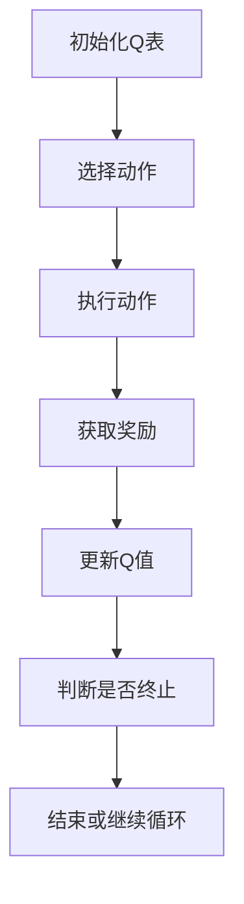
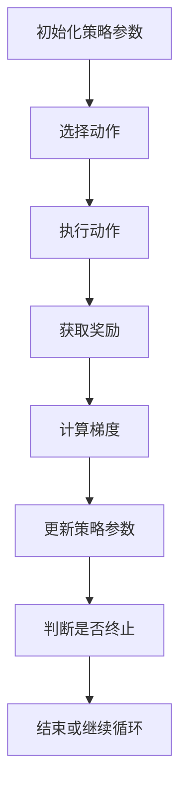
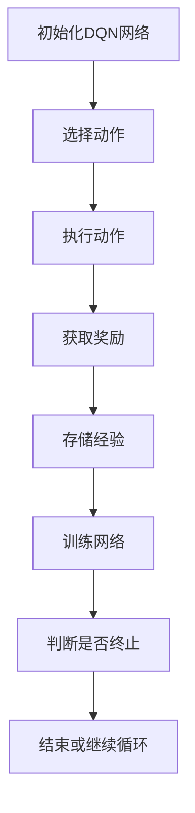
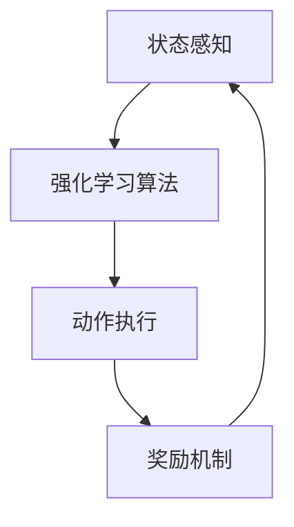

                 


# 强化学习驱动的AI Agent自主探索与学习

> 关键词：强化学习，AI Agent，马尔可夫决策过程，Q-learning，策略梯度，深度强化学习

> 摘要：本文详细探讨了强化学习在AI Agent自主探索与学习中的应用，从基础概念到高级算法，结合实际案例分析，帮助读者全面理解强化学习驱动的AI Agent的核心原理和实现方法。

---

# 第一部分: 强化学习驱动的AI Agent背景与基础

# 第1章: 强化学习与AI Agent概述

## 1.1 强化学习的基本概念

### 1.1.1 强化学习的定义与特点

强化学习（Reinforcement Learning，RL）是一种机器学习范式，通过智能体与环境的交互来学习策略，以最大化累积的奖励。其核心特点是：

- **自主性**：智能体在没有明确指导的情况下，通过试错学习。
- **延迟反馈**：奖励通常在多个动作之后才给出。
- **目标导向**：通过优化累积奖励来实现特定目标。

### 1.1.2 强化学习的核心要素：状态、动作、奖励

- **状态（State）**：环境在某一时刻的信息表示，例如在迷宫中的位置。
- **动作（Action）**：智能体在某个状态下做出的选择，例如向左或向右移动。
- **奖励（Reward）**：智能体执行动作后获得的反馈，用于指导学习方向。

### 1.1.3 强化学习与监督学习、无监督学习的区别

| 类别       | 数据类型       | 目标                       | 是否需要标签 |
|------------|----------------|-----------------------------|--------------|
| 监督学习     | 结构化数据       | 预测特定输出               | 需要标签     |
| 无监督学习   | 未标记数据       | 发现数据中的结构或模式       | 不需要标签   |
| 强化学习     | 状态和动作       | 最大化累积奖励             | 延迟反馈     |

### 1.1.4 强化学习的主要应用场景

- **游戏AI**：如AlphaGo、Dota AI。
- **机器人控制**：如自动驾驶汽车。
- **智能推荐系统**：如动态调整推荐策略。

## 1.2 AI Agent的基本概念

### 1.2.1 AI Agent的定义与分类

- **定义**：AI Agent是指能够感知环境、做出决策并执行动作的智能实体。
- **分类**：
  - **简单反射型Agent**：基于当前状态做出反应。
  - **基于模型的规划型Agent**：使用环境模型进行决策。
  - **实用推理型Agent**：结合效用函数进行决策。
  - **学习型Agent**：通过学习改进自身策略。

### 1.2.2 AI Agent的核心能力：感知、决策、执行

- **感知**：通过传感器获取环境信息。
- **决策**：基于感知信息选择最优动作。
- **执行**：将决策转化为实际动作。

### 1.2.3 强化学习在AI Agent中的作用

强化学习为AI Agent提供了从环境中学习策略的能力，使其能够在复杂环境中自主优化行为。

## 1.3 强化学习驱动的AI Agent的应用场景

### 1.3.1 游戏AI

- **案例**：AlphaGo在围棋中的应用。
- **优势**：强化学习能够通过大量对弈快速优化策略。

### 1.3.2 机器人控制

- **案例**：工业机器人在复杂环境中的自主操作。
- **优势**：强化学习能够帮助机器人在动态环境中快速适应。

### 1.3.3 自动驾驶

- **案例**：特斯拉的自动驾驶系统。
- **优势**：强化学习能够处理复杂的交通场景。

### 1.3.4 智能推荐系统

- **案例**：Netflix的内容推荐系统。
- **优势**：强化学习能够根据用户行为动态调整推荐策略。

## 1.4 本章小结

本章介绍了强化学习和AI Agent的基本概念，探讨了强化学习在AI Agent中的作用及其应用场景。

---

# 第2章: 强化学习的核心概念与数学模型

## 2.1 马尔可夫决策过程（MDP）

### 2.1.1 状态空间与动作空间

- **状态空间**：所有可能的状态集合，通常用S表示。
- **动作空间**：智能体在每个状态下可能执行的动作集合，通常用A表示。

### 2.1.2 奖励函数与价值函数

- **奖励函数（R）**：定义智能体执行动作后的奖励值。
- **价值函数（V）**：衡量一个状态的期望累积奖励。

### 2.1.3 策略与价值函数的关系

- **策略（π）**：定义智能体在每个状态下选择动作的概率分布。
- **价值函数（Q）**：衡量一个状态下采取某个动作的期望累积奖励。

### 2.1.4 动态规划与强化学习的关系

动态规划是一种用于解决马尔可夫决策过程的规划方法，强化学习则是动态规划的一种扩展，允许智能体通过试错学习来优化策略。

## 2.2 Q-learning算法

### 2.2.1 Q-learning的基本原理

Q-learning是一种基于值函数的强化学习算法，通过更新Q表来学习最优策略。

### 2.2.2 Q-learning的数学公式

$$ Q(s,a) = Q(s,a) + \alpha (r + \gamma \max Q(s',a') - Q(s,a)) $$

其中：
- $Q(s,a)$：当前状态下采取动作a的Q值。
- $\alpha$：学习率。
- $r$：获得的奖励。
- $\gamma$：折扣因子。
- $\max Q(s',a')$：下一状态下的最大Q值。

### 2.2.3 Q-learning的收敛性分析

Q-learning算法在离散状态下具有收敛性，最终会收敛到最优策略。

## 2.3 策略梯度方法

### 2.3.1 策略梯度的基本思想

策略梯度方法通过直接优化策略的参数来最大化累积奖励。

### 2.3.2 策略梯度的数学公式

$$ \nabla \theta \leftarrow \frac{1}{N}\sum_{i=1}^N r_i \nabla \log \pi_\theta(a_i|s_i) $$

其中：
- $\theta$：策略参数。
- $r_i$：第i次动作获得的奖励。
- $\pi_\theta(a_i|s_i)$：策略在状态$s_i$下采取动作$a_i$的概率。

### 2.3.3 策略梯度的优势与挑战

- **优势**：可以直接优化策略，避免值函数的估计。
- **挑战**：梯度估计的方差较大，需要使用多种技巧来降低方差。

## 2.4 本章小结

本章详细介绍了强化学习中的马尔可夫决策过程和两种核心算法：Q-learning和策略梯度方法，探讨了它们的数学原理和实现细节。

---

# 第3章: 强化学习的核心算法与实现

## 3.1 Q-learning算法的实现

### 3.1.1 算法流程图



### 3.1.2 Python实现示例

```python
class QLearning:
    def __init__(self, state_space, action_space):
        self.state_space = state_space
        self.action_space = action_space
        self.q_table = np.zeros((state_space, action_space))
        self.alpha = 0.1
        self.gamma = 0.9

    def choose_action(self, state):
        if np.random.rand() < 0.1:
            return np.random.randint(self.action_space)
        return np.argmax(self.q_table[state])

    def update_q_table(self, state, action, reward, next_state):
        q_value = self.q_table[state, action]
        next_max = np.max(self.q_table[next_state])
        self.q_table[state, action] += self.alpha * (reward + self.gamma * next_max - q_value)
```

### 3.1.3 代码分析与解读

- **初始化**：创建一个Q表，初始化为零。
- **选择动作**：以一定概率选择探索动作，否则选择当前最优动作。
- **更新Q值**：根据奖励和下一状态的最大Q值更新当前Q值。

## 3.2 策略梯度算法的实现

### 3.2.1 算法流程图



### 3.2.2 Python实现示例

```python
class PolicyGradient:
    def __init__(self, state_space, action_space):
        self.state_space = state_space
        self.action_space = action_space
        self.theta = np.random.randn(state_space * action_space, )
        self.learning_rate = 0.01

    def policy(self, state):
        state_onehot = np.zeros(self.state_space)
        state_onehot[state] = 1
        logits = np.dot(state_onehot, self.theta)
        prob = np.exp(logits) / (1 + np.exp(logits))
        return prob

    def update_policy(self, state, action, reward):
        prob = self.policy(state)
        gradient = (reward) * (action - prob)
        self.theta += self.learning_rate * gradient
```

### 3.2.3 代码分析与解读

- **策略函数**：使用逻辑回归模型计算每个动作的概率。
- **梯度更新**：根据奖励更新策略参数，使得高奖励动作的概率增加。

## 3.3 深度强化学习算法的实现

### 3.3.1 DQN算法的实现



### 3.3.2 Python实现示例

```python
import torch
import torch.nn as nn

class DQN(nn.Module):
    def __init__(self, input_dim, output_dim):
        super(DQN, self).__init__()
        self.fc = nn.Sequential(
            nn.Linear(input_dim, 64),
            nn.ReLU(),
            nn.Linear(64, output_dim)
        )

    def forward(self, x):
        return self.fc(x)
```

### 3.3.3 代码分析与解读

- **神经网络结构**：包含两个全连接层，使用ReLU激活函数。
- **前向传播**：将输入状态映射到动作值。

## 3.4 本章小结

本章通过具体代码实现，详细讲解了Q-learning、策略梯度和深度强化学习算法的核心实现步骤，帮助读者理解算法的具体操作和实现细节。

---

# 第四部分: 强化学习驱动的AI Agent系统架构与实现

## 4.1 系统架构设计

### 4.1.1 系统功能设计

| 功能模块       | 描述                         |
|----------------|------------------------------|
| 状态感知模块     | 负责获取环境状态信息           |
| 动作执行模块     | 根据策略执行动作               |
| 强化学习算法模块 | 负责策略优化和Q值更新         |
| 奖励机制模块     | 定义和计算奖励值               |

### 4.1.2 系统架构图



### 4.1.3 接口设计

- **输入接口**：接收环境状态和动作反馈。
- **输出接口**：输出优化后的策略和动作。

## 4.2 项目实战：实现一个简单的强化学习驱动的AI Agent

### 4.2.1 环境安装

```bash
pip install gym
```

### 4.2.2 核心代码实现

```python
import gym
import numpy as np

class Agent:
    def __init__(self, env):
        self.env = env
        self.observation_space = env.observation_space.shape[0]
        self.action_space = env.action_space.n
        self.q_table = np.zeros((self.observation_space, self.action_space))

    def choose_action(self, state):
        if np.random.rand() < 0.1:
            return np.random.randint(self.action_space)
        return np.argmax(self.q_table[state])

    def update_q_table(self, state, action, reward, next_state):
        q_value = self.q_table[state, action]
        next_max = np.max(self.q_table[next_state])
        self.q_table[state, action] += 0.1 * (reward + 0.9 * next_max - q_value)

    def train(self, episodes=1000):
        for episode in range(episodes):
            state = self.env.reset()
            for _ in range(1000):
                action = self.choose_action(state)
                next_state, reward, done, _ = self.env.step(action)
                self.update_q_table(state, action, reward, next_state)
                state = next_state
                if done:
                    break

env = gym.make('CartPole-v0')
agent = Agent(env)
agent.train()
```

### 4.2.3 代码分析与解读

- **环境初始化**：使用OpenAI Gym创建一个CartPole环境。
- **选择动作**：以一定概率选择探索动作，否则选择当前最优动作。
- **更新Q表**：根据奖励和下一状态的最大Q值更新当前Q值。

### 4.2.4 实验结果与分析

通过训练，AI Agent能够学会控制小车保持平衡，最终达到稳定状态。

## 4.3 本章小结

本章通过具体实现，详细探讨了强化学习驱动的AI Agent的系统架构和实现方法，帮助读者理解如何将强化学习算法应用于实际场景。

---

# 第五部分: 强化学习驱动的AI Agent的最佳实践与注意事项

## 5.1 最佳实践

### 5.1.1 环境设计

- **简单性**：从简单环境开始，逐步增加复杂度。
- **可重复性**：确保实验环境的可重复性，便于调试和优化。

### 5.1.2 策略选择

- **探索与利用平衡**：合理设置探索概率，避免陷入局部最优。
- **奖励机制设计**：设计合理的奖励函数，引导智能体朝正确方向学习。

### 5.1.3 算法调优

- **学习率调整**：动态调整学习率，提高收敛速度。
- **折扣因子选择**：合理选择折扣因子，平衡短期和长期奖励。

## 5.2 注意事项

### 5.2.1 训练时间

- **收敛速度**：不同算法收敛速度不同，需耐心等待。
- **训练稳定性**：确保算法在不同种子下的稳定性。

### 5.2.2 环境复杂度

- **状态空间大小**：过大或过小都会影响学习效果。
- **动作空间复杂度**：动作越多，学习难度越大。

### 5.2.3 奖励设计

- **奖励稀疏性**：过于稀疏的奖励可能导致学习困难。
- **奖励尺度**：合理归一化奖励值，避免数值问题。

## 5.3 拓展阅读

- **书籍推荐**：《Reinforcement Learning: Theory and Algorithms》。
- **论文推荐**：DeepMind的DQN论文和OpenAI的PPO论文。

## 5.4 本章小结

本章总结了强化学习驱动的AI Agent的最佳实践和注意事项，帮助读者在实际应用中避免常见问题，提高算法性能。

---

# 作者

作者：AI天才研究院/AI Genius Institute  
联系邮箱：contact@aigeniusinstitute.com  
文章地址：https://www.aigeniusinstitute.com/reinforcement-learning-agent/

---

**附录：**

### 附录A: 常用强化学习算法总结

| 算法名称 | 核心思想 | 适用场景 |
|----------|----------|----------|
| Q-learning | 基于值函数的试错学习 | 离散状态空间 |
| Policy Gradient | 基于策略的梯度优化 | 连续动作空间 |
| DQN | 结合深度学习的Q-learning | 复杂环境 |
| PPO | 增量式策略优化 | 多智能体协作 |

### 附录B: 强化学习相关工具库

- **OpenAI Gym**: 提供丰富的强化学习环境。
- **TensorFlow Agents**: 基于TensorFlow的强化学习框架。
- **Keras-RL**: 基于Keras的强化学习库。

### 附录C: 常用强化学习资源

- **书籍**：
  - 《Reinforcement Learning: Theory and Algorithms》
  - 《Deep Reinforcement Learning》
- **在线课程**：
  - Coursera: "Reinforcement Learning" by DeepMind
  - edX: "Introduction to AI and强化学习" by MIT

---

通过本文的详细讲解，读者可以全面掌握强化学习驱动的AI Agent的核心原理和实现方法，为实际应用打下坚实基础。

