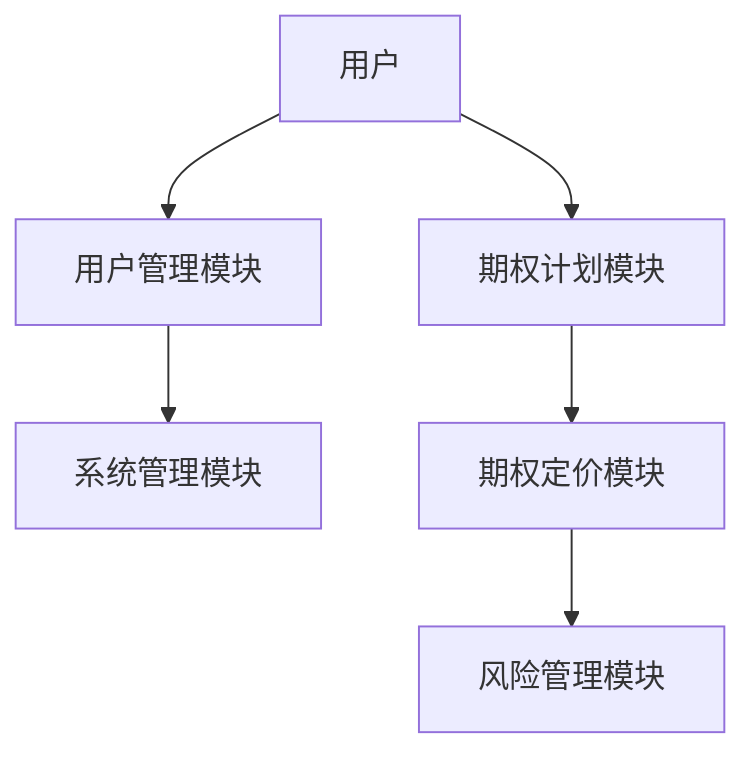

                 


# 彼得·林奇如何看待公司的股票期权计划

## 关键词：
股票期权计划、彼得·林奇、投资哲学、股权激励、公司治理

## 摘要：
本文从彼得·林奇的投资哲学出发，探讨他如何看待公司的股票期权计划。文章首先介绍股票期权的基本概念和作用，然后分析林奇的投资理念及其对期权计划的看法，接着深入讲解期权计划的数学模型与算法，最后从系统架构和项目实战的角度，分析股票期权计划的实施策略。文章通过理论与实践相结合的方式，为读者提供全面的视角。

---

# 第一部分: 股票期权计划的背景与基础

---

## 第1章: 股票期权计划的概述

### 1.1 股票期权计划的基本概念

#### 1.1.1 什么是股票期权
股票期权是一种金融衍生品，赋予持有者在特定时间内以特定价格购买或出售公司股票的权利。期权分为看涨期权（Call Option）和看跌期权（Put Option）两种类型。看涨期权赋予持有者以特定价格购买股票的权利，看跌期权则赋予持有者以特定价格出售股票的权利。

股票期权的核心在于其灵活性和风险管理能力。通过期权，公司可以在激励员工的同时，降低股权激励的直接成本。

#### 1.1.2 股票期权的类型
股票期权主要有以下几种类型：
- **欧式期权**：只能在到期日行使期权，不能提前行权。
- **美式期权**：可以在到期日前的任何时间行权。
- **股票认购期权**：以约定价格购买股票的权利。
- **股票认沽期权**：以约定价格出售股票的权利。

#### 1.1.3 股票期权的基本原理
股票期权的价值取决于以下几个因素：
1. **行权价（Strike Price）**：期权的行权价格。
2. **标的资产价格（Underlying Price）**：公司股票的市场价格。
3. **到期时间（Time to Maturity）**：期权的有效期。
4. **波动率（Volatility）**：股票价格的波动程度。
5. **无风险利率（Risk-Free Rate）**：市场无风险利率。

### 1.2 股票期权计划的作用与意义

#### 1.2.1 激励员工的作用
股票期权计划通过将员工的收益与公司股价挂钩，激励员工为公司创造更大的价值。员工通过持有期权，能够在公司股价上涨时获得额外收益，从而与公司利益保持一致。

#### 1.2.2 吸引和留住人才
股票期权计划是吸引和留住人才的重要工具。对于优秀员工来说，期权是一种长期激励机制，能够让他们感受到自己是公司的一部分，从而更愿意为公司长期发展付出努力。

#### 1.2.3 促进公司长期价值的实现
股票期权计划鼓励员工关注公司长期价值的实现，而非短期利益。通过期权的激励作用，员工会更加关注公司的可持续发展，从而推动公司长期价值的增长。

### 1.3 股票期权计划的实施背景

#### 1.3.1 现代公司治理的背景
在现代公司治理中，股权激励逐渐成为一种重要的管理工具。通过将管理层的收益与公司股价挂钩，可以实现管理层与股东利益的统一。

#### 1.3.2 股权激励的兴起
随着公司治理结构的不断完善，股权激励计划在全球范围内逐渐兴起。股票期权作为一种常见的股权激励工具，被广泛应用于科技公司、 startups等高成长型企业。

#### 1.3.3 股票期权计划的法律框架
股票期权计划的实施需要符合相关法律法规。例如，在美国，股票期权的发行和交易需要遵循《证券交易法》和《公司治理准则》等规定。

---

## 第2章: 彼得·林奇的投资理念与股票期权计划

### 2.1 彼得·林奇的投资哲学

#### 2.1.1 长期投资的重要性
林奇强调长期投资的重要性。他认为，只有通过长期持有优质股票，才能实现财富的持续增长。股票期权作为一种长期激励工具，符合他的长期投资理念。

#### 2.1.2 价值投资的核心思想
林奇的价值投资思想强调，投资者应该选择那些具有强大基本面、良好管理团队和竞争优势的公司。股票期权计划通过激励管理层，有助于提升公司的基本面，从而为投资者创造更大的价值。

#### 2.1.3 林奇对管理团队的信任
林奇认为，优秀的管理团队是公司成功的关键。股票期权计划通过将管理层的收益与公司股价挂钩，能够增强他对管理团队的信任。

### 2.2 林奇如何看待股票期权计划

#### 2.2.1 股票期权作为激励工具的有效性
林奇认为，股票期权是一种有效的激励工具。通过期权，可以将管理层的利益与公司股价紧密联系，从而激励管理层为公司创造更大的价值。

#### 2.2.2 林奇对管理层与股东利益一致性的看法
林奇强调，管理层与股东的利益一致性是公司治理的核心。股票期权计划通过将管理层的收益与公司股价挂钩，能够实现管理层与股东利益的统一。

#### 2.2.3 林奇对股票期权计划的潜在风险
林奇也意识到股票期权计划的潜在风险。例如，如果期权计划设计不合理，可能会导致管理层过度关注短期股价，而忽视公司的长期发展。

### 2.3 林奇的公司治理观点

#### 2.3.1 管理层激励机制的重要性
林奇认为，有效的管理层激励机制是公司治理的重要组成部分。股票期权计划通过激励管理层，能够提升公司的整体绩效。

#### 2.3.2 股东与管理层的利益平衡
林奇强调，公司治理的核心是实现股东与管理层的利益平衡。股票期权计划通过合理设计，能够在两者之间找到平衡点。

#### 2.3.3 林奇对管理层薪酬结构的建议
林奇建议，管理层的薪酬结构应该以股票期权为主，现金薪酬为辅。通过这种方式，可以实现管理层与股东利益的统一。

---

## 第3章: 股票期权计划的数学模型与算法

### 3.1 股票期权定价的数学模型

#### 3.1.1 Black-Scholes期权定价公式
Black-Scholes模型是股票期权定价的经典公式。其基本公式如下：

$$ C = S_0 \cdot N(d_1) - K \cdot e^{-rT} \cdot N(d_2) $$

其中：
- \( S_0 \)：标的资产当前价格
- \( K \)：行权价
- \( r \)：无风险利率
- \( T \)：到期时间（年）
- \( \sigma \)：标的资产价格波动率
- \( N(d) \)：标准正态分布的累积分布函数
- \( d_1 = \frac{\ln(S_0/K) + (r + \frac{\sigma^2}{2})T}{\sigma \sqrt{T}} \)
- \( d_2 = d_1 - \sigma \sqrt{T} \)

#### 3.1.2 模型的假设与限制
Black-Scholes模型的假设包括：
- 标的资产价格服从几何布朗运动
- 无交易成本
- 市场无摩擦
- 无股息支付

#### 3.1.3 模型的实际应用
Black-Scholes模型广泛应用于金融衍生品的定价。例如，对于一家科技公司，如果其股价为 $50，行权价为 $50，无风险利率为 2%，波动率为 30%，到期时间为 1年，我们可以使用 Black-Scholes 公式计算期权的理论价格。

---

### 3.2 期权定价的算法实现

#### 3.2.1 使用 Python 实现 Black-Scholes 模型
以下是一个使用 Python 实现 Black-Scholes 模型的代码示例：

```python
import numpy as np
from scipy.stats import norm

def black_scholes(S, K, r, T, sigma):
    d1 = (np.log(S/K) + (r + 0.5*sigma**2)*T) / (sigma*np.sqrt(T))
    d2 = d1 - sigma*np.sqrt(T)
    C = S * norm.cdf(d1) - K * np.exp(-r*T) * norm.cdf(d2)
    return C

# 示例参数
S = 50  # 标的资产价格
K = 50  # 行权价
r = 0.02  # 无风险利率
T = 1  # 到期时间（年）
sigma = 0.3  # 波动率

# 计算期权价格
option_price = black_scholes(S, K, r, T, sigma)
print("期权价格：", option_price)
```

#### 3.2.2 算法的步骤与流程图
以下是一个使用 Mermaid 绘制的 Black-Scholes 模型流程图：

```mermaid
graph TD
    A[开始] --> B[输入参数：S, K, r, T, sigma]
    B --> C[计算 d1 和 d2]
    C --> D[计算 C = S*N(d1) - K*e^{-rT}*N(d2)]
    D --> E[输出期权价格]
```

---

### 3.3 股票期权的 Greeks 计算

#### 3.3.1 Delta、Gamma、Theta的定义
- **Delta**：期权价格对标的资产价格的敏感度。
- **Gamma**：Delta对标的资产价格变化的敏感度。
- **Theta**：期权价格对时间的敏感度。

#### 3.3.2 Greeks 的计算公式
- **Delta**：$$ \Delta = N(d_1) $$
- **Gamma**：$$ \Gamma = \frac{N'(d_1)}{S \sigma \sqrt{T}} $$
- **Theta**：$$ \Theta = -r K e^{-rT} N(d_2) $$

#### 3.3.3 Greeks 在风险管理中的应用
Greeks 是风险管理的重要工具。通过监控 Delta、Gamma 和 Theta，投资者可以更好地管理期权组合的风险。

---

## 第4章: 股票期权计划的系统架构与设计

### 4.1 系统功能设计

#### 4.1.1 系统模块划分
股票期权计划的系统架构通常包括以下几个模块：
- **用户管理模块**：管理用户信息。
- **期权计划模块**：设计和实施期权计划。
- **期权定价模块**：计算期权价格。
- **风险管理模块**：监控和管理风险。

#### 4.1.2 用户角色与权限
- **管理员**：负责系统管理。
- **管理层**：负责期权计划的设计和实施。
- **员工**：期权持有者。

#### 4.1.3 期权计划的计算与模拟
系统可以根据输入的参数（如股价、行权价、波动率等）计算期权的理论价格，并模拟不同情景下的期权价值。

---

### 4.2 系统架构设计

#### 4.2.1 系统架构图
以下是一个使用 Mermaid 绘制的系统架构图：



---

## 第5章: 项目实战

### 5.1 环境安装

#### 5.1.1 安装 Python 和相关库
需要安装以下 Python 库：
- `numpy`
- `scipy`
- `matplotlib`

安装命令：
```bash
pip install numpy scipy matplotlib
```

---

### 5.2 系统核心实现源代码

#### 5.2.1 期权定价模块的实现
以下是一个期权定价模块的实现代码：

```python
import numpy as np
from scipy.stats import norm

def black_scholes(S, K, r, T, sigma):
    d1 = (np.log(S/K) + (r + 0.5*sigma**2)*T) / (sigma*np.sqrt(T))
    d2 = d1 - sigma*np.sqrt(T)
    C = S * norm.cdf(d1) - K * np.exp(-r*T) * norm.cdf(d2)
    return C

# 示例参数
S = 50
K = 50
r = 0.02
T = 1
sigma = 0.3

# 计算期权价格
option_price = black_scholes(S, K, r, T, sigma)
print("期权价格：", option_price)
```

---

### 5.3 实际案例分析

#### 5.3.1 案例背景
假设某科技公司计划实施股票期权计划，该公司当前股价为 $100，行权价为 $100，无风险利率为 2%，波动率为 30%，期权到期时间为 1年。

#### 5.3.2 期权价格计算
使用 Black-Scholes 模型计算期权价格：

$$ C = 100 \cdot N(d_1) - 100 \cdot e^{-0.02 \cdot 1} \cdot N(d_2) $$

其中：
- \( d_1 = \frac{\ln(100/100) + (0.02 + 0.5 \cdot 0.3^2) \cdot 1}{0.3 \cdot \sqrt{1}} = 0.1667 \)
- \( d_2 = 0.1667 - 0.3 \cdot 1 = -0.1333 \)
- \( N(d_1) = 0.5669 \)
- \( N(d_2) = 0.4449 \)

因此：
$$ C = 100 \cdot 0.5669 - 100 \cdot e^{-0.02} \cdot 0.4449 \approx 56.69 - 43.57 = 13.12 $$

---

### 5.4 项目小结

#### 5.4.1 项目总结
通过本项目，我们可以看到股票期权计划的实施需要结合理论与实践。Black-Scholes 模型为我们提供了一个有效的期权定价工具，而系统的实现则为我们提供了一个实际的应用平台。

#### 5.4.2 项目注意事项
- 确保期权计划的设计符合公司战略。
- 注意期权计划的法律合规性。
- 定期监控和调整期权计划。

---

## 第六部分: 总结与展望

### 6.1 总结
本文从彼得·林奇的投资哲学出发，探讨了他如何看待公司的股票期权计划。通过理论与实践相结合的方式，我们分析了股票期权计划的数学模型与系统架构，并通过实际案例展示了其应用。

### 6.2 未来展望
随着金融市场的不断发展，股票期权计划的实施将更加复杂。未来的研究可以集中在以下几个方面：
- 更精确的期权定价模型。
- 更高效的期权交易系统。
- 更完善的公司治理机制。

---

## 作者信息

作者：AI天才研究院/AI Genius Institute & 禅与计算机程序设计艺术/Zen And The Art of Computer Programming

---

希望这篇文章能满足你的需求！如果需要进一步修改或补充，请随时告诉我。

