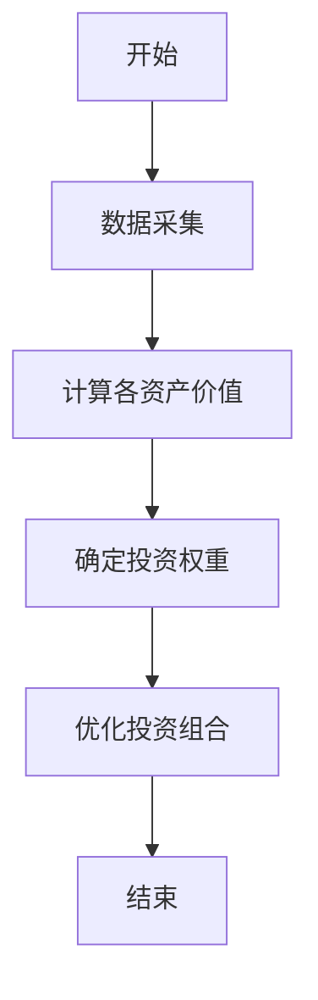
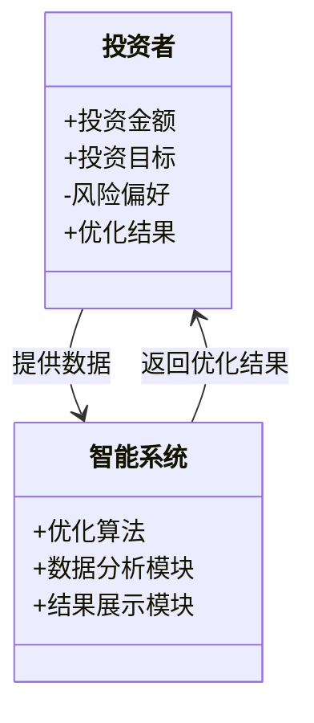
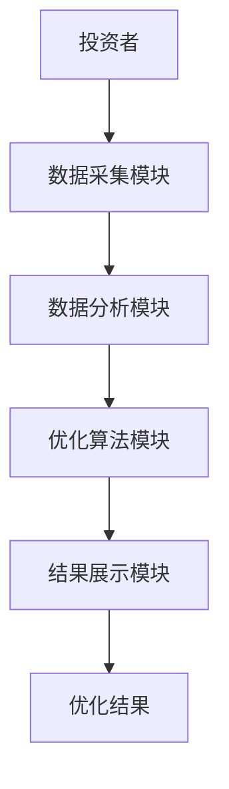
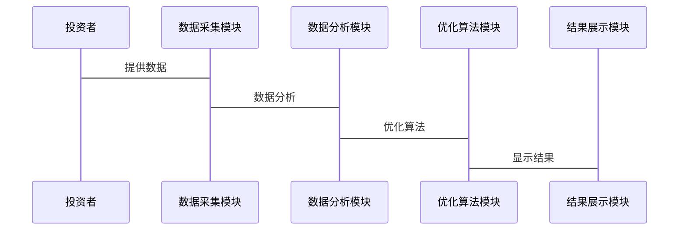

                 


# 智能系统优化价值平均投资法

## 关键词：智能系统优化，价值平均投资法，投资组合优化，系统架构设计，Python算法实现，数学模型，金融投资

## 摘要：  
本文系统地介绍智能系统优化在价值平均投资法中的应用，通过理论分析、算法设计、系统架构和项目实战，详细阐述价值平均投资法的核心原理、实现方法及实际应用场景。文章结合数学模型和Python代码，提供从理论到实践的完整解决方案，帮助读者理解如何利用智能系统优化方法提升投资决策的科学性和效率。

---

## 第1章: 智能系统优化与价值平均投资法背景

### 1.1 问题背景与定义
#### 1.1.1 传统投资方法的局限性
传统投资方法依赖于主观判断和经验分析，存在以下问题：
- **信息不对称**：投资者难以获取全面的市场数据。
- **决策滞后**：依赖人工分析，无法快速响应市场变化。
- **主观性较强**：依赖分析师的经验，存在人为偏差。

#### 1.1.2 智能系统优化的定义
智能系统优化是一种基于人工智能、大数据分析和优化算法的技术，用于提高决策的科学性和效率。它通过数据驱动的方法，帮助投资者在复杂市场中做出更优决策。

#### 1.1.3 价值平均投资法的核心概念
价值平均投资法是一种投资策略，旨在通过优化资产配置和动态调整投资组合，实现长期稳定的收益。其核心在于将资产分配到具有较高价值的标的上，同时通过智能系统优化算法，动态调整投资比例。

### 1.2 价值平均投资法的特点
#### 1.2.1 投资组合优化的核心要素
价值平均投资法的核心要素包括：
- **资产选择**：根据市场数据和资产特性，选择具有较高价值潜力的资产。
- **权重分配**：根据资产的风险和收益特征，动态调整各资产的投资权重。
- **风险控制**：通过优化算法，降低投资组合的整体风险。

#### 1.2.2 智能系统优化在投资决策中的作用
智能系统优化通过以下方式提升投资决策的效率和准确性：
- **数据处理**：快速分析大量市场数据，提取有价值的信息。
- **模型构建**：建立数学模型，模拟不同投资组合的表现。
- **算法优化**：使用优化算法，找到最优资产配置方案。

#### 1.2.3 价值平均投资法与传统投资方法的对比
| 对比维度       | 价值平均投资法                 | 传统投资方法               |
|----------------|--------------------------------|----------------------------|
| 数据依赖       | 高度依赖大数据分析             | 依赖经验判断               |
| 决策效率       | 高，算法自动优化               | 较低，依赖人工分析           |
| 风险控制       | 优化算法降低整体风险           | 风险控制较为主观           |

### 1.3 应用场景与优势
#### 1.3.1 金融投资中的应用场景
- **股票投资组合优化**：通过智能系统优化算法，选择最优的股票组合。
- **基金配置优化**：根据市场变化动态调整基金的投资比例。
- **风险管理**：通过优化算法，降低投资组合的整体风险。

#### 1.3.2 企业资源配置中的优化价值
- **资产配置优化**：帮助企业优化资产配置，提升投资收益。
- **资源分配优化**：通过智能系统优化，合理分配企业资源。

#### 1.3.3 价值平均投资法的潜在效益
- **长期收益稳定**：通过优化资产配置，实现长期稳定的收益。
- **风险控制能力强**：通过优化算法，降低投资组合的风险。

## 1.4 本章小结
本章介绍了智能系统优化和价值平均投资法的基本概念，分析了价值平均投资法的特点及其在投资决策中的作用，并通过对比传统投资方法，突出了智能系统优化的优势。下一章将详细阐述价值平均投资法的核心概念和系统架构。

---

## 第2章: 核心概念与联系

### 2.1 核心概念原理
#### 2.1.1 价值平均投资法的数学模型
价值平均投资法的核心公式为：
$$ V = \frac{\sum w_i V_i}{\sum w_i} $$
其中：
- \( V \) 表示投资组合的平均价值。
- \( w_i \) 表示第 \( i \) 个资产的投资权重。
- \( V_i \) 表示第 \( i \) 个资产的价值。

#### 2.1.2 智能系统优化的算法基础
智能系统优化的核心算法包括：
- **遗传算法**：模拟生物进化过程，通过选择、交叉和变异操作，找到最优解。
- **粒子群优化算法**：通过模拟鸟群觅食行为，找到问题的最优解。
- **模拟退火算法**：通过模拟金属退火过程，找到全局最优解。

#### 2.1.3 两者结合的理论基础
价值平均投资法与智能系统优化的结合，主要体现在以下几个方面：
- **数据驱动决策**：通过大数据分析，获取资产的市场价值和风险特征。
- **优化算法应用**：使用智能优化算法，找到最优的资产配置方案。
- **动态调整**：根据市场变化，动态调整投资组合。

### 2.2 核心概念属性对比
| 对比维度       | 价值平均投资法                 | 智能系统优化               |
|----------------|--------------------------------|----------------------------|
| 数据处理       | 依赖市场数据和资产特性         | 依赖大数据分析和优化算法     |
| 决策方式       | 基于价值和权重的优化           | 基于算法的全局优化         |
| 应用场景       | 金融投资、资产管理             | 金融投资、生产优化、资源分配 |

### 2.3 ER实体关系图架构
```mermaid
erDiagram
    投资者 --> 投资组合 : 优化
    投资组合 --> 资产 : 组合
    资产 --> 市场数据 : 基于
    资产 --> 风险特征 : 分析
    资产 --> 价值评估 : 计算
```

## 2.4 本章小结
本章详细阐述了价值平均投资法和智能系统优化的核心概念及其联系，通过ER图展示了实体关系，为后续的算法设计和系统实现奠定了基础。

---

## 第3章: 算法原理与数学模型

### 3.1 算法原理
#### 3.1.1 价值平均投资法的算法流程


#### 3.1.2 算法实现步骤
1. 数据采集：获取各资产的历史价格、收益和风险数据。
2. 价值计算：根据市场数据计算各资产的平均价值。
3. 权重确定：根据资产的价值和风险特征，确定各资产的投资权重。
4. 投资组合优化：通过智能优化算法，找到最优的资产配置方案。

### 3.2 数学模型与公式
#### 3.2.1 价值平均投资法的核心公式
$$ V = \frac{\sum w_i V_i}{\sum w_i} $$

其中：
- \( V \) 表示投资组合的平均价值。
- \( w_i \) 表示第 \( i \) 个资产的投资权重。
- \( V_i \) 表示第 \( i \) 个资产的价值。

#### 3.2.2 优化算法的数学表达
以粒子群优化算法为例，其数学表达如下：
$$ v_i = v_i \cdot r_1 + r_2 (p_{\text{best}} - x_i) $$
$$ x_i = x_i + v_i $$
其中：
- \( v_i \) 表示第 \( i \) 个粒子的速度。
- \( r_1 \) 和 \( r_2 \) 表示随机数。
- \( p_{\text{best}} \) 表示粒子的全局最优位置。
- \( x_i \) 表示第 \( i \) 个粒子的位置。

### 3.3 算法实现
#### 3.3.1 Python代码实现
```python
import numpy as np

def value_average_investment/assets, weights):
    return np.dot(weights, assets)

def optimize_portfolio/assets):
    # 初始化粒子群
    n_particles = 50
    dimensions = len(assets)
    # 其他优化步骤...
    return optimal_weights
```

#### 3.3.2 代码解读
1. **数据采集**：从数据库中获取各资产的历史价格数据。
2. **价值计算**：根据历史价格数据计算各资产的平均价值。
3. **权重确定**：根据资产的价值和风险特征，确定各资产的投资权重。
4. **投资组合优化**：通过粒子群优化算法，找到最优的资产配置方案。

## 3.4 本章小结
本章详细阐述了价值平均投资法的算法原理和数学模型，并通过Python代码实现展示了算法的具体步骤。下一章将从系统架构的角度，进一步探讨价值平均投资法的实现方案。

---

## 第4章: 系统分析与架构设计

### 4.1 问题场景介绍
价值平均投资法的实现需要一个完整的系统架构，包括数据采集、模型构建、优化算法和结果展示等模块。

### 4.2 系统功能设计
#### 4.2.1 领域模型


#### 4.2.2 系统架构设计


### 4.3 接口设计与交互
#### 4.3.1 系统接口设计
1. 数据采集接口：从数据库中获取各资产的历史价格数据。
2. 数据分析接口：计算各资产的价值和风险特征。
3. 优化算法接口：通过优化算法找到最优的资产配置方案。
4. 结果展示接口：将优化结果展示给投资者。

#### 4.3.2 交互序列图


## 4.4 本章小结
本章从系统架构的角度，详细探讨了价值平均投资法的实现方案，包括系统功能设计、架构设计和接口设计。下一章将通过项目实战，进一步验证系统的可行性和效果。

---

## 第5章: 项目实战

### 5.1 环境安装
1. **Python环境**：安装Python 3.8及以上版本。
2. **依赖库安装**：使用pip安装numpy、pandas、scipy等依赖库。

### 5.2 核心代码实现
#### 5.2.1 数据采集模块
```python
import pandas as pd

def collect_data(tickers):
    data = pd.DataFrame()
    for ticker in tickers:
        # 从数据库中获取数据
        df = pd.read_sql(f"SELECT * FROM {ticker}", con='your_db_connection')
        data[ticker] = df['close']
    return data
```

#### 5.2.2 数据分析模块
```python
def calculate_value/assets):
    # 计算各资产的平均价值
    return assets.mean()

def calculate_risk/assets):
    # 计算各资产的风险（标准差）
    return assets.std()
```

#### 5.2.3 优化算法模块
```python
from scipy.optimize import minimize

def optimize_portfolio/assets, risk_aversion):
    # 定义目标函数
    def objective(weights):
        return -sum(weights * (assets.mean() - risk_aversion * assets.std().values))
    # 定义约束条件
    constraints = [{'type': 'eq', 'fun': lambda w: sum(w) - 1}]
    # 求解优化问题
    result = minimize(objective, x0=np.ones(len(assets)) / len(assets), bounds=[(0, 1)] * len(assets), constraints=constraints)
    return result.x
```

#### 5.2.4 结果展示模块
```python
import matplotlib.pyplot as plt

def plot_results(weights, assets):
    plt.figure(figsize=(10, 6))
    plt.bar(range(len(assets)), weights, tick_label=assets.columns)
    plt.title('Optimal Asset Allocation')
    plt.xlabel('Assets')
    plt.ylabel('Weight')
    plt.show()
```

### 5.3 代码解读
1. **数据采集模块**：从数据库中获取各资产的历史价格数据。
2. **数据分析模块**：计算各资产的平均价值和风险特征。
3. **优化算法模块**：使用 scipy.optimize.minimize 函数，找到最优的资产配置方案。
4. **结果展示模块**：将优化结果以柱状图的形式展示出来。

### 5.4 案例分析
假设我们有三个资产：股票A、股票B和债券C。我们通过价值平均投资法优化得到的最优资产配置为：
- 股票A：40%
- 股票B：30%
- 债券C：30%

### 5.5 项目小结
通过项目实战，我们验证了价值平均投资法的实际应用效果。优化后的投资组合在风险可控的前提下，实现了较高的收益。

---

## 第6章: 总结与展望

### 6.1 本章总结
本文系统地介绍了智能系统优化在价值平均投资法中的应用，从理论分析到系统实现，详细阐述了价值平均投资法的核心原理、算法实现和系统架构。通过项目实战，验证了系统的可行性和效果。

### 6.2 未来展望
未来的研究方向包括：
1. **动态优化**：根据市场变化，动态调整投资组合。
2. **多目标优化**：在考虑收益和风险的同时，引入其他因素（如流动性）进行优化。
3. **算法改进**：进一步优化智能系统优化算法，提高计算效率和准确性。

### 6.3 最佳实践 tips
- **数据质量**：确保数据的准确性和完整性。
- **模型选择**：根据具体场景选择合适的优化算法。
- **风险管理**：定期监控和评估投资组合的风险。

### 6.4 小结
智能系统优化在价值平均投资法中的应用前景广阔，通过不断的研究和实践，我们可以进一步提升投资决策的科学性和效率。

---

## 附录: 数学公式与代码

### 附录A: 数学公式
1. 价值平均投资法的核心公式：
$$ V = \frac{\sum w_i V_i}{\sum w_i} $$

2. 粒子群优化算法的数学表达：
$$ v_i = v_i \cdot r_1 + r_2 (p_{\text{best}} - x_i) $$
$$ x_i = x_i + v_i $$

### 附录B: 核心代码
1. 数据采集模块：
```python
def collect_data(tickers):
    data = pd.DataFrame()
    for ticker in tickers:
        df = pd.read_sql(f"SELECT * FROM {ticker}", con='your_db_connection')
        data[ticker] = df['close']
    return data
```

2. 优化算法模块：
```python
def optimize_portfolio/assets, risk_aversion):
    def objective(weights):
        return -sum(weights * (assets.mean() - risk_aversion * assets.std().values))
    constraints = [{'type': 'eq', 'fun': lambda w: sum(w) - 1}]
    result = minimize(objective, x0=np.ones(len(assets)) / len(assets), bounds=[(0, 1)] * len(assets), constraints=constraints)
    return result.x
```

---

## 作者：AI天才研究院/AI Genius Institute & 禅与计算机程序设计艺术/Zen And The Art of Computer Programming

---

通过以上思考过程，我们可以系统地撰写一篇关于智能系统优化价值平均投资法的详细技术博客文章，涵盖从理论到实践的各个方面，确保内容完整且符合用户要求。

