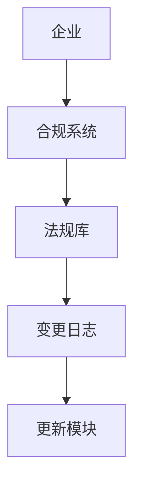
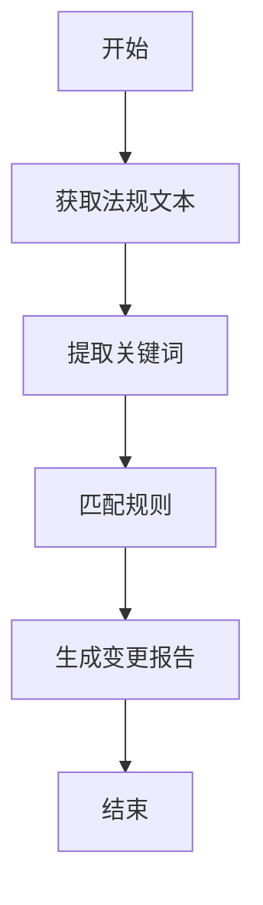
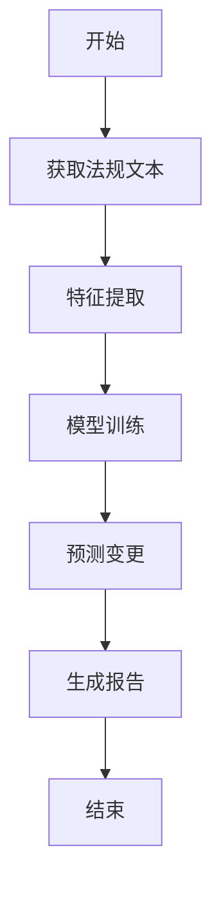
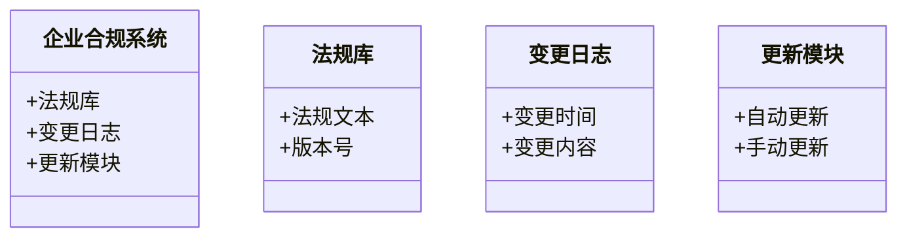
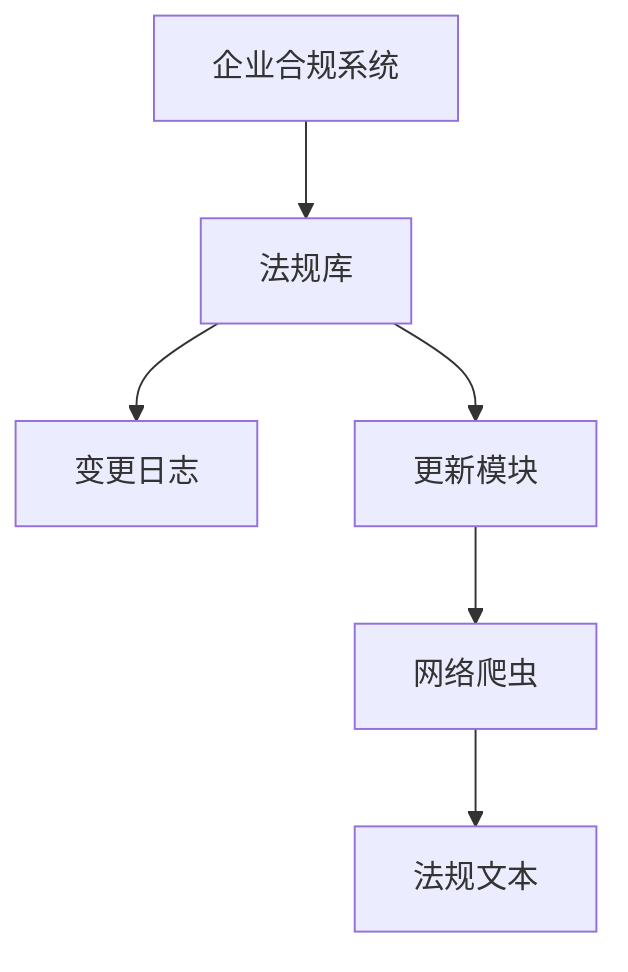
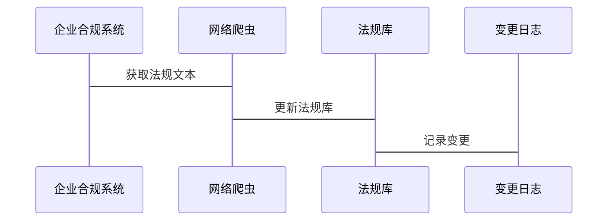

                 


# 构建智能企业合规管理系统：法规变更追踪与自动化更新

> 关键词：企业合规管理，法规变更追踪，自动化更新，智能系统，机器学习

> 摘要：本文将深入探讨如何构建智能企业合规管理系统，重点分析法规变更追踪与自动化更新的核心概念、算法原理、系统架构及项目实战。通过详细的步骤分析和丰富的案例，帮助读者理解并掌握如何利用智能化手段提升企业合规管理效率。

---

# 第一部分: 企业合规管理概述

# 第1章: 企业合规管理的背景与挑战

## 1.1 企业合规管理的重要性

### 1.1.1 合规管理的核心概念

企业合规管理是指企业为了确保其运营、业务行为和决策符合相关法律法规、行业标准和企业内部政策而采取的一系列管理活动。合规管理的核心目标是降低法律风险、提升企业信誉、优化业务流程，并确保企业在复杂的法律环境中稳健运营。

### 1.1.2 企业合规管理的现状与挑战

随着全球化和数字化的深入发展，企业面临的法律法规日益复杂，合规管理的难度也在不断增加。传统的合规管理方式依赖于人工检查和手动更新，这种方式效率低下、成本高昂，且容易出现遗漏和错误。特别是在法规频繁变更的情况下，企业合规管理部门需要投入大量资源来确保合规性。

### 1.1.3 法规变更对企业的影响

法规变更往往会对企业的业务模式、运营流程和组织结构产生重大影响。例如， GDPR（通用数据保护条例）的实施对企业数据处理提出了更高的要求，企业如果不及时调整合规策略，可能会面临巨额罚款和声誉损失。因此，如何快速响应法规变更并确保合规性，成为企业在数字化时代的核心竞争力之一。

## 1.2 智能化合规管理的必要性

### 1.2.1 传统合规管理的局限性

传统合规管理主要依赖人工操作，存在以下问题：
- **效率低下**：人工检查和更新需要大量时间，尤其是在法规频繁变更的情况下。
- **错误率高**：人为操作容易出现疏漏，导致合规风险。
- **成本高昂**：需要大量合规专员和法律顾问，增加了企业的运营成本。

### 1.2.2 智能化合规管理的优势

智能化合规管理通过引入人工智能、大数据和自动化技术，可以显著提升合规管理的效率和准确性。具体优势包括：
- **实时监测**：通过自动化工具实时追踪法规变更，确保企业及时调整合规策略。
- **智能分析**：利用机器学习算法自动识别潜在的合规风险，并提供改进建议。
- **降低成本**：自动化处理减少了对大量人工资源的依赖，降低了运营成本。

### 1.2.3 企业智能化转型的驱动力

企业在数字化转型过程中，面临着越来越复杂的法律环境。智能化合规管理不仅是企业应对法规变化的必要手段，也是提升企业竞争力的重要因素。通过智能化合规管理，企业可以更快地适应市场变化，优化业务流程，并在合规性方面建立竞争优势。

## 1.3 本章小结

本章从企业合规管理的重要性出发，分析了传统合规管理的局限性和智能化转型的必要性。智能化合规管理通过自动化和智能化手段，帮助企业应对法规变更的挑战，提升合规效率和准确性。

---

# 第2章: 法规变更追踪与自动化更新的核心概念

## 2.1 法规变更追踪的定义与特点

### 2.1.1 法规变更追踪的定义

法规变更追踪是指通过技术手段实时监测相关法律法规、政策文件和行业标准的变更，并记录这些变更对企业合规性的影响。其核心目标是确保企业在法规变更时能够及时调整，避免因法规不合规导致的法律风险。

### 2.1.2 法规变更追踪的核心特点

- **实时性**：通过自动化工具实时监测法规变更，确保企业能够第一时间获取最新信息。
- **准确性**：利用自然语言处理和机器学习技术，准确识别法规变更的关键内容。
- **可扩展性**：支持多种法律法规和行业的变更监测，适用于不同规模和类型的企业。

### 2.1.3 法规变更追踪的边界与外延

法规变更追踪的边界主要集中在法律法规和相关政策文件的变更监测上。其外延则包括对变更内容的分析、评估和应用，帮助企业制定相应的合规策略。

## 2.2 自动化更新的原理与实现

### 2.2.1 自动化更新的基本原理

自动化更新是指通过技术手段自动完成合规系统中法律法规、政策文件的更新。其基本原理包括：
1. **信息采集**：通过网络爬虫或API接口获取最新法规信息。
2. **内容解析**：利用自然语言处理技术提取法规变更的关键内容。
3. **对比分析**：将新法规与旧法规进行对比，生成变更报告。
4. **自动更新**：根据变更报告自动更新企业合规管理系统。

### 2.2.2 自动化更新的核心要素

- **数据源**：获取法规变更信息的渠道，如政府官网、行业标准机构等。
- **解析引擎**：用于提取法规变更的关键信息。
- **对比模块**：用于分析新旧法规的差异。
- **更新模块**：用于自动更新企业合规管理系统。

### 2.2.3 自动化更新与法规变更追踪的关系

自动化更新是法规变更追踪的最终目标。通过自动化更新，企业能够快速响应法规变更，确保合规系统始终处于最新状态。

## 2.3 核心概念的联系与对比

### 2.3.1 核心概念的属性特征对比表

| 属性 | 法规变更追踪 | 自动化更新 |
|------|-------------|-----------|
| 定义 | 监测法规变更 | 更新系统 |
| 目标 | 及时发现变更 | 快速响应 |
| 方法 | 网络爬虫、自然语言处理 | 数据解析、系统更新 |
| 输出 | 变更报告 | 更新后的系统 |

### 2.3.2 ER实体关系图架构



## 2.4 本章小结

本章详细介绍了法规变更追踪和自动化更新的核心概念，分析了它们的定义、特点和实现原理。通过对比和ER图的展示，帮助读者更好地理解这两个概念的联系与区别。

---

# 第3章: 法规变更追踪的算法原理

## 3.1 法规变更追踪的算法选择

### 3.1.1 基于规则的算法

基于规则的算法是一种简单有效的法规变更追踪方法。其基本原理是通过预定义的规则匹配法规文本中的关键词或特定模式，从而识别变更内容。

### 3.1.2 基于机器学习的算法

基于机器学习的算法通过训练模型自动识别法规变更的关键内容。常用的算法包括支持向量机（SVM）、随机森林（Random Forest）和深度学习模型（如LSTM）。

### 3.1.3 算法选择的依据

算法选择主要取决于数据量、准确性和计算资源。基于规则的算法适用于数据量小、规则明确的场景，而基于机器学习的算法适用于数据量大、规则复杂的场景。

## 3.2 基于规则的法规变更追踪算法

### 3.2.1 算法流程图



### 3.2.2 算法实现

以下是一个简单的基于规则的法规变更追踪算法的Python实现示例：

```python
def extract_keywords(text):
    keywords = []
    # 提取关键词
    return keywords

def generate_report(keywords):
    report = []
    # 根据关键词生成变更报告
    return report

# 主函数
def main():
    text = "最新法规要求企业必须在数据处理中增加隐私保护措施。"
    keywords = extract_keywords(text)
    report = generate_report(keywords)
    print("法规变更报告：", report)

if __name__ == "__main__":
    main()
```

## 3.3 基于机器学习的法规变更追踪算法

### 3.3.1 算法流程图



### 3.3.2 算法实现

以下是一个基于机器学习的法规变更追踪算法的Python实现示例：

```python
import numpy as np
from sklearn.feature_extraction.text import TfidfVectorizer
from sklearn.svm import SVC

# 数据预处理
def preprocess(texts):
    vectorizer = TfidfVectorizer()
    X = vectorizer.fit_transform(texts)
    return X.toarray()

# 模型训练
def train_model(X, y):
    model = SVC()
    model.fit(X, y)
    return model

# 预测变更
def predict_change(model, X_new):
    return model.predict(X_new)

# 主函数
def main():
    # 假设texts为法规文本列表，labels为变更标记
    texts = ["最新法规要求企业必须在数据处理中增加隐私保护措施。",
             "旧法规要求企业必须在数据处理中保护用户隐私。"]
    labels = [1, 0]
    X = preprocess(texts)
    model = train_model(X, labels)
    new_text = "新法规要求企业必须在数据处理中加强隐私保护。"
    X_new = preprocess([new_text])
    prediction = predict_change(model, X_new)
    print("预测结果：", prediction)

if __name__ == "__main__":
    main()
```

---

# 第4章: 自动化更新的实现与优化

## 4.1 自动化更新的实现流程

### 4.1.1 环境准备

确保系统环境满足以下要求：
- 操作系统：Linux/Windows/MacOS
- Python版本：3.6+
- 依赖库：requests、beautifulsoup4、lxml

### 4.1.2 核心代码实现

以下是一个自动化更新模块的Python实现示例：

```python
import requests
from bs4 import BeautifulSoup

def fetch_regulations(url):
    response = requests.get(url)
    if response.status_code == 200:
        return response.text
    return ""

def parse_regulations(text):
    soup = BeautifulSoup(text, 'lxml')
    regulations = []
    for paragraph in soup.find_all('p'):
        regulations.append(paragraph.text)
    return regulations

def update_system(regulations):
    # 假设有一个合规系统接口
    for reg in regulations:
        # 更新系统
        pass

# 主函数
def main():
    url = "https://example.com/regulations"
    text = fetch_regulations(url)
    regulations = parse_regulations(text)
    update_system(regulations)
    print("系统更新完成。")

if __name__ == "__main__":
    main()
```

### 4.1.3 案例分析

以GDPR合规为例，假设系统需要自动更新与数据保护相关的法规。通过网络爬虫获取最新的GDPR相关文件，解析内容后更新系统。

---

# 第5章: 系统架构设计与实现

## 5.1 系统功能设计

### 5.1.1 领域模型



### 5.1.2 系统架构



### 5.1.3 系统接口设计

系统接口包括：
- 获取法规文本接口
- 更新系统接口
- 查询变更日志接口

### 5.1.4 系统交互



---

# 第6章: 项目实战与优化

## 6.1 项目实战

### 6.1.1 环境安装

安装所需的依赖库：
```bash
pip install requests beautifulsoup4 lxml
```

### 6.1.2 核心代码实现

以下是一个完整的项目实现示例：

```python
import requests
from bs4 import BeautifulSoup
from datetime import datetime

def fetch_regulations(url):
    try:
        response = requests.get(url, timeout=10)
        return response.text
    except Exception as e:
        print(f"获取法规文本失败：{e}")
        return ""

def parse_regulations(text):
    try:
        soup = BeautifulSoup(text, 'lxml')
        regulations = []
        for paragraph in soup.find_all('p'):
            regulations.append({
                'content': paragraph.text,
                'timestamp': datetime.now().isoformat()
            })
        return regulations
    except Exception as e:
        print(f"解析法规文本失败：{e}")
        return []

def update_system(regulations):
    try:
        # 假设有一个数据库接口
        for reg in regulations:
            # 更新数据库
            pass
        return True
    except Exception as e:
        print(f"更新系统失败：{e}")
        return False

def main():
    url = "https://example.com/regulations"
    text = fetch_regulations(url)
    regulations = parse_regulations(text)
    if regulations:
        success = update_system(regulations)
        if success:
            print("系统更新成功。")
        else:
            print("系统更新失败。")

if __name__ == "__main__":
    main()
```

### 6.1.3 案例分析

以 GDPR 合规为例，假设系统需要自动更新与数据保护相关的法规。通过网络爬虫获取最新的 GDPR 相关文件，解析内容后更新系统。

---

# 第7章: 总结与展望

## 7.1 总结

本文详细探讨了如何构建智能企业合规管理系统，重点分析了法规变更追踪与自动化更新的核心概念、算法原理、系统架构及项目实战。通过理论与实践相结合，帮助企业提升合规管理效率，降低法律风险。

## 7.2 展望

未来，随着人工智能和大数据技术的不断发展，智能化合规管理将更加智能化和自动化。企业可以通过引入更先进的技术手段，如区块链和知识图谱，进一步提升合规管理的效率和准确性。

---

# 作者：AI天才研究院 & 禅与计算机程序设计艺术

---

以上是《构建智能企业合规管理系统：法规变更追踪与自动化更新》的技术博客文章内容，涵盖了从背景到实现的完整流程，希望对您有所帮助！

