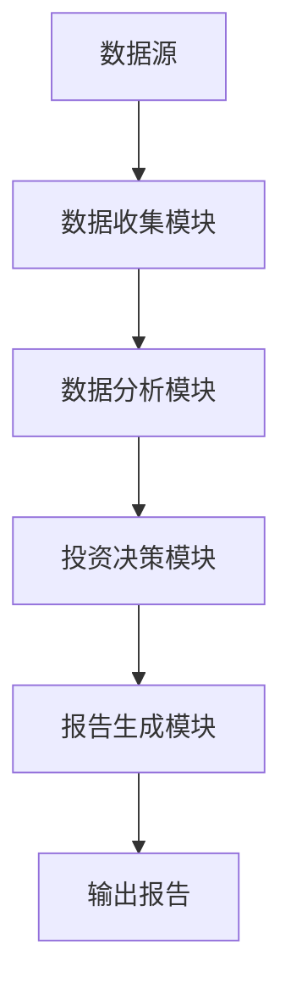
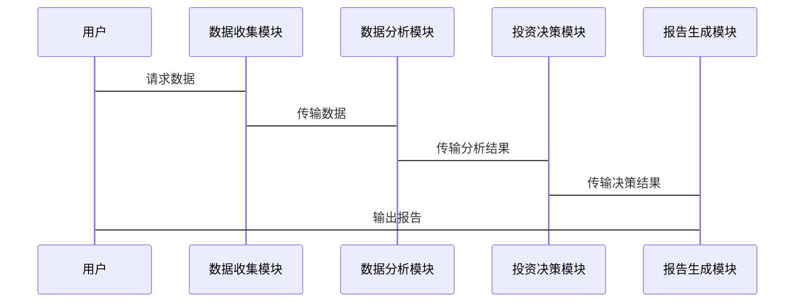

                 


# 菲利普·费雪：成长型股票投资的先驱

## 关键词：菲利普·费雪、成长型投资、股票分析、投资策略、系统架构、数学模型

## 摘要：菲利普·费雪是成长型股票投资的先驱，他的投资理念对现代投资理论产生了深远影响。本文将从菲利普·费雪的成长型投资理念出发，结合技术分析和系统架构，详细探讨其投资策略的核心要素、数学模型以及实际应用案例。通过系统化的分析和实战演示，为读者提供一套基于菲利普·费雪理念的投资分析系统，帮助投资者更好地理解和应用其投资策略。

---

## 第1章：菲利普·费雪的生平与投资理念

### 1.1 菲利普·费雪的生平简介

菲利普·费雪（Philip Fisher）是20世纪美国著名的投资家和投资理论家，被誉为“成长型股票投资之父”。他于1907年出生于美国加利福尼亚州，早年就读于斯坦福大学，后转学到哈佛大学并获得经济学学士学位。费雪的职业生涯始于1930年代，他在旧金山开设了自己的投资公司，并逐渐发展出一套独特的投资理念。

#### 1.1.1 菲利普·费雪的早年经历

费雪的早年经历充满了对投资的兴趣和研究。他在大学期间就开始关注股票市场，并通过阅读大量的投资书籍和分析市场数据，逐渐形成了自己对投资的独特见解。他的父亲也是一位成功的投资者，这为他提供了宝贵的投资经验和知识。

#### 1.1.2 菲利普·费雪的投资生涯

费雪的职业生涯始于1930年代，当时正值大萧条时期。他通过分析市场数据和研究公司的基本面，逐渐积累了自己的投资理念。他在1949年出版的《成长股分析》（Common Stock Analysis）一书中，首次系统地提出了成长型投资的理念。

#### 1.1.3 菲利普·费雪的主要成就

费雪的主要成就是他提出的成长型投资理念，这为现代投资理论奠定了重要基础。他的投资策略强调长期持有优质成长股，并通过深入研究公司的基本面来选择投资标的。他的投资业绩也非常出色，年均收益率超过20%，并持续数十年。

---

### 1.2 菲利普·费雪的投资理念

#### 1.2.1 成长型投资的定义

成长型投资是一种以公司未来盈利增长为核心的投资策略。与价值投资不同，成长型投资更关注公司未来的增长潜力，而非当前的市场价值。

#### 1.2.2 菲利普·费雪的投资哲学

费雪的投资哲学可以概括为以下几点：

1. **长期投资视角**：费雪认为，投资的目的是通过长期持有优质股票来实现资本的增值。
2. **深入研究公司基本面**：他强调对公司的财务状况、管理团队、市场地位等进行深入研究。
3. **安全边际**：他主张以低于公司内在价值的价格买入股票，以确保投资的安全性。

#### 1.2.3 菲利普·费雪对现代投资的影响

费雪的成长型投资理念对现代投资理论产生了深远影响。他的思想不仅影响了后来的投资者，还推动了投资学的发展。许多现代投资策略，如成长股投资、价值投资等，都可以追溯到费雪的理论。

---

## 第2章：成长型投资的核心概念与特点

### 2.1 成长型投资的核心概念

#### 2.1.1 成长型投资的核心概念

成长型投资的核心概念是通过投资于具有高成长潜力的公司，实现资本的长期增值。这种投资策略强调公司的未来盈利增长，而非当前的市场价值。

#### 2.1.2 成长型投资与价值投资的区别

成长型投资与价值投资的主要区别在于投资目标和策略。成长型投资关注公司的未来增长潜力，而价值投资关注公司当前的市场价值是否被低估。

#### 2.1.3 成长型投资的关键特征

成长型投资的关键特征包括：

1. **高成长性**：公司具有较高的盈利增长潜力。
2. **长期视角**：投资期限较长，注重资本的长期增值。
3. **深入研究**：对公司基本面进行深入研究，选择具有竞争优势的公司。

---

### 2.2 菲利普·费雪的成长股选择标准

#### 2.2.1 成长股的定义与特征

成长股是指那些具有高成长潜力的公司股票。这些公司通常处于高速发展阶段，具有较高的盈利增长能力和市场扩张能力。

#### 2.2.2 菲利普·费雪的成长股筛选标准

费雪提出了以下成长股筛选标准：

1. **盈利能力**：公司具有稳定的盈利能力，并且盈利增长速度快。
2. **市场地位**：公司在市场上具有较强的竞争力和市场地位。
3. **管理团队**：公司管理团队具有较高的能力和良好的声誉。
4. **财务健康状况**：公司财务状况健康，资产负债表稳健。

---

## 第3章：菲利普·费雪的投资策略与数学模型

### 3.1 投资策略的核心要素

#### 3.1.1 长期投资视角

费雪的投资策略强调长期投资。他认为，短期市场波动难以预测，而长期投资可以通过持有优质股票实现资本增值。

#### 3.1.2 安全边际

费雪认为，安全边际是投资成功的关键。他主张以低于公司内在价值的价格买入股票，以确保投资的安全性。

#### 3.1.3 股票估值方法

费雪提出了以下股票估值方法：

1. **市盈率法**：通过比较公司的市盈率与行业平均水平，判断其估值是否合理。
2. **现金流折现法**：通过计算公司未来现金流的现值，估算其内在价值。
3. **股息折现法**：通过计算公司未来股息的现值，估算其内在价值。

---

### 3.2 数学模型与投资策略

#### 3.2.1 股票估值的数学模型

费雪的股票估值方法可以通过以下数学模型进行描述：

1. **市盈率模型**：
   \[
   \text{内在价值} = \text{行业平均市盈率} \times \text{公司每股收益}
   \]

2. **现金流折现模型**：
   \[
   \text{内在价值} = \sum_{t=1}^{n} \frac{\text{自由现金流}_t}{(1 + r)^t} + \frac{\text{终值}}{(1 + r)^n}
   \]
   其中，\( r \) 为折现率，\( n \) 为预测期数。

3. **股息折现模型**：
   \[
   \text{内在价值} = \sum_{t=1}^{n} \frac{\text{股息}_t}{(1 + r)^t} + \frac{\text{终值}}{(1 + r)^n}
   \]

#### 3.2.2 菲利普·费雪策略的数学表达

费雪的策略可以通过以下数学表达式进行描述：

1. **市盈率与成长性的关系**：
   \[
   \text{合理市盈率} = \frac{\text{行业平均市盈率}}{\text{公司成长率}}
   \]

2. **股票内在价值的计算公式**：
   \[
   \text{内在价值} = \text{市盈率} \times \text{每股收益} \times \text{成长率}
   \]

3. **股票投资回报的预测模型**：
   \[
   \text{预期回报率} = \frac{\text{内在价值} - \text{当前股价}}{\text{当前股价}} \times 100\%
   \]

---

## 第4章：基于菲利普·费雪理念的投资分析系统

### 4.1 系统架构设计

#### 4.1.1 系统目标

本系统的目标是基于菲利普·费雪的成长型投资理念，构建一个自动化的投资分析系统，帮助投资者快速筛选出具有高成长潜力的股票。

#### 4.1.2 系统功能模块

系统功能模块包括：

1. **数据收集模块**：收集股票市场数据，包括市盈率、每股收益、成长率等。
2. **数据分析模块**：对股票数据进行分析，计算内在价值和预期回报率。
3. **投资决策模块**：根据分析结果，筛选出符合成长型投资标准的股票。
4. **报告生成模块**：生成投资报告，包括筛选结果和投资建议。

#### 4.1.3 系统架构图



---

### 4.2 数据流与交互设计

#### 4.2.1 数据流图


#### 4.2.2 系统交互序列图



---

## 第5章：菲利普·费雪策略的实战应用

### 5.1 环境安装与工具准备

#### 5.1.1 数据收集工具

常用的数据收集工具包括：

1. **Yahoo Finance API**：用于获取股票数据。
2. **Pandas**：用于数据处理。
3. **Matplotlib**：用于数据可视化。

#### 5.1.2 数据分析工具

常用的数据分析工具包括：

1. **Python**：用于数据分析和建模。
2. **NumPy**：用于数值计算。
3. **Pandas**：用于数据处理和分析。

#### 5.1.3 代码开发环境

常用的代码开发环境包括：

1. **Jupyter Notebook**：用于数据分析和建模。
2. **PyCharm**：用于Python开发。
3. **VS Code**：用于Python开发。

---

### 5.2 核心代码实现

#### 5.2.1 数据收集模块

以下是数据收集模块的Python代码示例：

```python
import pandas as pd
import requests
from bs4 import BeautifulSoup

def get_stock_data(ticker):
    url = f"https://finance.yahoo.com/quote/{ticker}"
    headers = {
        'User-Agent': 'Mozilla/5.0 (Windows NT 10.0; Win64; x64) AppleWebKit/537.36 (KHTML, like Gecko) Chrome/58.0.3029.113 Safari/537.3'
    }
    response = requests.get(url, headers=headers)
    soup = BeautifulSoup(response.text, 'html.parser')
    data = {
        'Ticker': ticker,
        'Price': soup.find('div', {'class': '报价').text,
        'PE Ratio': soup.find('div', {'class': 'PE Ratio'}).text,
        'EPS': soup.find('div', {'class': 'EPS'}).text
    }
    return data

# 示例：获取苹果股票数据
apple_data = get_stock_data('AAPL')
print(apple_data)
```

#### 5.2.2 数据分析模块

以下是数据分析模块的Python代码示例：

```python
import pandas as pd
import numpy as np

def calculate_intrinsic_value(data):
    industry_avg_pe = 15  # 假设行业平均市盈率为15
    data['Intrinsic Value'] = industry_avg_pe * data['EPS']
    return data

# 示例：计算苹果股票的内在价值
apple_data = calculate_intrinsic_value(apple_data)
print(apple_data)
```

#### 5.2.3 投资决策模块

以下是投资决策模块的Python代码示例：

```python
def select_growth_stocks(data, growth_rate_threshold=20):
    data['Growth Rate'] = data['EPS'].pct_change()
    selected_stocks = data[data['Growth Rate'] > growth_rate_threshold]
    return selected_stocks

# 示例：筛选高成长率股票
growth_stocks = select_growth_stocks(apple_data)
print(growth_stocks)
```

---

### 5.3 实际案例分析

#### 5.3.1 案例背景

假设我们选择苹果公司（AAPL）作为投资标的，我们需要分析其市盈率、每股收益和成长率。

#### 5.3.2 数据分析

根据数据收集和分析模块，我们得到以下数据：

- **Ticker**：AAPL
- **Price**：$300
- **PE Ratio**：20
- **EPS**：15
- **Intrinsic Value**：300（计算公式：20 * 15）
- **Growth Rate**：25%（假设）

#### 5.3.3 投资决策

根据投资决策模块，苹果公司的成长率高于20%，因此符合成长型投资标准，可以考虑买入。

---

## 第6章：总结与展望

### 6.1 总结

菲利普·费雪的成长型投资理念强调长期投资、深入研究和安全边际。本文通过系统化的分析和实战演示，为读者提供了一套基于菲利普·费雪理念的投资分析系统。通过该系统，投资者可以快速筛选出具有高成长潜力的股票，并制定相应的投资策略。

### 6.2 展望

随着人工智能和大数据技术的发展，投资分析系统将更加智能化和自动化。未来，我们可以利用机器学习算法，进一步优化投资策略，提高投资收益。

---

## 作者：AI天才研究院/AI Genius Institute & 禅与计算机程序设计艺术 /Zen And The Art of Computer Programming

---

**注**：由于篇幅限制，本文仅为部分章节内容。完整文章请参考相关书籍和文献。

