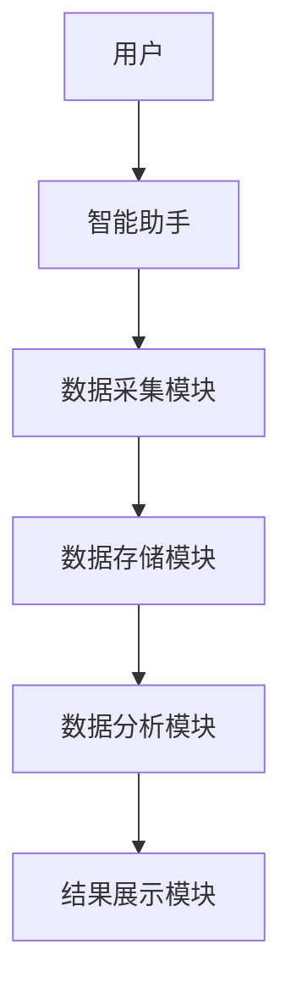
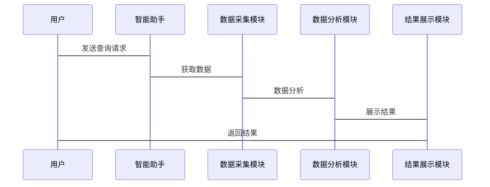

                 


# 《金融大数据分析在智能助手中的应用》

> 关键词：金融大数据分析、智能助手、数据分析算法、机器学习、NLP

> 摘要：本文深入探讨了金融大数据分析在智能助手中的应用，从核心概念、算法原理、系统架构到项目实战，全面解析了金融大数据分析的技术细节和实际应用。文章通过详细的技术分析和实际案例，展示了如何利用大数据技术提升智能助手在金融领域的效率和准确性，为读者提供了从理论到实践的完整指导。

---

# 第一部分: 金融大数据分析与智能助手概述

## 第1章: 金融大数据分析的背景与意义

### 1.1 金融大数据的基本概念

#### 1.1.1 数据的定义与分类

金融大数据指的是在金融领域中产生的海量数据，包括交易数据、市场数据、用户行为数据、新闻数据等。这些数据通常具有多样性、高速性和复杂性，需要通过先进的技术手段进行处理和分析。

- **数据分类**：
  - 结构化数据：如股票价格、交易记录等。
  - 半结构化数据：如JSON格式的用户行为数据。
  - 非结构化数据：如新闻文章、社交媒体评论等。

#### 1.1.2 金融大数据的特点与优势

- **特点**：
  - 数据量大（Volume）：每天产生的交易数据和市场数据以TB级计算。
  - 数据类型多样（Variety）：包括文本、图像、音频等多种形式。
  - 数据处理速度快（Velocity）：需要实时处理高频交易数据。
  - 数据价值密度高（Value）：通过分析数据可以发现潜在的市场机会或风险。

- **优势**：
  - 提高金融决策的精准性。
  - 优化投资策略和风险管理。
  - 提升用户体验，提供个性化的金融服务。

#### 1.1.3 金融大数据的应用场景

- **交易监控**：实时监控市场交易数据，发现异常交易行为。
- **投资决策**：基于历史数据和市场趋势，预测股票价格走势。
- **风险管理**：通过分析大数据，识别潜在的市场风险。
- **客户画像**：通过分析用户行为数据，构建客户画像，提供个性化服务。

### 1.2 智能助手的核心功能

#### 1.2.1 智能助手的定义与类型

- **定义**：智能助手是一种基于人工智能技术的工具，能够通过自然语言处理、机器学习等技术，为用户提供智能化的服务。
- **类型**：
  - 个人助理：如Apple的Siri、Google Assistant。
  - 企业级智能助手：如金融机构内部使用的智能风控系统。

#### 1.2.2 智能助手在金融领域的应用

- **智能投顾**：基于用户的投资目标和风险偏好，提供个性化的投资建议。
- **智能风控**：通过分析大数据，实时监控交易行为，识别潜在的欺诈行为。
- **智能客服**：通过自然语言处理技术，为用户提供7×24小时的金融服务。

#### 1.2.3 智能助手的技术基础

- **自然语言处理（NLP）**：实现人与机器的自然语言交互。
- **机器学习**：通过训练模型，实现智能决策和预测。
- **大数据技术**：处理和分析海量金融数据。

### 1.3 金融大数据分析的挑战与机遇

#### 1.3.1 金融大数据分析的挑战

- **数据量大与数据复杂性**：金融数据的多样性和复杂性给数据处理带来了巨大的挑战。
- **数据隐私与安全问题**：金融数据涉及用户的隐私和企业的机密，数据安全问题尤为重要。
- **数据处理的实时性要求**：金融市场的实时性要求非常高，需要快速处理和分析数据。

#### 1.3.2 金融大数据分析的机遇

- **技术进步带来的可能性**：人工智能、大数据技术的快速发展为金融大数据分析提供了技术支持。
- **金融行业数字化转型的需求**：金融机构 increasingly demand数字化转型，大数据分析成为核心驱动力。
- **智能助手在金融领域的潜力**：智能助手可以显著提升金融服务的效率和用户体验。

---

## 第2章: 金融大数据分析与智能助手的核心概念与联系

### 2.1 金融大数据分析的核心原理

#### 2.1.1 数据采集与处理

- **数据源的多样性**：金融数据来源广泛，包括交易数据、市场数据、社交媒体数据等。
- **数据清洗与预处理**：对数据进行清洗、去重、填充缺失值等操作，确保数据质量。
- **数据存储与管理**：使用分布式存储系统（如Hadoop、MongoDB）存储海量数据。

#### 2.1.2 数据分析与建模

- **数据分析方法的分类**：
  - 描述性分析：总结数据的基本特征。
  - 预测性分析：基于历史数据预测未来趋势。
  - 因果性分析：分析变量之间的因果关系。
- **数据建模的步骤与方法**：
  - 数据理解：明确问题、了解数据特征。
  - 数据准备：清洗数据、选择特征。
  - 建模：选择合适的算法，训练模型。
  - 评估与优化：评估模型性能，优化模型参数。
- **常用金融数据分析模型**：
  - 时间序列分析模型（ARIMA、LSTM）。
  - 机器学习模型（随机森林、支持向量机）。

#### 2.1.3 数据可视化

- **数据可视化的重要性**：通过可视化工具（如Tableau、Power BI）将数据转化为直观的图表，帮助用户更好地理解和分析数据。
- **常用数据可视化方法**：
  - 折线图：展示时间序列数据。
  - 条形图：比较不同类别数据的大小。
  - 饼图：展示数据的构成比例。

### 2.2 智能助手的核心算法

#### 2.2.1 自然语言处理（NLP）在智能助手中的应用

- **NLP的基本原理**：
  - 语言理解：通过词袋模型、TF-IDF等方法，将文本转化为向量表示。
  - 语言生成：通过生成模型（如GPT）生成自然语言文本。
- **NLP在金融领域的应用**：
  - 情感分析：分析新闻文章的情绪，预测市场走势。
  - 实体识别：识别文本中的公司名称、股票代码等实体。
  - 问答系统：通过NLP技术，实现智能客服的问答功能。

#### 2.2.2 机器学习在金融大数据分析中的应用

- **机器学习的基本原理**：
  - 数据驱动：通过大量数据训练模型，使其具备一定的智能性。
  - 模型训练：使用训练数据训练模型，使其能够识别数据中的模式。
  - 模型评估：通过测试数据评估模型的性能，调整模型参数。
- **机器学习在金融领域的应用**：
  - 股票价格预测：通过历史数据训练模型，预测未来股票价格。
  - 风险评估：通过机器学习模型评估客户的信用风险。
  - 市场情绪分析：通过机器学习模型分析社交媒体数据，预测市场走势。

---

## 第3章: 金融大数据分析与智能助手的算法原理

### 3.1 时间序列分析算法

#### 3.1.1 时间序列分析的基本原理

- **时间序列的定义与特征**：
  - 时间序列是指按时间顺序排列的数据。
  - 数据具有趋势性、周期性、随机性等特征。
- **时间序列分析的常见方法**：
  - 移动平均法：通过计算过去若干期的平均值，预测未来值。
  - 指数平滑法：通过加权平均法，预测未来值。
  - 自回归积分滑动平均模型（ARIMA）：通过模型拟合数据，预测未来值。

#### 3.1.2 基于机器学习的时间序列分析

- **基于RNN的时间序列分析**：
  - RNN（循环神经网络）：适合处理序列数据，能够捕捉时间序列中的依赖关系。
  - LSTM（长短期记忆网络）：一种特殊的RNN，能够捕捉长序列中的模式。
- **时间序列分析的优缺点**：
  - 优点：能够捕捉时间序列中的趋势和周期性。
  - 缺点：需要大量的训练数据，计算复杂度较高。

#### 3.1.3 时间序列分析的应用场景

- **股票价格预测**：通过时间序列分析，预测股票价格走势。
- **经济指标预测**：通过时间序列分析，预测GDP、CPI等经济指标。

### 3.2 机器学习在金融预测中的应用

#### 3.2.1 机器学习在金融预测中的基本原理

- **机器学习在金融预测中的优势**：
  - 数据驱动：通过大量数据训练模型，提高预测准确性。
  - 非线性关系：机器学习模型能够捕捉数据中的非线性关系。
  - 实时性：机器学习模型能够快速处理数据，满足金融领域的实时性要求。

#### 3.2.2 常用机器学习算法在金融中的应用

- **随机森林**：
  - 算法原理：通过构建多个决策树，集成预测结果，提高模型的准确性和鲁棒性。
  - 应用场景：股票价格预测、客户画像构建。
- **支持向量机（SVM）**：
  - 算法原理：通过构建超平面，将数据分为不同的类别。
  - 应用场景：信用评估、欺诈检测。

#### 3.2.3 机器学习模型的训练与优化

- **训练数据的选择**：选择具有代表性的数据，避免过拟合。
- **模型评估**：通过交叉验证、AUC-ROC曲线等方法评估模型性能。
- **模型优化**：通过调整模型参数、特征选择等方法优化模型性能。

---

## 第4章: 金融大数据分析与智能助手的系统分析与架构设计

### 4.1 系统功能设计

#### 4.1.1 领域模型设计

- **领域模型**：通过领域模型描述系统的功能模块和数据关系。
- **ER图展示**：通过ER图展示系统中的实体及其关系。

```mermaid
er
    customer
    stock
    transaction
    customer -- 订单 -> transaction
    stock -- 交易 -> transaction
```

#### 4.1.2 系统架构设计

- **分层架构**：
  - 数据层：存储和管理数据。
  - 业务逻辑层：实现业务逻辑，处理数据。
  - 用户界面层：与用户交互，展示结果。



#### 4.1.3 接口与交互设计

- **接口设计**：通过RESTful API实现系统模块之间的交互。
- **交互流程**：
  - 用户输入查询请求。
  - 智能助手接收请求，调用数据采集模块获取数据。
  - 数据分析模块处理数据，返回结果。
  - 结果展示模块将结果展示给用户。



---

## 第5章: 金融大数据分析与智能助手的项目实战

### 5.1 项目环境安装

- **安装Python**：从官网下载并安装Python。
- **安装依赖库**：
  - `pandas`：用于数据处理。
  - `numpy`：用于数值计算。
  - `scikit-learn`：用于机器学习。
  - `matplotlib`：用于数据可视化。
  - `jupyter`：用于数据处理和建模。

### 5.2 核心代码实现

#### 5.2.1 时间序列分析代码

```python
# 时间序列分析代码
import pandas as pd
import numpy as np
import matplotlib.pyplot as plt
from statsmodels.tsa.arima_model import ARIMA
import warnings
warnings.filterwarnings("ignore")

# 加载数据
data = pd.read_csv('stock_price.csv')
data['date'] = pd.to_datetime(data['date'])
data.set_index('date', inplace=True)

# 时间序列分析
model = ARIMA(data['price'], order=(5, 1, 0))
model_fit = model.fit()

# 预测未来价格
future_forecast = model_fit.forecast(steps=10)
print(future_forecast)
```

#### 5.2.2 机器学习模型实现

```python
# 机器学习模型实现
from sklearn.ensemble import RandomForestRegressor
from sklearn.model_selection import train_test_split
from sklearn.metrics import mean_squared_error

# 加载数据
data = pd.read_csv('financial_data.csv')
X = data.drop('target', axis=1)
y = data['target']

# 划分训练集和测试集
X_train, X_test, y_train, y_test = train_test_split(X, y, test_size=0.2, random_state=42)

# 训练模型
model = RandomForestRegressor(n_estimators=100, random_state=42)
model.fit(X_train, y_train)

# 预测结果
y_pred = model.predict(X_test)
print(mean_squared_error(y_test, y_pred))
```

### 5.3 项目总结

#### 5.3.1 项目经验

- **项目经验**：
  - 数据清洗和预处理是项目成功的关键。
  - 选择合适的算法和模型能够显著提高预测准确性。
  - 系统架构设计能够提高系统的稳定性和可扩展性。

#### 5.3.2 项目优缺点

- **优点**：
  - 提高了金融服务的效率和准确性。
  - 提供了个性化的金融服务，提升了用户体验。
- **缺点**：
  - 数据隐私和安全问题需要高度重视。
  - 系统的实时性和稳定性需要进一步优化。

#### 5.3.3 项目改进建议

- **改进建议**：
  - 引入更多的数据源，提高模型的泛化能力。
  - 优化系统架构，提高系统的实时性和稳定性。
  - 加强数据隐私保护，确保用户数据的安全。

---

## 第6章: 金融大数据分析与智能助手的最佳实践

### 6.1 最佳实践

#### 6.1.1 技术建议

- **技术建议**：
  - 选择合适的技术栈，确保系统的稳定性和可扩展性。
  - 引入先进的机器学习算法，提高预测准确性。
  - 加强数据可视化，提升用户体验。

#### 6.1.2 业务建议

- **业务建议**：
  - 结合业务需求，选择合适的数据分析方法。
  - 定期更新模型，确保模型的准确性和适用性。
  - 加强与业务部门的协作，确保系统的实用性。

### 6.2 小结

- **小结**：
  - 金融大数据分析在智能助手中的应用前景广阔。
  - 通过技术与业务的结合，能够显著提升金融服务的效率和准确性。
  - 数据隐私和安全问题是需要重点关注的挑战。

### 6.3 注意事项

- **注意事项**：
  - 数据隐私和安全问题需要高度重视。
  - 系统的实时性和稳定性需要进一步优化。
  - 模型的准确性和适用性需要定期评估和优化。

### 6.4 拓展阅读

- **拓展阅读**：
  - 《机器学习实战》：深入理解机器学习算法和其应用。
  - 《金融数据分析与投资策略》：学习金融数据分析方法和投资策略。
  - 《自然语言处理入门》：掌握自然语言处理技术及其应用。

---

## 作者：AI天才研究院/AI Genius Institute & 禅与计算机程序设计艺术/Zen And The Art of Computer Programming

---

这篇文章从金融大数据分析的基本概念、核心算法、系统架构到项目实战，全面解析了金融大数据分析在智能助手中的应用。通过详细的技术分析和实际案例，展示了如何利用大数据技术提升智能助手在金融领域的效率和准确性。

