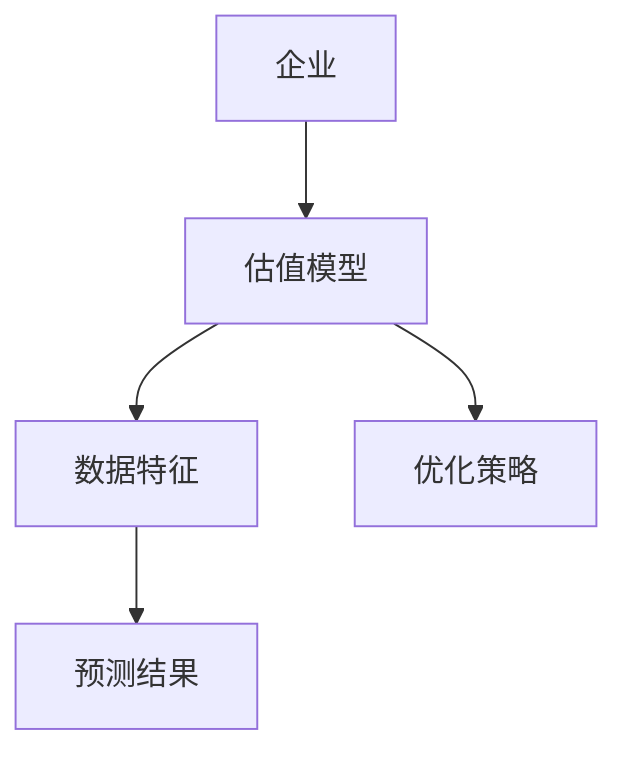
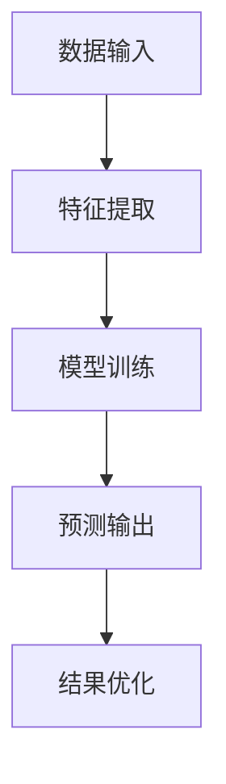
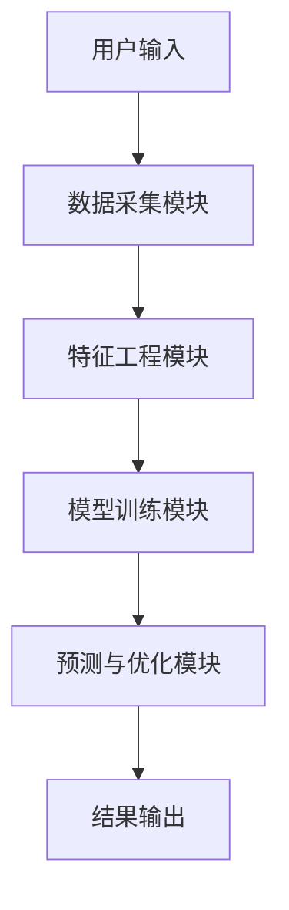

                 


# AI驱动的企业估值模型设计与实现

## 关键词：AI驱动，企业估值模型，机器学习，深度学习，数据驱动

## 摘要：本文详细探讨了AI技术在企业估值模型设计与实现中的应用，分析了传统估值方法的局限性，并结合现代AI技术的优势，提出了基于机器学习和深度学习的企业估值新方法。文章从核心概念、算法原理、系统架构设计到项目实战，全面阐述了AI驱动的企业估值模型的设计与实现过程，为读者提供了系统化的解决方案和实践指导。

---

## 第1章：AI驱动企业估值的背景与核心概念

### 1.1 企业估值的基本概念

#### 1.1.1 企业估值的定义与作用
企业估值是通过对企业各项资产、负债、盈利能力、市场地位等因素进行分析，估算企业整体价值的过程。传统的企业估值方法包括DCF模型、EV/EBITDA倍数法、市盈率法等，但这些方法往往依赖人工经验，存在主观性较强、计算复杂度高、难以实时更新等问题。

#### 1.1.2 传统企业估值方法的局限性
- 数据依赖性强：传统估值方法通常依赖于财务报表数据，而忽略了非财务因素（如市场情绪、行业趋势等）的影响。
- 计算复杂：复杂的财务模型需要大量人工计算和调整，容易出错且效率低下。
- 无法实时更新：市场环境不断变化，但传统估值模型难以快速响应。

#### 1.1.3 AI技术在企业估值中的潜力
AI技术可以通过大数据分析、机器学习算法和自然语言处理技术，从海量数据中提取有价值的信息，构建更精准、实时的估值模型。AI的引入使得企业估值更加智能化、自动化。

### 1.2 AI驱动企业估值的核心要素

#### 1.2.1 数据驱动的估值模型
AI驱动的企业估值模型依赖于大量高质量的数据输入，包括财务数据、市场数据、行业数据、文本数据等。通过对这些数据的分析和建模，可以发现传统方法难以捕捉的潜在规律。

#### 1.2.2 机器学习在估值中的应用
机器学习算法（如线性回归、随机森林、梯度提升树等）可以通过训练数据，自动学习企业的估值特征，构建预测模型。

#### 1.2.3 深度学习与复杂模型的引入
深度学习模型（如神经网络、LSTM等）可以处理非结构化数据（如新闻、社交媒体数据）并提取特征，进一步提升估值的准确性和实时性。

### 1.3 企业估值的AI驱动新范式

#### 1.3.1 数据、算法与算力的结合
AI驱动的企业估值模型需要强大的数据支持、先进的算法和高效的算力。三者的结合使得模型能够快速响应市场变化，提供实时估值。

#### 1.3.2 多维度特征分析与预测
AI技术可以从多个维度（财务指标、市场情绪、行业趋势等）提取特征，构建更全面的估值模型。

#### 1.3.3 智能化估值系统的构建
通过AI技术，可以构建一个智能化的估值系统，实现从数据输入到估值输出的全自动化流程。

### 1.4 本章小结
本章介绍了AI驱动企业估值的背景、核心概念以及AI技术在估值中的潜力。通过对比传统方法与AI驱动方法，展示了AI技术在提升企业估值准确性和效率方面的优势。

---

## 第2章：AI驱动企业估值的核心概念与联系

### 2.1 核心概念原理

#### 2.1.1 机器学习在估值中的应用原理
机器学习算法通过训练数据，学习企业的特征和规律，构建预测模型。例如，可以使用线性回归模型预测企业的未来盈利能力。

#### 2.1.2 深度学习模型的特征提取能力
深度学习模型（如卷积神经网络、LSTM）可以处理非结构化数据，提取潜在特征，进一步提升估值的准确性。

#### 2.1.3 多任务学习与联合优化
通过多任务学习，模型可以在同时完成多个任务（如估值和风险评估）的过程中，实现联合优化，提升整体性能。

### 2.2 核心概念属性对比

#### 2.2.1 传统估值方法 vs AI驱动方法
| 特性               | 传统方法               | AI驱动方法           |
|--------------------|------------------------|----------------------|
| 数据依赖性         | 高                     | 高                   |
| 计算效率           | 低                     | 高                   |
| 实时性             | 低                     | 高                   |
| 精确性             | 中                     | 高                   |

#### 2.2.2 各种AI模型的性能对比
| 模型类型           | 线性回归               | 随机森林             | 神经网络             |
|--------------------|-----------------------|----------------------|----------------------|
| 适用场景           | 线性关系               | 非线性关系           | 复杂非线性关系       |
| 模型复杂度         | 低                     | 中                   | 高                   |
| 预测精度           | 中                     | 高                   | 高                   |

#### 2.2.3 数据质量与模型表现的关系
数据质量直接影响模型表现。高质量的数据可以提高模型的预测精度，而低质量的数据可能导致模型性能下降。

### 2.3 ER实体关系图架构



### 2.4 本章小结
本章详细分析了AI驱动企业估值的核心概念，包括机器学习和深度学习在估值中的应用原理，以及不同模型的性能对比。通过ER实体关系图，展示了企业估值模型的架构和数据流关系。

---

## 第3章：企业估值AI模型的算法原理

### 3.1 算法原理概述

#### 3.1.1 传统机器学习算法
传统机器学习算法（如线性回归、随机森林）适用于处理结构化数据，但对非结构化数据的处理能力有限。

#### 3.1.2 深度学习算法
深度学习算法（如神经网络、LSTM）能够处理非结构化数据，提取更复杂的特征，适合处理复杂的估值问题。

#### 3.1.3 混合模型与集成学习
通过混合模型（如集成学习）可以结合不同算法的优势，进一步提升模型的预测精度。

### 3.2 算法流程图



### 3.3 数学模型与公式

#### 3.3.1 线性回归模型
线性回归模型用于预测企业的未来价值：

$$ y = \beta_0 + \beta_1x_1 + \beta_2x_2 + ... + \beta_nx_n $$

其中，$y$ 是预测值，$\beta_0$ 是截距，$\beta_1, \beta_2, ..., \beta_n$ 是回归系数，$x_1, x_2, ..., x_n$ 是输入特征。

#### 3.3.2 神经网络模型
神经网络模型用于处理非结构化数据，例如文本数据：

$$ a^{(l)} = \sigma(w^{(l)}a^{(l-1)} + b^{(l)}) $$

其中，$a^{(l)}$ 是第 $l$ 层的激活值，$w^{(l)}$ 是权重矩阵，$b^{(l)}$ 是偏置项，$\sigma$ 是激活函数。

### 3.4 实际案例分析

#### 3.4.1 某行业企业的估值案例
以某行业企业为例，假设我们有企业的财务数据和市场数据，可以通过机器学习模型进行估值。

#### 3.4.2 模型训练与优化过程
通过训练数据，调整模型参数，优化预测精度。

#### 3.4.3 结果分析与改进方向
分析模型预测结果与实际值的差异，调整模型参数或引入新的特征，进一步提升模型性能。

### 3.5 本章小结
本章详细讲解了AI驱动企业估值模型的算法原理，包括传统机器学习算法、深度学习算法以及混合模型的应用。通过数学公式和流程图，展示了模型的实现过程。

---

## 第4章：企业估值AI模型的系统架构设计

### 4.1 系统功能设计

#### 4.1.1 数据采集模块
负责从数据库、网络等来源采集企业的财务数据、市场数据等。

#### 4.1.2 特征工程模块
对采集到的数据进行清洗、特征提取和特征工程，生成适合模型输入的特征向量。

#### 4.1.3 模型训练模块
使用训练数据，训练机器学习或深度学习模型，生成预测模型。

#### 4.1.4 预测与优化模块
使用训练好的模型对新数据进行预测，并根据实际结果优化模型。

### 4.2 系统架构图



### 4.3 系统接口设计

#### 4.3.1 数据接口
- 数据输入接口：接收企业数据。
- 数据输出接口：输出模型预测结果。

#### 4.3.2 模型接口
- 模型训练接口：接收训练数据，输出训练好的模型。
- 模型预测接口：接收输入数据，输出预测结果。

### 4.4 本章小结
本章详细设计了AI驱动企业估值系统的架构，包括功能模块、系统架构图和系统接口设计。通过模块化设计，确保系统的可扩展性和可维护性。

---

## 第5章：项目实战

### 5.1 环境配置

#### 5.1.1 安装必要的库
需要安装以下Python库：
- `pandas`：数据处理
- `numpy`：数值计算
- `scikit-learn`：机器学习算法
- `keras` 或 `tensorflow`：深度学习框架

#### 5.1.2 数据准备
准备企业财务数据、市场数据等。

### 5.2 核心代码实现

#### 5.2.1 数据预处理
```python
import pandas as pd
import numpy as np

# 读取数据
data = pd.read_csv('企业数据.csv')

# 数据清洗
data.dropna(inplace=True)
data = pd.get_dummies(data)  # 特征编码
```

#### 5.2.2 模型训练
```python
from sklearn.model import LinearRegression

# 划分训练集和测试集
X_train, X_test, y_train, y_test = train_test_split(data.drop('估值', axis=1), data['估值'], test_size=0.2, random_state=42)

# 训练模型
model = LinearRegression()
model.fit(X_train, y_train)

# 预测
y_pred = model.predict(X_test)
```

#### 5.2.3 深度学习模型实现
```python
from tensorflow.keras import layers, Model

# 构建神经网络模型
def build_model(input_shape):
    inputs = layers.Input(shape=input_shape)
    x = layers.Dense(64, activation='relu')(inputs)
    x = layers.Dense(32, activation='relu')(x)
    outputs = layers.Dense(1)(x)
    return Model(inputs=inputs, outputs=outputs)

# 训练深度学习模型
model = build_model((X_train.shape[1],))
model.compile(optimizer='adam', loss='mean_squared_error')
model.fit(X_train, y_train, epochs=100, batch_size=32, validation_split=0.2)
```

### 5.3 案例分析

#### 5.3.1 模型训练与优化
分析模型的训练过程，调整超参数（如学习率、批量大小）以优化模型性能。

#### 5.3.2 结果分析
比较模型预测结果与实际值，计算模型的准确率、召回率等指标，评估模型性能。

### 5.4 本章小结
本章通过实际案例，详细讲解了AI驱动企业估值模型的环境配置、代码实现和案例分析，展示了如何将理论应用于实践。

---

## 第6章：总结与展望

### 6.1 总结
本文详细探讨了AI驱动企业估值模型的设计与实现，从核心概念、算法原理到系统架构设计，再到项目实战，全面分析了AI技术在企业估值中的应用。

### 6.2 未来的发展方向
- 更复杂模型的引入：如图神经网络、强化学习等，进一步提升模型的预测精度。
- 多模态数据的处理：结合文本、图像等多种数据源，构建更全面的估值模型。
- 实时估值系统的构建：利用流数据处理技术，实现对企业估值的实时更新。

### 6.3 注意事项与最佳实践
- 数据质量是模型性能的关键，需重视数据清洗和特征工程。
- 模型调优和部署需结合实际业务需求，确保模型的实用性和可解释性。
- 定期更新模型，适应市场环境的变化，保持模型的准确性。

### 6.4 本章小结
本章总结了全文的主要内容，并展望了未来的发展方向，为读者提供了进一步研究的方向和实践的指导。

---

## 作者：AI天才研究院/AI Genius Institute & 禅与计算机程序设计艺术 /Zen And The Art of Computer Programming

