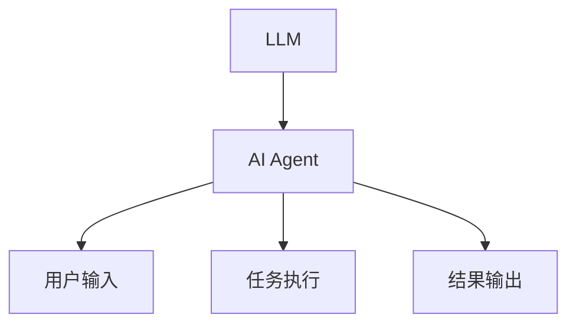
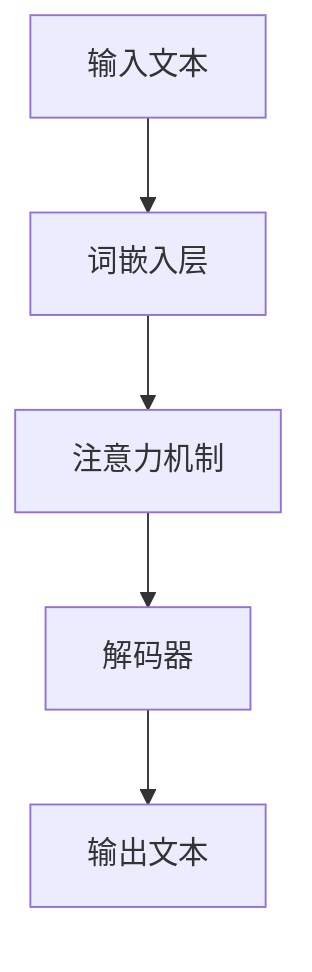
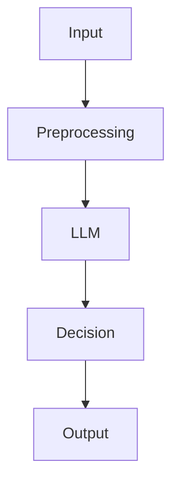
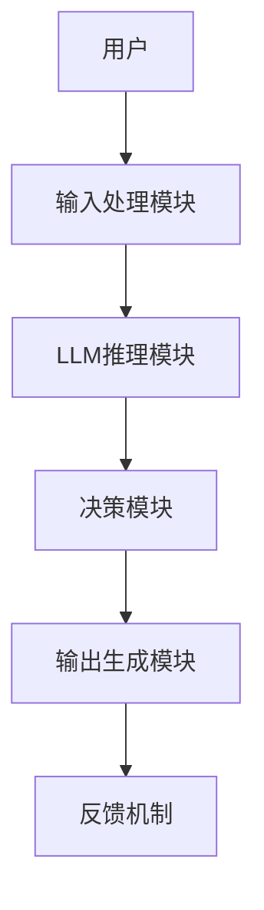
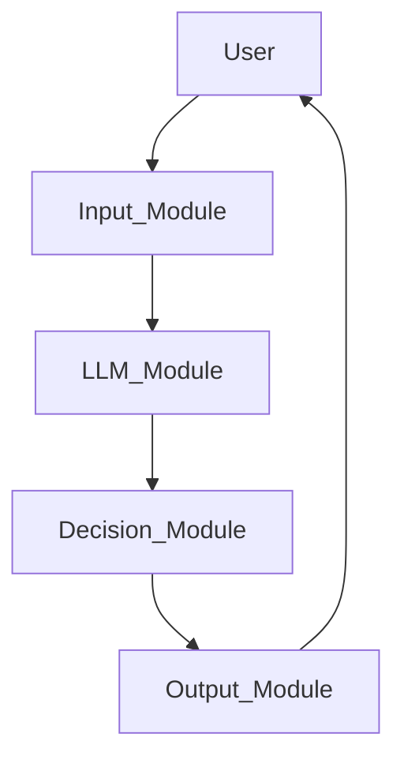

                 


# LLM在AI Agent抽象思维形成中的应用

> 关键词：LLM, AI Agent, 抽象思维, 自然语言处理, 深度学习, 大语言模型

> 摘要：本文探讨了大语言模型（LLM）在AI Agent形成抽象思维中的应用。通过分析LLM和AI Agent的核心概念，结合算法原理、系统架构和实际案例，详细阐述了如何利用LLM增强AI Agent的抽象思维能力，从而实现更智能的决策和交互。

---

# 第一部分: LLM与AI Agent背景介绍

## 第1章: LLM与AI Agent概述

### 1.1 问题背景

#### 1.1.1 AI Agent的定义与特点
AI Agent（人工智能代理）是指能够感知环境、自主决策并执行任务的智能体。AI Agent可以是软件程序、机器人或其他智能系统，其核心目标是通过与环境交互来实现特定目标。AI Agent的特点包括自主性、反应性、目标导向性和社会性。

#### 1.1.2 LLM在AI Agent中的作用
大语言模型（LLM）是一种基于深度学习的自然语言处理模型，能够理解和生成人类语言。LLM在AI Agent中的作用主要体现在以下几个方面：
1. **语义理解**：LLM能够理解用户输入的自然语言指令，帮助AI Agent准确理解用户的意图。
2. **知识推理**：LLM可以通过上下文推理出隐藏的信息，帮助AI Agent做出更智能的决策。
3. **生成能力**：LLM可以生成自然语言文本，帮助AI Agent与用户进行流畅的对话交互。

#### 1.1.3 当前AI Agent发展的挑战与机遇
尽管AI Agent技术已经取得了一定的进展，但在抽象思维能力方面仍存在不足。传统的AI Agent更多依赖于规则或基于数据的模式识别，难以真正理解抽象概念和复杂情境。而LLM的出现为AI Agent的抽象思维能力提供了新的可能性。

### 1.2 问题描述

#### 1.2.1 AI Agent抽象思维的必要性
AI Agent的抽象思维能力是其智能化的核心。具备抽象思维能力的AI Agent能够理解隐含含义、进行推理和创造性思考，从而在复杂环境中做出更灵活的决策。

#### 1.2.2 LLM在抽象思维中的优势
LLM通过大量数据训练，掌握了丰富的语义知识，能够理解上下文并进行推理。这种能力可以被集成到AI Agent中，增强其抽象思维能力。

#### 1.2.3 当前AI Agent在抽象思维中的不足
目前的AI Agent大多依赖于固定的规则或简单的模式识别，难以真正理解抽象概念。例如，当用户给出一个模糊的指令时，AI Agent往往无法准确理解用户的意图，导致交互体验不佳。

### 1.3 问题解决

#### 1.3.1 LLM如何帮助AI Agent形成抽象思维
通过结合LLM的自然语言处理能力，AI Agent可以更好地理解用户的意图和上下文信息，从而形成抽象思维能力。例如，当用户给出“帮我安排明天的会议”这样的指令时，AI Agent可以理解“安排会议”不仅包括预约会议室，还包括发送提醒、邀请相关人员等复杂步骤。

#### 1.3.2 LLM在AI Agent中的具体应用场景
- **智能助手**：如Siri、Alexa等，通过LLM理解用户的指令并执行相应的操作。
- **客服机器人**：通过LLM理解客户的问题并提供解决方案。
- **智能推荐系统**：通过LLM分析用户的行为和偏好，推荐相关内容。

#### 1.3.3 LLM与AI Agent结合的实现路径
1. **接口集成**：将LLM作为AI Agent的“大脑”，通过API接口接收输入并返回处理结果。
2. **上下文管理**：利用LLM的上下文理解能力，帮助AI Agent维护对话状态。
3. **知识库整合**：将LLM与知识库结合，增强AI Agent的知识推理能力。

### 1.4 边界与外延

#### 1.4.1 LLM在AI Agent中的边界
- **计算资源限制**：LLM的运行需要大量的计算资源，这可能限制其在资源受限环境中的应用。
- **数据依赖性**：LLM的表现高度依赖于训练数据的质量和多样性，数据偏差可能导致错误的推理。

#### 1.4.2 AI Agent抽象思维的外延
- **创造性思维**：AI Agent能够提出创新的解决方案。
- **情感理解**：AI Agent能够理解并处理情感信息，提升人机交互的体验。

#### 1.4.3 相关技术的对比与区别
- **传统AI Agent**：基于规则或模式识别，缺乏真正的理解能力。
- **增强型AI Agent**：结合LLM的自然语言处理能力，具备更强的抽象思维能力。

### 1.5 概念结构与核心要素

#### 1.5.1 LLM的核心要素
1. **模型结构**：如Transformer架构。
2. **训练数据**：大规模的文本数据。
3. **推理机制**：基于概率的生成模型。

#### 1.5.2 AI Agent的构成要素
1. **感知模块**：接收输入信息。
2. **决策模块**：基于感知信息做出决策。
3. **执行模块**：执行决策并输出结果。

#### 1.5.3 LLM与AI Agent的关系图


---

## 第2章: LLM与AI Agent的核心概念与联系

### 2.1 LLM的核心原理

#### 2.1.1 大语言模型的训练过程
LLM的训练通常采用监督学习和无监督学习相结合的方式。模型通过大量文本数据进行预训练，然后在特定任务上进行微调。

#### 2.1.2 大语言模型的推理机制
LLM通过概率生成模型，根据输入生成最可能的输出。其推理过程涉及词嵌入、注意力机制和解码器等技术。

#### 2.1.3 大语言模型的局限性
- **计算资源需求高**：需要大量的GPU资源。
- **黑箱问题**：模型的决策过程难以解释。
- **数据偏差**：训练数据中的偏见可能影响模型的输出。

### 2.2 AI Agent的核心原理

#### 2.2.1 AI Agent的感知与决策
AI Agent通过传感器或API接口感知环境信息，然后基于感知信息做出决策。

#### 2.2.2 AI Agent的行动与反馈
AI Agent根据决策结果执行动作，并通过反馈机制调整自身的行为。

#### 2.2.3 AI Agent的自主学习能力
AI Agent可以通过强化学习等方法，在与环境的交互中不断优化自身的决策策略。

### 2.3 LLM与AI Agent的关系

#### 2.3.1 LLM作为AI Agent的“大脑”
LLM为AI Agent提供语义理解和生成能力，帮助其更好地理解和响应用户需求。

#### 2.3.2 AI Agent作为LLM的“载体”
AI Agent为LLM提供实际应用场景，使其能够与真实环境和用户交互。

#### 2.3.3 两者的协同工作模式
1. **输入处理**：AI Agent接收用户输入，通过LLM进行语义分析。
2. **决策推理**：基于LLM的分析结果，AI Agent做出决策。
3. **输出生成**：AI Agent通过LLM生成自然语言的输出结果。

---

## 第3章: 核心概念属性特征对比

### 3.1 LLM的属性特征

#### 3.1.1 模型参数规模
- LLM的参数规模通常在 billions级别，例如GPT-3拥有175 billion个参数。

#### 3.1.2 模型训练数据
- LLM通常基于大规模的文本数据进行预训练，数据来源包括书籍、网页和其他公开文本。

#### 3.1.3 模型推理能力
- LLM能够理解上下文并生成连贯的文本，但其推理能力受限于训练数据的质量和多样性。

### 3.2 AI Agent的属性特征

#### 3.2.1 任务执行能力
- AI Agent能够执行特定任务，如信息检索、任务安排等。

#### 3.2.2 环境适应能力
- AI Agent能够根据环境变化调整自身行为，具有较强的适应性。

#### 3.2.3 自主决策能力
- AI Agent能够基于当前状态和环境信息做出决策，具有一定的自主性。

### 3.3 对比分析

#### 3.3.1 LLM与AI Agent的共同点
- 都依赖于大量数据进行训练或推理。
- 都具有一定的智能性，能够处理复杂任务。

#### 3.3.2 LLM与AI Agent的区别
- **功能定位**：LLM主要负责自然语言处理，而AI Agent负责整体任务执行。
- **应用场景**：LLM适用于需要语言交互的场景，而AI Agent适用于更广泛的智能任务。

#### 3.3.3 互补性分析
- LLM增强了AI Agent的语言理解和生成能力。
- AI Agent为LLM提供了实际的应用场景，使其能够发挥作用。

---

## 第4章: LLM与AI Agent的关系图


---

## 第5章: LLM与AI Agent的核心算法流程图



---

## 第6章: LLM与AI Agent的核心算法实现

### 6.1 LLM的核心算法实现

#### 6.1.1 模型结构
```python
class Transformer(nn.Module):
    def __init__(self, d_model, nhead, num_layers):
        super().__init__()
        self.layers = nn.ModuleList([
            nn.TransformerEncoderLayer(d_model=d_model, nhead=nhead)
            for _ in range(num_layers)
        ])
    
    def forward(self, x):
        for layer in self.layers:
            x = layer(x)
        return x
```

#### 6.1.2 推理过程
```python
def generate_response(prompt, model, tokenizer):
    inputs = tokenizer(prompt, return_tensors="pt")
    outputs = model.generate(
        inputs.input_ids,
        max_length=50,
        num_beams=5,
        temperature=0.7,
        top_p=0.9
    )
    response = tokenizer.decode(outputs[0], skip_special_tokens=True)
    return response
```

---

## 第7章: LLM与AI Agent的核心算法数学公式

### 7.1 注意力机制公式
$$
\text{Attention}(Q, K, V) = \text{softmax}\left(\frac{QK^T}{\sqrt{d_k}}\right)V
$$

### 7.2 解码器公式
$$
\text{Decoder}(x) = \text{Self-attention}(x) + \text{Feed-forward}(x)
$$

---

## 第8章: LLM与AI Agent的系统分析与架构设计

### 8.1 系统功能设计

#### 8.1.1 系统功能模块
1. **输入处理模块**：接收用户输入并进行预处理。
2. **LLM推理模块**：利用LLM对输入进行语义分析。
3. **决策模块**：基于分析结果做出决策。
4. **输出生成模块**：生成自然语言的输出结果。

#### 8.1.2 功能模块关系图


---

## 第9章: LLM与AI Agent的系统架构设计

### 9.1 系统架构图


---

## 第10章: LLM与AI Agent的系统接口设计

### 10.1 系统接口设计

#### 10.1.1 输入接口
- **输入格式**：文本字符串。
- **接口协议**：HTTP REST API。

#### 10.1.2 输出接口
- **输出格式**：文本字符串。
- **接口协议**：HTTP REST API。

---

## 第11章: LLM与AI Agent的系统交互流程图



---

## 第12章: LLM与AI Agent的项目实战

### 12.1 项目实战

#### 12.1.1 环境安装
```bash
pip install transformers torch
```

#### 12.1.2 核心代码实现

```python
from transformers import GPT2LMHeadModel, GPT2Tokenizer

model_name = 'gpt2'
tokenizer = GPT2Tokenizer.from_pretrained(model_name)
model = GPT2LMHeadModel.from_pretrained(model_name)

def generate_response(prompt):
    inputs = tokenizer(prompt, return_tensors="pt")
    outputs = model.generate(
        inputs.input_ids,
        max_length=50,
        num_beams=5,
        temperature=0.7,
        top_p=0.9
    )
    response = tokenizer.decode(outputs[0], skip_special_tokens=True)
    return response

# 示例
prompt = "帮我安排明天的会议。"
response = generate_response(prompt)
print(response)
```

#### 12.1.3 代码应用解读与分析
1. **环境安装**：安装必要的库，包括`transformers`和`torch`。
2. **核心代码实现**：定义生成响应的函数，利用GPT-2模型生成自然语言的输出。
3. **案例分析**：用户输入“帮我安排明天的会议。”，AI Agent通过LLM生成响应，例如“我将为您安排明天下午2点的会议，请问需要安排在哪个会议室？”

---

## 第13章: LLM与AI Agent的最佳实践

### 13.1 小结
本文详细探讨了LLM在AI Agent抽象思维形成中的应用，从核心概念、算法原理到系统设计和项目实战，全面阐述了如何利用LLM增强AI Agent的智能性。

### 13.2 注意事项
- **数据隐私**：在实际应用中，需要注意数据的隐私和安全问题。
- **计算资源**：LLM的运行需要大量的计算资源，需要合理规划资源分配。
- **模型调优**：根据具体场景对LLM进行微调，以提升性能。

### 13.3 拓展阅读
- [《Transformer: 一个/tutorial》](https://transformer.net/)
- [《大语言模型的原理与应用》](https://example.com/llm)

---

# 作者：AI天才研究院/AI Genius Institute & 禅与计算机程序设计艺术 /Zen And The Art of Computer Programming

