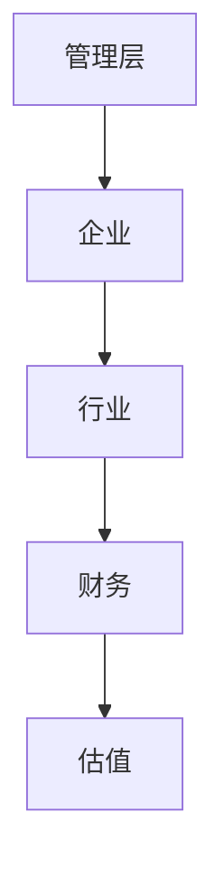

                 


# 乔尔·格林布拉特的价值投资量化方法

> 关键词：价值投资，量化方法，格林布拉特，五圈理论，套利机会模型，投资策略

> 摘要：本文深入探讨了乔尔·格林布拉特的价值投资量化方法，从其核心模型到系统的构建与实现，结合丰富的图表和数学公式，详细解读了如何将价值投资与量化方法相结合，帮助投资者制定有效的投资策略。

---

## 第1章: 价值投资与量化方法的背景介绍

### 1.1 价值投资的核心概念

#### 1.1.1 价值投资的定义与特点

价值投资是一种以基本面分析为基础的投资策略，强调以低于内在价值的价格购买优质资产。其核心在于识别市场低估的股票，并长期持有，等待其价值回归。

- **定义**：价值投资关注于公司内在价值的评估，而非市场的短期波动。
- **特点**：
  - 长期投资视角
  - 侧重于公司基本面分析
  - 寻找市场低估的资产
  - 耐心等待价值回归

#### 1.1.2 量化方法在投资中的作用

量化方法通过数学模型和算法，将复杂的投资决策过程系统化，帮助投资者更高效地识别投资机会和风险。

- **优势**：
  - 提高决策效率
  - 减少人为情绪干扰
  - 精准量化投资标的的价值
  - 便于大规模数据处理

#### 1.1.3 乔尔·格林布拉特的贡献

乔尔·格林布拉特是将价值投资与量化方法结合的先驱，其提出的五圈理论和套利机会模型为投资界提供了新的视角。

- **贡献**：
  - 提出五圈理论，帮助投资者系统化地评估公司价值。
  - 开发套利机会模型，识别市场套利机会。
  - 结合基本面分析和量化方法，开创了量化价值投资的新领域。

### 1.2 价值投资与量化方法的结合

#### 1.2.1 传统价值投资的局限性

传统价值投资依赖于分析师的主观判断，存在以下局限性：

- **低效性**：人工分析耗时且效率低下。
- **主观性**：不同分析师可能得出不同结论。
- **不一致性**：难以在大规模数据中保持一致性。

#### 1.2.2 量化方法的优势

量化方法通过模型和算法，克服了传统价值投资的局限性：

- **高效性**：自动化处理大量数据，提高投资效率。
- **客观性**：基于数学模型，减少人为情绪干扰。
- **一致性**：在不同市场环境下保持一致的投资策略。

#### 1.2.3 乔尔·格林布拉特的量化模型

格林布拉特的量化模型结合了基本面分析和统计套利，形成了一套独特的投资方法。

- **核心**：通过量化模型识别市场低估的股票和套利机会。
- **优势**：结合了基本面分析的深度和量化方法的广度。

### 1.3 本书的核心目标

#### 1.3.1 理解乔尔·格林布拉特的量化方法

本文旨在帮助读者深入理解格林布拉特的量化模型，包括其背后的数学原理和实际应用。

#### 1.3.2 学习如何构建量化投资模型

通过详细讲解模型的构建过程，读者可以掌握如何将价值投资理念转化为量化指标。

#### 1.3.3 实践量化投资策略

本文将结合实际案例，指导读者如何在实际投资中应用这些模型和方法。

---

## 第2章: 乔尔·格林布拉特的核心量化模型

### 2.1 五圈理论

#### 2.1.1 五圈理论的定义

五圈理论是格林布拉特提出的一种公司评估方法，将公司分为五个层次进行分析。

- **五圈**：
  1. **管理层**：公司管理层的能力和诚信。
  2. **企业**：公司的商业模式和竞争优势。
  3. **行业**：行业的竞争格局和增长潜力。
  4. **财务**：公司的财务状况和盈利能力。
  5. **估值**：公司的市场估值和投资价值。

#### 2.1.2 五圈理论的各圈分析

每个圈层都需要详细分析，以全面评估公司的投资价值。

- **管理层**：评估管理层的决策能力和诚信度。
- **企业**：分析公司的商业模式和竞争优势。
- **行业**：研究行业的发展趋势和竞争格局。
- **财务**：审查公司的财务报表和盈利情况。
- **估值**：计算公司的内在价值和市场估值。

#### 2.1.3 五圈理论的量化指标

通过量化指标将五圈理论转化为具体的数值，便于比较和筛选。

- **管理层评分**：基于管理层的过往表现和市场口碑。
- **企业评分**：基于公司的竞争优势和市场地位。
- **行业评分**：基于行业的增长潜力和竞争程度。
- **财务评分**：基于财务指标如ROE、毛利率等。
- **估值评分**：基于市盈率、市净率等估值指标。

#### 2.1.4 五圈理论的mermaid流程图



### 2.2 套利机会模型

#### 2.2.1 套利机会的定义

套利机会是指在不同市场或资产之间存在价格差异，可以通过同时买低卖高或卖高买低来获利的机会。

- **定义**：利用市场价差进行无风险或低风险套利。
- **特点**：
  - 价格差异的存在
  - 可能涉及不同市场或资产
  - 风险较低

#### 2.2.2 套利机会的量化指标

通过量化指标筛选套利机会，包括：

- **价差**：不同市场或资产之间的价格差异。
- **流动性**：套利机会的交易量和市场深度。
- **风险**：套利机会的风险程度，如信用风险、市场风险等。

#### 2.2.3 套利机会的筛选与评估

通过模型筛选和评估套利机会，确保其可行性和收益性。

- **筛选**：基于量化指标筛选出符合条件的套利机会。
- **评估**：评估套利机会的潜在收益和风险。

### 2.3 其他相关模型

#### 2.3.1 股价与价值的偏离度模型

该模型通过比较股价与内在价值的偏离程度，判断投资机会。

- **偏离度计算**：股价与内在价值的差异。
- **偏离度指标**：基于偏离度的正负判断投资方向。

#### 2.3.2 股票质量评估模型

该模型通过多个指标综合评估股票的质量。

- **指标**：
  - 财务指标：ROE、毛利率等。
  - 市场指标：市盈率、市净率等。
  - 风险指标：波动率、Beta值等。

#### 2.3.3 市场情绪与投资决策模型

通过分析市场情绪影响投资决策。

- **市场情绪指标**：基于市场参与者的心理和行为。
- **情绪与投资决策的关系**：市场情绪高涨时，可能引发高估；市场情绪低落时，可能引发低估。

---

## 第3章: 量化模型的数学基础

### 3.1 贴现现金流模型

#### 3.1.1 模型的定义与公式

贴现现金流模型（DCF模型）用于估算公司的内在价值。

- **定义**：通过折现未来现金流的现值，计算公司价值。
- **公式**：
  $$
  \text{内在价值} = \sum_{t=1}^{n} \frac{CF_t}{(1 + r)^t} + \frac{TV}{(1 + r)^n}
  $$
  其中，$CF_t$为第t年的现金流，$r$为折现率，$TV$为终值。

#### 3.1.2 模型的假设与限制

- **假设**：
  - 现金流可以准确预测。
  - 折现率可以合理估计。
- **限制**：
  - 预测的准确性影响模型结果。
  - 适用于稳定增长的企业，不适用于周期性企业。

#### 3.1.3 模型的改进与优化

- **改进**：引入情景分析和敏感性分析，提高模型的稳健性。
- **优化**：采用加权平均资本成本（WACC）作为折现率。

### 3.2 股票估值公式

#### 3.2.1 市盈率与市净率

- **市盈率（P/E）**：
  $$
  P/E = \frac{\text{股价}}{\text{每股收益}}
  $$
- **市净率（P/B）**：
  $$
  P/B = \frac{\text{股价}}{\text{每股净资产}}
  $$

#### 3.2.2 股息率与股息增长模型

- **股息率**：
  $$
  \text{股息率} = \frac{\text{每股股息}}{\text{股价}}
  $$
- **股息增长模型**（戈登模型）：
  $$
  \text{股价} = \frac{D_1}{r - g}
  $$
  其中，$D_1$为第一期股息，$r$为折现率，$g$为股息增长率。

#### 3.2.3 内在价值计算公式

通过DCF模型计算内在价值，与市场价格进行比较。

### 3.3 统计套利模型

#### 3.3.1 均值回归与统计套利

- **均值回归**：价格偏离均值后会回归均值。
- **统计套利**：利用价格偏离均值的机会进行套利。

#### 3.3.2 马科维茨投资组合理论

- **定义**：通过优化投资组合的风险和收益，找到最优资产配置。
- **公式**：
  $$
  \text{最小化} \sigma^2 \quad \text{在} \quad E(r) \geq \text{目标收益}
  $$

#### 3.3.3 风险调整后的收益模型

- **夏普比率**：
  $$
  \text{夏普比率} = \frac{E(r_p) - r_f}{\sigma_p}
  $$
  其中，$E(r_p)$为投资组合的期望收益，$r_f$为无风险利率，$\sigma_p$为投资组合的收益标准差。

---

## 第4章: 量化投资系统的系统分析与架构设计

### 4.1 系统目标与范围

#### 4.1.1 投资目标的定义

系统旨在帮助投资者基于格林布拉特的量化模型，识别投资机会和风险。

#### 4.1.2 系统范围的界定

- **数据采集**：收集公司财务数据、市场数据等。
- **数据分析**：应用量化模型进行数据分析。
- **投资决策**：基于分析结果生成投资策略。
- **风险控制**：监控投资组合的风险。

#### 4.1.3 系统功能的需求分析

- **数据采集模块**：收集和处理数据。
- **数据分析模块**：应用模型进行分析。
- **投资决策模块**：生成投资策略。
- **风险控制模块**：监控和管理风险。

### 4.2 系统架构设计

#### 4.2.1 数据采集模块

- **功能**：采集公司财务数据、市场数据等。
- **接口**：与数据源对接，如Yahoo Finance、Reuters等。

#### 4.2.2 数据分析模块

- **功能**：应用量化模型进行数据分析。
- **算法**：五圈理论、套利机会模型等。

#### 4.2.3 投资决策模块

- **功能**：基于分析结果生成投资策略。
- **输出**：投资建议、交易信号等。

#### 4.2.4 风险控制模块

- **功能**：监控和管理投资组合风险。
- **指标**：VaR、夏普比率等。

### 4.3 系统接口设计

#### 4.3.1 数据接口规范

- **输入**：数据源接口。
- **输出**：处理后的数据。

#### 4.3.2 模型接口规范

- **输入**：量化模型的参数。
- **输出**：模型结果。

#### 4.3.3 用户界面设计

- **界面**：用户友好的界面，展示投资建议和风险提示。

### 4.4 系统交互流程

#### 4.4.1 数据采集与处理流程

1. 从数据源获取数据。
2. 处理数据，提取所需信息。
3. 存储数据，供后续分析使用。

#### 4.4.2 模型计算与分析流程

1. 应用量化模型进行数据分析。
2. 计算投资标的评分和筛选。
3. 生成投资建议和交易信号。

#### 4.4.3 投资决策与执行流程

1. 基于分析结果生成投资策略。
2. 监控投资组合风险。
3. 根据市场变化调整投资组合。

---

## 第5章: 量化投资系统的实战实现

### 5.1 环境搭建与数据准备

#### 5.1.1 环境搭建

- **安装Python**：使用Anaconda或Miniconda。
- **安装依赖库**：如Pandas、NumPy、Matplotlib、Scikit-learn等。

#### 5.1.2 数据准备

- **数据来源**：Yahoo Finance、Reuters等。
- **数据格式**：CSV、Excel等。

### 5.2 核心实现

#### 5.2.1 数据采集模块

- **代码实现**：
  ```python
  import pandas as pd
  from pandas_datareader import data as pdr

  def get_data(tickers, start, end):
      df = pdr.data.get_data_yahoo(tickers, start, end)
      return df
  ```

#### 5.2.2 数据分析模块

- **代码实现**：
  ```python
  def greenblatt_screen(df, metrics):
      scores = {}
      for metric in metrics:
          scores[metric] = df[metric].rank(pct=True)
      total_score = sum(scores.values()) / len(metrics)
      return total_score
  ```

#### 5.2.3 投资决策模块

- **代码实现**：
  ```python
  def generate_signals(scores, threshold=0.5):
      signals = {}
      for ticker, score in scores.items():
          if score > threshold:
              signals[ticker] = 'Buy'
          elif score < -threshold:
              signals[ticker] = 'Sell'
          else:
              signals[ticker] = 'Hold'
      return signals
  ```

#### 5.2.4 风险控制模块

- **代码实现**：
  ```python
  def calculate VaR(positions, confidence_level=0.95):
      returns = positions.pct_change().dropna()
      VaR = returns.quantile(1 - confidence_level)
      return VaR
  ```

### 5.3 项目实战

#### 5.3.1 实际案例分析

- **案例**：假设我们有两只股票，A和B，分别应用五圈理论和套利机会模型进行分析。

#### 5.3.2 代码应用解读与分析

- **解读**：通过代码实现五圈评分和套利机会筛选。
- **分析**：根据评分结果生成投资建议。

### 5.4 项目小结

- **总结**：通过实战项目，读者可以掌握如何将理论应用于实际投资中。
- **注意事项**：强调风险控制和模型优化的重要性。

---

## 第6章: 总结与展望

### 6.1 本章小结

- **总结**：本文详细介绍了乔尔·格林布拉特的价值投资量化方法，从理论到实践，为投资者提供了全面的指导。

### 6.2 未来展望

- **拓展**：未来可以进一步研究如何将机器学习算法应用于量化投资中。
- **挑战**：随着市场的变化，量化模型需要不断优化和更新。

### 6.3 最佳实践 Tips

- **建议**：保持对市场的敏感性，及时调整投资策略。
- **注意事项**：合理控制风险，避免过度依赖单一模型。

### 6.4 小结

- **强调**：量化投资需要理论与实践的结合，持续学习和优化是关键。

---

## 作者：AI天才研究院/AI Genius Institute & 禅与计算机程序设计艺术 /Zen And The Art of Computer Programming

---

通过以上详细的目录和内容规划，我们可以看到，本文不仅介绍了乔尔·格林布拉特的价值投资量化方法，还结合了实际的系统设计和代码实现，帮助读者从理论到实践全面掌握这种方法。希望本文能为投资者提供有价值的指导和启示。

