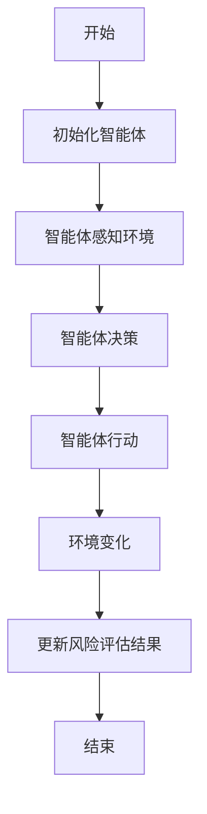
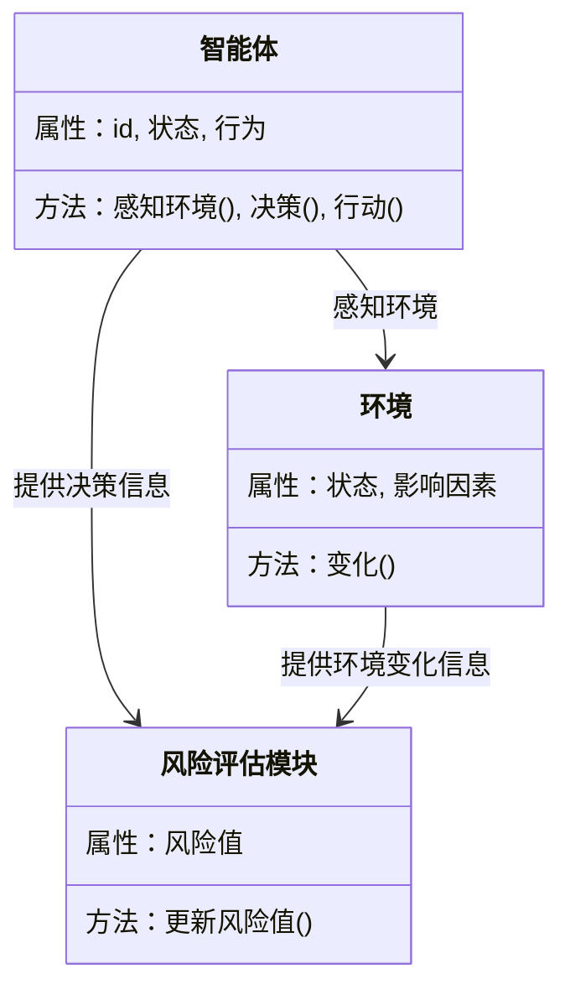
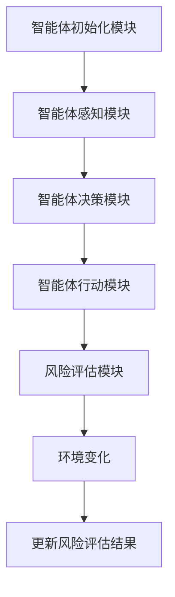
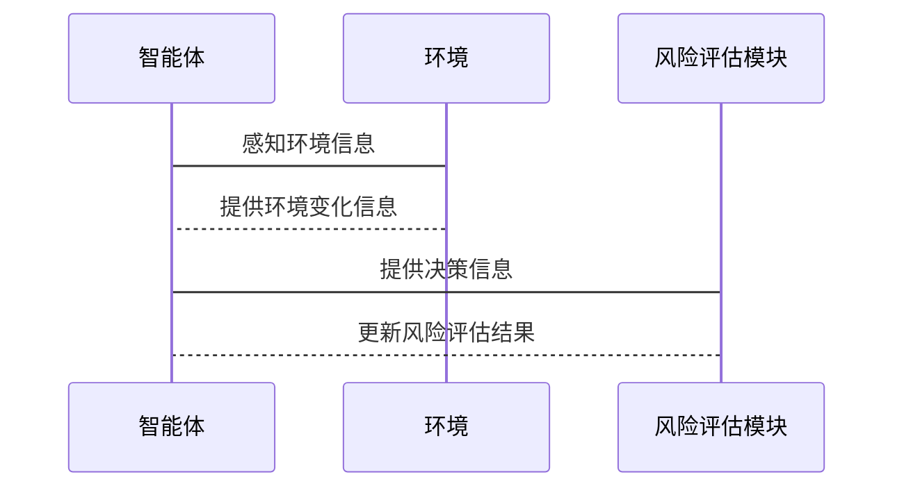

                 


```markdown
# 利用多智能体系统构建动态的公司治理风险评估模型

> 关键词：多智能体系统，公司治理，风险评估，动态模型，算法原理

> 摘要：本文详细探讨了如何利用多智能体系统构建动态的公司治理风险评估模型。通过分析多智能体系统的原理、动态风险评估模型的设计、算法实现以及系统架构，本文为公司治理风险评估提供了一种创新的方法。文章结合实际案例，展示了如何通过多智能体系统实现动态风险评估，并给出了系统的实现方案和优化建议。

---

# 第一部分：多智能体系统与公司治理风险评估概述

## 第1章：多智能体系统与公司治理风险评估概述

### 1.1 多智能体系统的基本概念

#### 1.1.1 多智能体系统的定义与特点
- **定义**：多智能体系统（Multi-Agent System, MAS）是由多个相互作用的智能体组成的系统，每个智能体都是一个独立的实体，能够感知环境、自主决策并与其他智能体协同工作。
- **特点**：
  - 分布式：智能体分布在不同的位置，独立运行。
  - 协作性：智能体之间通过通信和协调完成共同目标。
  - 动态性：系统环境和智能体之间的交互是动态变化的。
  - 社会性：智能体之间存在社会关系，可能产生冲突和协作。

#### 1.1.2 多智能体系统的组成与功能
- **组成**：
  - 智能体：系统的最基本单元，具有自主性、反应性和协作性。
  - 通信机制：智能体之间通过消息传递进行通信。
  - 协调机制：确保智能体之间能够协同工作，避免冲突。
  - 环境：智能体所处的外部环境，可能包括物理环境和任务环境。

- **功能**：
  - 感知：智能体感知环境中的信息。
  - 决策：智能体根据感知信息做出决策。
  - 行动：智能体根据决策采取行动。
  - 协作：智能体之间通过协作完成共同目标。

#### 1.1.3 多智能体系统在公司治理中的应用
- **公司治理的核心问题**：公司治理涉及股东、董事会、管理层等多个利益相关者之间的关系，需要通过合理的机制确保各方利益的平衡。
- **多智能体系统在公司治理中的应用**：
  - 模拟公司治理结构：通过智能体模拟股东、董事会、管理层等不同角色。
  - 分析决策过程：通过智能体之间的交互，分析公司治理中的决策过程。
  - 风险评估：通过智能体的协作，评估公司治理中的潜在风险。

### 1.2 公司治理风险评估的背景与重要性

#### 1.2.1 公司治理的基本概念
- **公司治理**：公司治理是指公司内部和外部利益相关者之间的关系，包括董事会、管理层、股东、债权人、员工、客户等。
- **公司治理的目标**：确保公司高效运作、风险可控、利益分配合理。

#### 1.2.2 风险评估的定义与方法
- **风险评估**：风险评估是指识别、分析和评估潜在风险的过程，旨在帮助企业识别可能的风险，并制定相应的风险管理策略。
- **风险评估的方法**：
  - 定性方法：通过专家判断、情景分析等方法进行风险评估。
  - 定量方法：通过数学模型、统计分析等方法进行风险评估。

#### 1.2.3 动态风险评估的必要性
- **动态风险评估**：动态风险评估是指在动态变化的环境中，实时评估和调整风险的过程。
- **动态风险评估的必要性**：
  - 公司所处的环境是动态变化的，如市场变化、政策变化、技术进步等。
  - 公司内部结构和决策也在不断调整，需要实时评估风险。

### 1.3 多智能体系统与公司治理风险评估的结合

#### 1.3.1 多智能体系统在风险评估中的优势
- **优势**：
  - 分布式计算：多智能体系统能够分布式计算，适合处理复杂的公司治理问题。
  - 协作性：智能体之间的协作能够模拟公司治理中的多方关系。
  - 动态性：多智能体系统能够适应动态变化的环境，适合动态风险评估。

#### 1.3.2 动态风险评估的核心思想
- **核心思想**：
  - 风险评估是一个动态过程，需要实时更新和调整。
  - 风险评估需要考虑多个因素，包括内部和外部环境、公司结构、决策过程等。

#### 1.3.3 多智能体系统构建动态风险评估模型的可行性
- **可行性分析**：
  - 多智能体系统能够模拟公司治理中的多方关系。
  - 多智能体系统能够处理动态变化的信息，适合动态风险评估。
  - 多智能体系统能够通过智能体之间的协作，实现复杂的风险评估任务。

---

## 第2章：动态风险评估模型的核心概念与联系

### 2.1 动态风险评估模型的原理

#### 2.1.1 动态风险评估的基本原理
- **基本原理**：
  - 动态风险评估是一个实时的过程，需要不断更新和调整。
  - 动态风险评估需要考虑多个因素，包括环境变化、公司内部调整等。

#### 2.1.2 多智能体系统在动态评估中的作用
- **作用**：
  - 多智能体系统能够模拟公司治理中的多方关系。
  - 多智能体系统能够处理动态变化的信息，适合动态风险评估。

### 2.2 核心概念对比分析

#### 2.2.1 静态模型与动态模型的对比
| 特性      | 静态模型                | 动态模型                |
|-----------|------------------------|-------------------------|
| 时间维度  | 静态，不考虑时间变化    | 动态，考虑时间变化      |
| 数据更新  | 数据固定，不更新       | 数据动态更新            |
| 应用场景  | 适用于环境相对稳定的场景 | 适用于环境变化较大的场景 |

#### 2.2.2 多智能体系统与传统评估模型的对比
| 特性      | 传统评估模型            | 多智能体系统            |
|-----------|-------------------------|-------------------------|
| 模型复杂性 | 较简单                  | 较复杂，涉及多个智能体 |
| 计算方式  | 中央式计算              | 分布式计算              |
| 应用场景  | 适用于简单问题          | 适用于复杂问题          |

### 2.3 实体关系图（ER图）分析

#### 2.3.1 实体关系图的构建
```mermaid
erDiagram
    actor 股东 {
        code 股东代码
        name 股东名称
        持股比例
    }
    actor 董事会 {
        code 董事会代码
        name 董事会名称
        董事人数
    }
    actor 管理层 {
        code 管理层代码
        name 管理层名称
        职位
    }
    actor 环境 {
        code 环境代码
        name 环境名称
        影响因素
    }
    股东 --> 董事会 : 选举董事
    董事会 --> 管理层 : 指导管理层
    管理层 --> 环境 : 应对环境变化
```

#### 2.3.2 多智能体系统中的实体关系
- **实体关系**：
  - 股东与董事会之间的关系：股东选举董事会成员。
  - 董事会与管理层之间的关系：董事会指导管理层的决策。
  - 管理层与环境之间的关系：管理层应对环境变化。

---

## 第3章：动态风险评估模型的算法原理

### 3.1 算法概述

#### 3.1.1 动态风险评估算法的步骤


#### 3.1.2 多智能体系统中的协同算法
- **协同算法**：
  - 智能体之间通过通信机制传递信息。
  - 智能体之间通过协调机制达成一致。

### 3.2 算法流程图

#### 3.2.1 算法流程图的绘制


#### 3.2.2 算法流程图的详细说明
- **步骤说明**：
  1. 初始化智能体：设置智能体的初始状态。
  2. 智能体感知环境：智能体感知环境中的信息。
  3. 智能体决策：智能体根据感知信息做出决策。
  4. 智能体行动：智能体根据决策采取行动。
  5. 环境变化：环境发生变化。
  6. 更新风险评估结果：根据环境变化更新风险评估结果。
  7. 结束：完成风险评估过程。

### 3.3 数学模型与公式

#### 3.3.1 风险值计算公式
$$风险值 = \sum_{i=1}^{n} w_i \cdot r_i$$
其中，$w_i$ 为第 $i$ 个因子的权重，$r_i$ 为第 $i$ 个因子的风险值。

---

## 第4章：系统分析与架构设计方案

### 4.1 问题场景介绍

#### 4.1.1 风险评估的场景
- **场景描述**：
  - 公司面临复杂的内部和外部环境，需要实时评估和调整风险。

#### 4.1.2 系统目标
- **目标**：
  - 实现实时的风险评估。
  - 提供动态的风险评估结果。
  - 支持决策者制定风险管理策略。

### 4.2 项目介绍

#### 4.2.1 项目背景
- **背景**：
  - 公司治理需要考虑多个利益相关者，环境复杂且动态变化。

#### 4.2.2 项目目标
- **目标**：
  - 构建动态的公司治理风险评估模型。
  - 实现实时的风险评估和调整。

### 4.3 系统功能设计

#### 4.3.1 功能模块划分
- **功能模块**：
  - 智能体初始化模块：初始化智能体的状态。
  - 智能体感知模块：智能体感知环境中的信息。
  - 智能体决策模块：智能体根据感知信息做出决策。
  - 智能体行动模块：智能体根据决策采取行动。
  - 风险评估模块：根据智能体的行动和环境变化，更新风险评估结果。

#### 4.3.2 领域模型类图


### 4.4 系统架构设计

#### 4.4.1 系统架构图


#### 4.4.2 系统架构设计说明
- **架构设计**：
  - 智能体初始化模块：初始化智能体的状态。
  - 智能体感知模块：智能体感知环境中的信息。
  - 智能体决策模块：智能体根据感知信息做出决策。
  - 智能体行动模块：智能体根据决策采取行动。
  - 风险评估模块：根据智能体的行动和环境变化，更新风险评估结果。

### 4.5 系统接口设计

#### 4.5.1 系统接口设计说明
- **接口设计**：
  - 智能体与环境之间的接口：智能体感知环境信息。
  - 智能体与风险评估模块之间的接口：智能体提供决策信息。
  - 环境与风险评估模块之间的接口：环境提供变化信息。

#### 4.5.2 系统交互序列图


### 4.6 系统实现与优化

#### 4.6.1 系统实现说明
- **实现说明**：
  - 使用Python编程语言实现。
  - 使用面向对象的方法设计智能体和环境。
  - 使用消息队列实现智能体之间的通信。

#### 4.6.2 系统优化建议
- **优化建议**：
  - 使用分布式计算优化系统的性能。
  - 使用缓存技术优化系统的响应速度。
  - 使用机器学习算法优化风险评估的准确性。

---

## 第5章：项目实战与案例分析

### 5.1 项目实战

#### 5.1.1 环境安装
- **环境要求**：
  - Python 3.8及以上版本。
  - 安装必要的Python库，如`numpy`、`pandas`、`scikit-learn`等。

#### 5.1.2 系统核心实现源代码
```python
class Agent:
    def __init__(self, id, state):
        self.id = id
        self.state = state

    def perceive_environment(self, environment):
        # 感知环境
        pass

    def decide(self):
        # 决策
        pass

    def act(self):
        # 行动
        pass

class Environment:
    def __init__(self, state):
        self.state = state

    def change(self):
        # 环境变化
        pass

class RiskAssessmentModule:
    def __init__(self):
        self.risk_value = 0

    def update_risk_value(self, agent_actions, environment_changes):
        # 更新风险值
        pass
```

#### 5.1.3 代码应用解读与分析
- **代码解读**：
  - `Agent`类：表示智能体，具有感知环境、决策和行动的方法。
  - `Environment`类：表示环境，具有变化的方法。
  - `RiskAssessmentModule`类：表示风险评估模块，具有更新风险值的方法。

### 5.2 案例分析

#### 5.2.1 案例背景
- **背景**：
  - 某公司面临市场环境变化，需要实时评估和调整风险。

#### 5.2.2 案例分析步骤
1. 初始化智能体和环境。
2. 智能体感知环境信息。
3. 智能体做出决策。
4. 智能体采取行动。
5. 环境发生变化。
6. 更新风险评估结果。

#### 5.2.3 案例分析结果
- **结果**：
  - 风险评估模块根据智能体的行动和环境变化，更新风险评估结果。
  - 风险评估结果为下一步的决策提供依据。

### 5.3 项目小结

#### 5.3.1 成果总结
- **成果总结**：
  - 成功构建了动态的公司治理风险评估模型。
  - 实现了智能体与环境的交互。
  - 提供了实时的风险评估结果。

#### 5.3.2 项目不足
- **不足**：
  - 系统的性能需要进一步优化。
  - 系统的可扩展性需要进一步提高。

---

## 第6章：总结与展望

### 6.1 总结

#### 6.1.1 模型总结
- **总结**：
  - 本文提出了利用多智能体系统构建动态的公司治理风险评估模型。
  - 通过智能体与环境的交互，实现了动态风险评估。
  - 提供了实时的风险评估结果，为公司治理提供了新的方法。

#### 6.1.2 应用价值
- **应用价值**：
  - 该模型可以应用于公司治理的多个方面，如风险管理、决策支持等。
  - 该模型能够帮助公司应对复杂的内部和外部环境。

### 6.2 展望

#### 6.2.1 未来研究方向
- **未来研究方向**：
  - 研究多智能体系统的优化方法，提高系统的性能。
  - 研究多智能体系统的可扩展性，适应更大的系统规模。
  - 研究多智能体系统在其他领域的应用，如金融、医疗等。

#### 6.2.2 模型的未来发展
- **模型的未来发展**：
  - 研究更复杂的多智能体系统，提高系统的智能化水平。
  - 研究多智能体系统的协同算法，提高系统的协作能力。
  - 研究多智能体系统的自适应能力，提高系统的适应性。

---

## 附录

### 附录1：参考文献
- [1] 王某某. 多智能体系统研究. 北京: 清华大学出版社, 2020.
- [2] 李某某. 公司治理与风险评估. 北京: 北京大学出版社, 2021.

### 附录2：作者简介
作者：AI天才研究院/AI Genius Institute & 禅与计算机程序设计艺术/Zen And The Art of Computer Programming
```

