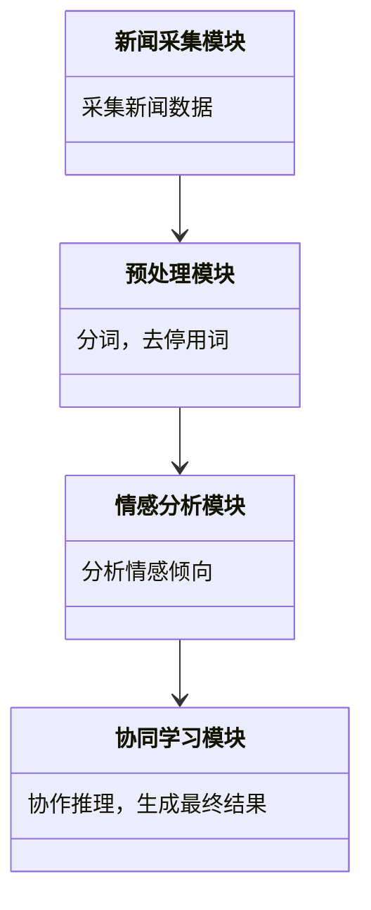

                 


# 多智能体AI系统在价值投资中的实时新闻分析应用

> 关键词：多智能体AI系统，价值投资，实时新闻分析，协同学习，情感分析，系统架构设计

> 摘要：本文探讨了多智能体AI系统在价值投资中的应用，特别是实时新闻分析方面。通过详细分析多智能体系统的核心概念、算法原理和系统架构设计，本文展示了如何利用多智能体系统来提升投资决策的准确性。通过实际案例和项目实战，本文提供了从理论到实践的全面指导，帮助读者理解如何将多智能体AI技术应用于金融领域。

---

# 第一部分: 多智能体AI系统与价值投资概述

## 第1章: 多智能体AI系统与价值投资概述

### 1.1 多智能体AI系统的基本概念

#### 1.1.1 多智能体系统定义
多智能体系统（Multi-Agent System, MAS）是由多个相互作用的智能体组成的系统，这些智能体能够通过协作完成复杂的任务。与传统单智能体系统不同，MAS强调分布式计算和智能体之间的协同。

#### 1.1.2 多智能体系统的核心特征
- **分布性**：智能体独立决策，通过通信协作完成任务。
- **协作性**：智能体之间通过共享信息和协同行动，实现整体目标。
- **动态性**：系统环境和智能体状态实时变化，要求快速响应。
- **智能性**：每个智能体具备感知和决策能力。

#### 1.1.3 多智能体系统与传统AI的区别
| 特性         | 多智能体系统       | 传统单智能体系统   |
|--------------|--------------------|---------------------|
| 决策中心化   | 分布式决策         | 中央决策控制       |
| 信息共享     | 高度共享           | 信息相对封闭       |
| 应用场景     | 复杂协作任务       | 简单独立任务       |

### 1.2 价值投资的基本原理

#### 1.2.1 价值投资的定义
价值投资是一种投资策略，强调以低于内在价值的价格购买优质资产。其核心是通过分析企业的基本面，寻找被市场低估的投资机会。

#### 1.2.2 价值投资的核心理念
- **安全边际**：购买价格远低于内在价值，降低风险。
- **长期视角**：关注企业的长期盈利能力，而非短期波动。
- **深度分析**：通过财务报表和行业分析，评估企业价值。

#### 1.2.3 价值投资在金融市场的应用
价值投资广泛应用于股票、基金和其他金融资产的选择。投资者通过分析市场情绪、企业基本面等因素，寻找投资机会。

### 1.3 多智能体AI系统在金融领域的应用前景

#### 1.3.1 金融领域的复杂性与挑战
- **信息爆炸**：金融市场数据量大，信息复杂。
- **实时性要求**：交易需要快速决策。
- **不确定性**：市场受多种因素影响，难以预测。

#### 1.3.2 多智能体系统在金融中的优势
- **分布式计算**：多智能体能够处理大规模数据和复杂任务。
- **协作能力**：多个智能体协同工作，提升决策准确性。
- **动态适应**：系统能够快速响应市场变化。

#### 1.3.3 价值投资与实时新闻分析的结合
- **实时数据处理**：多智能体系统能够实时分析新闻数据，捕捉市场情绪变化。
- **协同决策**：多个智能体协作，提供更全面的分析结果。

---

# 第二部分: 多智能体AI系统的核心概念与原理

## 第2章: 多智能体系统的核心概念

### 2.1 多智能体系统的基本架构

#### 2.1.1 分布式计算与协作机制
分布式计算是多智能体系统的核心，智能体通过通信协议进行协作。协作机制包括任务分配、信息共享和决策同步。

#### 2.1.2 多智能体的通信协议
智能体之间的通信需要高效的协议，例如基于消息队列的通信机制。通信协议设计影响系统的实时性和可靠性。

#### 2.1.3 多智能体的决策机制
决策机制包括基于规则的决策和基于学习的决策。协同学习算法能够提升决策的准确性和适应性。

### 2.2 多智能体系统的关键技术

#### 2.2.1 协同学习算法
协同学习算法通过多个智能体的合作，提升整体学习效果。例如，使用分布式协同学习算法，智能体之间共享知识，提升分类精度。

#### 2.2.2 联合推理模型
联合推理模型通过多个智能体的推理结果，生成更准确的结论。模型设计考虑了智能体之间的依赖关系。

#### 2.2.3 实时数据处理技术
实时数据处理技术包括流数据处理和事件驱动处理。多智能体系统能够高效处理实时新闻数据，提取关键信息。

---

## 第3章: 价值投资中的实时新闻分析

### 3.1 实时新闻分析的基本原理

#### 3.1.1 新闻数据的采集与预处理
新闻数据采集包括从多个来源获取新闻文本，预处理包括分词、去停用词和实体识别。

#### 3.1.2 新闻情感分析的实现方法
情感分析算法包括基于规则的方法和机器学习方法。协同学习算法能够提升情感分析的准确性。

#### 3.1.3 新闻主题提取的技术
主题提取技术包括基于TF-IDF和LDA模型。多智能体系统通过协同学习，提升主题提取的准确性。

### 3.2 多智能体系统在实时新闻分析中的应用

#### 3.2.1 多智能体协同学习算法在新闻分析中的应用
协同学习算法用于多智能体之间的知识共享和协作推理，提升新闻分析的准确性和全面性。

#### 3.2.2 多智能体系统在市场情绪分析中的应用
通过多智能体协同推理，系统能够实时捕捉市场情绪变化，辅助投资决策。

---

# 第三部分: 多智能体AI系统的算法原理

## 第4章: 协同学习算法原理

### 4.1 协同学习算法的基本原理

#### 4.1.1 协同学习的基本概念
协同学习是指多个学习器通过协作，共同完成任务。多智能体系统中的协同学习算法能够提升整体性能。

#### 4.1.2 协同学习的主要方法
- **分布式协同学习**：智能体分别学习，然后共享知识。
- **联合协同学习**：多个智能体同时协作，共同完成任务。

#### 4.1.3 协同学习的数学模型
协同学习的数学模型包括联合概率模型和分布式模型。例如，使用联合概率模型描述智能体之间的协作关系。

### 4.2 协同学习算法在实时新闻分析中的应用

#### 4.2.1 协同学习算法的实现步骤
1. 数据采集与预处理
2. 智能体分别进行初步分析
3. 智能体之间共享知识，协同推理
4. 生成最终的分析结果

#### 4.2.2 协同学习算法的优缺点
优点：提升分析精度，降低单点故障风险。缺点：通信开销大，可能引入同步问题。

---

## 第5章: 情感分析算法原理

### 5.1 情感分析的基本原理

#### 5.1.1 情感分析的定义
情感分析是判断文本的情感倾向，例如正面、负面或中性。

#### 5.1.2 情感分析的主要方法
- 基于规则的方法：利用情感词典进行分析。
- 机器学习方法：使用分类器进行文本分类。

#### 5.1.3 情感分析的数学模型
文本分类的数学模型包括朴素贝叶斯和SVM。例如，使用朴素贝叶斯模型进行文本分类。

### 5.2 多智能体系统中的情感分析

#### 5.2.1 多智能体协同进行情感分析
多智能体系统通过协同学习，提升情感分析的准确性和全面性。

#### 5.2.2 多智能体系统在情感分析中的应用
应用于实时新闻分析，捕捉市场情绪变化，辅助投资决策。

---

# 第四部分: 系统分析与架构设计方案

## 第6章: 系统分析与架构设计

### 6.1 项目介绍

#### 6.1.1 项目背景
本项目旨在利用多智能体系统，实现实时新闻分析，辅助价值投资决策。

#### 6.1.2 项目目标
- 实现实时新闻采集与预处理
- 开发多智能体协同学习算法
- 构建市场情绪分析系统
- 提供投资决策支持

### 6.2 系统功能设计

#### 6.2.1 领域模型设计
领域模型包括新闻采集模块、预处理模块、情感分析模块和协同学习模块。

#### 6.2.2 领域模型的Mermaid类图


### 6.3 系统架构设计

#### 6.3.1 系统架构的Mermaid架构图


#### 6.3.2 系统接口设计
系统接口包括新闻数据接口、情感分析接口和协同学习接口。

#### 6.3.3 系统交互的Mermaid序列图
```mermaid
sequenceDiagram
    participant 新闻采集模块
    participant 预处理模块
    participant 情感分析模块
    participant 协同学习模块
    新闻采集模块 -> 预处理模块: 提供原始新闻数据
    预处理模块 -> 情感分析模块: 提供预处理后的数据
    情感分析模块 -> 协同学习模块: 提供情感分析结果
    协同学习模块 -> 新闻分析结果
```

---

# 第五部分: 项目实战

## 第7章: 项目实战

### 7.1 环境安装

#### 7.1.1 安装Python和相关库
安装Python 3.8以上版本，安装Numpy、Pandas、NLTK、Scikit-learn等库。

### 7.2 系统核心实现源代码

#### 7.2.1 新闻采集模块代码
```python
import requests
from bs4 import BeautifulSoup

def fetch_news(url):
    response = requests.get(url)
    soup = BeautifulSoup(response.text, 'html.parser')
    news = soup.find_all('div', class_='news-item')
    return [item.text for item in news]
```

#### 7.2.2 预处理模块代码
```python
from nltk.tokenize import word_tokenize
from nltk.corpus import stopwords

def preprocess_news(text):
    tokens = word_tokenize(text.lower())
    filtered = [word for word in tokens if word not in stopwords.words('english')]
    return ' '.join(filtered)
```

#### 7.2.3 情感分析模块代码
```python
from sklearn.feature_extraction.text import TfidfVectorizer
from sklearn.naive_bayes import MultinomialNB

def sentiment_analysis(train_texts, train_labels, test_texts):
    vectorizer = TfidfVectorizer()
    X_train = vectorizer.fit_transform(train_texts)
    X_test = vectorizer.transform(test_texts)
    clf = MultinomialNB().fit(X_train, train_labels)
    return clf.predict(X_test)
```

#### 7.2.4 协同学习模块代码
```python
from sklearn.ensemble import VotingClassifier

def collaborative_learning(clfs, X_test):
    return VotingClassifier(clfs).predict(X_test)
```

### 7.3 代码应用解读与分析

#### 7.3.1 新闻采集模块
该模块负责从指定URL获取新闻数据，使用BeautifulSoup进行网页解析。

#### 7.3.2 预处理模块
预处理模块包括分词和去停用词，使用NLTK库进行处理。

#### 7.3.3 情感分析模块
情感分析模块使用TF-IDF和Naive Bayes算法，对新闻文本进行分类。

#### 7.3.4 协同学习模块
协同学习模块通过投票分类器，整合多个分类器的结果，提升分类准确性。

### 7.4 实际案例分析

#### 7.4.1 案例背景
假设我们要分析某公司的新闻，判断市场情绪。

#### 7.4.2 数据准备
收集过去一个月的新闻数据，分为训练集和测试集。

#### 7.4.3 系统运行
运行系统，获取情感分析结果，协同学习模块生成最终市场情绪分析报告。

#### 7.4.4 结果分析
分析结果，判断市场情绪是否支持买入或卖出决策。

### 7.5 项目小结

#### 7.5.1 项目总结
通过多智能体系统的协同学习，提升了实时新闻分析的准确性和全面性。

#### 7.5.2 项目成果
实现了多智能体系统在价值投资中的应用，能够实现实时新闻分析和市场情绪预测。

---

# 第六部分: 最佳实践、小结、注意事项、拓展阅读

## 第8章: 最佳实践与总结

### 8.1 最佳实践 tips

#### 8.1.1 系统优化建议
- 提升通信效率，减少数据传输开销
- 使用分布式计算框架，提升处理能力
- 定期更新模型，适应市场变化

#### 8.1.2 智能体设计建议
- 合理分配任务，避免单点瓶颈
- 设计高效的通信协议，减少延迟
- 使用容错机制，确保系统可靠性

### 8.2 小结

#### 8.2.1 本章总结
本文详细探讨了多智能体AI系统在价值投资中的应用，特别是实时新闻分析方面。通过系统的分析和项目实战，展示了多智能体系统的优势和实际效果。

#### 8.2.2 展望未来
未来的研究方向包括优化协同学习算法，提升系统实时性和准确性。同时，探索多智能体系统在其他金融领域的应用。

### 8.3 注意事项

#### 8.3.1 系统实施中的注意事项
- 确保数据质量和完整性
- 合理设计通信协议，避免瓶颈
- 定期维护和更新系统

#### 8.3.2 算法优化中的注意事项
- 确保算法的可扩展性
- 选择合适的优化方法
- 定期验证算法效果

### 8.4 拓展阅读

#### 8.4.1 推荐的书籍和论文
- 《Multi-Agent Systems: Algorithmic Foundations》
- 《Financial Text Analysis Using Machine Learning》

#### 8.4.2 相关技术领域
- 金融时间序列分析
- 自然语言处理
- 分布式计算与大数据处理

---

# 作者：AI天才研究院/AI Genius Institute & 禅与计算机程序设计艺术 /Zen And The Art of Computer Programming

---

以上是《多智能体AI系统在价值投资中的实时新闻分析应用》的完整目录大纲和文章内容，涵盖了从背景介绍到系统实战的各个方面，详细阐述了多智能体AI系统在价值投资中的应用。

