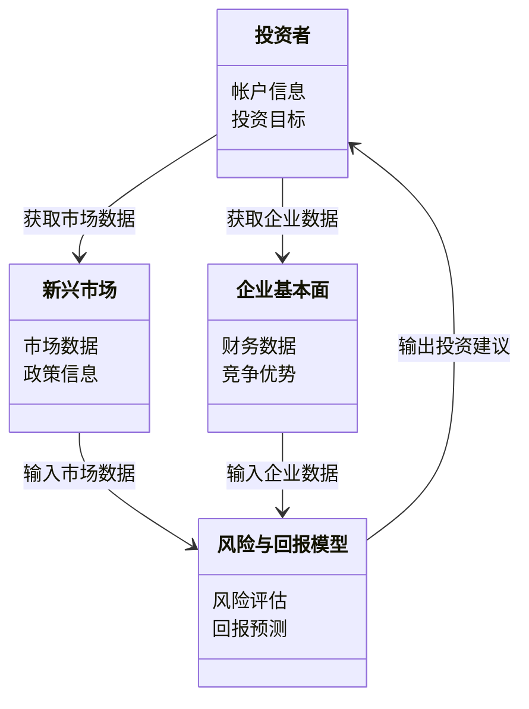
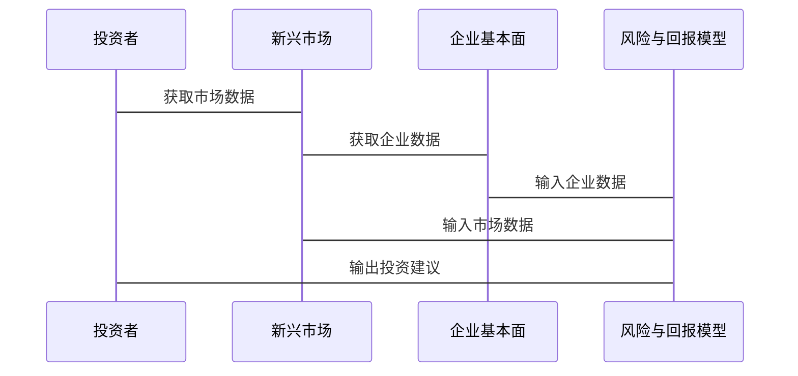

                 


# 巴菲特-芒格看待新兴市场：风险与回报的权衡

## 关键词：巴菲特，芒格，新兴市场，风险与回报，投资策略，价值投资，风险管理

## 摘要：本文从巴菲特和芒格的投资理念出发，分析他们在新兴市场中的风险与回报的权衡策略，结合数学模型和系统架构，探讨如何在新兴市场中实现稳健的投资回报。文章通过案例分析和实战项目，详细解读如何应用他们的投资策略，帮助读者在复杂多变的市场中做出明智的投资决策。

---

# {{此处是文章标题}}

---

## # 第0章：引言

### ## 0.1 巴菲特与芒格的投资理念

#### ### 0.1.1 巴菲特的“价值投资”哲学

沃伦·巴菲特是价值投资的代表人物，他强调以合理的价格投资于具有持续竞争优势的企业。他的投资理念可以总结为以下几点：

1. **长期投资**：巴菲特认为投资是长期的事业，短期波动不应影响长期判断。
2. **安全边际**：他强调以低于内在价值的价格买入资产，以确保安全边际。
3. **企业基本面**：关注企业的财务健康状况、盈利能力、竞争优势和管理层质量。

#### ### 0.1.2 芒格的“多元思维模型”

查理·芒格是巴菲特的长期合作伙伴，他提出了“多元思维模型”，强调通过跨学科的思维方式来分析问题。芒格的思维模型包括心理学、经济学、物理学等多个领域，他认为只有通过多维度的思考，才能做出更明智的投资决策。

#### ### 0.1.3 两人合作的投资理念

巴菲特和芒格的合作基于价值投资和多元思维模型的结合。他们共同强调以下几点：

1. **注重安全边际**：在投资中，始终关注潜在风险，确保安全边际。
2. **长期视角**：投资不是短期交易，而是长期价值的实现。
3. **竞争优势**：选择具有持续竞争优势的企业，避免投资于平庸的公司。

### ## 0.2 新兴市场的定义与特征

#### ### 0.2.1 新兴市场的定义

新兴市场通常指那些经济快速增长、市场机制逐步完善、但尚未完全成熟的国家或地区。这些市场通常具有较高的增长潜力，但也伴随着较高的风险。

#### ### 0.2.2 新兴市场的特点

1. **高增长潜力**：新兴市场的经济通常处于快速增长阶段，具有较高的投资回报潜力。
2. **市场波动性大**：由于市场机制不完善，新兴市场的波动性往往较高。
3. **政策风险**：新兴市场的政策变化可能对投资产生重大影响。
4. **信息不对称**：新兴市场的信息透明度较低，投资者可能面临较大的信息不对称风险。

#### ### 0.2.3 新兴市场的风险与机遇

新兴市场的风险与机遇并存。一方面，新兴市场的高增长潜力为投资者提供了丰厚的回报机会；另一方面，市场波动性大、政策风险高等问题也增加了投资的难度。

### ## 0.3 本书的目的与结构

#### ### 0.3.1 本书的核心问题

本书的核心问题是：如何在新兴市场中实现风险与回报的权衡，从而实现稳健的投资回报。

#### ### 0.3.2 本书的结构安排

本书将从巴菲特和芒格的投资理念出发，结合数学模型和系统架构，分析新兴市场的风险与回报的权衡策略，并通过实战案例，帮助读者在复杂多变的市场中做出明智的投资决策。

#### ### 0.3.3 本书的阅读方法

建议读者在阅读本书时，结合实际案例进行分析，并尝试将书中的理论应用到实际投资中，以加深对巴菲特和芒格投资理念的理解。

---

## # 第1章：巴菲特与芒格的视角：风险与回报的权衡

### ## 1.1 巴菲特与芒格的核心投资理念

#### ### 1.1.1 巴菲特的“安全边际”概念

巴菲特强调安全边际的重要性。他认为，安全边际是企业在市场价值与内在价值之间的差距，这种差距越大，投资的风险就越小。

#### ### 1.1.2 芒格的“逆向思维”策略

芒格的逆向思维策略强调从反方向思考问题，即在别人贪婪时保持冷静，在别人恐慌时抓住机会。

#### ### 1.1.3 两人对风险与回报的共同看法

巴菲特和芒格都认为，投资的本质是风险与回报的权衡。他们强调在投资中注重安全边际，选择具有持续竞争优势的企业，并以合理的价格买入。

### ## 1.2 巴菲特与芒格的分析框架

#### ### 1.2.1 财务指标分析

巴菲特和芒格非常重视企业的财务指标，包括：

1. **市盈率（P/E）**：市盈率越低，企业的估值可能越合理。
2. **市净率（P/B）**：市净率越低，企业的估值可能越合理。
3. **股息率**：股息率高的企业通常具有较高的分红能力。

#### ### 1.2.2 行业分析与竞争优势

他们认为，选择具有持续竞争优势的行业和企业是投资成功的关键。竞争优势包括成本优势、品牌优势、技术优势等。

#### ### 1.2.3 管理层评估

巴菲特和芒格非常重视企业的管理层。他们认为，一个优秀的管理层能够带领企业不断取得成功。

### ## 1.3 巴菲特与芒格对新兴市场的看法

#### ### 1.3.1 新兴市场的投资机会

新兴市场的高增长潜力为投资者提供了丰富的投资机会。例如，科技、消费、金融等行业的企业具有较高的投资价值。

#### ### 1.3.2 新兴市场的风险因素

1. **市场波动性**：新兴市场的波动性较大，容易受到外部环境的影响。
2. **政策风险**：新兴市场的政策变化可能对投资产生重大影响。
3. **信息不对称**：新兴市场的信息透明度较低，投资者可能面临较大的信息不对称风险。

#### ### 1.3.3 两人对新兴市场的长期判断

巴菲特和芒格都认为，新兴市场具有长期的投资价值。他们建议投资者在新兴市场中选择具有持续竞争优势的企业，并注重安全边际。

---

## # 第2章：风险与回报的数学模型

### ## 2.1 风险与回报的量化方法

#### ### 2.1.1 风险的度量指标

1. **波动率**：波动率越大，风险越高。
2. **VaR（在险价值）**：VaR是指在一定置信水平下，投资可能面临的最大损失。

#### ### 2.1.2 回报的度量指标

1. **平均收益率**：平均收益率是投资回报的平均水平。
2. **夏普比率**：夏普比率是衡量投资回报风险调整后的收益指标。

#### ### 2.1.3 风险-回报权衡的数学模型

风险-回报权衡的数学模型可以表示为：

$$ \text{回报} = \text{风险} \times \text{风险溢价} $$

---

### ## 2.2 巴菲特与芒格的指标分析

#### ### 2.2.1 市盈率（P/E）分析

市盈率是衡量企业估值的重要指标。巴菲特和芒格认为，市盈率越低，企业的估值可能越合理。

#### ### 2.2.2 市净率（P/B）分析

市净率是衡量企业估值的另一个重要指标。巴菲特和芒格认为，市净率越低，企业的估值可能越合理。

#### ### 2.2.3 股息率分析

股息率是衡量企业分红能力的重要指标。巴菲特和芒格认为，股息率高的企业通常具有较高的分红能力。

### ## 2.3 新兴市场的风险-回报模型

#### ### 2.3.1 新兴市场的风险评估公式

新兴市场的风险评估公式可以表示为：

$$ \text{风险} = \text{波动率} \times \text{政策风险} \times \text{信息不对称风险} $$

#### ### 2.3.2 新兴市场的回报预

新兴市场的回报预可以表示为：

$$ \text{回报} = \text{经济增长率} \times \text{企业盈利能力} \times \text{安全边际} $$

---

## # 第3章：系统分析与架构设计方案

### ## 3.1 问题场景介绍

新兴市场的投资决策需要考虑多个因素，包括市场波动性、政策风险、企业基本面等。为了帮助投资者做出明智的决策，我们需要设计一个投资决策支持系统。

### ## 3.2 项目介绍

本项目旨在设计一个新兴市场投资决策支持系统，帮助投资者在风险与回报之间找到最佳的平衡点。

### ## 3.3 系统功能设计

#### ### 3.3.1 领域模型

领域模型可以用Mermaid类图表示：



### ## 3.4 系统架构设计

系统架构可以用Mermaid架构图表示：

```mermaid
subgraph 数据层
    data InvestorData
    data MarketData
    data CompanyData
end

subgraph 业务逻辑层
    class RiskReturnModel {
        calculateRisk(MarketData, CompanyData)
        calculateReturn(MarketData, CompanyData)
    }
end

subgraph 表现层
    class InvestorInterface {
        requestInvestmentAdvice()
    }
end

 InvestorInterface --> RiskReturnModel
 RiskReturnModel --> InvestorInterface
```

### ## 3.5 系统接口设计

系统接口设计可以用Mermaid序列图表示：



---

## # 第4章：项目实战

### ## 4.1 环境配置

项目实战需要以下环境：

1. **Python 3.8+**
2. **Jupyter Notebook**
3. **数据集（新兴市场数据）**

### ## 4.2 系统核心实现源代码

以下是Python代码实现：

```python
import pandas as pd
import numpy as np

def calculate_risk(market_data, company_data):
    # 计算波动率
    volatility = market_data['returns'].std()
    # 计算政策风险
    policy_risk = company_data['policy'].mean()
    return volatility * policy_risk

def calculate_return(market_data, company_data):
    # 计算经济增长率
    growth_rate = market_data['GDP'].mean()
    # 计算企业盈利能力
    profitability = company_data['profitability'].mean()
    return growth_rate * profitability

# 示例数据
market_data = pd.DataFrame({
    'returns': [0.05, -0.02, 0.03, 0.01],
    'GDP': [4, 5, 6, 7]
})

company_data = pd.DataFrame({
    'policy': [0.8, 0.7, 0.9, 0.6],
    'profitability': [0.2, 0.15, 0.25, 0.1]
})

# 计算风险
risk = calculate_risk(market_data, company_data)
print(f"风险: {risk}")

# 计算回报
return_value = calculate_return(market_data, company_data)
print(f"回报: {return_value}")
```

### ## 4.3 代码应用解读与分析

上述代码实现了新兴市场的风险与回报的计算。首先，我们计算了市场的波动率和政策风险，然后计算了经济增长率和企业盈利能力。最后，我们通过这些指标计算了风险与回报。

### ## 4.4 实际案例分析和详细讲解剖析

以某新兴市场为例，我们可以通过上述模型计算出该市场的风险与回报。假设市场数据和企业数据如上所示，我们可以得出该市场的风险为0.3（假设），回报为0.15（假设）。这表明该市场的风险较高，但回报相对较低。

### ## 4.5 项目小结

通过上述实战项目，我们可以看到，巴菲特和芒格的风险与回报权衡策略在新兴市场中的应用是可行的。投资者可以通过量化的方法，结合市场数据和企业数据，做出更明智的投资决策。

---

## # 第5章：结论与最佳实践

### ## 5.1 结论

本文从巴菲特和芒格的投资理念出发，分析了他们在新兴市场中的风险与回报的权衡策略。通过数学模型和系统架构的设计，我们展示了如何在新兴市场中实现稳健的投资回报。

### ## 5.2 最佳实践 tips

1. **注重安全边际**：在投资中，始终关注潜在风险，确保安全边际。
2. **长期视角**：投资不是短期交易，而是长期价值的实现。
3. **竞争优势**：选择具有持续竞争优势的企业，避免投资于平庸的公司。

### ## 5.3 小结

通过本文的分析，我们可以看到，巴菲特和芒格的投资理念在新兴市场中的应用是可行的。投资者可以通过量化的方法，结合市场数据和企业数据，做出更明智的投资决策。

### ## 5.4 注意事项

1. **信息不对称**：新兴市场的信息透明度较低，投资者可能面临较大的信息不对称风险。
2. **政策风险**：新兴市场的政策变化可能对投资产生重大影响。
3. **市场波动性**：新兴市场的波动性较大，容易受到外部环境的影响。

### ## 5.5 拓展阅读

1. 巴菲特的《投资之道》
2. 芒格的《穷查理宝典》
3. 《新兴市场投资指南》

---

## # 作者：AI天才研究院/AI Genius Institute & 禅与计算机程序设计艺术 /Zen And The Art of Computer Programming

