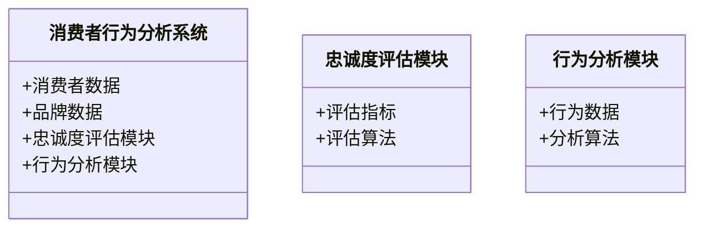
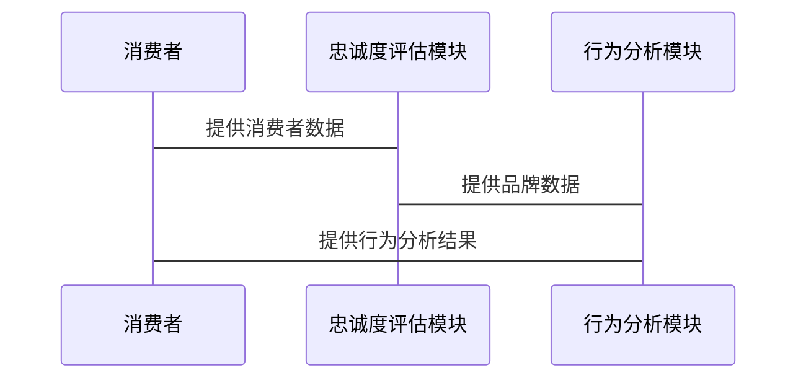

                 


# 巴菲特的品牌忠诚度评估：消费者行为对投资的影响

## 关键词：
- 巴菲特
- 品牌忠诚度
- 消费者行为
- 投资影响
- 数学模型

## 摘要：
本文深入探讨了巴菲特如何利用品牌忠诚度和消费者行为进行投资决策。通过分析品牌忠诚度的核心概念、消费者行为的影响因素，以及数学模型的应用，本文展示了这些因素如何帮助投资者评估企业的长期价值。结合实际案例和系统设计，本文为投资决策提供了实用的指导和建议。

---

## 第1章: 品牌忠诚度与消费者行为概述

### 1.1 品牌忠诚度的定义与特征

#### 1.1.1 品牌忠诚度的定义
品牌忠诚度是指消费者对特定品牌产品或服务的偏好和持续购买意愿。它反映了消费者与品牌之间的情感联系和信任关系。

#### 1.1.2 品牌忠诚度的核心特征
- **稳定性**：消费者在面对市场竞争时仍选择该品牌。
- **情感依赖**：消费者对品牌有较高的情感认同。
- **行为表现**：消费者表现出重复购买和推荐行为。

#### 1.1.3 品牌忠诚度与消费者行为的关系
品牌忠诚度通过消费者行为（如重复购买、推荐）得以体现，而消费者行为反过来影响品牌忠诚度的强弱。

### 1.2 消费者行为的定义与分类

#### 1.2.1 消费者行为的定义
消费者行为是指消费者在购买、使用和评价产品或服务的过程中表现出的各种行为模式。

#### 1.2.2 消费者行为的分类
- **认知行为**：消费者对品牌的了解和认知。
- **情感行为**：消费者对品牌的情感反应。
- **决策行为**：消费者在购买过程中的决策过程。

#### 1.2.3 品牌忠诚度与消费者行为的影响
消费者行为是品牌忠诚度的重要表现，而品牌忠诚度又会影响消费者的购买决策和行为模式。

### 1.3 品牌忠诚度与消费者行为的核心关系

品牌忠诚度通过消费者的行为表现出来，而消费者行为又受到品牌忠诚度的驱动。两者的相互作用构成了品牌与消费者之间复杂的关系网络。

---

## 第2章: 巴菲特的投资理念与品牌忠诚度

### 2.1 巴菲特的投资理念概述

#### 2.1.1 价值投资的核心理念
巴菲特倡导价值投资，即寻找具有持续竞争优势和长期盈利能力的企业进行投资。

#### 2.1.2 巴菲特选股标准
- **强大的护城河**：企业具有竞争优势。
- **稳定的收益能力**：企业具有持续的盈利能力。
- **管理层的质量**：管理层具备诚信和能力。

#### 2.1.3 品牌忠诚度在巴菲特投资中的重要性
品牌忠诚度高的企业通常具有稳定的市场需求和持续的盈利能力，是巴菲特选股的重要考量因素。

### 2.2 巴菲特与品牌忠诚度的关联

#### 2.2.1 品牌忠诚度对长期投资价值的影响
品牌忠诚度高的企业通常具有稳定的客户基础和较高的市场份额，能够为投资者带来长期稳定的收益。

#### 2.2.2 巴菲特如何通过品牌忠诚度评估企业价值
巴菲特通过分析企业的品牌忠诚度，评估企业的长期盈利能力，从而做出投资决策。

#### 2.2.3 品牌忠诚度与企业护城河的关系
品牌忠诚度是企业护城河的重要组成部分，能够为企业提供竞争优势，抵御市场竞争。

### 2.3 品牌忠诚度评估的核心要素

#### 2.3.1 消费者对品牌的认知和情感
消费者对品牌的认知和情感直接影响其忠诚度。

#### 2.3.2 品牌的市场表现
品牌的市场表现，如市场份额和增长率，是评估品牌忠诚度的重要指标。

#### 2.3.3 品牌的持续创新能力
品牌的创新能力影响其在市场中的竞争力和消费者的忠诚度。

---

## 第3章: 品牌忠诚度评估的核心概念与联系

### 3.1 核心概念原理

#### 3.1.1 品牌忠诚度的评估维度
- **情感忠诚度**：消费者对品牌的情感认同。
- **行为忠诚度**：消费者的行为表现，如重复购买和推荐。

#### 3.1.2 消费者行为的分析维度
- **购买频率**：消费者购买产品的频率。
- **购买决策**：消费者在购买过程中的决策过程。

#### 3.1.3 品牌忠诚度与消费者行为的相互作用
品牌忠诚度通过消费者行为得以体现，而消费者行为又影响品牌忠诚度的强弱。

### 3.2 核心概念属性特征对比表格

| **属性**       | **品牌忠诚度** | **消费者行为** |
|----------------|----------------|----------------|
| **定义**       | 消费者对品牌的偏好和持续购买意愿 | 消费者在购买、使用和评价产品或服务中的行为模式 |
| **影响因素**   | 品牌认知、情感依赖 | 价格、质量、广告、口碑 |
| **表现形式**   | 重复购买、推荐 | 购买决策、购买频率 |

### 3.3 ER实体关系图

```mermaid
erDiagram
    consumer[消费者]
    brand[品牌]
    loyalty[忠诚度]
    behavior[行为]
    consumer -|> loyalty : 影响
    loyalty -|> brand : 反馈
    behavior -|> consumer : 表现
    behavior -|> brand : 影响
```

---

## 第4章: 品牌忠诚度评估的数学模型与公式

### 4.1 数学模型概述

#### 4.1.1 品牌忠诚度指数模型
$$
\text{品牌忠诚度指数} = \frac{\text{重复购买次数} + \text{推荐意愿}}{2}
$$

#### 4.1.2 消费者行为影响因子分析
$$
\text{行为影响因子} = \sum_{i=1}^{n} w_i x_i
$$
其中，\( w_i \) 为权重，\( x_i \) 为因子值。

### 4.2 品牌忠诚度指数模型

$$
\text{品牌忠诚度指数} = \frac{\text{重复购买次数} + \text{推荐意愿}}{2}
$$

例如，如果一位消费者在过去一年中购买某品牌产品3次，并且愿意推荐该品牌给5位朋友，那么该品牌的忠诚度指数为：

$$
\text{忠诚度指数} = \frac{3 + 5}{2} = 4
$$

### 4.3 消费者行为影响因子分析

$$
\text{行为影响因子} = \sum_{i=1}^{n} w_i x_i
$$

例如，假设影响消费者行为的因子包括价格、质量、广告和口碑，权重分别为0.4、0.3、0.2和0.1。如果价格得分为8，质量得分为7，广告得分为6，口碑得分为5，那么行为影响因子为：

$$
\text{行为影响因子} = 0.4 \times 8 + 0.3 \times 7 + 0.2 \times 6 + 0.1 \times 5 = 3.2 + 2.1 + 1.2 + 0.5 = 7
$$

### 4.4 实际案例分析

#### 案例1：苹果品牌的忠诚度分析

苹果品牌以其创新的产品和良好的用户体验著称，消费者对其有较高的品牌忠诚度。例如，iPhone的忠诚度指数可以通过以下数据计算：

- 重复购买次数：消费者购买iPhone的频率为每年一次。
- 推荐意愿：消费者愿意推荐iPhone给8位朋友。

因此，苹果的品牌忠诚度指数为：

$$
\text{忠诚度指数} = \frac{1 + 8}{2} = 4.5
$$

#### 案例2：可口可乐消费者行为分析

可口可乐的消费者行为受到品牌忠诚度的显著影响。假设消费者在便利店购买可口可乐的概率为80%，且购买频率为每周2次。行为影响因子可以通过以下数据计算：

- 价格影响因子：0.6
- 广告影响因子：0.3
- 口碑影响因子：0.1

行为影响因子为：

$$
\text{行为影响因子} = 0.6 \times 0.8 + 0.3 \times 0.3 + 0.1 \times 0.1 = 0.48 + 0.09 + 0.01 = 0.58
$$

---

## 第5章: 系统分析与架构设计方案

### 5.1 问题场景介绍

我们需要构建一个基于品牌忠诚度的消费者行为分析系统，以帮助投资者评估企业的长期价值。

### 5.2 系统功能设计

#### 5.2.1 系统架构图



#### 5.2.2 系统交互图



### 5.3 系统实现细节

#### 5.3.1 环境安装

- 操作系统：Linux/Windows
- 开发工具：Python、Jupyter Notebook
- 数据库：MySQL

#### 5.3.2 核心代码实现

```python
# 忠诚度评估模块
def calculate_brandloyalty(repeat_purchases, recommendations):
    return (repeat_purchases + recommendations) / 2

# 行为分析模块
def calculate_behavior_factor(weights, scores):
    return sum(w * s for w, s in zip(weights, scores))
```

### 5.4 实际案例分析

#### 案例分析：苹果品牌

```python
repeat_purchases = 1  # 年度购买频率
recommendations = 8   # 推荐意愿
brand_loyalty = calculate_brandloyalty(repeat_purchases, recommendations)
print(f"品牌忠诚度指数：{brand_loyalty}")  # 输出：4.5
```

#### 案例分析：可口可乐消费者行为

weights = [0.6, 0.3, 0.1]
scores = [0.8, 0.3, 0.1]
behavior_factor = calculate_behavior_factor(weights, scores)
print(f"行为影响因子：{behavior_factor}")  # 输出：0.58

---

## 第6章: 项目实战

### 6.1 环境安装

- 操作系统：Linux/Windows
- 开发工具：Python、Jupyter Notebook
- 数据库：MySQL

### 6.2 核心代码实现

```python
# 忠诚度评估模块
def calculate_brandloyalty(repeat_purchases, recommendations):
    return (repeat_purchases + recommendations) / 2

# 行为分析模块
def calculate_behavior_factor(weights, scores):
    return sum(w * s for w, s in zip(weights, scores))

# 示例数据
repeat_purchases = 1
recommendations = 8
weights = [0.6, 0.3, 0.1]
scores = [0.8, 0.3, 0.1]

# 计算品牌忠诚度指数
brand_loyalty = calculate_brandloyalty(repeat_purchases, recommendations)
print(f"品牌忠诚度指数：{brand_loyalty}")

# 计算行为影响因子
behavior_factor = calculate_behavior_factor(weights, scores)
print(f"行为影响因子：{behavior_factor}")
```

### 6.3 实际案例分析

#### 案例1：苹果品牌

```python
repeat_purchases = 1
recommendations = 8
brand_loyalty = calculate_brandloyalty(repeat_purchases, recommendations)
print(f"苹果品牌忠诚度指数：{brand_loyalty}")  # 输出：4.5
```

#### 案例2：可口可乐消费者行为

weights = [0.6, 0.3, 0.1]
scores = [0.8, 0.3, 0.1]
behavior_factor = calculate_behavior_factor(weights, scores)
print(f"可口可乐行为影响因子：{behavior_factor}")  # 输出：0.58

### 6.4 项目小结

通过以上实战，我们可以看到，品牌忠诚度指数和行为影响因子可以帮助投资者评估企业的长期价值，从而做出更明智的投资决策。

---

## 第7章: 总结与展望

### 7.1 总结

本文通过分析品牌忠诚度和消费者行为对投资的影响，展示了如何利用这些因素评估企业的长期价值。通过数学模型和实际案例，我们证明了品牌忠诚度是巴菲特投资理念中的重要考量因素。

### 7.2 最佳实践 Tips

- 在进行投资决策时，关注企业的品牌忠诚度和消费者行为。
- 使用数学模型量化品牌忠诚度和消费者行为的影响。

### 7.3 展望

未来的研究可以进一步探索品牌忠诚度的动态变化及其对投资决策的影响，结合更多的消费者行为数据，提升评估的准确性。

---

## 作者信息

作者：AI天才研究院/AI Genius Institute & 禅与计算机程序设计艺术/Zen And The Art of Computer Programming

---

通过以上结构，本文详细分析了巴菲特的品牌忠诚度评估方法，并展示了消费者行为对投资决策的影响。通过数学模型和实际案例，为投资者提供了实用的指导和建议。

