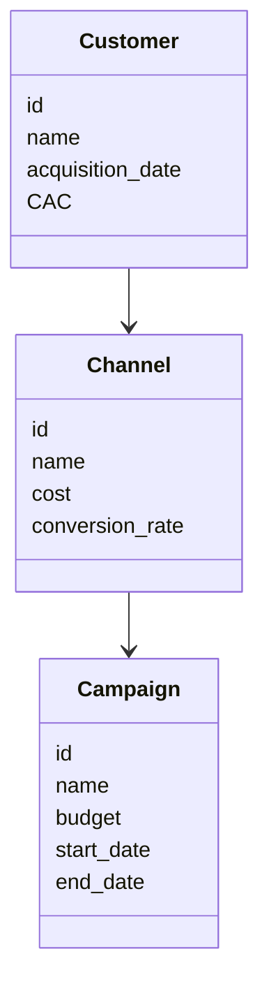
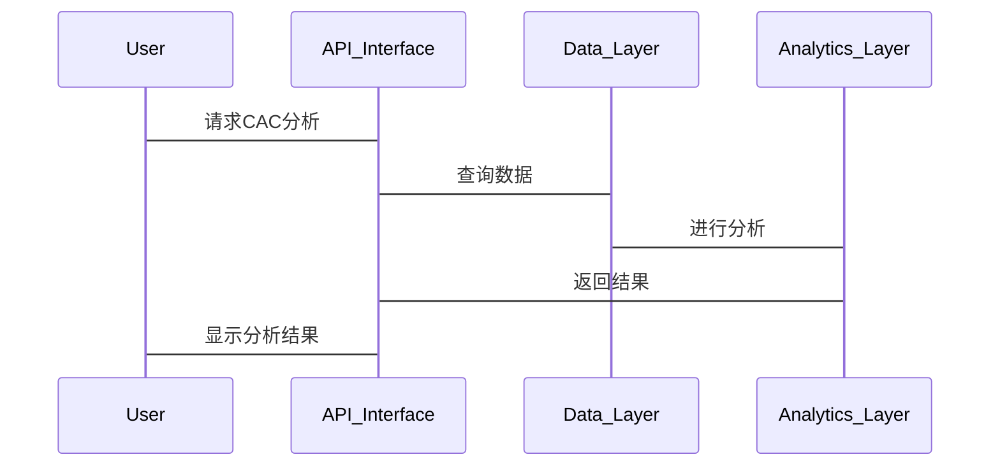

                 


# 彼得林奇如何分析公司的客户获取成本效率

## 关键词：客户获取成本（CAC）、彼得林奇、投资分析、效率优化、数据分析

## 摘要：本文详细探讨了彼得林奇如何分析公司的客户获取成本（CAC）效率，从背景、核心概念、算法原理到系统分析、项目实战，结合数学模型和最佳实践，为投资者和技术人员提供深入的分析方法和优化策略。

---

## 第一部分: 客户获取成本效率分析背景与核心概念

### 第1章: 客户获取成本效率分析的背景介绍

#### 1.1 什么是客户获取成本（CAC）

##### 1.1.1 CAC的定义与基本概念
客户获取成本（Customer Acquisition Cost，CAC）是指企业获取一位新客户的总成本，包括广告支出、销售团队费用、渠道费用等直接或间接用于吸引客户的各项支出。

##### 1.1.2 CAC的计算公式与应用场景
CAC的计算公式为：
$$CAC = \frac{\text{广告支出} + \text{销售费用} + \text{其他成本}}{\text{新客户数}}$$
CAC广泛应用于企业估值、投资决策和运营优化中，特别是在互联网、电子商务和SaaS等领域。

##### 1.1.3 CAC在企业经营中的重要性
CAC是衡量企业客户获取效率的关键指标，直接影响企业的盈利能力。过高的CAC可能导致客户获取成本过高，影响企业可持续发展。

#### 1.2 为什么彼得林奇关注CAC

##### 1.2.1 彼得林奇与投资分析的独特视角
彼得林奇以其独特的投资分析方法闻名，他通过深入研究企业的财务数据和运营模式，寻找具有长期增长潜力的企业。CAC作为企业增长的关键指标，自然成为他关注的焦点。

##### 1.2.2 CAC在企业估值中的关键作用
CAC帮助投资者评估企业的客户获取效率和盈利能力。通过对比CAC与客户生命周期价值（CLV），投资者可以判断企业的投资回报率和长期发展潜力。

##### 1.2.3 投资者如何通过CAC评估企业价值
投资者可以通过分析企业的CAC趋势、CAC与收入的比例，以及CAC回收周期等指标，评估企业的市场竞争力和投资价值。

### 第2章: 客户获取成本效率的核心概念与分析框架

#### 2.1 CAC的构成要素

##### 2.1.1 广告支出
广告支出是CAC的重要组成部分，包括线上广告、线下广告等。有效的广告策略可以降低CAC，提高客户获取效率。

##### 2.1.2 销售团队成本
销售团队的工资、奖金和培训费用也是CAC的重要组成部分。优化销售流程和提高销售团队效率可以降低CAC。

##### 2.1.3 渠道费用
通过渠道合作伙伴获取客户的费用也是CAC的一部分。选择合适的渠道合作伙伴可以有效降低CAC。

#### 2.2 CAC与客户生命周期价值（CLV）的关系

##### 2.2.1 CLV的定义与计算
客户生命周期价值（CLV）是客户在企业生命周期中为企业带来的总收入。CLV的计算公式为：
$$CLV = \text{客户平均收入} \times \text{客户生命周期长度}$$

##### 2.2.2 CAC与CLV的比率分析
CAC与CLV的比率是衡量客户获取效率的重要指标：
$$\text{CAC/CLV比率} = \frac{CAC}{CLV}$$
通常，理想的CAC/CLV比率应小于1，即CLV > CAC，表明客户获取是盈利的。

##### 2.2.3 如何通过CAC优化CLV
优化CAC可以通过降低广告支出、提高销售效率和选择更有效的渠道等方式实现。同时，通过提高客户满意度和忠诚度，可以延长客户生命周期，进一步提升CLV。

### 第3章: 客户获取成本效率的分析方法

#### 3.1 定量分析方法

##### 3.1.1 数据收集与整理
收集广告支出、销售费用、客户获取数量等数据，确保数据的准确性和完整性。

##### 3.1.2 数据分析模型的建立
使用回归分析等统计方法，建立CAC预测模型，分析影响CAC的主要因素。

##### 3.1.3 数据可视化与结果解读
通过图表（如柱状图、折线图）展示CAC的变化趋势，解读数据背后的业务逻辑。

#### 3.2 定性分析方法

##### 3.2.1 竞争对手分析
分析竞争对手的CAC和CLV，评估自身在市场中的竞争优势。

##### 3.2.2 客户反馈与行为分析
通过客户调查和行为数据，了解客户获取渠道的有效性和客户的满意度。

##### 3.2.3 市场趋势分析
结合市场趋势和宏观经济因素，预测未来的CAC变化趋势，制定相应的策略。

---

## 第二部分: CAC分析的算法原理与数学模型

### 第4章: CAC分析的数学模型与公式

#### 4.1 CAC的基本公式

##### 4.1.1 CAC的计算公式
$$CAC = \frac{\text{广告支出} + \text{销售费用} + \text{其他成本}}{\text{新客户数}}$$

#### 4.2 CAC优化的数学模型

##### 4.2.1 线性回归模型在CAC预测中的应用
使用线性回归模型预测未来的CAC，帮助企业在预算制定和资源分配中做出更准确的决策。

##### 4.2.2 优化算法（如梯度下降）在CAC分析中的应用
通过梯度下降等优化算法，找到影响CAC的关键因素，并优化这些因素以降低CAC。

##### 4.2.3 CAC与客户转化率的关系模型
分析CAC与客户转化率的关系，建立数学模型，优化客户获取渠道和策略，提高转化率。

### 第5章: CAC分析的算法实现

#### 5.1 数据预处理与特征工程

##### 5.1.1 数据清洗与标准化
清洗数据中的异常值和缺失值，确保数据质量。对数据进行标准化处理，使其适合模型训练。

##### 5.1.2 特征选择与维度降维
选择影响CAC的关键特征，使用主成分分析（PCA）等方法进行维度降维，简化模型。

##### 5.1.3 数据分训练集与测试集
将数据集分为训练集和测试集，用于模型训练和验证。

#### 5.2 算法实现

##### 5.2.1 使用线性回归模型预测CAC
```python
import pandas as pd
from sklearn.linear_model import LinearRegression
from sklearn.metrics import mean_squared_error

# 加载数据
data = pd.read_csv('customer_acquisition.csv')

# 特征和目标变量
X = data[['广告支出', '销售费用', '其他成本']]
y = data['CAC']

# 划分训练集和测试集
X_train, X_test, y_train, y_test = train_test_split(X, y, test_size=0.2, random_state=42)

# 训练模型
model = LinearRegression()
model.fit(X_train, y_train)

# 预测
y_pred = model.predict(X_test)

# 评估
mse = mean_squared_error(y_test, y_pred)
print(f"均方误差: {mse}")
```

##### 5.2.2 使用梯度下降优化CAC
```python
import numpy as np
import matplotlib.pyplot as plt

# 示例数据
X = np.array([1, 2, 3, 4, 5])
y = np.array([2, 3, 5, 7, 11])

# 初始化参数
theta = [0, 0]
alpha = 0.01
iterations = 1000

# 梯度下降算法
for _ in range(iterations):
    y_pred = theta[0] + theta[1] * X
    cost = np.mean((y - y_pred) ** 2)
    dJ_dtheta0 = np.mean(2 * (y_pred - y))
    dJ_dtheta1 = np.mean(2 * (y_pred - y) * X)
    theta[0] -= alpha * dJ_dtheta0
    theta[1] -= alpha * dJ_dtheta1

print(f"最优参数: {theta}")
```

##### 5.2.3 分析和解读结果
通过模型预测结果，分析影响CAC的关键因素，并根据模型建议优化策略，例如减少广告支出或提高销售效率。

---

## 第三部分: CAC分析的系统架构与项目实战

### 第6章: 系统分析与架构设计方案

#### 6.1 问题场景介绍
企业需要通过数据分析优化CAC，降低客户获取成本，提高客户转化率和满意度。

#### 6.2 系统功能设计

##### 6.2.1 领域模型（领域模型Mermaid类图）


#### 6.3 系统架构设计

##### 6.3.1 系统架构（Mermaid架构图）


#### 6.4 系统接口设计

##### 6.4.1 数据接口
API接口用于数据获取和分析结果展示，例如：
- GET /api/cac-analysis：获取CAC分析结果
- POST /api/data：上传新的数据

#### 6.5 系统交互设计（Mermaid序列图）


### 第7章: 项目实战与代码实现

#### 7.1 环境安装与配置

##### 7.1.1 安装必要的Python库
安装Pandas、Scikit-learn、Matplotlib等库：
```bash
pip install pandas scikit-learn matplotlib
```

#### 7.2 核心代码实现

##### 7.2.1 数据处理与分析
```python
import pandas as pd
import matplotlib.pyplot as plt
from sklearn.linear_model import LinearRegression

# 加载数据
data = pd.read_csv('customer_acquisition.csv')

# 数据预处理
data['CAC'] = (data['广告支出'] + data['销售费用'] + data['其他成本']) / data['新客户数']

# 可视化分析
plt.scatter(data['广告支出'], data['CAC'])
plt.xlabel('广告支出')
plt.ylabel('CAC')
plt.title('广告支出与CAC的关系')
plt.show()

# 训练模型
model = LinearRegression()
model.fit(data[['广告支出', '销售费用', '其他成本']], data['CAC'])

# 预测与评估
y_pred = model.predict(data[['广告支出', '销售费用', '其他成本']])
print(f"均方误差: {mean_squared_error(data['CAC'], y_pred)}")
```

#### 7.3 实际案例分析

##### 7.3.1 案例背景
假设我们有一家互联网公司，希望通过优化广告支出和销售费用降低CAC，提高客户获取效率。

##### 7.3.2 数据分析与优化建议
通过对数据的分析，发现广告支出占CAC的较大比例，建议优化广告策略，选择更有效的广告渠道，同时提高销售团队的效率。

#### 7.4 项目小结

##### 7.4.1 成果总结
通过数据分析和模型优化，成功降低了CAC，提高了客户获取效率。

##### 7.4.2 经验总结
- 数据清洗和特征选择是关键
- 选择合适的算法和模型
- 定期监控和优化CAC

---

## 第四部分: 最佳实践与小结

### 第8章: 最佳实践与小结

#### 8.1 最佳实践

##### 8.1.1 数据驱动的决策
通过数据分析和模型预测，制定科学的客户获取策略。

##### 8.1.2 持续优化
定期监控CAC的变化，根据市场变化和企业战略调整优化策略。

##### 8.1.3 多维度分析
结合定量分析和定性分析，全面评估客户获取成本效率。

#### 8.2 小结

##### 8.2.1 CAC分析的核心价值
CAC分析是企业优化客户获取策略、提高盈利能力的重要工具，也是投资者评估企业价值的重要指标。

##### 8.2.2 未来展望
随着大数据和人工智能技术的发展，CAC分析将更加智能化和精准化，为企业和投资者提供更有力的支持。

---

## 作者：AI天才研究院/AI Genius Institute & 禅与计算机程序设计艺术 /Zen And The Art of Computer Programming

