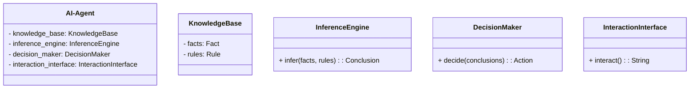
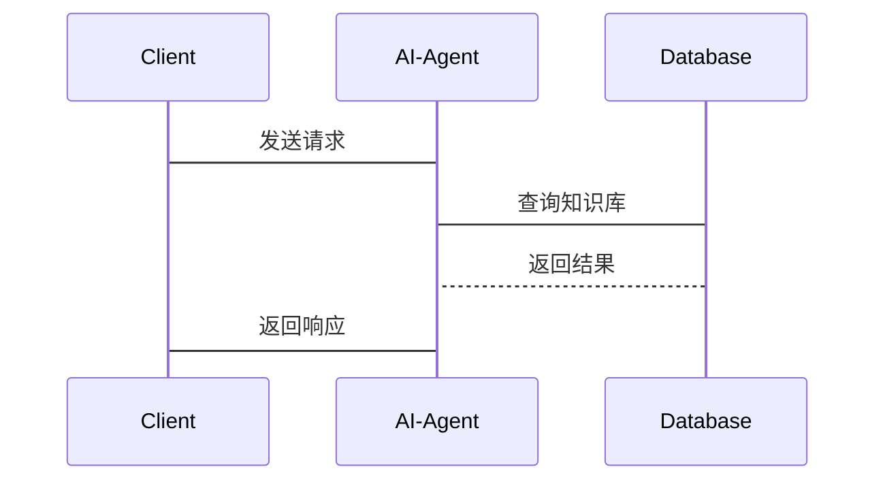

                 


# 《构建具有批判性思维的AI Agent系统》

> **关键词**：AI Agent、批判性思维、逻辑推理、知识表示、意图识别  
> **摘要**：本篇文章详细探讨了如何构建具有批判性思维的AI Agent系统，从核心概念、算法原理到系统架构设计，再到项目实战，全面解析了AI Agent系统中批判性思维的实现与应用。

---

## 第1章：AI Agent与批判性思维概述

### 1.1 AI Agent的基本概念

#### 1.1.1 AI Agent的定义与特点
AI Agent（人工智能代理）是指能够感知环境、自主决策并执行任务的智能实体。其特点包括：
- **自主性**：能够在没有外部干预的情况下自主运作。
- **反应性**：能够根据环境的变化实时调整行为。
- **目标导向性**：基于目标驱动决策和行动。
- **学习能力**：通过学习提升自身的智能水平。

#### 1.1.2 批判性思维的定义与特点
批判性思维是指对信息、假设、推论和论证进行分析和评估的能力。其特点包括：
- **分析性**：对信息进行深入分析，识别其优点和缺点。
- **质疑性**：对假设和推论提出质疑，并寻找证据支持。
- **逻辑性**：基于逻辑推理得出结论。

#### 1.1.3 AI Agent与批判性思维的结合
AI Agent通过集成批判性思维能力，能够更好地理解复杂环境、做出合理决策并优化行为。这种结合使得AI Agent不仅能够执行任务，还能在面对不确定性时进行反思和调整。

---

### 1.2 AI Agent的应用场景

#### 1.2.1 企业级应用中的AI Agent
在企业级应用中，AI Agent可以用于流程自动化、智能客服、风险管理等领域。例如，AI Agent可以通过分析市场数据，帮助企业做出更明智的商业决策。

#### 1.2.2 批判性思维在AI Agent中的作用
批判性思维使AI Agent能够评估多个可能的解决方案，选择最优策略。例如，在医疗领域，AI Agent可以通过批判性思维分析多种治疗方案，选择最适合患者的治疗方案。

#### 1.2.3 AI Agent的边界与外延
AI Agent的应用范围广泛，但其能力受限于数据质量和模型训练水平。未来，随着技术的进步，AI Agent的边界可能会进一步扩大。

---

### 1.3 AI Agent系统的组成要素

#### 1.3.1 知识库与数据源
知识库是AI Agent进行推理的基础，包含领域知识、规则和实例。数据源包括结构化数据、非结构化数据和实时数据。

#### 1.3.2 推理引擎
推理引擎负责根据知识库中的信息进行推理，生成推论。常见的推理方法包括基于规则的推理、概率推理和图推理。

#### 1.3.3 行为决策模块
行为决策模块基于推理结果和环境反馈，生成行动策略。该模块需要考虑多个因素，如目标、风险和收益。

#### 1.3.4 交互界面
交互界面是AI Agent与用户或其他系统进行交互的通道。支持多种交互方式，如文本、语音和图形界面。

---

## 第2章：批判性思维与AI Agent的核心概念

### 2.1 批判性思维的核心原理

#### 2.1.1 逻辑推理与论证
逻辑推理是批判性思维的基础。通过逻辑推理，AI Agent能够从已知事实中推导出新的结论。例如，基于“如果A则B，B则C”的推理规则，AI Agent可以推导出“如果A，则C”。

#### 2.1.2 批判性思维的属性特征对比表
| 属性       | 批判性思维的特点                  |
|------------|----------------------------------|
| 分析性      | 强调对信息的深入分析              |
| 质疑性      | 对假设和推论提出质疑              |
| 逻辑性      | 基于逻辑推理得出结论              |

#### 2.1.3 批判性思维的ER实体关系图
```mermaid
er
actor: AI Agent
action: 执行操作
knowledge_base: 知识库
environment: 环境
```

---

### 2.2 AI Agent的逻辑推理模型

#### 2.2.1 知识表示与推理规则
知识表示通常采用符号逻辑或概率模型。推理规则包括演绎推理和归纳推理。

#### 2.2.2 推理引擎的工作原理
推理引擎通过分析知识库中的信息，应用推理规则生成推论。例如，基于知识库中的事实“下雨了”，推理引擎可以推导出“地面湿了”。

#### 2.2.3 推理过程中的不确定性处理
在现实场景中，信息可能存在不确定性。AI Agent需要通过概率推理或模糊逻辑来处理不确定性。

---

### 2.3 批判性思维与AI Agent的结合模型

#### 2.3.1 知识库构建与批判性思维的关系
知识库是AI Agent进行推理的基础。通过批判性思维，AI Agent能够对知识库中的信息进行评估和优化。

#### 2.3.2 推理引擎中的批判性思维应用
推理引擎在进行推理时，需要考虑多种可能性，并通过批判性思维选择最优的推论路径。

#### 2.3.3 行为决策中的批判性思维体现
在行为决策模块，AI Agent需要通过批判性思维评估多个可能的决策，选择最优策略。

---

## 第3章：AI Agent系统中的算法原理

### 3.1 逻辑推理算法

#### 3.1.1 基于规则的推理算法
基于规则的推理算法通过预定义的规则进行推理。例如，规则可以是“如果A，则B”。

#### 3.1.2 基于概率的推理算法
基于概率的推理算法通过计算概率来推断结论。例如，贝叶斯网络是一种常用的概率推理方法。

#### 3.1.3 基于图的推理算法
基于图的推理算法通过构建知识图谱进行推理。例如，使用图嵌入技术对图中的节点进行表示。

---

### 3.2 情感分析与意图识别算法

#### 3.2.1 情感分析的数学模型
情感分析可以通过机器学习模型（如LSTM和Transformer）进行。模型通过分析文本的情感倾向，生成情感标签。

#### 3.2.2 意图识别的算法原理
意图识别通过分析用户的输入，识别用户的意图。例如，使用自然语言处理技术识别用户的查询意图。

#### 3.2.3 情感分析与意图识别的结合
情感分析和意图识别可以结合使用，例如在智能客服中，通过分析用户的情感和意图，生成更精准的回复。

---

### 3.3 优化算法

#### 3.3.1 基于遗传算法的优化
遗传算法通过模拟生物进化过程，优化AI Agent的行为策略。

#### 3.3.2 基于模拟退火的优化
模拟退火算法通过随机搜索和局部最优解的改进，优化AI Agent的行为策略。

#### 3.3.3 基于强化学习的优化
强化学习通过奖励机制，优化AI Agent的行为策略。例如，使用Q-learning算法进行策略优化。

---

## 第4章：数学模型与公式详解

### 4.1 逻辑推理的数学模型

#### 4.1.1 命题逻辑的基本公式
命题逻辑的基本公式包括：
- $p \land q$：表示$p$和$q$都为真。
- $p \lor q$：表示$p$或$q$至少有一个为真。
- $\neg p$：表示$p$的否定。

#### 4.1.2 概率推理的贝叶斯公式
贝叶斯公式为：
$$P(A|B) = \frac{P(B|A)P(A)}{P(B)}$$
其中，$P(A|B)$表示在$B$发生的条件下，$A$发生的概率。

#### 4.1.3 图推理的表示方法
图推理可以通过图的邻接矩阵或邻接表进行表示。例如，知识图谱中的节点关系可以通过邻接矩阵表示。

---

## 第5章：系统分析与架构设计方案

### 5.1 项目背景介绍

#### 5.1.1 项目背景
本项目旨在构建一个具有批判性思维的AI Agent系统，使其能够在复杂环境中自主决策并优化行为。

#### 5.1.2 项目目标
- 实现AI Agent的自主决策能力。
- 集成批判性思维能力，提升系统的推理和分析能力。
- 优化系统架构，确保系统的高效性和可扩展性。

### 5.2 系统功能设计

#### 5.2.1 领域模型
领域模型通过类图展示系统的组成和交互关系。例如：


#### 5.2.2 系统架构设计
系统架构设计通过架构图展示系统的组成和交互关系。例如：


#### 5.2.3 系统接口设计
系统接口设计通过接口图展示系统的接口和交互关系。例如：


---

## 第6章：项目实战

### 6.1 环境安装

#### 6.1.1 安装Python环境
建议使用Python 3.8及以上版本。可以通过以下命令安装：
```bash
python --version
pip install --upgrade pip
```

#### 6.1.2 安装依赖库
安装必要的依赖库，例如：
```bash
pip install numpy
pip install scikit-learn
pip install transformers
```

### 6.2 系统核心实现源代码

#### 6.2.1 知识库的构建
```python
from typing import List
from dataclasses import dataclass

@dataclass
class Fact:
    subject: str
    predicate: str
    object: str

@dataclass
class Rule:
    antecedent: List[Fact]
    consequent: Fact

class KnowledgeBase:
    def __init__(self):
        self.facts = []
        self.rules = []

    def add_fact(self, fact: Fact):
        self.facts.append(fact)

    def add_rule(self, rule: Rule):
        self.rules.append(rule)
```

#### 6.2.2 推理引擎的实现
```python
class InferenceEngine:
    def infer(self, knowledge_base):
        # 示例推理逻辑
        for rule in knowledge_base.rules:
            if all([fact in knowledge_base.facts for fact in rule.antecedent]):
                return rule.consequent
        return None
```

#### 6.2.3 行为决策的实现
```python
class DecisionMaker:
    def decide(self, conclusions):
        # 示例决策逻辑
        return conclusions[0] if conclusions else None
```

### 6.3 代码应用解读与分析

#### 6.3.1 知识库的构建
知识库通过`Fact`和`Rule`类表示，分别存储事实和规则。`KnowledgeBase`类提供添加事实和规则的方法。

#### 6.3.2 推理引擎的实现
推理引擎通过遍历规则，检查前提条件是否满足，生成结论。如果满足，则返回结论；否则返回`None`。

#### 6.3.3 行为决策的实现
行为决策模块根据推理结果，选择最优行动策略。示例中选择第一个结论进行决策。

### 6.4 实际案例分析

#### 6.4.1 案例背景
假设有一个医疗领域的AI Agent，需要根据患者症状和病史，推荐诊断方案。

#### 6.4.2 知识库构建
```python
kb = KnowledgeBase()
kb.add_fact(Fact('patient', 'has', 'flu'))
kb.add_rule(Rule([Fact('patient', 'has', 'flu')], Fact('diagnosis', 'is', 'flu')))
```

#### 6.4.3 推理与决策
```python
inference_engine = InferenceEngine()
conclusion = inference_engine.infer(kb)
decision = decision_maker.decide([conclusion])
```

#### 6.4.4 结果分析
推理引擎根据知识库中的事实和规则，推导出诊断结论。决策模块根据结论生成行动策略。

### 6.5 项目小结
本项目通过构建知识库、推理引擎和决策模块，实现了具有批判性思维的AI Agent系统。系统能够根据输入的信息，进行推理和决策，并生成相应的行动策略。

---

## 第7章：总结与展望

### 7.1 总结
本篇文章详细探讨了如何构建具有批判性思维的AI Agent系统。从核心概念、算法原理到系统架构设计，再到项目实战，全面解析了AI Agent系统中批判性思维的实现与应用。

### 7.2 展望
未来，随着技术的进步，AI Agent系统将更加智能化和人性化。批判性思维能力的提升将使AI Agent在更多领域中发挥重要作用。

---

**作者：AI天才研究院/AI Genius Institute & 禅与计算机程序设计艺术/Zen And The Art of Computer Programming**

