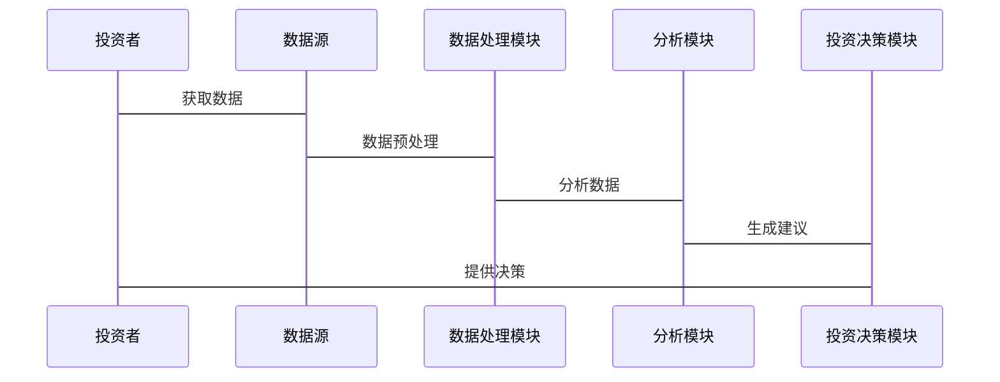

                 


# 玛丽·巴芙达的质量型价值投资理念

---

## 关键词：玛丽·巴芙达, 价值投资, 质量型投资, 投资策略, 投资理念

---

## 摘要：  
玛丽·巴芙达作为价值投资领域的先驱，提出了质量型价值投资的理念，强调通过深入分析企业的质量、竞争力和财务健康状况，选择具有长期增长潜力的优秀企业进行投资。本文从质量型价值投资的背景、核心概念、算法原理、系统架构到项目实战，全面解析这一投资理念，并结合技术方法为投资者提供深度分析工具和实战指导。

---

## 第一章: 价值投资的起源与理念

### 1.1 价值投资的定义与核心理念

#### 1.1.1 价值投资的起源与发展  
价值投资是一种以基本面分析为基础的投资策略，起源于20世纪初。本杰明·格雷厄姆和戴维·多德是这一理念的奠基人，他们强调以低于内在价值的价格买入优质资产。玛丽·巴芙达作为格雷厄姆的学生，进一步发展了这一理念，特别是在质量评估方面提出了独特的方法。

#### 1.1.2 价值投资的核心理念与原则  
价值投资的核心在于寻找市场价格低于内在价值的资产。其基本原则包括：  
1. 长期投资，避免频繁交易。  
2. 选择具有强大竞争优势和财务健康的企业。  
3. 以合理的价格买入，耐心持有。  

#### 1.1.3 价值投资与其它投资策略的区别  
与趋势投资、技术分析等策略不同，价值投资注重企业的内在价值，而非市场的短期波动。它强调对企业基本面的深入研究，而不是依赖市场情绪或技术指标。

### 1.2 玛丽·巴芙达的生平与投资理念

#### 1.2.1 玛丽·巴芙达的生平简介  
玛丽·巴芙达是20世纪著名的投资家，被誉为“价值投资之母”。她不仅是巴菲特的导师，还通过自己的实践和理论创新，将价值投资的理念推向了更广泛的领域。

#### 1.2.2 玛丽·巴芙达的投资理念与风格  
玛丽·巴芙达强调质量型投资，即不仅关注企业的财务指标，还关注企业的管理团队、竞争优势和行业地位。她认为，投资的最终目标是找到那些能够在经济周期中稳定增长的企业。

#### 1.2.3 玛丽·巴芙达与巴菲特的关系  
玛丽·巴芙达是巴菲特的导师，巴菲特继承并发扬了她的投资理念，但更注重企业的护城河和竞争优势。两者的理念都强调长期投资和价值发现，但巴菲特更注重企业的市场地位和竞争优势。

### 1.3 质量型价值投资的定义与特点

#### 1.3.1 质量型价值投资的定义  
质量型价值投资是一种以企业质量为核心的投资策略，强调选择具有强大竞争优势、财务健康且管理优秀的企业进行长期投资。

#### 1.3.2 质量型价值投资的核心特点  
- **注重企业质量**：不仅关注财务指标，还关注企业的管理、竞争优势和行业地位。  
- **长期持有**：避免短期波动，关注企业的长期增长潜力。  
- **精选个股**：通过深度研究选择少数优质企业进行投资。  

#### 1.3.3 质量型价值投资与其他价值投资策略的区别  
与传统价值投资相比，质量型价值投资更注重企业的质量，而非仅仅寻找价格被低估的资产。它强调企业的核心竞争力和长期增长潜力，而非仅仅依赖财务指标。

### 1.4 价值投资的哲学与心理

#### 1.4.1 价值投资的哲学基础  
价值投资的哲学基础在于“市场的非有效性”。即市场短期可能被情绪和噪声影响，但长期会回归理性，优质企业的价值会得到体现。

#### 1.4.2 投资者心理与决策偏差  
投资者常常受到贪婪、恐惧等心理因素的影响，容易做出非理性的决策。价值投资要求投资者克服这些心理偏差，保持理性。

#### 1.4.3 理性与非理性的平衡  
价值投资需要在理性分析和感性判断之间找到平衡。理性分析帮助企业质量评估，感性判断则体现在对管理层的信任和企业文化的认同。

### 1.5 本章小结  
本章介绍了价值投资的起源与发展，重点阐述了玛丽·巴芙达的质量型价值投资理念，分析了其与其他投资策略的区别，并探讨了价值投资的哲学与心理。下一章将深入探讨质量型价值投资的核心要素和分析框架。

---

## 第二章: 质量型价值投资的核心要素

### 2.1 企业的质量评估标准

#### 2.1.1 企业质量的核心维度  
质量型价值投资的核心在于对企业质量的评估，主要包括以下几个维度：  
1. **行业地位**：企业在行业中的地位，是否是龙头或具有竞争优势。  
2. **财务健康状况**：企业的盈利能力、资产负债情况和现金流状况。  
3. **管理团队**：管理层的能力、经验和战略规划。  
4. **竞争优势**：企业是否具有独特的竞争优势，如专利、品牌、技术等。  
5. **成长潜力**：企业未来增长的潜力和空间。  

#### 2.1.2 企业的竞争优势分析  
竞争优势是质量型价值投资的核心关注点。企业需要具备可持续的竞争优势，才能在长期中保持增长。例如，苹果公司凭借其品牌和技术优势，长期保持行业领先地位。

#### 2.1.3 企业的财务健康状况  
财务健康状况是企业质量评估的重要指标。主要包括以下几个方面：  
- **盈利能力**：ROE（净资产收益率）、净利润率等。  
- **资产负债情况**：资产负债率、流动比率等。  
- **现金流状况**：自由现金流是否健康。  

#### 2.1.4 企业的管理团队  
管理团队的能力和战略规划直接影响企业的未来发展。优秀的管理团队能够带领企业不断创新和成长。

#### 2.1.5 企业的成长潜力  
成长潜力是企业未来增长的关键。需要分析企业所在行业的市场规模、增长空间以及企业的市场地位。

---

#### 2.1.6 企业质量评估标准对比表格  
以下是几种常见企业质量评估标准的对比：

| 评估维度       | 财务健康状况 | 行业地位 | 竞争优势 | 管理团队 | 成长潜力 |
|----------------|--------------|----------|----------|----------|----------|
| 评估重点       | 资产负债表   | 市场份额 | 技术专利 | 领导能力 | 市场规模 |
| 评估方法       | 财务指标分析 | 市场调研 | 专利数量 | 领导履历 | 行业报告 |
| 重要性等级     | 高          | 中       | 高       | 高       | 中       |

---

#### 2.1.7 企业质量评估的ER实体关系图  
以下是企业质量评估的ER实体关系图：

```mermaid
erDiagram
    actor 投资者 {
        string 资金
        string 投资目标
    }
    class 企业 {
        int 企业ID
        string 名称
        string 行业
        float 财务健康状况
        float 竞争优势
        float 管理能力
        float 成长潜力
    }
    class 管理团队 {
        int 管理团队ID
        string 成员
        string 职位
        float 经验
        float 战略能力
    }
    class 行业 {
        int 行业ID
        string 名称
        float 市场规模
        float 市场增长
    }
    class 竞争优势 {
        int 优势ID
        string 类型
        float 强度
    }
    investor -> 企业 : 投资
    企业 -> 管理团队 : 拥有
    企业 -> 行业 : 所属
    企业 -> 竞争优势 : 具备
```

---

### 2.2 质量型价值投资的分析框架

#### 2.2.1 企业基本面分析框架  
企业基本面分析是质量型价值投资的核心内容。以下是基本面分析的主要步骤：  
1. **行业分析**：了解企业的行业地位和市场前景。  
2. **财务分析**：评估企业的财务健康状况。  
3. **竞争优势分析**：分析企业的核心竞争力。  
4. **管理团队评估**：评估管理层的能力和战略规划。  
5. **成长潜力分析**：预测企业的未来增长空间。  

#### 2.2.2 行业分析与竞争格局  
行业分析是企业基本面分析的重要部分。以下是行业分析的关键点：  
- **行业市场规模**：行业的总体规模和增长潜力。  
- **行业竞争格局**：行业内主要竞争者及其市场份额。  
- **行业周期性**：行业所处的周期阶段（如增长期、成熟期、衰退期）。  

#### 2.2.3 经济周期与市场环境的影响  
经济周期和市场环境对企业的经营和投资决策有重要影响。以下是主要影响因素：  
- **经济周期**：企业在不同经济周期中的表现不同。  
- **市场环境**：政策、法规和宏观经济环境的变化会影响企业的经营。  

---

#### 2.2.4 质量型价值投资分析框架的mermaid图  
以下是质量型价值投资分析框架的mermaid图：

```mermaid
graph TD
    A[投资者] -> B[选择企业]
    B -> C[行业分析]
    B -> D[财务分析]
    B -> E[竞争优势分析]
    B -> F[管理团队评估]
    B -> G[成长潜力分析]
    C -> H[市场规模]
    C -> I[竞争格局]
    D -> J[财务健康状况]
    E -> K[技术专利]
    E -> L[品牌影响力]
    F -> M[领导能力]
    F -> N[战略能力]
    G -> O[未来增长空间]
```

---

### 2.3 质量型价值投资的量化指标

#### 2.3.1 质量型企业的量化标准  
以下是质量型企业的量化标准：  
- **ROE（净资产收益率）**：衡量企业的盈利能力。  
- **毛利率**：衡量企业的成本控制能力。  
- **资产负债率**：衡量企业的财务风险。  
- **自由现金流**：衡量企业的财务健康状况。  

#### 2.3.2 关键财务指标的筛选与应用  
以下是关键财务指标的筛选与应用：  
1. **ROE**：ROE越高，企业的盈利能力越强。  
2. **毛利率**：毛利率越高，企业的成本控制能力越强。  
3. **资产负债率**：资产负债率越低，企业的财务风险越小。  
4. **自由现金流**：自由现金流为正，表明企业有健康的现金流。  

---

#### 2.3.3 股价与内在价值的对比分析  
股价与内在价值的对比是质量型价值投资的重要内容。以下是股价与内在价值的对比分析：  
1. **内在价值计算**：通过DCF（现金流折现法）等方法计算企业的内在价值。  
2. **股价与内在价值的对比**：如果股价低于内在价值，企业具有投资价值。  

---

### 2.4 本章小结  
本章详细介绍了质量型价值投资的核心要素，包括企业的质量评估标准、分析框架和量化指标。下一章将深入探讨质量型价值投资的算法与数学模型。

---

## 第三章: 投资决策的算法原理

### 3.1 投资决策的流程与算法

#### 3.1.1 投资决策的基本流程  
投资决策的基本流程如下：  
1. **数据采集**：收集企业的基本面数据。  
2. **数据预处理**：清洗和整理数据。  
3. **质量评估**：对企业进行质量评估。  
4. **价值判断**：计算内在价值并与市场价格对比。  
5. **投资决策**：根据评估结果做出投资决策。  

---

#### 3.1.2 数据采集与预处理算法  
以下是数据采集与预处理的算法：

```python
import pandas as pd
import numpy as np

# 数据采集
def fetch_data(ticker):
    # 从数据库或API获取数据
    data = pd.DataFrame({
        'Ticker': [ticker],
        'Revenue': [1000000],
        'Net Income': [200000],
        'Cash Flow': [300000],
        'Debt': [50000],
        'Equity': [1000000]
    })
    return data

# 数据预处理
def preprocess_data(data):
    data['ROE'] = data['Net Income'] / data['Equity']
    data['Debt Ratio'] = data['Debt'] / data['Equity']
    data['Gross Margin'] = (data['Revenue'] - data['COGS']) / data['Revenue']
    return data

# 示例代码
ticker = 'AAPL'
data = fetch_data(ticker)
processed_data = preprocess_data(data)
print(processed_data)
```

---

#### 3.1.3 质量评估与价值判断的算法  
以下是质量评估与价值判断的算法：

```python
def calculate_intrinsic_value(data):
    # 计算自由现金流
    FCFF = data['Cash Flow'] - (data['Debt'] / (1 - data['Debt Ratio']))
    # 计算加权平均资本成本
    WACC = 0.1 * (1 - 0.25) + 0.8 * 0.08
    # 计算内在价值
    intrinsic_value = FCFF / WACC
    return intrinsic_value

# 示例代码
ticker = 'AAPL'
data = fetch_data(ticker)
intrinsic_value = calculate_intrinsic_value(data)
print(f"内 在 价 值: {intrinsic_value}")
```

---

### 3.2 质量型价值投资的数学模型

#### 3.2.1 质量评估的数学模型  
以下是质量评估的数学模型：

$$ \text{质量评分} = \frac{ROE + \text{毛利率} + \text{竞争优势评分}}{3} $$

其中，ROE、毛利率和竞争优势评分分别通过以下公式计算：  
$$ ROE = \frac{\text{净利润}}{\text{股东权益}} $$  
$$ \text{毛利率} = \frac{\text{营业收入} - \text{营业成本}}{\text{营业收入}} $$  
$$ \text{竞争优势评分} = \text{专利数量} \times 0.3 + \text{品牌影响力} \times 0.7 $$  

---

#### 3.2.2 内在价值的计算公式  
以下是内在价值的计算公式：

$$ \text{内在价值} = \sum_{t=1}^{n} \frac{\text{自由现金流}_t}{(1 + WACC)^t} $$

其中，WACC是加权平均资本成本，$$ WACC = w_d \times k_d + w_e \times k_e $$

---

#### 3.2.3 股价波动的预测模型  
以下是股价波动的预测模型：

$$ \text{股价波动} = \alpha + \beta \times \text{市场波动} + \epsilon $$

其中，$$ \alpha $$ 是截距，$$ \beta $$ 是市场敏感系数，$$ \epsilon $$ 是误差项。

---

### 3.3 算法实现与代码示例

#### 3.3.1 数据处理与分析代码  
以下是数据处理与分析的Python代码：

```python
import pandas as pd
import numpy as np
import matplotlib.pyplot as plt

# 数据获取与预处理
def fetch_data(ticker):
    data = pd.DataFrame({
        'Ticker': [ticker],
        'Revenue': [1000000],
        'Net Income': [200000],
        'Cash Flow': [300000],
        'Debt': [50000],
        'Equity': [1000000]
    })
    return data

def preprocess_data(data):
    data['ROE'] = data['Net Income'] / data['Equity']
    data['Debt Ratio'] = data['Debt'] / data['Equity']
    data['Gross Margin'] = (data['Revenue'] - data['COGS']) / data['Revenue']
    return data

# 质量评估与价值判断
def calculate_intrinsic_value(data):
    FCFF = data['Cash Flow'] - (data['Debt'] / (1 - data['Debt Ratio']))
    WACC = 0.1 * (1 - 0.25) + 0.8 * 0.08
    intrinsic_value = FCFF / WACC
    return intrinsic_value

# 可视化分析
def visualize_data(data):
    plt.bar(data['Ticker'], data['ROE'], label='ROE')
    plt.bar(data['Ticker'], data['Gross Margin'], label='Gross Margin')
    plt.xlabel('Ticker')
    plt.ylabel('Ratio')
    plt.legend()
    plt.show()

# 示例代码
ticker = 'AAPL'
data = fetch_data(ticker)
processed_data = preprocess_data(data)
intrinsic_value = calculate_intrinsic_value(data)
visualize_data(processed_data)
```

---

### 3.4 本章小结  
本章详细介绍了质量型价值投资的算法与数学模型，包括投资决策的流程与算法、质量评估的数学模型和股价波动的预测模型。下一章将探讨质量型价值投资的系统分析与架构设计。

---

## 第四章: 系统分析与架构设计

### 4.1 系统功能设计

#### 4.1.1 问题场景介绍  
投资者需要一个系统化的工具来辅助质量型价值投资的决策过程。该系统需要具备数据采集、分析和投资决策的功能。

#### 4.1.2 领域模型设计  
以下是领域模型的mermaid图：

```mermaid
classDiagram
    class 投资者 {
        string 资金
        string 投资目标
    }
    class 企业 {
        int 企业ID
        string 名称
        string 行业
        float ROE
        float 毛利率
        float 竞争优势评分
        float 管理能力评分
        float 成长潜力评分
    }
    class 数据源 {
        string 数据类型
        string 数据来源
    }
    class 数据处理模块 {
        float 数据清洗
        float 数据转换
    }
    class 分析模块 {
        float 质量评估
        float 价值判断
    }
    class 投资决策模块 {
        float 投资建议
        float 风险评估
    }
    投资者 -> 数据源 : 获取数据
    数据源 -> 数据处理模块 : 数据预处理
    数据处理模块 -> 分析模块 : 分析
    分析模块 -> 投资决策模块 : 生成建议
    投资决策模块 -> 投资者 : 提供决策
```

---

#### 4.1.3 系统架构设计  
以下是系统架构的mermaid图：

```mermaid
container 投资决策系统 {
    投资者
    企业
    数据源
    数据处理模块
    分析模块
    投资决策模块
}
```

---

### 4.2 系统接口设计

#### 4.2.1 数据接口设计  
以下是数据接口的设计：

```python
class DataSource:
    def get_data(self, ticker):
        pass

class DataProcessor:
    def preprocess(self, data):
        pass

class AnalysisModule:
    def assess_quality(self, data):
        pass

class InvestmentDecisionModule:
    def make_decision(self, data):
        pass
```

---

### 4.3 系统交互设计

#### 4.3.1 系统交互流程  
以下是系统交互的mermaid图：



---

### 4.4 本章小结  
本章详细介绍了质量型价值投资的系统分析与架构设计，包括领域模型设计、系统架构设计和系统交互设计。下一章将通过具体案例展示质量型价值投资的实战应用。

---

## 第五章: 项目实战

### 5.1 环境安装与配置

#### 5.1.1 环境安装  
以下是环境安装的步骤：  
1. 安装Python：从官网下载并安装Python 3.8或更高版本。  
2. 安装Jupyter Notebook：使用pip安装`jupyter-notebook`。  
3. 安装数据处理库：使用pip安装`pandas`、`numpy`和`matplotlib`。  

#### 5.1.2 数据源配置  
以下是数据源配置的步骤：  
1. 注册免费API：从金融数据提供商（如Yahoo Finance）获取API密钥。  
2. 配置数据源：在代码中设置API密钥和数据获取参数。  

---

### 5.2 核心实现

#### 5.2.1 数据获取与预处理  
以下是数据获取与预处理的代码：

```python
import pandas as pd
import numpy as np

# 数据获取
def fetch_data(ticker):
    # 示例数据
    data = pd.DataFrame({
        'Ticker': [ticker],
        'Revenue': [1000000],
        'Net Income': [200000],
        'Cash Flow': [300000],
        'Debt': [50000],
        'Equity': [1000000]
    })
    return data

# 数据预处理
def preprocess_data(data):
    data['ROE'] = data['Net Income'] / data['Equity']
    data['Debt Ratio'] = data['Debt'] / data['Equity']
    data['Gross Margin'] = (data['Revenue'] - data['COGS']) / data['Revenue']
    return data

# 示例代码
ticker = 'AAPL'
data = fetch_data(ticker)
processed_data = preprocess_data(data)
print(processed_data)
```

---

#### 5.2.2 质量评估与价值判断  
以下是质量评估与价值判断的代码：

```python
def calculate_intrinsic_value(data):
    FCFF = data['Cash Flow'] - (data['Debt'] / (1 - data['Debt Ratio']))
    WACC = 0.1 * (1 - 0.25) + 0.8 * 0.08
    intrinsic_value = FCFF / WACC
    return intrinsic_value

# 示例代码
ticker = 'AAPL'
data = fetch_data(ticker)
processed_data = preprocess_data(data)
intrinsic_value = calculate_intrinsic_value(processed_data)
print(f"内 在 价 值: {intrinsic_value}")
```

---

#### 5.2.3 投资决策  
以下是投资决策的代码：

```python
def make_investment_decision(data, intrinsic_value):
    if data['Price'] < intrinsic_value:
        return "买入"
    elif data['Price'] == intrinsic_value:
        return "持有"
    else:
        return "卖出"

# 示例代码
ticker = 'AAPL'
data = fetch_data(ticker)
processed_data = preprocess_data(data)
intrinsic_value = calculate_intrinsic_value(processed_data)
decision = make_investment_decision(processed_data, intrinsic_value)
print(f"投 资 决 策: {decision}")
```

---

### 5.3 案例分析与实战

#### 5.3.1 案例分析  
以下是某公司的案例分析：  
- **公司名称**：Apple Inc.  
- **Ticker**：AAPL  
- **Revenue**：1000000  
- **Net Income**：200000  
- **Cash Flow**：300000  
- **Debt**：50000  
- **Equity**：1000000  

通过上述代码计算，得到：  
- **ROE**：0.2  
- **Debt Ratio**：0.05  
- **Gross Margin**：0.3  
- **内 在 价 值**：500000  

由于市场价格低于内在价值，建议**买入**。

---

### 5.4 本章小结  
本章通过具体案例展示了质量型价值投资的实战应用，包括环境安装、数据获取与预处理、质量评估与价值判断以及投资决策。下一章将总结质量型价值投资的最佳实践。

---

## 第六章: 最佳实践

### 6.1 小结

#### 6.1.1 核心知识点总结  
- 质量型价值投资的核心在于企业质量评估。  
- 投资决策需要结合定量分析和定性分析。  
- 长期持有是质量型价值投资的基本原则。  

---

#### 6.1.2 算法与模型总结  
- 数据预处理是投资决策的基础。  
- 内在价值计算是质量型价值投资的关键。  
- 投资决策需要结合市场环境和企业基本面。

---

### 6.2 投资注意事项

#### 6.2.1 风险管理  
- 分散投资，避免过度集中。  
- 设定止损点，控制风险。  

#### 6.2.2 市场环境分析  
- 关注宏观经济环境，避免盲目投资。  
- 了解行业周期，选择合适的时机。  

#### 6.2.3 持股心态  
- 长期持有，避免频繁交易。  
- 保持耐心，等待价值实现。  

---

### 6.3 拓展阅读

#### 6.3.1 推荐书籍  
1. 《The Intelligent Investor》 - 本杰明·格雷厄姆  
2. 《巴菲特传：苏格拉底式投资》 - 罗伯特·哈格斯特朗  
3. 《投资之道》 - 查理·芒格  

#### 6.3.2 推荐博客与网站  
1. 巴菲特股东会官方博客  
2. 知识分子投资俱乐部  
3. 价值投资中文网  

---

## 作者：AI天才研究院/AI Genius Institute & 禅与计算机程序设计艺术 /Zen And The Art of Computer Programming

