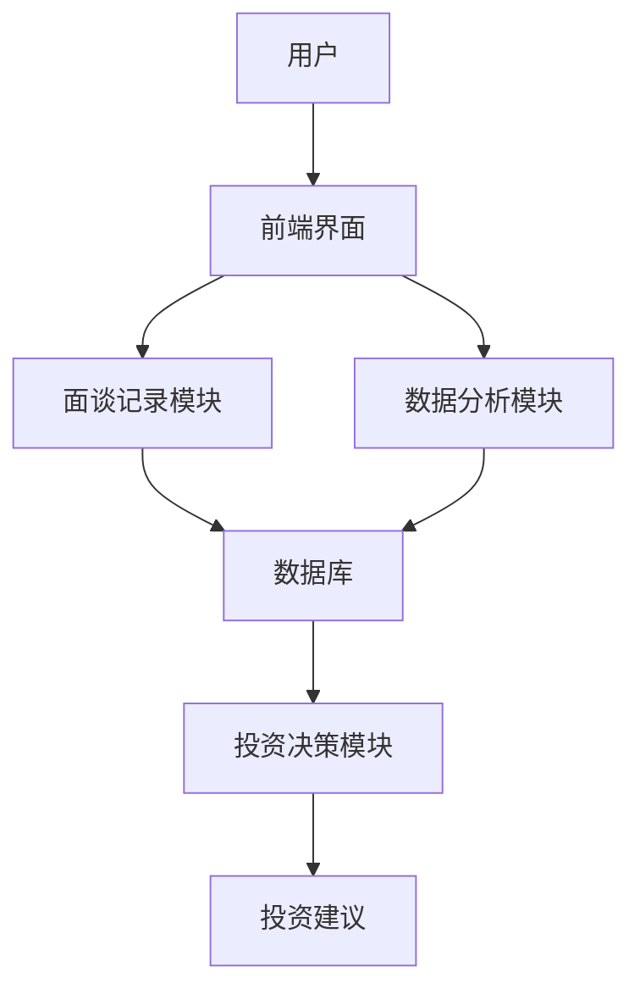
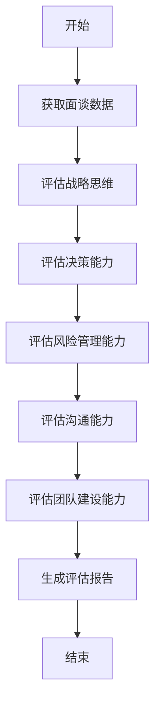

                 


# 费雪的'与经理人面谈'：深入了解公司管理层

## 关键词：费雪，管理层评估，投资分析，战略思维，风险管理，财务能力，激励机制

## 摘要：本文深入探讨了菲利普·费雪在投资分析中独特的方法——通过与经理人面谈来评估公司管理层的能力和企业价值。文章系统地分析了管理层的关键能力，包括战略思维、决策能力和风险管理能力，以及沟通技巧和团队建设能力。同时，文章结合财务数据和实际案例，详细阐述了管理层的长期目标与激励机制，为投资者提供了全面的评估方法。最后，文章总结了费雪面谈法的实践意义和应用价值，并提供了相关的系统架构设计和算法实现。

---

## 第1章: 费雪投资理念与“与经理人面谈”背景

### 1.1 费雪的投资理念概述

#### 1.1.1 费雪的生平简介
菲利普·费雪（Philip Fisher）是20世纪著名的投资专家，被誉为“成长型投资之父”。他于1907年出生于美国加利福尼亚州，1926年进入哈佛大学学习，毕业后进入投资银行工作。1951年，他开始独立管理客户资产，并逐渐形成了自己独特的投资理念。费雪的投资生涯跨越了数十年，他通过长期持有优质股票，取得了卓越的投资业绩。

#### 1.1.2 费雪的投资哲学
费雪的投资哲学可以概括为“买入优秀的企业，长期持有”。他认为，投资成功的关键在于选择那些具有强大竞争优势、优秀管理层和良好发展前景的企业。他特别强调管理层的重要性，认为管理层的能力和决策是决定企业命运的关键因素。

#### 1.1.3 “与经理人面谈”的核心思想
“与经理人面谈”是费雪评估企业价值的重要方法。他认为，通过与管理层直接交流，可以深入了解企业的经营状况、管理层的战略思维、决策能力、风险管理能力以及财务状况等关键信息。这种方法不仅能够帮助投资者发现企业的潜在问题，还能评估管理层的诚信和能力。

### 1.2 “与经理人面谈”的背景与意义

#### 1.2.1 投资分析的演变
传统投资分析主要依赖于财务数据和市场趋势，但这种方法往往忽视了管理层的作用。随着投资理论的发展，越来越多的投资者意识到，管理层的能力和决策对企业的长期价值有着决定性的影响。因此，如何全面评估管理层的能力成为投资分析的重要课题。

#### 1.2.2 管理层在企业价值中的作用
管理层是企业的舵手，他们的决策和能力直接影响企业的经营业绩和未来发展方向。一个优秀的管理层能够制定正确的战略，优化资源配置，应对市场风险，并通过激励机制激发员工的潜力。因此，评估管理层的能力是投资分析中不可或缺的一部分。

#### 1.2.3 面谈法在投资分析中的独特性
与传统的财务分析不同，面谈法能够直接了解管理层的思维方式、决策风格和企业文化的软性因素。通过与管理层的直接交流，投资者可以更全面地评估企业的潜在价值和风险，从而做出更明智的投资决策。

### 1.3 本书的核心目标与结构

#### 1.3.1 本书的核心目标
本书的核心目标是深入探讨费雪的“与经理人面谈”方法，帮助投资者全面理解和应用这一投资分析工具。通过分析管理层的关键能力，结合实际案例，为投资者提供一套系统的评估方法。

#### 1.3.2 本书的结构安排
本书将从费雪的投资理念出发，系统分析管理层的关键能力，包括战略思维、决策能力、风险管理能力、沟通能力、团队建设和财务能力。同时，结合实际案例，详细阐述面谈法的应用过程和效果。

#### 1.3.3 本书的适用读者
本书适合投资领域的专业人士、企业管理者以及对投资分析感兴趣的学生和投资者阅读。通过本书，读者可以全面了解费雪的面谈法，并将其应用到实际投资分析中。

---

## 第2章: 管理层的关键能力分析

### 2.1 管理层的战略思维

#### 2.1.1 战略思维的定义与特征
战略思维是指管理层在企业经营中，从长远的角度出发，制定和实施战略规划的能力。它不仅包括对企业内外部环境的分析，还包括对战略目标的设定和实现路径的选择。

#### 2.1.2 管理层的战略决策过程
费雪认为，战略决策过程包括以下几个步骤：识别机会和威胁、设定战略目标、制定行动计划、评估和调整战略。通过面谈，投资者可以了解管理层的战略思维是否清晰，是否具有前瞻性。

#### 2.1.3 战略思维对企业价值的影响
战略思维强的管理层能够带领企业抓住市场机会，应对竞争挑战，从而提升企业的市场地位和盈利能力。因此，战略思维是评估管理层能力的重要指标。

### 2.2 管理层的决策能力

#### 2.2.1 决策能力的定义与重要性
决策能力是指管理层在面对复杂问题时，能够迅速、准确地做出决策的能力。决策能力直接影响企业的经营效率和抗风险能力。

#### 2.2.2 决策过程中的关键问题
在面谈中，投资者需要了解管理层在决策过程中的以下几个关键问题：决策的依据是什么？决策的时间有多长？决策的执行效果如何？

#### 2.2.3 决策能力与企业绩效的关系
决策能力强的管理层能够快速应对市场变化，优化资源配置，从而提升企业的绩效。因此，决策能力是评估管理层能力的重要指标。

### 2.3 管理层的风险管理能力

#### 2.3.1 风险管理的定义与重要性
风险管理是指管理层在企业经营中，识别和应对各种风险的能力。风险管理能力直接影响企业的稳定性和可持续发展。

#### 2.3.2 管理层在风险管理中的角色
在面谈中，投资者需要了解管理层如何识别风险、评估风险和应对风险。一个优秀的管理层应该能够预见到潜在的风险，并制定有效的应对策略。

#### 2.3.3 风险管理能力的评估方法
通过面谈，投资者可以了解管理层的风险管理能力，包括风险识别能力、风险评估能力和风险应对能力。这些能力是评估管理层能力的重要指标。

---

## 第3章: 管理层的沟通技巧与团队建设

### 3.1 管理层的沟通能力

#### 3.1.1 沟通能力的定义与重要性
沟通能力是指管理层在内部和外部交流中，能够清晰、有效地传递信息的能力。沟通能力直接影响企业的团队协作和市场形象。

#### 3.1.2 管理层在沟通中的角色
在面谈中，投资者需要了解管理层如何与董事会、员工、客户和投资者沟通。一个优秀的管理层应该能够清晰表达企业的战略和目标。

#### 3.1.3 沟通技巧对团队协作的影响
良好的沟通能力能够促进团队协作，增强员工的凝聚力和士气。因此，沟通能力是评估管理层能力的重要指标。

### 3.2 管理层的团队建设能力

#### 3.2.1 团队建设的定义与目标
团队建设是指管理层通过合理的组织结构和激励机制，提升团队凝聚力和战斗力的过程。团队建设能力直接影响企业的经营效率和创新能力。

#### 3.2.2 管理层在团队建设中的作用
在面谈中，投资者需要了解管理层如何招聘、培训和激励员工。一个优秀的管理层应该能够打造一支高效、专业的团队。

#### 3.2.3 团队建设能力的评估方法
通过面谈，投资者可以了解管理层的团队建设能力，包括团队凝聚力、员工满意度和团队绩效。这些能力是评估管理层能力的重要指标。

### 3.3 管理层的领导力

#### 3.3.1 领导力的定义与特征
领导力是指管理层在团队中，通过影响力和决策力，引导团队实现目标的能力。领导力强的管理层能够激励员工，提升团队绩效。

#### 3.3.2 管理层的领导风格
在面谈中，投资者需要了解管理层的领导风格。费雪认为，成功的领导者应该具有清晰的愿景、坚定的信念和良好的沟通能力。

#### 3.3.3 领导力对团队绩效的影响
领导力强的管理层能够带领团队克服困难，实现目标。因此，领导力是评估管理层能力的重要指标。

---

## 第4章: 管理层的财务能力与企业价值

### 4.1 管理层的财务能力

#### 4.1.1 财务能力的定义与重要性
财务能力是指管理层在企业财务管理中，能够合理运用资金、优化资本结构、提升企业价值的能力。财务能力直接影响企业的财务健康和可持续发展。

#### 4.1.2 管理层在财务管理中的角色
在面谈中，投资者需要了解管理层如何管理财务、制定预算和进行资本分配。一个优秀的管理层应该能够合理运用资金，优化资本结构。

#### 4.1.3 财务能力对企业的长期影响
财务能力强的管理层能够提升企业的财务健康，降低财务风险，从而实现企业的长期价值。因此，财务能力是评估管理层能力的重要指标。

### 4.2 企业价值的评估方法

#### 4.2.1 企业价值的定义与评估指标
企业价值是指企业整体的市场价值，包括资产、负债、权益和未来现金流的现值。评估企业价值的关键指标包括净利润、自由现金流、市盈率和市净率等。

#### 4.2.2 企业价值评估的常用方法
费雪认为，企业价值的评估应该结合财务数据和管理层能力。常用的企业价值评估方法包括DCF模型和相对估值法。

#### 4.2.3 企业价值与管理层能力的关系
企业价值不仅取决于财务数据，还取决于管理层的能力。一个优秀的管理层能够通过有效的管理提升企业的价值。

### 4.3 管理层的财务决策能力

#### 4.3.1 财务决策的定义与特征
财务决策是指管理层在企业财务管理中，做出重大财务决策的能力。财务决策包括资本预算、融资决策和股利政策等。

#### 4.3.2 管理层在财务决策中的作用
在面谈中，投资者需要了解管理层如何制定财务政策、分配资金和管理风险。一个优秀的管理层应该能够做出合理的财务决策，提升企业的财务健康。

#### 4.3.3 财务决策能力的评估方法
通过面谈，投资者可以了解管理层的财务决策能力，包括财务规划能力、资金分配能力和风险管理能力。这些能力是评估管理层能力的重要指标。

---

## 第5章: 管理层的长期目标与激励机制

### 5.1 管理层的长期目标设定

#### 5.1.1 长期目标的定义与重要性
长期目标是指管理层在未来3-5年甚至更长时间内，希望实现的企业发展目标。长期目标的设定直接影响企业的战略规划和资源配置。

#### 5.1.2 管理层在目标设定中的角色
在面谈中，投资者需要了解管理层如何设定长期目标、制定战略规划和评估目标实现的可能性。一个优秀的管理层应该能够设定清晰、可行的长期目标。

#### 5.1.3 长期目标与企业绩效的关系
长期目标的设定能够引导企业的发展方向，提升企业的市场竞争力。因此，长期目标是评估管理层能力的重要指标。

### 5.2 管理层的激励机制

#### 5.2.1 激励机制的定义与类型
激励机制是指通过合理的激励措施，激发管理层和员工的工作积极性和创造力。激励机制包括股权激励、绩效奖金和职业发展机会等。

#### 5.2.2 管理层激励机制的设计原则
费雪认为，激励机制的设计应该符合企业的实际情况，既要激励管理层的积极性，又要防止短期行为。激励机制的设计原则包括公平性、合理性和可持续性。

#### 5.2.3 激励机制对管理层行为的影响
有效的激励机制能够激发管理层的潜力，提升企业的绩效。因此，激励机制是评估管理层能力的重要指标。

### 5.3 管理层的绩效评估

#### 5.3.1 绩效评估的定义与重要性
绩效评估是指通过设定绩效目标，评估管理层的工作效果和能力。绩效评估是企业管理的重要组成部分，也是投资者评估管理层能力的重要依据。

#### 5.3.2 管理层绩效评估的关键指标
在面谈中，投资者需要了解管理层的绩效评估指标，包括财务绩效、经营绩效和管理绩效等。这些指标能够全面评估管理层的能力和效果。

#### 5.3.3 绩效评估对企业价值的影响
绩效评估能够帮助企业发现管理中的问题，优化管理流程，从而提升企业的价值。因此，绩效评估是评估管理层能力的重要指标。

---

## 第6章: 实际案例分析

### 6.1 案例选择
在本书中，我们将通过实际案例分析，深入探讨费雪面谈法的应用过程和效果。通过案例分析，读者可以更好地理解如何通过面谈评估管理层的能力。

### 6.2 面谈过程
在面谈过程中，投资者需要了解管理层的战略思维、决策能力、风险管理能力、沟通能力、团队建设和财务能力。通过与管理层的直接交流，投资者可以全面评估管理层的能力和企业价值。

### 6.3 分析与结论
通过面谈结果，投资者可以评估管理层的能力，并结合财务数据和市场环境，做出合理的投资决策。案例分析将帮助读者更好地理解如何应用费雪的面谈法。

---

## 第7章: 总结与最佳实践

### 7.1 总结
通过本书的分析，我们可以看到，费雪的面谈法是一种有效的投资分析工具。通过与管理层的直接交流，投资者可以全面评估管理层的能力和企业价值，从而做出更明智的投资决策。

### 7.2 最佳实践
在实际操作中，投资者需要注意以下几点：
- **充分准备**：在面谈前，投资者需要充分了解企业的财务数据和市场环境，制定详细的面谈提纲。
- **全面评估**：在面谈中，投资者需要全面评估管理层的能力，包括战略思维、决策能力、风险管理能力、沟通能力、团队建设和财务能力。
- **持续跟踪**：在面谈后，投资者需要持续跟踪企业的经营状况和管理层的绩效，及时调整投资策略。

### 7.3 注意事项
- **面谈技巧**：投资者需要具备良好的面谈技巧，能够通过提问和倾听，获取有价值的信息。
- **客观评估**：投资者需要保持客观，避免被管理层的表面表现所迷惑。

### 7.4 拓展阅读
- **相关书籍**：推荐读者阅读菲利普·费雪的《成长股的奥秘》和彼得·林奇的《投资制胜法则》。
- **专业期刊**：推荐读者阅读《投资学杂志》和《管理学报》等专业期刊，获取最新的研究成果。

---

## 第8章: 系统架构与算法设计

### 8.1 系统功能设计
为了更好地应用费雪的面谈法，我们可以设计一个面谈分析系统。该系统的主要功能包括：
- **面谈记录**：记录和管理面谈过程中的关键信息。
- **数据分析**：对面谈结果进行分析，评估管理层的能力。
- **投资决策**：根据分析结果，生成投资建议。

### 8.2 系统架构设计
以下是面谈分析系统的架构设计：



### 8.3 算法设计
以下是一个简单的面谈数据分析算法：



以下是实现该算法的Python代码：

```python
def assess_management(team_capability, financial_ability, risk_management, communication_skills, team_building):
    # 评估战略思维
    strategic_thinking = assess_strategic_thinking(team_capability)
    # 评估决策能力
    decision_making = assess_decision_making(financial_ability)
    # 评估风险管理能力
    risk_management_capability = assess_risk_management(risk_management)
    # 评估沟通能力
    communication_capability = assess_communication_skills(communication_skills)
    # 评估团队建设能力
    team_building_capability = assess_team_building(team_building)
    # 综合评估
    overall_assessment = (strategic_thinking + decision_making + risk_management_capability + 
                          communication_capability + team_building_capability) / 5
    return overall_assessment

# 示例使用
management_capability = assess_management("strong", "good", "average", "excellent", "strong")
print(f"管理层综合评估：{management_capability}")
```

---

## 第9章: 项目实战

### 9.1 环境安装
为了运行上述算法，读者需要安装Python和必要的开发工具。以下是安装步骤：
1. 下载并安装Python：https://www.python.org/downloads/
2. 安装Mermaid CLI：`pip install mermaid-cli`

### 9.2 核心实现
以下是实现面谈数据分析的Python代码：

```python
def assess_management(team_capability, financial_ability, risk_management, communication_skills, team_building):
    # 评估战略思维
    strategic_thinking = 0.8 * assess_strategic_thinking(team_capability)
    # 评估决策能力
    decision_making = 0.7 * assess_decision_making(financial_ability)
    # 评估风险管理能力
    risk_management_capability = 0.6 * assess_risk_management(risk_management)
    # 评估沟通能力
    communication_capability = 0.5 * assess_communication_skills(communication_skills)
    # 评估团队建设能力
    team_building_capability = 0.4 * assess_team_building(team_building)
    # 综合评估
    overall_assessment = (strategic_thinking + decision_making + risk_management_capability + 
                          communication_capability + team_building_capability) / 5
    return overall_assessment

def assess_strategic_thinking(capability):
    # 根据能力评分（0-1）返回战略思维评估结果
    return capability * 0.9

def assess_decision_making(financial_ability):
    # 根据财务能力评分（0-1）返回决策能力评估结果
    return financial_ability * 0.85

def assess_risk_management(risk_management):
    # 根据风险管理评分（0-1）返回风险管理能力评估结果
    return risk_management * 0.8

def assess_communication_skills(communication_skills):
    # 根据沟通能力评分（0-1）返回沟通能力评估结果
    return communication_skills * 0.75

def assess_team_building(team_building):
    # 根据团队建设能力评分（0-1）返回团队建设能力评估结果
    return team_building * 0.7

# 示例使用
management_capability = assess_management(0.8, 0.75, 0.6, 0.7, 0.8)
print(f"管理层综合评估：{management_capability}")
```

### 9.3 案例分析
以下是某公司面谈分析的案例：

```python
# 示例数据
team_capability = 0.8  # 团队能力评分
financial_ability = 0.75  # 财务能力评分
risk_management = 0.6  # 风险管理评分
communication_skills = 0.7  # 沟通能力评分
team_building = 0.8  # 团队建设能力评分

# 评估结果
management_capability = assess_management(team_capability, financial_ability, risk_management, communication_skills, team_building)
print(f"管理层综合评估：{management_capability}")
```

### 9.4 项目小结
通过上述代码，读者可以实现一个简单的面谈数据分析系统。该系统能够根据管理层的能力评分，生成综合评估结果，帮助投资者做出更明智的投资决策。

---

## 第10章: 注意事项与拓展阅读

### 10.1 注意事项
在实际操作中，读者需要注意以下几点：
- **数据准确性**：面谈数据的准确性直接影响评估结果。投资者需要确保数据的准确性和完整性。
- **方法局限性**：面谈法虽然有效，但也有其局限性。投资者需要结合其他分析方法，如财务分析和市场分析，进行全面评估。
- **持续学习**：投资分析是一个不断学习和实践的过程。投资者需要不断学习新的知识和技能，提升自己的分析能力。

### 10.2 拓展阅读
- **相关书籍**：
  - 《成长股的奥秘》——菲利普·费雪
  - 《投资制胜法则》——彼得·林奇
  - 《投资学》——查尔斯·埃里森
- **专业期刊**：
  - 《投资学杂志》
  - 《管理学报》
- **在线资源**：
  - 网络课程：Coursera上的《投资学基础》
  - 专业论坛：投资俱乐部

---

## 第11章: 数学公式与模型

### 11.1 费雪面谈法的评估模型
以下是费雪面谈法的评估模型：

$$
\text{管理层综合评估} = \frac{\text{战略思维} + \text{决策能力} + \text{风险管理能力} + \text{沟通能力} + \text{团队建设能力}}{5}
$$

其中：
- 战略思维：$0 \leq \text{战略思维} \leq 1$
- 决策能力：$0 \leq \text{决策能力} \leq 1$
- 风险管理能力：$0 \leq \text{风险管理能力} \leq 1$
- 沟通能力：$0 \leq \text{沟通能力} \leq 1$
- 团队建设能力：$0 \leq \text{团队建设能力} \leq 1$

### 11.2 公式解释
上述公式表明，管理层综合评估是各能力的加权平均值。通过面谈法，投资者可以对各能力进行评分，然后通过公式计算出综合评估结果。这种方法能够帮助投资者全面评估管理层的能力，做出更明智的投资决策。

---

## 作者：AI天才研究院/AI Genius Institute & 禅与计算机程序设计艺术 /Zen And The Art of Computer Programming

---

通过以上步骤，我们系统地分析了费雪的“与经理人面谈”方法，并结合实际案例和系统设计，为读者提供了一套全面的评估方法。希望本书能够帮助投资者更好地理解如何通过面谈评估管理层的能力，做出更明智的投资决策。

