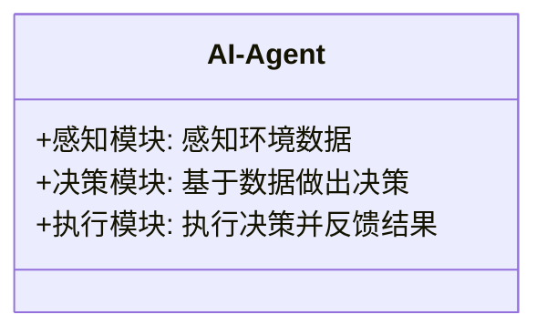
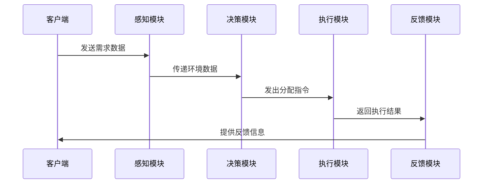

                 


# AI Agent在智能能源分配中的实践

> **关键词**: AI Agent, 智能能源分配, 强化学习, 能源优化, 系统架构设计

> **摘要**: 本文探讨了AI Agent在智能能源分配中的应用，从背景、核心概念到算法原理，再到系统架构设计和项目实战，详细分析了AI Agent如何通过强化学习和监督学习优化能源分配过程，并通过实际案例展示了其在能源管理中的巨大潜力。

---

# 第一部分: AI Agent在智能能源分配中的背景与概念

## 第1章: AI Agent与智能能源分配的背景

### 1.1 AI Agent的基本概念

#### 1.1.1 AI Agent的定义与特点
- **定义**: AI Agent（人工智能代理）是一种能够感知环境、自主决策并执行任务的智能实体。
- **特点**:
  - **自主性**: 能够自主决策，无需外部干预。
  - **反应性**: 能够实时感知环境变化并做出反应。
  - **学习能力**: 能够通过数据和经验不断优化自身行为。
  - **协作性**: 能够与其他AI Agent或系统协同工作。

#### 1.1.2 AI Agent在能源领域的应用背景
- **背景**: 随着能源需求的不断增长和环境问题的加剧，传统能源分配方式的低效性和不可持续性逐渐显现。
- **能源分配的核心问题**: 如何在满足需求的同时，实现能源的高效利用和低碳排放。

#### 1.1.3 智能能源分配的核心问题与挑战
- **核心问题**: 如何通过智能代理优化能源分配，实现供需平衡、降低能耗、减少排放。
- **挑战**:
  - 多目标优化问题。
  - 动态环境下的实时决策。
  - 大规模系统的协调与管理。

### 1.2 智能能源分配的背景与现状

#### 1.2.1 能源分配的传统模式与问题
- **传统模式**: 基于固定规则和人工调度的能源分配方式。
- **问题**:
  - 低效性: 无法实时优化。
  - 不灵活性: 难以应对需求波动。
  - 高成本: 人工干预成本高昂。

#### 1.2.2 智能能源分配的必要性与优势
- **必要性**: 面对能源危机和环境问题，智能化是必然趋势。
- **优势**:
  - **高效性**: 实时优化能源分配。
  - **灵活性**: 能够快速响应需求变化。
  - **经济性**: 降低能源浪费和管理成本。

#### 1.2.3 当前技术发展与AI Agent的结合
- **技术发展**: AI、大数据、物联网等技术的深度融合为智能能源分配提供了技术支持。
- **AI Agent的结合**: 通过AI Agent实现能源分配的智能化、自动化。

### 1.3 本章小结
- 本章介绍了AI Agent的基本概念及其在能源分配中的应用背景，分析了传统能源分配模式的局限性和智能能源分配的必要性与优势。

---

## 第2章: AI Agent的核心概念与原理

### 2.1 AI Agent的核心概念

#### 2.1.1 AI Agent的定义与分类
- **定义**: AI Agent是一种能够感知环境、自主决策并执行任务的智能实体。
- **分类**:
  - **基于反应式架构的AI Agent**: 基于当前感知做出反应。
  - **基于规划式架构的AI Agent**: 基于预设目标和计划进行决策。
  - **混合式AI Agent**: 结合反应式和规划式架构。

#### 2.1.2 AI Agent与传统能源分配系统的区别
| 特性               | AI Agent                     | 传统能源分配系统                 |
|--------------------|----------------------------|----------------------------------|
| 决策方式           | 自主学习与优化               | 依赖固定规则与人工干预           |
| 响应速度           | 实时感知与快速反应           | 延迟较高                         |
| 可扩展性           | 高度可扩展                   | 较低                            |

#### 2.1.3 AI Agent的核心属性与特征
- **自主性**: 能够自主决策，无需外部干预。
- **反应性**: 能够实时感知环境变化并做出反应。
- **学习能力**: 能够通过数据和经验不断优化自身行为。
- **协作性**: 能够与其他AI Agent或系统协同工作。

---

## 2.2 AI Agent的工作原理

### 2.2.1 AI Agent的感知与决策机制
- **感知**: 通过传感器、数据流等感知环境信息。
- **决策**: 基于感知信息，结合预设目标和优化算法，做出决策。

### 2.2.2 AI Agent的自主性与适应性
- **自主性**: 能够在没有外部干预的情况下独立完成任务。
- **适应性**: 能够根据环境变化调整自身行为。

### 2.2.3 AI Agent的协作与通信机制
- **协作**: 多个AI Agent之间通过通信协议协同工作。
- **通信**: 使用消息传递、事件触发等方式实现信息共享。

---

## 2.3 AI Agent的数学模型与优化方法

### 2.3.1 AI Agent的数学模型构建
- **优化目标**: 最小化能源浪费，最大化能源利用效率。
- **约束条件**: 满足用户需求，保证能源供应的稳定性。

### 2.3.2 AI Agent的优化算法
- **强化学习**: 通过奖励机制优化决策。
- **监督学习**: 基于历史数据进行预测和优化。

### 2.3.3 AI Agent的性能评估指标
- **能源利用效率**: 单位能源消耗的产出。
- **响应时间**: 系统的实时性。
- **错误率**: 决策的准确性。

---

## 2.4 本章小结
- 本章详细介绍了AI Agent的核心概念、工作原理以及优化方法，为后续的算法实现奠定了理论基础。

---

## 第3章: AI Agent的算法原理

### 3.1 强化学习在AI Agent中的应用

#### 3.1.1 强化学习的基本原理
- **定义**: 通过试错机制，智能体在环境中学习最优策略。
- **核心要素**:
  - **状态空间**: 当前环境的状态。
  - **动作空间**: 智能体可执行的动作。
  - **奖励函数**: 衡量动作好坏的标准。

#### 3.1.2 AI Agent的强化学习模型
- **模型**: 使用深度强化学习（DRL）框架，结合神经网络和强化学习算法。
- **算法**: 基于Q-learning或Deep Q-Network（DQN）。

#### 3.1.3 强化学习在能源分配中的具体应用
- **案例**: 通过强化学习优化电力分配，减少高峰时段的电力需求。

### 3.2 监督学习在AI Agent中的应用

#### 3.2.1 监督学习的基本原理
- **定义**: 基于历史数据，学习输入与输出之间的映射关系。
- **核心要素**:
  - **特征工程**: 数据的特征提取。
  - **损失函数**: 衡量预测与真实值的差异。

#### 3.2.2 AI Agent的监督学习模型
- **模型**: 使用随机森林、支持向量机（SVM）或神经网络。
- **算法**: 基于梯度下降的优化方法。

#### 3.2.3 监督学习在能源分配中的具体应用
- **案例**: 通过监督学习预测能源需求，优化能源分配计划。

### 3.3 本章小结
- 本章详细介绍了强化学习和监督学习在AI Agent中的应用，展示了这些算法在能源分配中的具体实现和效果。

---

## 第4章: AI Agent的系统分析与架构设计

### 4.1 问题场景介绍
- **场景描述**: 某城市电力分配系统，需要通过AI Agent优化电力分配，减少高峰时段的电力需求。

### 4.2 系统功能设计

#### 4.2.1 系统功能模块
- **感知模块**: 采集电力需求数据。
- **决策模块**: 基于强化学习算法做出电力分配决策。
- **执行模块**: 执行分配决策并反馈结果。

#### 4.2.2 领域模型图（Mermaid 类图）


### 4.3 系统架构设计

#### 4.3.1 系统架构图（Mermaid 架构图）


### 4.4 系统接口设计

#### 4.4.1 系统接口（Mermaid 序列图）


### 4.5 本章小结
- 本章通过系统分析与架构设计，展示了AI Agent在智能能源分配中的具体实现方式。

---

## 第5章: AI Agent的项目实战

### 5.1 环境安装与配置

#### 5.1.1 环境要求
- **操作系统**: Linux或Windows。
- **编程语言**: Python 3.8及以上版本。
- **框架**: TensorFlow或PyTorch。

#### 5.1.2 工具安装
- **安装Python**: 使用Anaconda或虚拟环境。
- **安装依赖库**: `pip install numpy, pandas, matplotlib, keras`.

### 5.2 系统核心实现源代码

#### 5.2.1 强化学习算法实现
```python
import numpy as np
import random

class AI-Agent:
    def __init__(self, state_space, action_space):
        self.state_space = state_space
        self.action_space = action_space
        # 初始化Q-learning表格
        self.q_table = np.zeros((state_space, action_space))
    
    def perceive(self, state):
        # 感知环境状态
        return state
    
    def decide(self, state):
        # 选择动作
        if random.uniform(0, 1) < 0.1:
            return random.randint(0, self.action_space-1)
        else:
            return np.argmax(self.q_table[state])
    
    def learn(self, state, action, reward):
        # 更新Q-learning表格
        self.q_table[state, action] = self.q_table[state, action] + 0.1 * (reward + np.max(self.q_table[state]) - self.q_table[state, action])
```

#### 5.2.2 系统功能实现
```python
def main():
    # 初始化环境
    state_space = 10
    action_space = 4
    agent = AI-Agent(state_space, action_space)
    
    # 运行环境
    for episode in range(100):
        state = random.randint(0, state_space-1)
        action = agent.decide(state)
        reward = calculate_reward(state, action)
        agent.learn(state, action, reward)
    
    # 输出结果
    print("训练完成！")

if __name__ == "__main__":
    main()
```

### 5.3 代码应用解读与分析
- **代码解读**: 上述代码实现了一个简单的Q-learning算法，用于优化能源分配。
- **分析**: 通过不断的学习和训练，AI Agent能够找到最优的能源分配策略。

### 5.4 实际案例分析
- **案例**: 某城市电力分配系统，通过AI Agent实现电力分配的优化。
- **分析**: 使用强化学习算法优化电力分配，减少高峰时段的电力需求。

### 5.5 本章小结
- 本章通过实际案例分析和代码实现，展示了AI Agent在智能能源分配中的具体应用。

---

## 第6章: 总结与拓展阅读

### 6.1 本章总结
- 本文详细探讨了AI Agent在智能能源分配中的应用，从理论到实践，全面分析了AI Agent的核心概念、算法原理和系统架构设计。

### 6.2 最佳实践 Tips
- **算法优化**: 使用更先进的强化学习算法（如DQN）优化能源分配。
- **系统扩展**: 将AI Agent应用于更复杂的能源分配场景。

### 6.3 小结
- AI Agent在智能能源分配中的应用前景广阔，随着技术的不断发展，AI Agent将发挥越来越重要的作用。

### 6.4 注意事项
- **数据质量**: 数据的准确性和完整性对AI Agent的性能至关重要。
- **系统安全性**: 确保系统的安全性和稳定性。

### 6.5 拓展阅读
- **推荐书籍**: 《强化学习：算法与应用》、《人工智能：一种现代方法》。
- **推荐博客**: [AI Agent技术博客](https://example.com)

---

## 附录

### 附录1: 工具与库的安装指南
- **安装Python**: 下载并安装Python 3.8及以上版本。
- **安装依赖库**: 使用命令 `pip install numpy, pandas, matplotlib, keras` 安装所需的库。

### 附录2: 参考文献
- [1] Russell, S., & Norvig, P. (2010). Artificial Intelligence: A Modern Approach.
- [2] Sutton, R. S., & Barto, A. G. (2018). Reinforcement Learning: An Introduction.

---

## 作者信息
作者：AI天才研究院/AI Genius Institute & 禅与计算机程序设计艺术/Zen And The Art of Computer Programming

