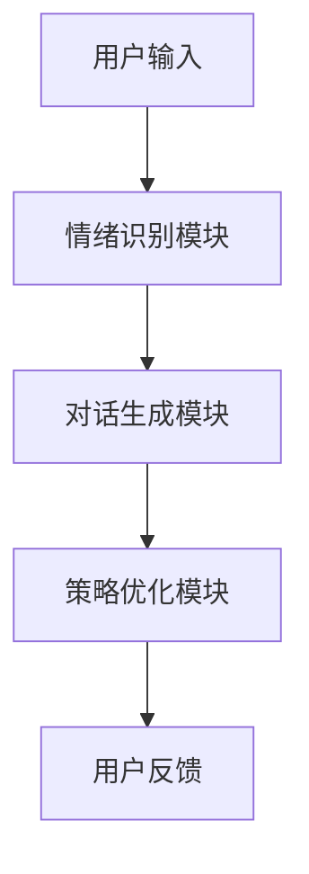
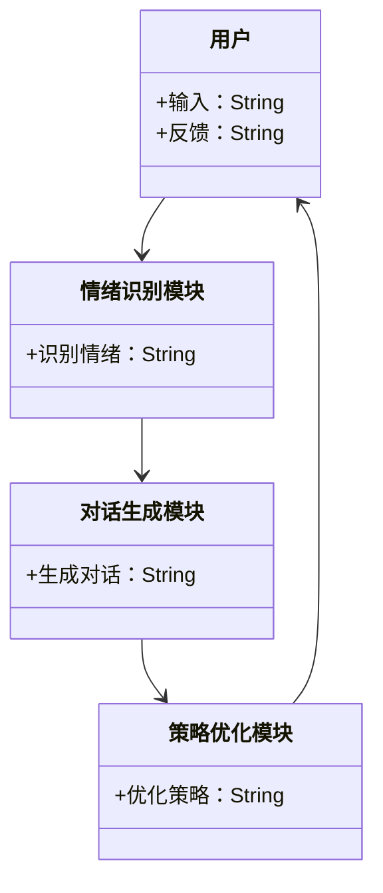
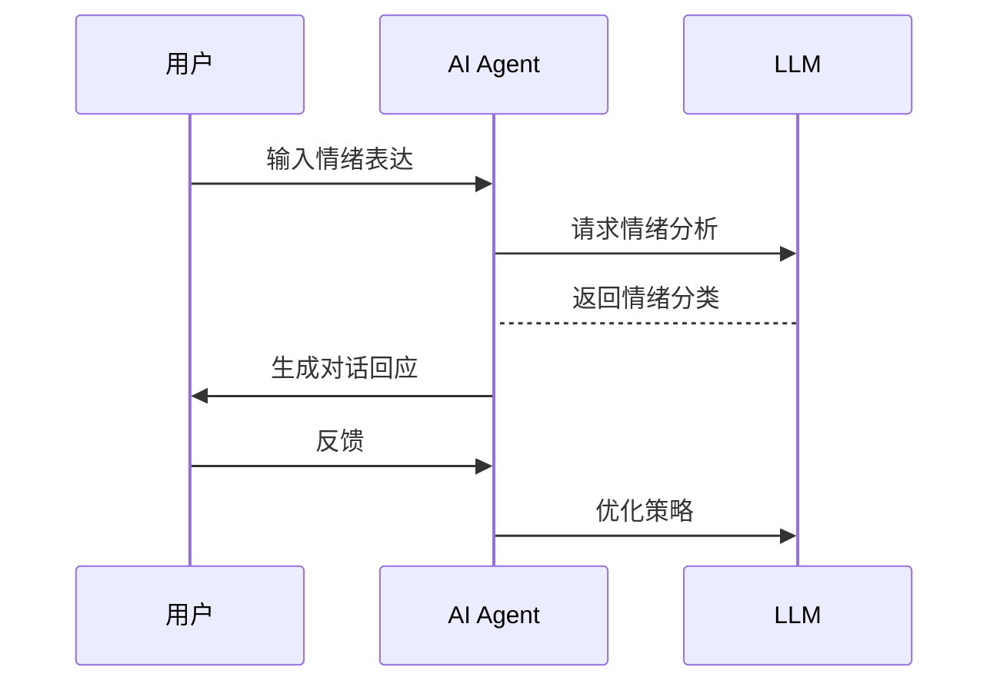

                 


# AI Agent的情绪调节功能：LLM驱动的心理健康助手

> 关键词：AI Agent，LLM，心理健康，情绪调节，自然语言处理，人工智能

> 摘要：随着人工智能技术的快速发展，AI Agent在心理健康领域的应用逐渐成为研究热点。本文将深入探讨AI Agent的情绪调节功能，特别是基于大语言模型（LLM）的心理健康助手。通过分析LLM在情绪识别、情感支持和情绪调节中的作用，结合实际应用场景，详细阐述AI Agent在心理健康支持中的技术实现和应用价值。

---

# 第一部分: AI Agent的情绪调节功能概述

# 第1章: AI Agent与LLM驱动心理健康助手的背景介绍

## 1.1 AI Agent的基本概念

### 1.1.1 AI Agent的定义与特点
AI Agent（人工智能代理）是一种智能实体，能够感知环境、自主决策并执行任务。其特点包括：
- **自主性**：能够在没有外部干预的情况下运行。
- **反应性**：能够实时感知环境并做出响应。
- **目标导向**：通过设定目标来驱动行为。
- **学习能力**：能够通过数据和经验不断优化自身的性能。

### 1.1.2 AI Agent的核心功能与应用场景
AI Agent的核心功能包括信息处理、决策支持和任务执行。其应用场景广泛，涵盖智能家居、自动驾驶、医疗健康、金融投资等领域。

### 1.1.3 AI Agent与人类交互的心理学基础
AI Agent的设计需要考虑人类的心理需求，例如情感支持、信任建立和用户体验优化。通过理解人类的情感和行为模式，AI Agent能够更好地与人类交互。

## 1.2 LLM在心理健康领域的应用

### 1.2.1 LLM的基本原理与技术特点
大语言模型（LLM）基于深度学习技术，通过大量数据训练，能够生成自然语言文本。其技术特点包括：
- **大规模数据训练**：使用海量文本数据进行预训练。
- **多任务学习能力**：能够处理多种语言任务，如情感分析、文本生成等。
- **上下文理解**：通过上下文理解用户意图。

### 1.2.2 LLM在心理健康支持中的优势
LLM在心理健康领域的优势包括：
- **24/7可用性**：能够全天候为用户提供支持。
- **个性化服务**：通过分析用户语言和行为，提供个性化建议。
- **隐私保护**：用户数据在模型中匿名化处理，保护隐私。

### 1.2.3 AI Agent与LLM结合的心理健康助手模式
AI Agent通过整合LLM技术，能够为用户提供智能化的心理健康支持。这种模式结合了AI Agent的自主性和LLM的自然语言处理能力，为用户提供了高效、便捷的心理健康服务。

## 1.3 情绪调节功能的必要性与挑战

### 1.3.1 情绪调节的基本概念与心理学理论
情绪调节是指个体通过认知、行为或环境调整来改变自身情绪状态的过程。心理学理论认为，情绪调节是维持心理健康的重要机制。

### 1.3.2 AI Agent在情绪调节中的作用
AI Agent通过情绪识别、情感支持和行为引导，帮助用户调节情绪，缓解心理压力。

### 1.3.3 情绪调节功能实现的技术挑战
技术挑战包括：
- **高精度情绪识别**：准确识别用户情绪状态。
- **自然语言理解**：理解用户的语言表达和情感意图。
- **个性化调节策略**：制定适合用户的调节方案。

## 1.4 本章小结
本章介绍了AI Agent和LLM的基本概念，分析了LLM在心理健康支持中的优势，并探讨了AI Agent在情绪调节中的作用和技术挑战。

---

# 第2章: AI Agent的情绪调节功能核心概念

## 2.1 情绪调节功能的实现原理

### 2.1.1 情绪识别与分析
情绪识别是通过分析用户的语言、语调和行为来判断其情绪状态。常用的情绪识别方法包括文本分析、语音分析和行为分析。

### 2.1.2 情绪分类算法
情绪分类算法包括：
- **基于词袋模型的分类**：通过统计文本中的情感词进行分类。
- **基于深度学习的分类**：使用神经网络模型（如LSTM）进行情感分类。
- **混合模型**：结合传统特征和深度学习模型进行分类。

### 2.1.3 情绪调节策略生成
情绪调节策略生成包括：
- **情绪反馈**：通过语言和表情反馈用户情绪状态。
- **情感支持**：提供情感上的支持和安慰。
- **行为引导**：引导用户进行有助于情绪调节的行为。

## 2.2 LLM在情绪调节中的角色

### 2.2.1 LLM作为对话生成器
LLM能够生成自然流畅的对话，帮助用户表达情绪和解决问题。

### 2.2.2 LLM作为情感支持者
LLM通过情感分析和对话生成，为用户提供情感支持和心理安慰。

### 2.2.3 LLM作为情绪调节策略的优化器
LLM能够根据用户的情绪状态和历史数据，优化情绪调节策略，提供个性化支持。

## 2.3 AI Agent与LLM的协同工作模式

### 2.3.1 AI Agent的架构设计
AI Agent的架构包括感知层、决策层和执行层。感知层负责情绪识别，决策层负责策略生成，执行层负责任务执行。

### 2.3.2 LLM在AI Agent中的功能定位
LLM在AI Agent中主要负责情绪识别、对话生成和策略优化。

### 2.3.3 AI Agent与用户交互的流程分析
AI Agent与用户交互的流程包括：
1. 用户输入情绪表达。
2. AI Agent通过LLM进行情绪识别。
3. AI Agent根据情绪状态生成相应的回应。
4. 用户对回应做出反馈。
5. AI Agent根据反馈优化策略。

## 2.4 核心概念对比分析

### 2.4.1 情绪调节功能与其他AI功能的对比
情绪调节功能与其他AI功能的对比包括：
- **情绪调节与信息检索**：情绪调节注重情感支持，信息检索注重数据查询。
- **情绪调节与任务执行**：情绪调节注重心理支持，任务执行注重目标达成。

### 2.4.2 LLM与其他NLP技术的对比
LLM与其他NLP技术的对比包括：
- **LLM与传统NLP模型**：LLM具有更强的上下文理解和生成能力。
- **LLM与规则-based系统**：LLM能够处理复杂和不确定的情况。

### 2.4.3 AI Agent与传统对话系统的对比
AI Agent与传统对话系统的对比包括：
- **自主性**：AI Agent具有更高的自主性，传统对话系统依赖预设规则。
- **学习能力**：AI Agent能够通过数据优化性能，传统对话系统难以自适应。

## 2.5 本章小结
本章详细阐述了情绪调节功能的实现原理，分析了LLM在情绪调节中的角色，并对比了AI Agent与其他技术的差异。

---

# 第三部分: AI Agent的情绪调节功能的技术实现

# 第3章: LLM驱动的AI Agent情绪调节算法原理

## 3.1 LLM情绪识别算法的实现原理
### 3.1.1 情感分析的数学模型
情感分析的数学模型可以表示为：
$$
f(x) = \text{sign}(w \cdot x + b)
$$
其中，$x$ 是输入向量，$w$ 是权重向量，$b$ 是偏置项，$\text{sign}$ 是符号函数。

### 3.1.2 基于Transformer的模型结构
Transformer模型由编码器和解码器组成，编码器负责将输入序列转换为向量表示，解码器负责根据编码器的输出生成目标序列。

### 3.1.3 情感分类的实现步骤
1. 对输入文本进行分词和向量化。
2. 使用预训练的Transformer模型进行编码。
3. 对编码结果进行情感分类。

### 3.1.4 情感生成的算法流程
1. 分析用户输入的情感倾向。
2. 根据情感倾向生成相应的回应。
3. 通过反馈优化生成策略。

## 3.2 基于LLM的对话生成算法

### 3.2.1 对话生成的数学模型
对话生成的数学模型可以表示为：
$$
P(y|x) = \text{softmax}(Wx + b)
$$
其中，$x$ 是输入向量，$W$ 是权重矩阵，$b$ 是偏置项，$\text{softmax}$ 是概率分布函数。

### 3.2.2 对话生成的实现步骤
1. 对输入文本进行分词和向量化。
2. 使用预训练的LLM模型生成候选回应。
3. 根据评估指标（如 BLEU、ROUGE）选择最佳回应。

### 3.2.3 对话生成的优化方法
1. 增加情感反馈机制，优化生成策略。
2. 使用强化学习对模型进行微调。

## 3.3 LLM驱动的情绪调节算法的设计与实现

### 3.3.1 算法设计目标
算法设计目标包括：
- **高精度情绪识别**：准确识别用户情绪状态。
- **个性化调节策略**：根据不同情绪生成相应的调节策略。
- **实时交互能力**：能够在实时交互中提供支持。

### 3.3.2 算法实现步骤
1. 收集和标注用户情绪数据。
2. 使用预训练的LLM模型进行情绪识别。
3. 根据情绪生成相应的调节策略。
4. 通过用户反馈优化调节策略。

## 3.4 本章小结
本章详细介绍了LLM驱动的情绪调节算法的实现原理，包括情感分析、对话生成和策略优化的数学模型和实现步骤。

---

# 第4章: 基于LLM的AI Agent情绪调节系统架构设计

## 4.1 系统功能设计
### 4.1.1 系统功能模块
系统功能模块包括：
- **情绪识别模块**：负责识别用户情绪状态。
- **对话生成模块**：负责生成情感支持对话。
- **策略优化模块**：负责优化情绪调节策略。

### 4.1.2 功能模块之间的关系
功能模块之间的关系可以用以下Mermaid图表示：



## 4.2 系统架构设计
### 4.2.1 系统架构的层次划分
系统架构的层次划分为：
- **数据层**：负责数据的存储和管理。
- **算法层**：负责情绪识别、对话生成和策略优化。
- **交互层**：负责用户与系统之间的交互。

### 4.2.2 系统架构的实现
系统架构的实现可以用以下Mermaid图表示：



## 4.3 系统接口设计
### 4.3.1 系统接口的功能描述
系统接口的功能描述包括：
- **输入接口**：接收用户的文本输入。
- **输出接口**：生成对话文本并返回给用户。
- **反馈接口**：接收用户的反馈并优化策略。

### 4.3.2 系统接口的交互流程
系统接口的交互流程可以用以下Mermaid图表示：



## 4.4 系统交互设计
### 4.4.1 用户与AI Agent的交互流程
用户与AI Agent的交互流程包括：
1. 用户输入情绪表达。
2. AI Agent通过LLM识别情绪。
3. AI Agent生成对话回应。
4. 用户对回应做出反馈。
5. AI Agent优化情绪调节策略。

### 4.4.2 系统交互的优化方法
系统交互的优化方法包括：
- **实时反馈机制**：根据用户反馈优化调节策略。
- **个性化设置**：根据用户偏好调整交互方式。

## 4.5 本章小结
本章详细设计了基于LLM的AI Agent情绪调节系统的架构，包括功能模块、系统接口和交互流程。

---

# 第5章: 项目实战——基于LLM的AI Agent情绪调节系统实现

## 5.1 项目背景与目标
### 5.1.1 项目背景
随着人工智能技术的发展，心理健康问题日益受到关注。基于LLM的AI Agent能够为用户提供便捷的心理健康支持。

### 5.1.2 项目目标
项目目标包括：
- 实现情绪识别和情感支持功能。
- 提供个性化的心理健康服务。
- 验证LLM在情绪调节中的有效性。

## 5.2 项目环境与工具安装
### 5.2.1 项目环境
项目环境包括：
- **操作系统**：Linux/Windows/macOS。
- **编程语言**：Python。
- **框架与库**：TensorFlow/PyTorch、Hugging Face Transformers。

### 5.2.2 工具安装
工具安装包括：
1. 安装Python和必要的开发工具。
2. 安装TensorFlow/PyTorch框架。
3. 安装Hugging Face Transformers库。

## 5.3 项目核心代码实现

### 5.3.1 情绪识别模块的实现
情绪识别模块的实现代码如下：

```python
from transformers import pipeline

def emotion_classification(text):
    classifier = pipeline("text-classification", model="nlptown/bert-base")
    result = classifier(text)
    return result[0]['label']
```

### 5.3.2 对话生成模块的实现
对话生成模块的实现代码如下：

```python
from transformers import pipeline

def dialogue_generation(text):
    generator = pipeline("text-generation", model="gpt2")
    result = generator(text, max_length=50, num_return_sequences=1)
    return result[0]['generated_text']
```

### 5.3.3 策略优化模块的实现
策略优化模块的实现代码如下：

```python
def strategy_optimization(feedback):
    # 根据反馈优化策略
    pass
```

## 5.4 项目功能模块的实现与解读

### 5.4.1 情绪识别模块的功能解读
情绪识别模块通过预训练的情感分类模型，准确识别用户的情绪状态。

### 5.4.2 对话生成模块的功能解读
对话生成模块通过生成式模型，为用户提供情感支持和心理安慰。

### 5.4.3 策略优化模块的功能解读
策略优化模块根据用户反馈，动态优化情绪调节策略，提高服务质量。

## 5.5 项目小结
本章通过项目实战，详细讲解了基于LLM的AI Agent情绪调节系统的实现过程，包括环境配置、核心代码实现和功能模块解读。

---

# 第6章: 基于LLM的AI Agent情绪调节系统的优化与展望

## 6.1 项目优化建议

### 6.1.1 情绪识别的优化
情绪识别的优化建议包括：
- 增加多模态输入（如语音和表情）。
- 使用更先进的模型（如ViT）进行情绪分类。

### 6.1.2 对话生成的优化
对话生成的优化建议包括：
- 增加情感反馈机制，优化生成策略。
- 使用强化学习对模型进行微调。

## 6.2 项目未来展望

### 6.2.1 技术发展方向
技术发展方向包括：
- **多模态情感识别**：结合文本、语音和图像等多种模态进行情感识别。
- **自适应调节策略**：根据用户行为和反馈动态调整调节策略。
- **个性化服务**：基于用户特征提供个性化的情绪调节服务。

### 6.2.2 应用场景拓展
应用场景拓展包括：
- **心理健康服务**：为用户提供专业的心理健康支持。
- **教育领域**：帮助学生缓解学习压力。
- **企业应用**：优化员工心理健康，提高工作效率。

## 6.3 本章小结
本章提出了项目优化建议，并展望了未来的技术发展方向和应用场景。

---

# 第7章: 总结与致谢

## 7.1 本项目的核心内容总结
本项目的核心内容包括：
- AI Agent与LLM的基本概念。
- 情绪调节功能的实现原理。
- 基于LLM的AI Agent情绪调节系统的实现与优化。

## 7.2 项目的价值与意义
项目的价值与意义包括：
- 提供了智能化的心理健康支持工具。
- 推动了LLM技术在心理健康领域的应用。
- 为AI Agent的设计与实现提供了参考。

## 7.3 致谢
感谢读者的支持，感谢团队成员的共同努力。

---

# 作者：AI天才研究院/AI Genius Institute & 禅与计算机程序设计艺术 /Zen And The Art of Computer Programming

