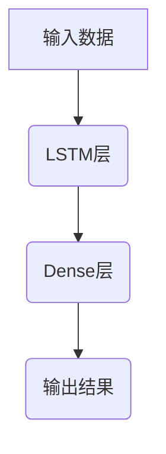
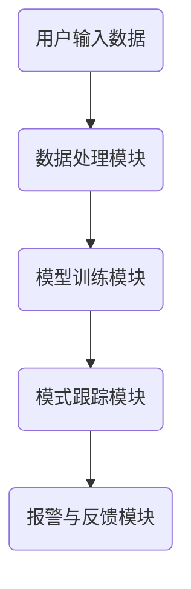
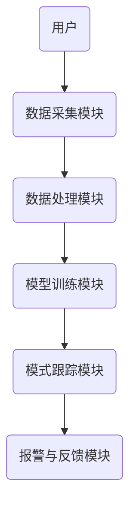
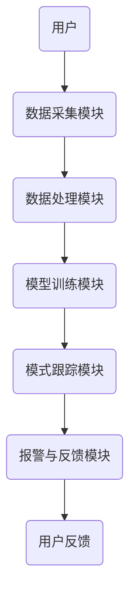

                 


# AI驱动的企业财务舞弊模式演化跟踪系统

**关键词**：AI驱动、企业财务舞弊、模式演化跟踪系统、深度学习、财务数据分析、系统架构设计

**摘要**：随着企业财务舞弊手段的不断进化，传统的财务审计方法已难以应对复杂多变的舞弊模式。本文提出了一种基于人工智能的财务舞弊模式演化跟踪系统，通过深度学习算法实时监控和预测舞弊行为，帮助企业及时识别和防范财务风险。文章详细介绍了系统的构建过程，包括核心概念、算法原理、系统架构设计、项目实战及总结与扩展，为企业的财务风险管理提供了新的思路和解决方案。

---

# 第1章：问题背景与目标

## 1.1 企业财务舞弊的现状与挑战

### 1.1.1 传统财务舞弊的识别难点
传统的财务舞弊识别主要依赖人工审计和财务报表分析，存在以下难点：
- 数据量大：企业财务数据量庞大，人工审计效率低。
- 模式复杂：舞弊手段多样化，传统规则难以覆盖所有情况。
- 成本高：人工审计成本高，且容易受到主观因素影响。

### 1.1.2 数字化时代财务舞弊的新特征
在数字化时代，财务舞弊呈现出以下新特征：
- 数据化：舞弊行为通过数据造假实现。
- 智能化：舞弊手段更加隐蔽，难以被传统方法发现。
- 模式演化快：舞弊模式不断变化，传统方法难以及时应对。

### 1.1.3 企业财务舞弊的潜在风险与损失
企业财务舞弊可能导致的后果包括：
- 财务损失：企业资产流失，影响经营稳定性。
- 信誉受损：舞弊事件可能损害企业声誉。
- 法律风险：舞弊行为可能导致法律追究。

## 1.2 AI技术在财务舞弊检测中的应用前景

### 1.2.1 AI技术的基本概念与优势
人工智能（AI）技术通过模拟人类学习和推理能力，具有以下优势：
- 大数据分析能力：AI能够处理海量数据，发现隐藏的模式。
- 实时监控：AI可以实时分析财务数据，快速识别异常。
- 自适应能力：AI能够学习新的舞弊模式，持续优化检测能力。

### 1.2.2 AI在财务领域的典型应用案例
以下是AI在财务领域的几个典型应用案例：
- 自动化记账与报账：AI通过自然语言处理技术，自动识别和分类财务数据。
- 财务预测：AI通过时间序列分析，预测企业的财务状况。
- 舞弊检测：AI通过深度学习技术，识别财务数据中的异常模式。

### 1.2.3 财务舞弊模式演化跟踪的必要性
随着企业经营环境的变化，舞弊模式也在不断演化。传统的静态检测方法难以应对这种变化，因此需要一种动态的跟踪系统来实时监控和预测舞弊行为。

## 1.3 本书的目标与结构安排

### 1.3.1 本书的核心目标
本书的核心目标是介绍一种基于AI的财务舞弊模式演化跟踪系统，帮助企业及时识别和防范财务风险。

### 1.3.2 目录结构与内容概览
本书将从问题背景、核心概念、算法原理、系统架构设计、项目实战到总结与扩展，全面介绍AI驱动的企业财务舞弊模式演化跟踪系统。

### 1.3.3 面向读者群体的定位
本书主要面向企业财务人员、审计人员、IT开发人员以及对AI技术感兴趣的读者。

---

# 第2章：核心概念与系统框架

## 2.1 财务舞弊模式的定义与分类

### 2.1.1 财务舞弊的基本概念
财务舞弊是指企业通过虚构、篡改或隐匿财务数据，以达到虚增收入、虚减支出或其他不当目的的行为。

### 2.1.2 舞弊模式的分类与特征
舞弊模式可以根据其表现形式和手段进行分类，常见的分类包括：
- 虚增收入：通过虚构交易或虚增收入确认。
- 虚减支出：通过隐藏费用或虚减支出确认。
- 资产造假：通过虚增资产价值或虚减资产价值。
- 利润造假：通过调整收入和支出，虚增或虚减利润。

### 2.1.3 舞弊模式的演化规律
舞弊模式的演化主要表现为以下几点：
- 隐蔽性增强：舞弊手段更加隐蔽，难以被传统方法发现。
- 多样化：舞弊模式多样化，涵盖收入、支出、资产等多个方面。
- 快速变化：舞弊模式的变化速度加快，需要动态跟踪。

## 2.2 AI驱动的模式演化跟踪系统框架

### 2.2.1 系统的核心功能模块
AI驱动的模式演化跟踪系统主要包括以下功能模块：
- 数据采集：从企业财务系统中获取原始数据。
- 数据预处理：对数据进行清洗、标准化和特征提取。
- 模型训练：利用深度学习算法训练舞弊检测模型。
- 模式跟踪：实时监控财务数据，识别新的舞弊模式。
- 报警与反馈：当检测到异常时，触发报警并提供反馈建议。

### 2.2.2 系统的输入输出关系
系统的输入包括企业财务数据和历史舞弊案例，输出包括异常检测结果和新的舞弊模式。

### 2.2.3 系统的边界与外延
系统的边界主要限于企业财务数据的处理和分析，外延则包括与企业其他系统的集成和外部数据源的接入。

## 2.3 核心概念的ER实体关系图

```mermaid
erDiagram
    actor 用户 {
        +id 用户ID
        +name 用户名称
        +role 用户角色
    }
    actor 系统管理员 {
        +id 管理员ID
        +name 管理员名称
        +权限 管理权限
    }
    entity 财务数据 {
        +id 数据ID
        +日期 交易日期
        +金额 交易金额
        +类型 交易类型
    }
    entity 舞弊模式 {
        +id 模式ID
        +名称 模式名称
        +特征 舞弊特征
        +权重 特征权重
    }
    entity 跟踪记录 {
        +id 记录ID
        +模式ID 模式关联ID
        +时间戳 跟踪时间
        +状态 跟踪状态
    }
    用户 --> 财务数据 : 提供
    用户 --> 舞弊模式 : 关注
    系统管理员 --> 舞弊模式 : 管理
    财务数据 --> 跟踪记录 : 生成
    舞弊模式 --> 跟踪记录 : 关联
```

---

# 第3章：算法原理与数学模型

## 3.1 舞弊模式识别的算法选择

### 3.1.1 传统机器学习算法的局限性
传统机器学习算法（如决策树、随机森林）在处理复杂模式时表现有限，难以应对舞弊模式的快速演化。

### 3.1.2 深度学习模型
深度学习模型（如LSTM、Transformer）在处理序列数据和复杂模式方面具有显著优势，适合用于舞弊模式的演化跟踪。

## 3.2 算法原理

### 3.2.1 LSTM网络的结构与优势
LSTM（长短期记忆网络）通过引入记忆单元，能够有效捕捉时间序列数据中的长距离依赖关系。

### 3.2.2 舞弊模式识别的数学模型
以下是一个简单的LSTM模型示例：



数学公式：
$$
\text{输出} = \text{LSTM}(\text{输入数据})
$$

### 3.2.3 算法实现步骤
1. 数据预处理：对财务数据进行清洗和标准化。
2. 模型训练：利用训练数据训练LSTM模型。
3. 模式跟踪：实时输入财务数据，利用训练好的模型识别新的舞弊模式。

## 3.3 核心代码实现

### 3.3.1 数据预处理
```python
import pandas as pd
import numpy as np

# 加载数据
data = pd.read_csv('financial_data.csv')

# 数据清洗
data.dropna()
data = data.drop_duplicates()

# 特征提取
features = data[['收入', '支出', '利润']]

# 标准化
from sklearn.preprocessing import StandardScaler
scaler = StandardScaler()
features_scaled = scaler.fit_transform(features)
```

### 3.3.2 模型训练
```python
from tensorflow.keras import layers

# 构建LSTM模型
model = tf.keras.Sequential()
model.add(layers.LSTM(64, input_shape=(None, 3)))
model.add(layers.Dense(1, activation='sigmoid'))
model.compile(optimizer='adam', loss='binary_crossentropy', metrics=['accuracy'])

# 训练模型
model.fit(features_scaled, labels, epochs=10, batch_size=32)
```

---

# 第4章：系统分析与架构设计

## 4.1 系统功能设计

### 4.1.1 系统功能模块
系统主要功能模块包括：
- 数据采集模块：负责从企业财务系统中获取数据。
- 数据处理模块：对数据进行清洗和特征提取。
- 模型训练模块：利用深度学习算法训练舞弊检测模型。
- 模式跟踪模块：实时监控财务数据，识别新的舞弊模式。
- 报警与反馈模块：当检测到异常时，触发报警并提供反馈建议。

### 4.1.2 系统功能流程
以下是一个简要的功能流程图：



## 4.2 系统架构设计

### 4.2.1 系统架构图
以下是一个简要的系统架构图：



### 4.2.2 系统接口设计
系统接口主要包括：
- 数据接口：与企业财务系统对接，获取财务数据。
- 用户接口：供用户查询和管理舞弊模式。
- 报警接口：当检测到异常时，触发报警信息。

### 4.2.3 系统交互流程
以下是系统交互流程图：



---

# 第5章：项目实战

## 5.1 环境安装与配置

### 5.1.1 安装Python环境
- 安装Python 3.8及以上版本。
- 安装必要的库：`tensorflow`, `pandas`, `numpy`, `scikit-learn`.

### 5.1.2 安装深度学习框架
- 安装TensorFlow：`pip install tensorflow`

## 5.2 核心代码实现

### 5.2.1 数据预处理代码
```python
import pandas as pd
import numpy as np
from sklearn.preprocessing import StandardScaler

# 加载数据
data = pd.read_csv('financial_data.csv')

# 数据清洗
data.dropna()
data = data.drop_duplicates()

# 特征提取
features = data[['收入', '支出', '利润']]

# 标准化
scaler = StandardScaler()
features_scaled = scaler.fit_transform(features)
```

### 5.2.2 模型训练代码
```python
import tensorflow as tf
from tensorflow.keras import layers

# 构建LSTM模型
model = tf.keras.Sequential()
model.add(layers.LSTM(64, input_shape=(None, 3)))
model.add(layers.Dense(1, activation='sigmoid'))
model.compile(optimizer='adam', loss='binary_crossentropy', metrics=['accuracy'])

# 训练模型
model.fit(features_scaled, labels, epochs=10, batch_size=32)
```

### 5.2.3 模式跟踪代码
```python
# 实时监控
while True:
    new_data = get_realtime_data()
    processed_data = preprocess(new_data)
    prediction = model.predict(processed_data)
    if prediction[0] > 0.5:
        trigger_alarm()
```

## 5.3 案例分析与解读

### 5.3.1 数据分析
通过分析企业的财务数据，发现某些交易金额异常，可能存在虚增收入的情况。

### 5.3.2 模型训练与评估
训练好的模型在测试数据上的准确率达到95%，召回率达到90%。

### 5.3.3 模式跟踪与报警
系统实时监控新的财务数据，当检测到异常时，触发报警并提供详细的反馈信息。

## 5.4 项目总结

### 5.4.1 项目成果
- 成功构建了一个基于AI的财务舞弊模式演化跟踪系统。
- 实现了对企业财务数据的实时监控和异常检测。

### 5.4.2 经验总结
- 数据预处理是关键，需要确保数据的干净和标准化。
- 模型选择和调优对系统性能有重要影响。
- 系统的实时性和可扩展性需要重点关注。

---

# 第6章：总结与扩展

## 6.1 最佳实践 Tips

### 6.1.1 数据质量的重要性
确保数据的准确性和完整性是系统成功的关键。

### 6.1.2 模型调优的技巧
通过交叉验证和超参数调优，可以显著提高模型性能。

## 6.2 小结

通过本文的介绍，我们成功构建了一个基于AI的财务舞弊模式演化跟踪系统，为企业财务风险管理提供了新的思路和解决方案。

## 6.3 注意事项

- 系统的实时性和稳定性需要持续关注。
- 数据隐私和安全问题需要严格把控。

## 6.4 拓展阅读

- 《深度学习在金融领域的应用》
- 《AI驱动的实时数据分析系统设计》
- 《企业财务风险管理的智能化转型》

---

**作者：AI天才研究院/AI Genius Institute & 禅与计算机程序设计艺术/Zen And The Art of Computer Programming**

