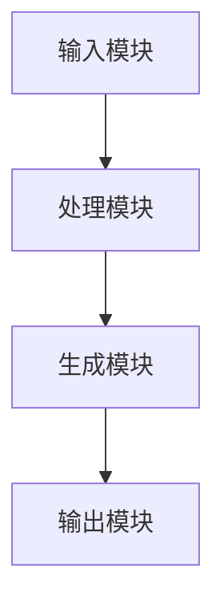

                 


# LLM驱动的AI Agent创意生成：突破思维局限

## 关键词：LLM, AI Agent, 创意生成, 大语言模型, 智能体, 思维突破

## 摘要：本文深入探讨了如何利用大语言模型（LLM）驱动AI Agent进行创意生成，分析了其核心原理、系统架构，并通过实战案例展示了其应用。文章从背景介绍到算法原理，再到系统设计与项目实施，全面解析了LLM驱动AI Agent的技术细节与创新点，帮助读者突破传统思维局限，掌握前沿的AI技术。

---

## 第1章: LLM与AI Agent概述

### 1.1 LLM与AI Agent的基本概念

#### 1.1.1 大语言模型（LLM）的定义
大语言模型（Large Language Model，LLM）是指经过大规模数据训练的深度学习模型，能够理解并生成人类语言。LLM的核心技术包括自然语言处理（NLP）、机器学习（ML）和深度学习（DL）。其训练过程通常涉及 billions of parameters，并使用大量的文本数据进行监督学习和无监督学习。

- **监督学习**：模型在标注数据上进行训练，学习输入与输出之间的映射关系。
- **无监督学习**：模型在未标注数据上进行训练，学习数据的分布特征。

LLM的应用广泛，包括文本生成、机器翻译、问答系统、对话系统等。

#### 1.1.2 AI Agent的概念与特点
AI Agent（智能体）是指在环境中能够感知并自主行动以实现目标的实体。AI Agent可以是软件程序，也可以是物理机器人。其特点包括：

1. **自主性**：能够在没有外部干预的情况下自主行动。
2. **反应性**：能够根据环境反馈实时调整行为。
3. **目标导向**：所有行动都以实现特定目标为导向。
4. **学习能力**：能够通过经验改进自身的决策能力。

AI Agent的核心任务包括信息处理、决策制定和行动执行。

#### 1.1.3 LLM与AI Agent的结合
LLM与AI Agent的结合为AI Agent提供了强大的语言理解和生成能力。LLM作为AI Agent的核心组件，负责处理自然语言输入，生成自然语言输出，并辅助AI Agent进行决策。

- **输入处理**：LLM能够理解用户输入的自然语言，提取关键信息。
- **决策支持**：LLM为AI Agent提供生成多种可能的决策方案。
- **输出生成**：LLM能够生成自然语言的输出，提高AI Agent与用户的交互体验。

### 1.2 创意生成的背景与挑战

#### 1.2.1 创意生成的传统方法
传统的创意生成方法主要依赖人类的创造力和专业知识，常见的方法包括：

1. **头脑风暴**：通过集体讨论激发创意。
2. **思维导图**：通过图形化工具整理思路。
3. **类比推理**：通过类比其他领域的知识生成新想法。

这些方法虽然有效，但受到人类知识和经验的限制，难以突破思维定式。

#### 1.2.2 LLM驱动创意生成的优势
LLM驱动的创意生成具有以下优势：

1. **知识广博**：LLM经过海量数据训练，能够覆盖多个领域的知识。
2. **快速生成**：LLM可以在短时间内生成大量创意，提高效率。
3. **无限可能**：LLM能够打破传统思维定式，生成人类难以想到的新颖创意。

#### 1.2.3 创意生成中的主要挑战
尽管LLM驱动创意生成具有许多优势，但也面临一些挑战：

1. **创意质量**：生成的创意可能缺乏深度和可行性。
2. **多样性控制**：如何控制生成创意的多样性是一个难题。
3. **伦理问题**：生成的创意可能涉及敏感内容，引发伦理问题。

### 1.3 本章小结
本章介绍了大语言模型（LLM）和AI Agent的基本概念，并分析了LLM驱动创意生成的背景、优势和挑战。通过理解这些内容，我们可以为后续章节的深入分析打下基础。

---

## 第2章: LLM驱动的AI Agent核心原理

### 2.1 大语言模型的训练与推理

#### 2.1.1 LLM的训练过程
大语言模型的训练过程主要包括以下步骤：

1. **数据预处理**：清洗数据，去除噪声，分词标注。
2. **模型选择**：选择适合的模型架构，如Transformer。
3. **训练过程**：使用训练数据进行模型参数优化，通常采用随机梯度下降（SGD）或Adam优化器。
4. **评估与调优**：通过验证集评估模型性能，调整超参数。

训练过程通常需要大量的计算资源，采用分布式训练和并行计算加速训练。

#### 2.1.2 LLM的推理机制
LLM的推理机制主要包括以下步骤：

1. **输入处理**：将用户的输入转换为模型能够理解的格式。
2. **生成策略**：选择生成策略，如贪心搜索、随机采样等。
3. **输出生成**：根据模型的输出结果生成最终的自然语言输出。

#### 2.1.3 LLM的注意力机制
注意力机制（Attention Mechanism）是大语言模型的重要组成部分，主要用于处理序列数据。注意力机制通过计算输入序列中每个位置的重要性，生成一个注意力权重矩阵，从而提高模型的语义理解能力。

$$
\text{Attention}(Q, K, V) = \text{softmax}\left(\frac{QK^T}{\sqrt{d_k}}\right)V
$$

其中，$Q$ 是查询向量，$K$ 是键向量，$V$ 是值向量，$d_k$ 是键的维度。

### 2.2 AI Agent的决策与执行

#### 2.2.1 AI Agent的决策模型
AI Agent的决策模型通常包括以下步骤：

1. **状态感知**：感知当前环境状态。
2. **目标设定**：根据当前状态设定目标。
3. **决策制定**：基于当前状态和目标，制定决策方案。
4. **行动执行**：执行决策方案，改变环境状态。

#### 2.2.2 AI Agent的执行机制
AI Agent的执行机制主要包括以下步骤：

1. **决策执行**：将决策方案转化为具体行动。
2. **环境反馈**：获取环境对行动的反馈。
3. **状态更新**：根据反馈更新环境状态。

#### 2.2.3 LLM在AI Agent中的角色
LLM在AI Agent中的角色主要体现在以下几个方面：

1. **自然语言理解**：理解用户输入的自然语言指令。
2. **创意生成**：生成多样化的创意方案。
3. **决策支持**：辅助AI Agent制定决策方案。

### 2.3 创意生成的算法原理

#### 2.3.1 创意生成的数学模型
创意生成的数学模型通常基于概率分布。LLM通过训练数据学习语言的分布规律，生成符合语言规律的文本。

$$
P(\text{sequence}) = \prod_{i=1}^{n} P(w_i | w_{i-1}, \dots, w_1)
$$

其中，$w_i$ 是序列中的第$i$个词，$P(w_i | w_{i-1}, \dots, w_1)$ 是在前面词的条件下，生成当前词的概率。

#### 2.3.2 创意生成的算法流程
创意生成的算法流程主要包括以下步骤：

1. **输入处理**：接收用户的输入指令。
2. **生成策略**：选择生成策略，如贪心搜索、随机采样等。
3. **输出生成**：根据模型的输出结果生成最终的自然语言输出。

#### 2.3.3 创意生成的优化方法
创意生成的优化方法主要包括以下几种：

1. **温度调节**：通过调整生成过程中的温度参数，控制生成结果的多样性和创造性。
2. **重复惩罚**：惩罚重复生成的内容，提高生成结果的多样性。
3. **Top-k采样**：从生成的候选词中选择Top-k个最可能的词进行生成，平衡多样性和质量。

### 2.4 本章小结
本章深入分析了大语言模型（LLM）和AI Agent的核心原理，包括训练与推理、决策与执行，以及创意生成的算法原理。通过理解这些内容，我们可以为后续章节的系统架构设计打下基础。

---

## 第3章: LLM驱动的AI Agent系统架构

### 3.1 系统架构设计

#### 3.1.1 系统功能模块划分
LLM驱动的AI Agent系统通常包括以下功能模块：

1. **输入模块**：接收用户的输入指令。
2. **处理模块**：对输入指令进行解析和处理。
3. **生成模块**：生成创意方案。
4. **输出模块**：将生成的创意方案输出给用户。

#### 3.1.2 系统架构图
以下是LLM驱动的AI Agent系统的架构图：



#### 3.1.3 模块之间的交互关系
模块之间的交互关系如下：

1. **输入模块**接收用户的输入指令，将其传递给**处理模块**。
2. **处理模块**对输入指令进行解析和处理，生成模型需要的输入格式。
3. **生成模块**根据处理后的输入，调用LLM生成创意方案。
4. **输出模块**将生成的创意方案输出给用户。

### 3.2 系统接口设计

#### 3.2.1 系统输入接口
系统输入接口主要包括以下几种：

1. **文本输入接口**：接收用户的自然语言输入。
2. **参数输入接口**：接收生成过程中的参数设置，如温度、Top-k值等。

#### 3.2.2 系统输出接口
系统输出接口主要包括以下几种：

1. **文本输出接口**：输出生成的创意方案。
2. **日志输出接口**：输出系统运行的日志信息。

#### 3.2.3 接口设计规范
接口设计规范包括以下内容：

1. **输入格式**：所有输入必须符合规定的格式要求。
2. **输出格式**：所有输出必须符合规定的格式要求。
3. **接口文档**：提供详细的接口文档，方便开发者调用。

### 3.3 系统交互流程

#### 3.3.1 用户输入处理流程
用户输入处理流程如下：

1. **接收输入**：用户通过输入接口输入创意生成的指令。
2. **解析输入**：系统对输入指令进行解析，提取关键信息。
3. **生成创意**：系统调用LLM生成创意方案。
4. **输出结果**：系统将生成的创意方案输出给用户。

#### 3.3.2 系统推理流程
系统推理流程如下：

1. **输入处理**：系统接收用户的输入指令。
2. **生成策略**：系统选择生成策略，如贪心搜索、随机采样等。
3. **生成创意**：系统根据选择的生成策略生成创意方案。
4. **输出结果**：系统将生成的创意方案输出给用户。

#### 3.3.3 结果输出流程
结果输出流程如下：

1. **生成结果**：系统生成创意方案。
2. **格式转换**：系统将生成的创意方案转换为输出格式。
3. **输出结果**：系统将生成的创意方案输出给用户。

### 3.4 本章小结
本章详细分析了LLM驱动的AI Agent系统的架构设计，包括功能模块划分、接口设计和交互流程。通过理解这些内容，我们可以为后续章节的项目实战打下基础。

---

## 第4章: LLM驱动的AI Agent创意生成实战

### 4.1 环境安装与配置

#### 4.1.1 开发环境搭建
开发环境搭建主要包括以下步骤：

1. **安装Python**：安装Python 3.8或更高版本。
2. **安装依赖库**：安装必要的依赖库，如TensorFlow、PyTorch、Hugging Face Transformers等。
3. **配置环境变量**：配置Python和相关库的环境变量。

#### 4.1.2 LLM模型下载与安装
LLM模型下载与安装主要包括以下步骤：

1. **选择模型**：选择适合的LLM模型，如GPT-2、GPT-3、BERT等。
2. **下载模型**：从Hugging Face Model Hub下载模型。
3. **安装模型**：将模型安装到本地或云服务器上。

### 4.2 系统核心实现源代码

#### 4.2.1 输入处理代码
以下是输入处理代码示例：

```python
def process_input(input_str):
    # 对输入字符串进行预处理
    input_str = input_str.strip().lower()
    return input_str
```

#### 4.2.2 生成模块代码
以下是生成模块代码示例：

```python
from transformers import GPT2LMHeadModel, GPT2Tokenizer

def generate_creative(input_str, model, tokenizer):
    # 对输入字符串进行编码
    inputs = tokenizer.encode(input_str, return_tensors='pt')
    
    # 生成创意
    outputs = model.generate(inputs, max_length=50, temperature=1.0, top_k=50)
    
    # 解码生成的输出
    creative = tokenizer.decode(outputs[0], skip_special_tokens=True)
    return creative
```

#### 4.2.3 输出模块代码
以下是输出模块代码示例：

```python
def output_results(creative):
    # 输出生成的创意
    print("生成的创意：")
    print(creative)
```

### 4.3 代码应用解读与分析

#### 4.3.1 输入处理模块
输入处理模块的主要功能是对用户的输入进行预处理，包括去除多余的空格、统一大小写等。通过预处理，可以提高模型的生成效果。

#### 4.3.2 生成模块
生成模块的主要功能是调用LLM生成创意方案。生成过程中，可以通过调整温度和Top-k参数，控制生成结果的多样性和创造性。

#### 4.3.3 输出模块
输出模块的主要功能是将生成的创意方案输出给用户。输出格式可以根据需求进行定制，如文本输出、JSON输出等。

### 4.4 实际案例分析和详细讲解剖析

#### 4.4.1 案例背景
假设我们需要生成一个环保相关的创意方案，用户输入指令为：“生成一个环保相关的创意方案”。

#### 4.4.2 案例分析
系统接收到用户的输入指令后，首先进行预处理，然后调用LLM生成创意方案。生成过程中，系统可以选择贪心搜索策略，生成高质量的创意方案。

#### 4.4.3 案例结果
生成的创意方案可能包括以下几个方面：

1. **垃圾分类系统**：设计一个智能垃圾分类系统，帮助用户更好地进行垃圾分类。
2. **环保教育平台**：创建一个在线环保教育平台，提供环保知识和培训。
3. **可持续包装解决方案**：开发一种可降解的包装材料，减少对环境的污染。

### 4.5 项目小结
本章通过实际案例分析，展示了LLM驱动的AI Agent创意生成的实现过程。通过代码示例和案例分析，帮助读者更好地理解如何将理论应用于实际。

---

## 第5章: 最佳实践与总结

### 5.1 小结
通过本文的分析，我们可以看到，LLM驱动的AI Agent创意生成是一种非常 powerful 的技术，能够帮助我们突破传统思维的局限，生成多样化的创意方案。通过合理设计系统架构和优化生成算法，我们可以进一步提高生成创意的质量和多样性。

### 5.2 注意事项
在实际应用中，需要注意以下几点：

1. **数据安全**：确保生成过程中涉及的数据安全，防止数据泄露。
2. **伦理问题**：注意生成内容的伦理问题，避免生成有害信息。
3. **模型优化**：不断优化模型和生成算法，提高生成效果。

### 5.3 拓展阅读
对于感兴趣的朋友，可以进一步阅读以下内容：

1. **Hugging Face Transformers库**：了解如何使用Hugging Face Transformers库进行文本生成。
2. **大语言模型的优化方法**：学习如何优化大语言模型的性能。
3. **AI伦理与安全**：研究AI伦理与安全的相关内容。

### 5.4 本章小结
本章总结了LLM驱动的AI Agent创意生成的最佳实践，并提出了需要注意的事项和拓展阅读的方向，帮助读者进一步深入学习和应用。

---

## 作者：AI天才研究院/AI Genius Institute & 禅与计算机程序设计艺术 /Zen And The Art of Computer Programming

---

以上是《LLM驱动的AI Agent创意生成：突破思维局限》的技术博客文章的完整内容。

