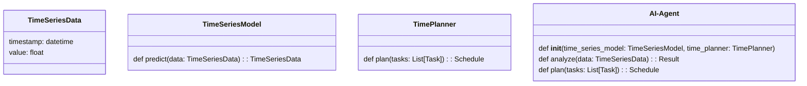

                 


# 从零构建AI Agent的时间推理能力

## 关键词：AI Agent, 时间推理, 机器学习, 时间序列模型, 系统架构设计

## 摘要：  
本文将从零开始，系统地探讨如何构建AI Agent的时间推理能力。文章首先介绍了时间推理的重要性及其在AI Agent中的核心地位，然后深入分析了时间推理的核心概念与原理，包括时间序列模型、时间依赖关系和时间规划。接着，详细讲解了时间推理的算法原理，包括时间序列模型的数学公式和代码实现。最后，通过一个实际项目案例，展示了如何将时间推理能力集成到AI Agent系统中，并提供了系统架构设计和最佳实践建议。本文旨在为AI开发者和研究人员提供一份全面而深入的指南，帮助他们从零开始构建具备时间推理能力的AI Agent。

---

## 第一部分: AI Agent时间推理能力的背景与基础

### 第1章: 时间推理能力的背景与问题定义

#### 1.1 时间推理的背景与重要性
时间推理是AI Agent实现智能决策的核心能力之一。在现实世界中，许多问题都需要对时间进行建模和推理，例如交通调度、医疗诊断、金融预测等。时间推理能力使AI Agent能够理解事件的时间顺序、因果关系以及时间依赖性，从而做出更准确和合理的决策。

#### 1.2 时间推理能力的定义与特点
时间推理是指AI Agent通过分析时间序列数据，理解和推理事件发生的时间顺序、因果关系以及时间依赖性的一种能力。其特点是：
- **时间序列性**：事件的发生具有顺序性。
- **因果关系**：事件之间存在因果关系。
- **动态性**：时间推理需要动态更新和调整。

#### 1.3 时间推理能力的边界与外延
时间推理的边界包括：
- **时间范围**：限定在特定的时间范围内。
- **事件类型**：限定在特定类型的事件。
- **数据来源**：限定在特定的数据来源。

时间推理的外延包括：
- **时间预测**：基于历史数据预测未来事件。
- **时间规划**：制定时间计划和优化资源分配。
- **时间依赖推理**：分析事件之间的依赖关系。

#### 1.4 时间推理能力的概念结构
时间推理能力的核心要素包括：
- **时间序列数据**：事件的时间戳和相关属性。
- **时间依赖关系**：事件之间的因果关系。
- **推理算法**：用于分析和推理的数学模型。

时间推理的逻辑框架如下：
1. 数据采集：获取时间序列数据。
2. 数据预处理：清洗和标准化数据。
3. 模型训练：训练时间序列模型。
4. 推理与预测：基于模型进行时间推理。

### 1.5 本章小结
本章从背景、定义、特点、边界和外延等方面，全面介绍了时间推理能力在AI Agent中的重要性及其核心概念。接下来，我们将深入探讨时间推理的核心概念与原理。

---

## 第二部分: 时间推理能力的核心概念与联系

### 第2章: 时间推理的核心概念与原理

#### 2.1 时间序列模型
时间序列模型是时间推理的核心工具之一。常见的时间序列模型包括：
- **线性回归模型**：适用于简单的时间序列预测。
- **自回归模型（AR）**：基于历史数据进行预测。
- **移动平均模型（MA）**：基于过去误差进行预测。
- **ARIMA模型**：结合AR和MA的混合模型。

##### 时间序列模型的对比分析
| 模型 | 描述 | 优点 | 缺点 |
|------|------|------|------|
| 线性回归 | 简单，适用于线性关系 | 易实现 | 仅适用于线性关系 |
| AR | 基于历史数据 | 捕捉时间依赖性 | 易受异常值影响 |
| MA | 基于过去误差 | 平滑噪声 | 需大量历史数据 |
| ARIMA | 综合AR和MA | 高精度 | 计算复杂 |

##### 时间序列模型的Mermaid流程图


#### 2.2 时间依赖关系
时间依赖关系是时间推理的关键因素。事件之间的依赖关系可以通过以下方式建模：
- **直接依赖**：事件A的发生直接影响事件B。
- **间接依赖**：事件A的发生通过多个中间事件影响事件B。
- **独立事件**：事件之间无依赖关系。

##### 时间依赖关系的Mermaid图


#### 2.3 时间规划与推理
时间规划是时间推理的重要应用之一。常见的时间规划算法包括：
- **贪心算法**：逐步选择最优解。
- **动态规划**：通过分解问题寻找最优解。
- **启发式算法**：基于启发信息进行优化。

##### 时间规划与推理的结合
时间规划与推理的结合可以通过以下步骤实现：
1. 确定目标和约束。
2. 建立时间规划模型。
3. 进行推理和优化。
4. 输出最优时间计划。

#### 2.4 本章小结
本章详细探讨了时间推理的核心概念，包括时间序列模型、时间依赖关系和时间规划。通过对比分析和Mermaid图，帮助读者更好地理解这些概念之间的联系。

---

## 第三部分: 时间推理能力的算法原理

### 第3章: 时间序列模型的算法原理

#### 3.1 时间序列模型的分类与选择
时间序列模型的选择取决于具体应用场景和数据特征。常见的模型包括：
- **线性回归模型**：适用于线性关系。
- **ARIMA模型**：适用于复杂的时间序列。
- **LSTM模型**：适用于长序列数据。

##### 时间序列模型的选择标准
| 参数 | 描述 |
|------|------|
| 数据特征 | 数据的线性、周期性、趋势 |
| 预测精度 | 模型的预测能力 |
| 计算复杂度 | 模型的计算效率 |

#### 3.2 时间序列模型的数学模型
##### 线性回归模型
线性回归模型的数学表达式为：
$$ y = \beta_0 + \beta_1 x + \epsilon $$
其中，$y$ 是目标变量，$x$ 是自变量，$\beta_0$ 和 $\beta_1$ 是回归系数，$\epsilon$ 是误差项。

##### ARIMA模型
ARIMA模型的数学表达式为：
$$ y_t = \phi_1 y_{t-1} + \theta_1 e_{t-1} + e_t $$
其中，$y_t$ 是当前时间点的值，$\phi_1$ 是自回归系数，$\theta_1$ 是移动平均系数，$e_t$ 是当前时间点的误差。

##### LSTM模型
LSTM模型的数学表达式为：
$$ f_t = \sigma(W_f x_t + U_f h_{t-1} + b_f) $$
$$ i_t = \sigma(W_i x_t + U_i h_{t-1} + b_i) $$
$$ o_t = \sigma(W_o x_t + U_o h_{t-1} + b_o) $$
$$ c_t = i_t \odot c_{t-1} + f_t \odot h_{t-1} $$
$$ h_t = o_t \odot \tanh(c_t) $$
其中，$x_t$ 是输入数据，$h_{t-1}$ 是前一时间点的隐藏状态，$c_t$ 是当前时间点的细胞状态，$\sigma$ 是sigmoid函数，$\odot$ 是逐元素乘法。

##### 时间序列模型的Python代码实现
```python
import numpy as np
from sklearn.linear_model import LinearRegression
from statsmodels.tsa.arima.model import ARIMA
from keras.layers import LSTM, Dense
from keras.models import Sequential

# 线性回归模型
model_lr = LinearRegression()
model_lr.fit(X_train, y_train)
y_pred_lr = model_lr.predict(X_test)

# ARIMA模型
model_arima = ARIMA(train_data, order=(5,1,0))
model_arima_fit = model_arima.fit()
y_pred_arima = model_arima_fit.forecast(len(test_data))

# LSTM模型
model_lstm = Sequential()
model_lstm.add(LSTM(50, input_shape=(timesteps, features)))
model_lstm.add(Dense(1))
model_lstm.compile(loss='mean_squared_error', optimizer='adam')
model_lstm.fit(X_train, y_train, epochs=50, batch_size=32)
y_pred_lstm = model_lstm.predict(X_test)
```

#### 3.3 时间序列模型的优缺点对比
| 模型 | 优点 | 缺点 |
|------|------|------|
| 线性回归 | 简单易实现 | 仅适用于线性关系 |
| ARIMA | 高精度 | 计算复杂 |
| LSTM | 适用于长序列 | 计算资源消耗大 |

#### 3.4 本章小结
本章详细讲解了时间序列模型的分类、选择标准、数学模型和代码实现。通过对比分析，帮助读者选择合适的模型。

---

## 第四部分: 系统架构设计与实现

### 第4章: 系统架构设计与实现

#### 4.1 项目介绍
本项目旨在构建一个具备时间推理能力的AI Agent系统。系统将集成时间序列模型和时间规划算法，实现对时间序列数据的分析和推理。

#### 4.2 系统功能设计
##### 领域模型


##### 系统架构设计


#### 4.3 系统接口设计
系统接口设计包括：
- 数据输入接口：接收时间序列数据。
- 数据预处理接口：清洗和标准化数据。
- 模型训练接口：训练时间序列模型。
- 推理与预测接口：基于模型进行预测。
- 输出结果接口：输出推理结果。

#### 4.4 系统交互流程
##### 系统交互流程图


#### 4.5 本章小结
本章详细介绍了AI Agent系统的系统架构设计与实现，包括领域模型、系统架构图和系统交互流程图。

---

## 第五部分: 项目实战与应用

### 第5章: 项目实战与应用

#### 5.1 项目介绍
本项目旨在构建一个具备时间推理能力的AI Agent系统，实现对时间序列数据的分析和推理。

#### 5.2 环境安装与配置
##### 安装依赖
```bash
pip install numpy
pip install scikit-learn
pip install statsmodels
pip install keras
pip install tensorflow
```

##### 配置环境
```bash
export PATH=/path/to/python:$PATH
```

#### 5.3 系统核心实现
##### 时间序列模型实现
```python
import numpy as np
from sklearn.linear_model import LinearRegression
from statsmodels.tsa.arima.model import ARIMA
from keras.layers import LSTM, Dense
from keras.models import Sequential

# 线性回归模型
def linear_regression_model(X_train, y_train, X_test):
    model = LinearRegression()
    model.fit(X_train, y_train)
    return model.predict(X_test)

# ARIMA模型
def arima_model(train_data, test_data):
    model = ARIMA(train_data, order=(5, 1, 0))
    model_fit = model.fit()
    return model_fit.forecast(len(test_data))

# LSTM模型
def lstm_model(X_train, y_train, X_test, timesteps, features):
    model = Sequential()
    model.add(LSTM(50, input_shape=(timesteps, features)))
    model.add(Dense(1))
    model.compile(loss='mean_squared_error', optimizer='adam')
    model.fit(X_train, y_train, epochs=50, batch_size=32)
    return model.predict(X_test)
```

##### 时间规划实现
```python
def time_planner(tasks, resources):
    # 初始化
    schedule = []
    available_time = resources['time']
    available_capacity = resources['capacity']
    
    # 排序任务
    tasks.sort(key=lambda x: x['duration'])
    
    # 安排任务
    for task in tasks:
        if available_time >= task['duration'] and available_capacity >= task['required_capacity']:
            schedule.append(task)
            available_time -= task['duration']
            available_capacity -= task['required_capacity']
        else:
            continue
    return schedule
```

#### 5.4 项目小结
本章通过实际项目案例，展示了如何将时间推理能力集成到AI Agent系统中。通过代码实现和案例分析，帮助读者更好地理解时间推理能力的实现与应用。

---

## 第六部分: 总结与展望

### 第6章: 总结与展望

#### 6.1 本章总结
本文从零开始，系统地探讨了如何构建AI Agent的时间推理能力。通过背景介绍、核心概念、算法原理和系统架构设计，帮助读者全面掌握了时间推理能力的实现方法。

#### 6.2 最佳实践 tips
- **数据预处理**：确保数据的准确性和完整性。
- **模型选择**：根据具体场景选择合适的模型。
- **系统优化**：通过优化算法和架构提高性能。

#### 6.3 注意事项
- **数据质量问题**：数据预处理是关键。
- **模型选择问题**：需要根据具体场景选择合适的模型。
- **系统性能问题**：需要优化算法和架构。

#### 6.4 未来展望
随着AI技术的不断发展，时间推理能力将在更多领域得到应用。未来的研究方向包括：
- **复杂时间序列模型**：开发更复杂的模型。
- **多模态时间推理**：结合其他模态数据进行推理。
- **实时推理**：实现实时时间推理。

#### 6.5 本章小结
本章总结了全文的主要内容，并提供了最佳实践建议和未来展望。

---

## 作者：AI天才研究院/AI Genius Institute & 禅与计算机程序设计艺术 /Zen And The Art of Computer Programming

---

本文通过系统地介绍时间推理能力的背景、核心概念、算法原理和系统架构设计，帮助读者从零开始构建具备时间推理能力的AI Agent系统。希望本文能够为AI开发者和研究人员提供一份全面而深入的指南，助力他们在AI Agent领域取得更大的突破。

