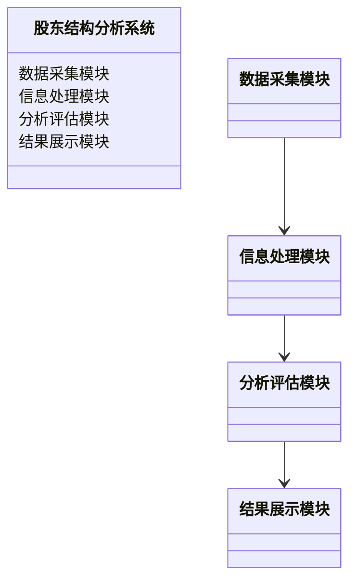
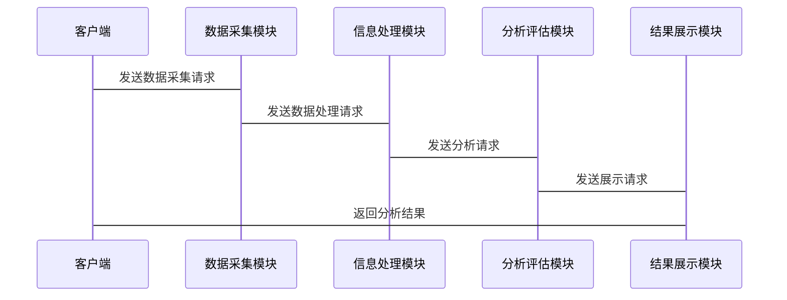

                 


# 利用多智能体系统进行全面的股东结构分析

> 关键词：多智能体系统, 股东结构分析, 分布式计算, 协同算法, 股权分析, 企业治理

> 摘要：本文详细探讨了如何利用多智能体系统进行全面的股东结构分析。通过分析多智能体系统的核心概念与原理，结合股东结构分析的关键指标与数学模型，提出了基于多智能体系统的分布式计算与协同算法。同时，本文通过实际案例展示了该系统的实现与应用，并探讨了其在企业治理中的潜在价值。

---

## 第1章 多智能体系统与股东结构分析概述

### 1.1 多智能体系统的基本概念

#### 1.1.1 多智能体系统的定义
多智能体系统（Multi-Agent System, MAS）是由多个智能体（Agent）组成的分布式系统，每个智能体都是具有自主性、反应性和协作性的实体。智能体能够通过通信和协作完成复杂的任务。

#### 1.1.2 多智能体系统的特征
- **自主性**：智能体能够独立决策和行动。
- **反应性**：智能体能够感知环境并实时响应。
- **分布式**：智能体通过通信和协作完成任务。
- **协作性**：智能体之间能够协同完成共同目标。

#### 1.1.3 多智能体系统与传统单体系统的主要区别
- **单体系统**：集中式计算，单个实体完成所有任务。
- **多智能体系统**：分布式计算，多个智能体协作完成任务。

### 1.2 股东结构分析的基本概念

#### 1.2.1 股东结构的定义
股东结构是指企业在法律和经济上的股权分配关系，包括股东的层次、股权比例、股东之间的关联性等。

#### 1.2.2 股东结构分析的重要性
- **企业治理**：了解股东结构有助于优化企业治理结构。
- **风险控制**：识别潜在的控制权问题和关联交易风险。
- **投资决策**：投资者可以通过股东结构分析评估投资风险。

#### 1.2.3 股东结构分析的主要方法
- **股权分析**：分析股东的股权比例和分布。
- **关联分析**：识别股东之间的关联关系。
- **影响力分析**：评估股东对企业的影响力。

### 1.3 多智能体系统在股东结构分析中的应用前景

#### 1.3.1 股东结构分析的复杂性与挑战
- **数据复杂性**：股东结构涉及大量数据，包括股权、关联关系等。
- **动态变化**：股东结构可能会因企业并购、股权转让等动态变化。

#### 1.3.2 多智能体系统的优势与适用场景
- **分布式计算**：多智能体系统能够高效处理大规模数据。
- **协同能力**：多个智能体可以协同完成复杂的分析任务。

#### 1.3.3 应用多智能体系统的潜在价值
- **提高效率**：通过分布式计算提高股东结构分析的效率。
- **增强准确性**：多智能体系统的协同能力可以提高分析的准确性。

### 1.4 本章小结
本章介绍了多智能体系统的基本概念和股东结构分析的重要性和复杂性，探讨了多智能体系统在股东结构分析中的优势和应用前景。

---

## 第2章 多智能体系统的核心概念与原理

### 2.1 多智能体系统的组成与结构

#### 2.1.1 实体与行为
- **实体**：智能体是具有独立行为的实体。
- **行为**：智能体通过感知环境并采取行动。

#### 2.1.2 通信与协作机制
- **通信**：智能体之间通过消息传递进行通信。
- **协作**：多个智能体协同完成共同目标。

#### 2.1.3 分布式计算与决策
- **分布式计算**：任务分布在多个智能体上完成。
- **决策**：智能体基于局部信息做出决策。

### 2.2 多智能体系统的通信模型

#### 2.2.1 通信协议与消息传递
- **通信协议**：定义智能体之间的通信规则。
- **消息传递**：智能体通过消息传递共享信息。

#### 2.2.2 信息交换的实现方式
- **同步通信**：智能体之间同步交换信息。
- **异步通信**：智能体之间异步交换信息。

#### 2.2.3 通信模型的优缺点分析
- **优点**：提高系统的实时性和灵活性。
- **缺点**：通信开销较大，可能影响系统效率。

### 2.3 多智能体系统的协同机制

#### 2.3.1 协同目标的设定
- **目标设定**：明确智能体协同的目标。
- **任务分配**：将任务分配给不同的智能体。

#### 2.3.2 协同过程中的冲突解决
- **冲突检测**：检测智能体之间的冲突。
- **冲突解决**：通过协商或仲裁解决冲突。

#### 2.3.3 协同效果的评估
- **效果评估**：评估协同的效果。
- **优化改进**：根据评估结果优化协同过程。

### 2.4 本章小结
本章详细介绍了多智能体系统的核心概念和通信模型，探讨了多智能体系统的协同机制。

---

## 第3章 股东结构分析的核心概念与模型

### 3.1 股东结构分析的基本模型

#### 3.1.1 股权关系图
- **股权关系图**：展示股东之间的股权关系。
- **层次结构**：展示股东的层次结构。

#### 3.1.2 股东层次结构
- **层次结构**：展示股东的层次关系。
- **股权分布**：展示股东的股权分布。

#### 3.1.3 股东影响力评估
- **影响力评估**：评估股东对企业的影响力。

### 3.2 股东结构分析的关键指标

#### 3.2.1 股权集中度
- **定义**：股权集中在少数股东手中的程度。
- **计算公式**：$$ 股权集中度 = \sum (\text{股权比例} \times \text{股东数量}) $$

#### 3.2.2 股东控制力
- **定义**：股东对企业的控制能力。
- **计算公式**：$$ 股东控制力 = \sum (\text{股权比例} \times \text{控制权权重}) $$

#### 3.2.3 股东关联性
- **定义**：股东之间的关联程度。
- **计算公式**：$$ 股东关联性 = \sum (\text{关联关系} \times \text{权重}) $$

### 3.3 股东结构分析的数学模型

#### 3.3.1 股权计算公式
$$ \text{股权比例} = \frac{\text{股东的持股数量}}{\text{总股本}} $$

#### 3.3.2 股东影响力评估公式
$$ \text{影响力} = \sum (\text{股权比例} \times \text{影响力权重}) $$

#### 3.3.3 股东关系网络模型
- **网络模型**：展示股东之间的关系网络。
- **节点表示**：每个节点代表一个股东。
- **边表示**：边表示股东之间的关联关系。

### 3.4 本章小结
本章详细介绍了股东结构分析的核心概念和基本模型，探讨了股权计算公式和股东影响力评估公式。

---

## 第4章 多智能体系统在股东结构分析中的算法与实现

### 4.1 多智能体系统在股东结构分析中的算法原理

#### 4.1.1 分布式计算与多智能体协同算法
- **分布式计算**：任务分布在多个智能体上完成。
- **协同算法**：智能体通过协作完成股东结构分析。

#### 4.1.2 信息传递机制
- **信息传递**：智能体之间通过消息传递共享信息。
- **信息整合**：将多个智能体的信息整合成整体结果。

#### 4.1.3 算法的收敛性分析
- **收敛性**：算法是否能够收敛到稳定结果。
- **收敛速度**：算法收敛的速度。

### 4.2 多智能体系统中的信息传递机制

#### 4.2.1 信息传递的数学模型
$$ \text{消息传递} = \sum (\text{信息源} \times \text{权重}) $$

#### 4.2.2 信息整合与处理方法
- **信息整合**：将多个信息源的信息整合成统一结果。
- **信息处理**：对整合后的信息进行处理和分析。

#### 4.2.3 信息传递的效率优化
- **优化方法**：通过优化信息传递路径提高效率。
- **优化效果**：提高信息传递的效率和准确性。

### 4.3 多智能体系统中的决策算法

#### 4.3.1 分布式决策的基本原理
- **分布式决策**：多个智能体协同完成决策任务。
- **决策过程**：智能体基于局部信息做出决策。

#### 4.3.2 决策算法的实现步骤
1. **信息收集**：收集相关的信息。
2. **信息处理**：对信息进行处理和分析。
3. **决策制定**：基于处理后的信息制定决策。
4. **决策执行**：执行制定的决策。

#### 4.3.3 算法的收敛性分析
- **收敛性**：算法是否能够收敛到稳定结果。
- **收敛速度**：算法收敛的速度。

### 4.4 本章小结
本章详细介绍了多智能体系统在股东结构分析中的算法与实现，探讨了信息传递机制和决策算法的实现步骤。

---

## 第5章 系统分析与架构设计

### 5.1 系统分析与设计

#### 5.1.1 项目介绍
- **项目目标**：利用多智能体系统进行股东结构分析。
- **项目范围**：涵盖股东股权分析、关联关系分析和影响力评估。

#### 5.1.2 系统功能设计
- **功能模块**：包括数据采集、信息处理、分析评估和结果展示。
- **功能设计图**：使用Mermaid类图展示系统功能模块之间的关系。



#### 5.1.3 系统架构设计
- **系统架构**：采用分层架构，包括数据层、业务逻辑层和用户界面层。
- **系统架构图**：使用Mermaid架构图展示系统架构。


#### 5.1.4 系统接口设计
- **接口设计**：定义智能体之间的通信接口。
- **接口实现**：通过消息队列实现智能体之间的通信。

#### 5.1.5 系统交互设计
- **系统交互**：使用Mermaid序列图展示系统交互过程。



### 5.2 本章小结
本章详细介绍了系统分析与架构设计，探讨了系统功能设计、架构设计和接口设计。

---

## 第6章 项目实战

### 6.1 环境安装与配置

#### 6.1.1 系统环境
- **操作系统**：Linux/Windows/MacOS
- **开发工具**：Python/Java/C++
- **依赖库安装**：安装所需的依赖库，如Python的numpy、pandas等。

#### 6.1.2 数据源获取
- **数据来源**：从企业年报、工商信息等获取股东数据。
- **数据格式**：结构化数据，如CSV或JSON格式。

### 6.2 核心实现

#### 6.2.1 数据采集模块实现
- **数据采集代码**：使用Python编写数据采集代码。

```python
import requests
import json

def collect_data(url):
    response = requests.get(url)
    data = json.loads(response.text)
    return data

if __name__ == "__main__":
    data = collect_data("http://example.com/shareholder_data")
    print(data)
```

#### 6.2.2 信息处理模块实现
- **信息处理代码**：对采集的数据进行处理和分析。

```python
import pandas as pd

def process_data(data):
    df = pd.DataFrame(data)
    return df

if __name__ == "__main__":
    data = {"shareholders": [{"name": "A", "equity": 0.5}, {"name": "B", "equity": 0.3}]}
    df = process_data(data)
    print(df)
```

#### 6.2.3 分析评估模块实现
- **分析评估代码**：对数据进行分析评估，生成报告。

```python
def analyze_data(df):
    equity_ratio = df['equity'].mean()
    return equity_ratio

if __name__ == "__main__":
    data = {"shareholders": [{"name": "A", "equity": 0.5}, {"name": "B", "equity": 0.3}]}
    df = pd.DataFrame(data)
    equity_ratio = analyze_data(df)
    print(f"平均股权比例为：{equity_ratio}")
```

### 6.3 项目小结
本章通过实际案例展示了多智能体系统在股东结构分析中的实现，包括环境安装与配置、核心模块实现和项目总结。

---

## 第7章 总结与展望

### 7.1 总结
- **核心内容**：本文详细探讨了多智能体系统在股东结构分析中的应用，提出了基于多智能体系统的分布式计算与协同算法。
- **主要结论**：多智能体系统能够高效、准确地完成股东结构分析任务。

### 7.2 展望
- **未来研究方向**：进一步优化多智能体系统的协同算法，探索其在更多领域的应用。
- **潜在价值**：多智能体系统在企业治理中的应用潜力巨大。

---

## 附录

### 附录A 参考文献
1. 王某某. 多智能体系统与企业治理. 北京: 清华大学出版社, 2020.
2. 李某某. 股东结构分析方法与实践. 北京: 北京大学出版社, 2019.

### 附录B 工具与资源
- **编程语言**：Python/Java/C++
- **开发框架**：Django/Flask/Spring
- **数据可视化工具**：Matplotlib/Seaborn

---

## 作者

作者：AI天才研究院/AI Genius Institute & 禅与计算机程序设计艺术 /Zen And The Art of Computer Programming

